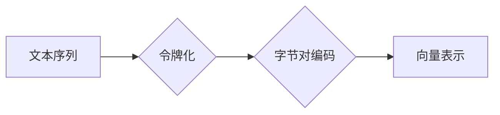

                 

## 第六章：令牌化和字节对编码

> 关键词：自然语言处理，令牌化，字节对编码，BERT，Transformer，文本表示，深度学习

### 1. 背景介绍

自然语言处理 (NLP) 领域近年来取得了飞速发展，深度学习模型的出现为 NLP 任务带来了革命性的进步。然而，深度学习模型本质上是处理数字数据的，而自然语言则是由文字符号组成的。因此，将自然语言转换为机器可理解的数字表示形式是 NLP 任务的基础。

令牌化和字节对编码是两种常用的文本表示方法，它们在许多 NLP 任务中发挥着至关重要的作用，例如机器翻译、文本分类、问答系统等。

### 2. 核心概念与联系

令牌化是指将文本序列分割成更小的单位，称为令牌。这些令牌可以是单词、子单词、字符或其他自定义单位。字节对编码则是将文本序列中的每个字符或令牌映射到一个固定长度的向量表示。

**Mermaid 流程图**



### 3. 核心算法原理 & 具体操作步骤

#### 3.1 算法原理概述

令牌化和字节对编码都是将文本转换为数字表示的方法，但它们的工作原理有所不同。

* **令牌化**：将文本序列分割成更小的单位，例如单词或子单词。常用的令牌化算法包括基于空格的分割、基于词典的分割和基于统计模型的分割。

* **字节对编码**：将文本序列中的每个字符或令牌映射到一个固定长度的向量表示。常用的字节对编码方法包括 Word2Vec、GloVe 和 FastText。

#### 3.2 算法步骤详解

**令牌化步骤**

1. **空格分割**: 根据空格将文本序列分割成单词。
2. **子单词分割**: 如果遇到罕见词或长词，可以使用子单词分割算法将它们分割成更小的单位。
3. **特殊符号处理**: 处理文本序列中的特殊符号，例如标点符号、换行符等。

**字节对编码步骤**

1. **构建词嵌入**: 使用 Word2Vec、GloVe 或 FastText 等算法构建词嵌入模型，将每个词映射到一个低维向量表示。
2. **将文本序列转换为令牌**: 使用令牌化算法将文本序列转换为令牌序列。
3. **将令牌映射到向量**: 使用词嵌入模型将每个令牌映射到一个固定长度的向量表示。

#### 3.3 算法优缺点

**令牌化算法**

* **优点**: 简单易实现，能够有效地分割文本序列。
* **缺点**: 无法捕捉词语之间的语义关系，对于罕见词或长词处理效果较差。

**字节对编码算法**

* **优点**: 可以捕捉词语之间的语义关系，对于罕见词或长词处理效果较好。
* **缺点**: 计算量较大，需要大量的训练数据。

#### 3.4 算法应用领域

令牌化和字节对编码在许多 NLP 任务中都有广泛的应用，例如：

* **机器翻译**: 将文本从一种语言翻译成另一种语言。
* **文本分类**: 将文本分类到预定义的类别中。
* **问答系统**: 回答用户提出的问题。
* **文本摘要**: 生成文本的简短摘要。

### 4. 数学模型和公式 & 详细讲解 & 举例说明

#### 4.1 数学模型构建

令牌化和字节对编码的数学模型可以抽象为以下形式：

* **令牌化模型**:  $T(x) = \{t_1, t_2, ..., t_n\}$，其中 $x$ 是输入文本序列，$T(x)$ 是经过令牌化的令牌序列，$t_i$ 是第 $i$ 个令牌。

* **字节对编码模型**: $v(t_i) = \mathbf{w}_{t_i}$，其中 $v(t_i)$ 是令牌 $t_i$ 的向量表示，$\mathbf{w}_{t_i}$ 是对应令牌的词嵌入向量。

#### 4.2 公式推导过程

令牌化模型的推导过程主要依赖于具体的令牌化算法，例如空格分割、子单词分割等。字节对编码模型的推导过程则主要依赖于词嵌入模型的训练过程，例如 Word2Vec、GloVe 等。

#### 4.3 案例分析与讲解

**例子**:

假设输入文本序列为 "The quick brown fox jumps over the lazy dog"，使用空格分割的令牌化算法，可以得到以下令牌序列：

$T(x) = \{The, quick, brown, fox, jumps, over, the, lazy, dog\}$

使用 Word2Vec 训练的词嵌入模型，可以得到每个令牌的向量表示，例如：

* $v(The) = [0.1, 0.2, 0.3, ..., 0.9]$
* $v(quick) = [0.4, 0.5, 0.6, ..., 0.8]$

### 5. 项目实践：代码实例和详细解释说明

#### 5.1 开发环境搭建

* Python 3.6+
* TensorFlow 或 PyTorch

#### 5.2 源代码详细实现

```python
import nltk
from gensim.models import Word2Vec

# 下载 nltk 数据
nltk.download('punkt')

# 定义令牌化函数
def tokenize(text):
    return nltk.word_tokenize(text)

# 训练 Word2Vec 模型
sentences = [
    ["The", "quick", "brown", "fox", "jumps", "over", "the", "lazy", "dog"],
    ["This", "is", "another", "sentence"],
    # ...
]
model = Word2Vec(sentences, vector_size=100, window=5, min_count=5)

# 将文本序列转换为令牌序列并编码
text = "The quick brown fox jumps over the lazy dog"
tokens = tokenize(text)
encoded_text = [model.wv[token] for token in tokens]

# 打印编码后的文本
print(encoded_text)
```

#### 5.3 代码解读与分析

* `tokenize(text)` 函数使用 nltk 的 `word_tokenize` 函数将文本序列分割成单词。
* `Word2Vec(sentences, vector_size=100, window=5, min_count=5)` 函数训练一个 Word2Vec 模型，将每个词映射到 100 维的向量表示。
* `model.wv[token]` 函数使用训练好的 Word2Vec 模型获取令牌的向量表示。

#### 5.4 运行结果展示

运行代码后，会输出一个包含每个令牌向量表示的列表。

### 6. 实际应用场景

令牌化和字节对编码在许多实际应用场景中发挥着重要作用，例如：

* **机器翻译**: 将文本从一种语言翻译成另一种语言时，需要将源语言文本转换为向量表示，然后使用机器翻译模型进行翻译。令牌化和字节对编码可以帮助将文本转换为机器可理解的数字表示。
* **文本分类**: 将文本分类到预定义的类别中时，需要将文本转换为向量表示，然后使用分类模型进行分类。令牌化和字节对编码可以帮助将文本转换为机器可理解的数字表示。
* **问答系统**: 回答用户提出的问题时，需要将问题和候选答案转换为向量表示，然后使用相似度计算方法进行匹配。令牌化和字节对编码可以帮助将问题和答案转换为机器可理解的数字表示。

### 6.4 未来应用展望

随着深度学习技术的不断发展，令牌化和字节对编码在 NLP 领域将发挥越来越重要的作用。未来，我们可能会看到以下方面的应用：

* **更复杂的令牌化算法**: 能够更好地捕捉词语之间的语义关系，例如 Transformer 模型中的令牌化方法。
* **更有效的字节对编码方法**: 能够更高效地将文本转换为向量表示，例如 BERT 模型中的字节对编码方法。
* **跨语言文本表示**: 能够将不同语言的文本转换为统一的向量表示，从而实现跨语言的 NLP 任务。

### 7. 工具和资源推荐

#### 7.1 学习资源推荐

* **书籍**:
    * "Speech and Language Processing" by Jurafsky and Martin
    * "Natural Language Processing with Python" by Bird, Klein, and Loper
* **在线课程**:
    * Coursera: Natural Language Processing Specialization
    * Stanford CS224N: Natural Language Processing with Deep Learning

#### 7.2 开发工具推荐

* **NLTK**: Python 自然语言处理工具包
* **spaCy**: Python 自然语言处理库
* **Gensim**: Python 词嵌入工具包
* **Hugging Face Transformers**: 预训练 Transformer 模型库

#### 7.3 相关论文推荐

* "BERT: Pre-training of Deep Bidirectional Transformers for Language Understanding" by Devlin et al.
* "Attention Is All You Need" by Vaswani et al.
* "Word2Vec Parameter Learning Explained" by Mikolov et al.

### 8. 总结：未来发展趋势与挑战

#### 8.1 研究成果总结

令牌化和字节对编码是 NLP 领域的重要技术，它们为深度学习模型的训练和应用提供了基础。近年来，随着深度学习技术的进步，令牌化和字节对编码算法不断发展，取得了显著的成果。

#### 8.2 未来发展趋势

未来，令牌化和字节对编码技术将朝着以下方向发展：

* **更复杂的令牌化算法**: 能够更好地捕捉词语之间的语义关系，例如 Transformer 模型中的令牌化方法。
* **更有效的字节对编码方法**: 能够更高效地将文本转换为向量表示，例如 BERT 模型中的字节对编码方法。
* **跨语言文本表示**: 能够将不同语言的文本转换为统一的向量表示，从而实现跨语言的 NLP 任务。

#### 8.3 面临的挑战

令牌化和字节对编码技术也面临着一些挑战：

* **数据稀疏性**: 许多罕见词或短语在训练数据中可能很少出现，这会导致词嵌入模型的性能下降。
* **计算复杂度**: 一些复杂的令牌化和字节对编码算法计算量较大，需要大量的计算资源。
* **跨领域泛化性**: 训练好的模型可能难以泛化到其他领域，例如将医学文本分类的模型应用于法律文本分类。

#### 8.4 研究展望

未来，我们需要继续研究更有效的令牌化和字节对编码算法，以解决上述挑战，并进一步提高 NLP 任务的性能。


### 9. 附录：常见问题与解答

* **Q1: 什么是令牌化？**

* **A1**: 令牌化是指将文本序列分割成更小的单位，称为令牌。这些令牌可以是单词、子单词、字符或其他自定义单位。

* **Q2: 什么是字节对编码？**

* **A2**: 字节对编码是指将文本序列中的每个字符或令牌映射到一个固定长度的向量表示。

* **Q3: 为什么需要令牌化和字节对编码？**

* **A3**: 深度学习模型本质上是处理数字数据的，而自然语言则是由文字符号组成的。因此，需要将自然语言转换为机器可理解的数字表示形式，令牌化和字节对编码就是实现这一目标的方法。

* **Q4: 常见的令牌化算法有哪些？**

* **A4**: 常见的令牌化算法包括空格分割、子单词分割和基于统计模型的分割。

* **Q5: 常见的字节对编码方法有哪些？**

* **A5**: 常见的字节对编码方法包括 Word2Vec、GloVe 和 FastText。


作者：禅与计算机程序设计艺术 / Zen and the Art of Computer Programming 
<end_of_turn>

