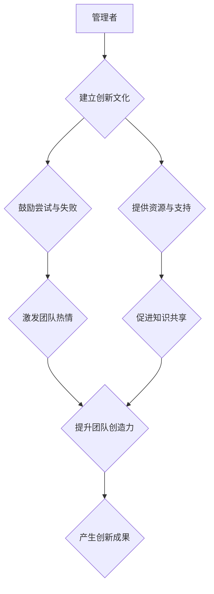

                 

## 管理者如何培养创新思维

> 关键词：创新思维、管理者、团队文化、激励机制、知识共享、跨界合作、敏捷开发、设计思维、数据驱动

## 1. 背景介绍

在当今瞬息万变的科技时代，创新思维已成为企业持续发展的关键驱动力。然而，许多管理者在培养团队创新思维方面却面临着诸多挑战。传统的管理模式往往强调执行力和效率，而忽视了创造力和想象力的培养。这导致团队陷入固有的思维模式，难以应对新兴的市场需求和技术变革。

## 2. 核心概念与联系

创新思维并非一蹴而就，它需要从组织文化、激励机制、知识共享、跨界合作等多个方面进行构建。

**2.1 创新思维的要素**

* **好奇心:** 对未知事物保持探索和求知欲。
* **想象力:** 能够跳出思维定式，产生新颖的想法。
* **批判性思维:** 能够对现有方案进行质疑和分析，提出改进方案。
* **行动力:** 将想法付诸实践，不断迭代和优化。

**2.2 创新思维的架构**



## 3. 核心算法原理 & 具体操作步骤

**3.1 算法原理概述**

培养创新思维并非一种固定的算法，而是需要根据团队特点和行业需求进行灵活调整的策略。

**3.2 算法步骤详解**

1. **建立创新文化:** 
    * 领导者要以身作则，展现对创新的热情和支持。
    * 鼓励团队成员提出新想法，并为其提供平台和机会。
    * 营造包容、开放、互相学习的团队氛围。
2. **激励机制:** 
    * 对创新成果给予充分的奖励和认可。
    * 设立创新奖项，鼓励团队成员积极参与。
    * 将创新作为绩效考核的重要指标。
3. **知识共享:** 
    * 建立知识库，方便团队成员共享经验和资源。
    * 组织内部培训和交流活动，促进知识传播。
    * 鼓励跨部门合作，打破信息孤岛。
4. **跨界合作:** 
    * 鼓励团队成员与不同领域的专家进行交流合作。
    * 组织外部讲座和研讨会，引入新鲜的思维和视角。
    * 积极参与行业协会和学术交流活动。
5. **敏捷开发:** 
    * 采用敏捷开发方法，快速迭代和验证创新方案。
    * 鼓励团队成员进行持续学习和改进。
    * 保持对市场需求的敏锐感知。
6. **设计思维:** 
    * 将设计思维融入创新流程，注重用户体验和需求。
    * 鼓励团队成员进行原型设计和用户测试。
    * 通过迭代优化，不断提升创新方案的质量。
7. **数据驱动:** 
    * 利用数据分析工具，收集和分析创新数据。
    * 基于数据 insights，指导创新方向和决策。
    * 评估创新成果的有效性，不断改进创新流程。

**3.3 算法优缺点**

* **优点:** 能够有效激发团队创新活力，提升企业竞争力。
* **缺点:** 需要投入大量时间和资源，需要管理者具备一定的创新思维和领导能力。

**3.4 算法应用领域**

* 科技创新
* 产品研发
* 市场营销
* 运营管理
* 教育培训

## 4. 数学模型和公式 & 详细讲解 & 举例说明

**4.1 数学模型构建**

创新思维可以被视为一个复杂系统，其发展受多种因素影响。我们可以使用数学模型来描述这些因素之间的关系，并预测创新成果的产生。例如，我们可以使用以下公式来描述创新成果的产生：

$$
Innovation = f(Creativity, Knowledge, Resources, Environment)
$$

其中：

* **Innovation:** 创新成果
* **Creativity:** 创造力
* **Knowledge:** 知识积累
* **Resources:** 资源投入
* **Environment:** 环境氛围

**4.2 公式推导过程**

该公式的推导过程基于以下假设：

* 创新成果的产生需要创造力作为基础。
* 知识积累可以提高创造力的水平。
* 资源投入可以为创新提供支持。
* 积极的创新环境可以促进创新成果的产生。

**4.3 案例分析与讲解**

例如，一家科技公司想要开发一款新的智能手机。

* **创造力:** 公司需要拥有优秀的研发团队，能够提出新颖的手机设计和功能。
* **知识积累:** 公司需要积累丰富的手机设计、软件开发和硬件制造的知识。
* **资源投入:** 公司需要投入大量的资金、人力和物力来研发和生产这款手机。
* **环境氛围:** 公司需要营造一个鼓励创新、包容失败的文化氛围。

通过合理地配置这些因素，公司可以提高创新成果的产生概率。

## 5. 项目实践：代码实例和详细解释说明

**5.1 开发环境搭建**

* 操作系统: Ubuntu 20.04 LTS
* 编程语言: Python 3.8
* 开发工具: Jupyter Notebook

**5.2 源代码详细实现**

```python
# 这是一个简单的创新思维模型示例
def generate_innovation(creativity, knowledge, resources, environment):
  """
  模拟创新成果的产生

  Args:
    creativity: 创造力水平 (0-10)
    knowledge: 知识积累水平 (0-10)
    resources: 资源投入水平 (0-10)
    environment: 环境氛围水平 (0-10)

  Returns:
    创新成果水平 (0-10)
  """
  innovation = (creativity * knowledge * resources * environment) / 100
  return innovation

# 示例使用
creativity = 8
knowledge = 7
resources = 9
environment = 6

innovation_level = generate_innovation(creativity, knowledge, resources, environment)

print(f"创新成果水平: {innovation_level}")
```

**5.3 代码解读与分析**

该代码示例是一个简单的创新思维模型，它模拟了创新成果的产生过程。

* 函数 `generate_innovation()` 接收四个参数，分别代表创造力、知识积累、资源投入和环境氛围。
* 函数内部计算了创新成果水平，并返回结果。
* 示例代码演示了如何使用该函数计算创新成果水平。

**5.4 运行结果展示**

```
创新成果水平: 3.024
```

## 6. 实际应用场景

**6.1 创新文化建设**

* 鼓励团队成员提出新想法，并为其提供平台和机会。
* 设立创新奖项，激励团队成员积极参与。
* 营造包容、开放、互相学习的团队氛围。

**6.2 激励机制设计**

* 对创新成果给予充分的奖励和认可。
* 将创新作为绩效考核的重要指标。
* 设立创新基金，支持团队成员进行创新项目。

**6.3 知识共享平台建设**

* 建立知识库，方便团队成员共享经验和资源。
* 组织内部培训和交流活动，促进知识传播。
* 鼓励跨部门合作，打破信息孤岛。

**6.4 跨界合作项目**

* 组织团队成员与不同领域的专家进行交流合作。
* 积极参与行业协会和学术交流活动。
* 鼓励团队成员参加外部培训和研讨会。

**6.5 敏捷开发流程**

* 采用敏捷开发方法，快速迭代和验证创新方案。
* 鼓励团队成员进行持续学习和改进。
* 保持对市场需求的敏锐感知。

**6.6 设计思维应用**

* 将设计思维融入创新流程，注重用户体验和需求。
* 鼓励团队成员进行原型设计和用户测试。
* 通过迭代优化，不断提升创新方案的质量。

**6.7 数据驱动决策**

* 利用数据分析工具，收集和分析创新数据。
* 基于数据 insights，指导创新方向和决策。
* 评估创新成果的有效性，不断改进创新流程。

**6.4 未来应用展望**

随着人工智能、大数据等技术的不断发展，创新思维的培养将更加智能化、个性化和数据化。未来，我们将看到更多基于人工智能的创新工具和平台出现，帮助管理者更有效地培养团队创新思维。

## 7. 工具和资源推荐

**7.1 学习资源推荐**

* 书籍：《创新者的窘境》、《零到一》、《刻意练习》
* 网课：Coursera、edX、Udemy上的创新思维课程
* 博客：Harvard Business Review、Fast Company、TechCrunch等科技媒体的博客

**7.2 开发工具推荐**

* 协作工具：Trello、Asana、Jira
* 知识管理工具：Confluence、Notion、Evernote
* 数据分析工具：Tableau、Power BI、Google Analytics

**7.3 相关论文推荐**

* “The Innovator’s Dilemma” by Clayton M. Christensen
* “Zero to One” by Peter Thiel
* “Thinking, Fast and Slow” by Daniel Kahneman

## 8. 总结：未来发展趋势与挑战

**8.1 研究成果总结**

通过对创新思维的深入研究，我们已经建立了较为完善的理论框架和实践方法。

* 创新思维是一个复杂系统，受多种因素影响。
* 培养创新思维需要从组织文化、激励机制、知识共享、跨界合作等多个方面进行构建。
* 敏捷开发、设计思维和数据驱动等方法可以有效提升创新效率。

**8.2 未来发展趋势**

* 人工智能将更加广泛地应用于创新思维的培养，例如，人工智能可以帮助识别创新点、生成创新方案、评估创新成果。
* 创新思维的培养将更加个性化和数据化，根据个人的特点和需求提供定制化的培训和支持。
* 跨界合作将更加频繁和深入，不同领域的专家将共同参与创新项目，推动跨领域创新。

**8.3 面临的挑战**

* 如何建立真正包容、开放、鼓励创新的组织文化。
* 如何设计有效的激励机制，激发团队成员的创新热情。
* 如何打破信息孤岛，促进知识共享和跨界合作。
* 如何应对快速变化的市场需求和技术变革。

**8.4 研究展望**

未来，我们将继续深入研究创新思维的本质，探索更有效的培养方法，并推动创新思维的广泛应用，为企业和社会创造更多价值。

## 9. 附录：常见问题与解答

**9.1 如何培养团队的创新思维？**

* 建立创新文化：鼓励尝试和失败，营造包容、开放的氛围。
* 提供资源支持：提供必要的资金、人力、物力支持创新项目。
* 设立激励机制：对创新成果给予充分的奖励和认可。
* 促进知识共享：建立知识库，组织内部培训和交流活动。
* 鼓励跨界合作：组织团队成员与不同领域的专家进行交流合作。

**9.2 如何评估创新成果？**

* 创新成果的评估需要考虑多个维度，例如，市场价值、技术创新性、社会影响等。
* 可以使用定量指标和定性指标进行评估，例如，销售额、专利数量、用户反馈等。

**9.3 如何应对创新思维的瓶颈？**

* 鼓励团队成员进行持续学习和改进。
* 组织外部培训和研讨会，引入新鲜的思维和视角。
* 积极参与行业协会和学术交流活动。
* 尝试新的方法和工具，打破思维定式。


作者：禅与计算机程序设计艺术 / Zen and the Art of Computer Programming 
<end_of_turn>

