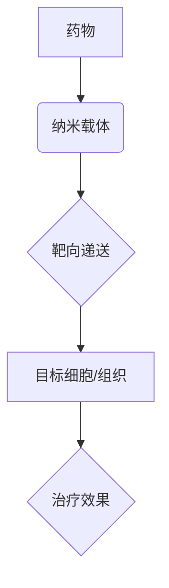

                 

## 纳米技术在药物递送中的应用：提高治疗效果

> 关键词：纳米技术、药物递送、靶向治疗、生物相容性、载体、药物释放、安全性、疗效

## 1. 背景介绍

药物递送一直是医学领域面临的重大挑战之一。传统的药物递送方式存在着许多局限性，例如药物的非特异性分布、低生物利用度、不良副作用等。随着纳米技术的快速发展，纳米药物递送系统 (nanomedicine) 应运而生，为克服传统药物递送的缺陷提供了新的思路和方法。

纳米技术是指对物质进行微观尺度上的操控和加工，其尺度通常在1纳米到100纳米之间。纳米材料具有独特的物理、化学和生物学特性，例如高表面积、量子尺寸效应、可控的释放特性等，使其成为药物递送的理想载体。

纳米药物递送系统通过将药物负载到纳米颗粒中，可以实现药物的靶向递送、控释释放、提高生物利用度等功能，从而有效提高治疗效果，降低副作用。

## 2. 核心概念与联系

### 2.1 纳米药物递送系统

纳米药物递送系统是指利用纳米材料作为载体，将药物负载并递送到目标部位的系统。

### 2.2 核心概念

* **纳米材料:** 指直径在1纳米到100纳米之间的材料，具有独特的物理、化学和生物学特性。常用的纳米材料包括金纳米颗粒、银纳米颗粒、碳纳米管、石墨烯、脂质体、聚合物纳米颗粒等。
* **药物载体:** 指用于将药物递送到目标部位的载体，可以是纳米材料、病毒、脂质体等。
* **靶向递送:** 指将药物精准地递送到目标细胞或组织，提高药物的治疗效果，降低对正常组织的损害。
* **控释释放:** 指控制药物在体内释放的速度和时间，延长药物的作用时间，提高治疗效果。

### 2.3 架构图



## 3. 核心算法原理 & 具体操作步骤

### 3.1 算法原理概述

纳米药物递送系统的设计和开发需要考虑多种因素，包括纳米材料的选择、药物负载的策略、靶向机制、控释释放机制等。

* **纳米材料的选择:** 不同的纳米材料具有不同的物理、化学和生物学特性，需要根据药物的性质和治疗目标选择合适的纳米材料。例如，脂质体具有良好的生物相容性和靶向性，适合用于递送水溶性药物；聚合物纳米颗粒具有良好的稳定性和控释性，适合用于递送脂溶性药物。
* **药物负载的策略:** 药物可以通过物理吸附、化学键合、包封等方式负载到纳米载体中。
* **靶向机制:** 可以通过修饰纳米载体的表面，使其与目标细胞或组织特异性结合，实现靶向递送。常用的靶向策略包括抗体偶联、配体偶联、脂质修饰等。
* **控释释放机制:** 可以通过设计纳米载体的结构和成分，控制药物在体内的释放速度和时间。常用的控释释放机制包括pH敏感性释放、酶敏感性释放、温度敏感性释放等。

### 3.2 算法步骤详解

1. **选择合适的纳米材料:** 根据药物的性质和治疗目标，选择合适的纳米材料。
2. **制备纳米载体:** 利用物理或化学方法制备纳米载体。
3. **负载药物:** 将药物负载到纳米载体中。
4. **修饰纳米载体:** 通过修饰纳米载体的表面，使其具有靶向性。
5. **评价纳米药物递送系统:** 对纳米药物递送系统进行体外和体内评价，包括药物负载量、释放特性、靶向性、安全性等。

### 3.3 算法优缺点

**优点:**

* 提高药物的生物利用度和治疗效果。
* 降低药物的毒副作用。
* 实现药物的靶向递送。
* 控制药物的释放速度和时间。

**缺点:**

* 纳米材料的安全性尚待进一步研究。
* 纳米药物递送系统的制备工艺复杂。
* 纳米药物递送系统的成本较高。

### 3.4 算法应用领域

纳米药物递送系统在以下领域具有广泛的应用前景:

* 癌症治疗
* 心血管疾病治疗
* 感染性疾病治疗
* 神经退行性疾病治疗
* 遗传性疾病治疗

## 4. 数学模型和公式 & 详细讲解 & 举例说明

### 4.1 数学模型构建

纳米药物递送系统的数学模型可以描述药物在体内分布、释放和作用的过程。常用的数学模型包括：

* **药代动力学模型:** 描述药物在体内吸收、分布、代谢和排泄的过程。
* **药物动力学模型:** 描述药物与靶细胞或组织的相互作用过程。

### 4.2 公式推导过程

例如，一个简单的药代动力学模型可以描述药物在体内的浓度变化：

$$
\frac{dC}{dt} = k_a - k_eC
$$

其中：

* $C$ 是药物在体内的浓度。
* $t$ 是时间。
* $k_a$ 是药物吸收速率常数。
* $k_e$ 是药物消除速率常数。

这个方程描述了药物在体内浓度的变化，吸收速率与消除速率的平衡决定了药物在体内的浓度水平。

### 4.3 案例分析与讲解

假设一个纳米药物递送系统，药物的吸收速率常数为 $k_a = 0.1 h^{-1}$，消除速率常数为 $k_e = 0.05 h^{-1}$。

根据上述方程，我们可以计算药物在体内的浓度变化。

例如，在 $t = 0$ 时，药物浓度为 $C_0$，则药物浓度随时间的变化可以表示为：

$$
C(t) = C_0e^{-k_et} + \frac{k_a}{k_e}(1-e^{-k_et})
$$

通过这个方程，我们可以模拟药物在体内的浓度变化，并分析纳米药物递送系统的性能。

## 5. 项目实践：代码实例和详细解释说明

### 5.1 开发环境搭建

* 操作系统：Windows/macOS/Linux
* 编程语言：Python
* 库依赖：NumPy、SciPy、Matplotlib

### 5.2 源代码详细实现

```python
import numpy as np
from scipy.integrate import odeint
import matplotlib.pyplot as plt

# 参数设置
k_a = 0.1  # 吸收速率常数
k_e = 0.05  # 消除速率常数
C_0 = 1  # 初始药物浓度

# 时间点
t = np.linspace(0, 10, 100)

# 药物浓度变化方程
def dC_dt(C, t):
    return k_a - k_e * C

# 求解微分方程
C = odeint(dC_dt, C_0, t)

# 绘制药物浓度随时间变化曲线
plt.plot(t, C)
plt.xlabel('时间 (h)')
plt.ylabel('药物浓度 (mg/L)')
plt.title('药物浓度随时间变化曲线')
plt.show()
```

### 5.3 代码解读与分析

这段代码实现了药物浓度随时间变化的模拟。

* 首先，定义了药物吸收速率常数、消除速率常数和初始药物浓度。
* 然后，使用 `odeint` 函数求解微分方程，得到药物浓度随时间的变化曲线。
* 最后，使用 `matplotlib` 库绘制药物浓度随时间变化曲线。

### 5.4 运行结果展示

运行代码后，会生成一个药物浓度随时间变化的曲线图。

## 6. 实际应用场景

纳米药物递送系统已经应用于多种疾病的治疗，例如：

* **癌症治疗:** 纳米药物递送系统可以将抗癌药物靶向递送到肿瘤细胞，提高治疗效果，降低对正常组织的损害。
* **心血管疾病治疗:** 纳米药物递送系统可以将降脂药物、抗血栓药物等靶向递送到血管内皮细胞，改善血管功能，预防心血管疾病。
* **感染性疾病治疗:** 纳米药物递送系统可以将抗生素靶向递送到感染部位，提高药物的疗效，降低耐药性。

### 6.4 未来应用展望

纳米药物递送系统在未来将有更广泛的应用前景，例如：

* **个性化治疗:** 根据患者的基因信息和疾病特点，定制化设计纳米药物递送系统，实现精准治疗。
* **多重药物递送:** 将多种药物负载到纳米载体中，实现联合治疗，提高治疗效果。
* **基因治疗:** 将基因治疗药物纳米递送至目标细胞，实现基因的修复或沉默。

## 7. 工具和资源推荐

### 7.1 学习资源推荐

* **书籍:**
    * "Nanomedicine: Applications in Drug Delivery" by S.M. Hussain
    * "Nanotechnology in Medicine" by A.K. Sharma
* **期刊:**
    * "Nano Letters"
    * "ACS Nano"
    * "Nature Nanotechnology"
* **网站:**
    * National Nanotechnology Initiative (NNI): https://www.nano.gov/
    * American Chemical Society (ACS) Nanotechnology Division: https://www.acs.org/content/acs/en/divs/nanotechnology.html

### 7.2 开发工具推荐

* **分子模拟软件:**
    * LAMMPS: https://lammps.sandia.gov/
    * GROMACS: https://www.gromacs.org/
* **纳米材料设计软件:**
    * COMSOL Multiphysics: https://www.comsol.com/
    * ANSYS Fluent: https://www.ansys.com/products/fluids/ansys-fluent

### 7.3 相关论文推荐

* "Targeted Drug Delivery Using Nanoparticles" by Peer et al. (2007)
* "Nanoparticle-Based Drug Delivery Systems: A Review" by Torchilin (2006)
* "Nanomedicine: A Revolution in Medicine" by Langer et al. (2009)

## 8. 总结：未来发展趋势与挑战

### 8.1 研究成果总结

纳米药物递送系统已经取得了显著的进展，为药物治疗提供了新的思路和方法。

### 8.2 未来发展趋势

未来，纳米药物递送系统将朝着以下方向发展:

* **更精准的靶向递送:** 利用生物标志物、基因信息等，实现更精准的靶向递送。
* **更智能的控释释放:** 开发能够根据体内环境变化智能调节药物释放的纳米载体。
* **更安全的纳米材料:** 研究开发更安全、更生物相容的纳米材料。

### 8.3 面临的挑战

纳米药物递送系统还面临着一些挑战，例如:

* **纳米材料的安全性:** 需进一步研究纳米材料的长期安全性。
* **制备工艺的复杂性:** 纳米药物递送系统的制备工艺复杂，成本较高。
* **临床应用的推广:** 需进一步开展临床试验，推广纳米药物递送系统的临床应用。

### 8.4 研究展望

纳米药物递送系统是一个充满机遇和挑战的领域，未来将会有更多的研究和开发工作，为人类健康做出更大的贡献。

## 9. 附录：常见问题与解答

### 9.1 纳米材料的安全性如何？

纳米材料的安全性是一个重要的研究课题。目前，对纳米材料的安全性研究还处于初步阶段，需要进一步研究其长期安全性。

### 9.2 纳米药物递送系统的制备工艺复杂吗？

是的，纳米药物递送系统的制备工艺比较复杂，需要精密的设备和技术。

### 9.3 纳米药物递送系统何时能够广泛应用于临床？

纳米药物递送系统已经有一些临床应用，但还需要进一步开展临床试验，推广其临床应用。


作者：禅与计算机程序设计艺术 / Zen and the Art of Computer Programming 
<end_of_turn>

