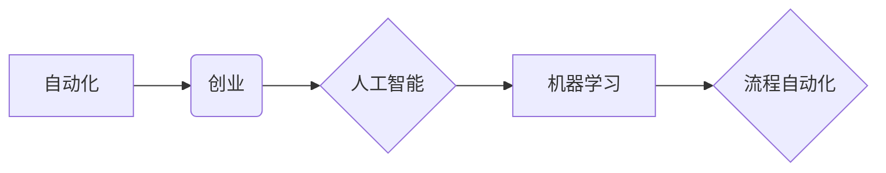

                 

## 自动化创业的未来趋势与展望

> 关键词：自动化、创业、人工智能、机器学习、流程自动化、数据分析、云计算、低代码平台

### 1. 背景介绍

创业一直是人类社会进步的引擎，推动着创新和经济发展。然而，传统的创业模式往往面临着诸多挑战，例如高昂的启动成本、漫长的研发周期、复杂的市场竞争等。随着人工智能、机器学习等技术的快速发展，自动化创业逐渐成为一种新的趋势，它为创业者提供了全新的机遇和可能性。

自动化创业是指利用自动化技术，简化创业流程，降低创业门槛，提高创业效率。它涵盖了从市场调研、产品开发、营销推广到运营管理等多个环节，旨在通过技术手段，解放创业者的精力，让他们能够专注于更具战略性的工作。

### 2. 核心概念与联系

**2.1 核心概念**

* **自动化:** 通过程序或算法自动执行重复性任务，减少人工干预。
* **创业:**  创立新企业，开发新产品或服务，并将其推向市场。
* **人工智能 (AI):**  使计算机能够模拟人类智能的行为，例如学习、推理、决策等。
* **机器学习 (ML):**  一种人工智能技术，通过算法从数据中学习，不断改进其性能。
* **流程自动化:**  利用软件工具，自动执行一系列预定义的步骤，提高工作效率。

**2.2 架构关系**



**2.3 联系分析**

自动化创业的核心是利用人工智能和机器学习技术，实现对创业流程的自动化。流程自动化可以帮助创业者简化重复性任务，提高效率，而人工智能和机器学习则可以帮助创业者进行更深入的数据分析，做出更精准的决策。

### 3. 核心算法原理 & 具体操作步骤

**3.1 算法原理概述**

自动化创业的核心算法原理主要包括：

* **机器学习算法:** 用于从数据中学习，例如预测市场需求、识别潜在客户、优化营销策略等。常见的机器学习算法包括线性回归、逻辑回归、决策树、支持向量机、神经网络等。
* **自然语言处理 (NLP) 算法:** 用于处理和理解人类语言，例如自动生成文案、分析用户评论、进行智能客服等。
* **计算机视觉算法:** 用于处理和理解图像和视频，例如自动识别产品、分析用户行为、进行视觉搜索等。

**3.2 算法步骤详解**

1. **数据收集:** 收集与创业相关的各种数据，例如市场数据、用户数据、产品数据等。
2. **数据预处理:** 对收集到的数据进行清洗、转换、格式化等处理，使其能够被算法所使用。
3. **模型训练:** 选择合适的机器学习算法，并利用训练数据对模型进行训练，使其能够学习到数据中的规律。
4. **模型评估:** 利用测试数据对模型进行评估，评估模型的准确率、效率等指标。
5. **模型部署:** 将训练好的模型部署到实际应用场景中，例如网站、应用程序等。
6. **模型监控:**  持续监控模型的性能，并根据需要进行模型更新和调整。

**3.3 算法优缺点**

* **优点:** 提高效率、降低成本、数据驱动决策、个性化体验。
* **缺点:** 数据依赖性强、算法解释性差、伦理风险等。

**3.4 算法应用领域**

* **市场调研:** 分析市场趋势、预测用户需求、识别潜在客户。
* **产品开发:** 自动生成产品原型、优化产品设计、预测产品销量。
* **营销推广:** 自动生成营销文案、精准推送广告、分析营销效果。
* **运营管理:** 自动化运营流程、优化资源配置、提高运营效率。

### 4. 数学模型和公式 & 详细讲解 & 举例说明

**4.1 数学模型构建**

在自动化创业中，我们可以利用数学模型来描述和预测各种现象。例如，我们可以构建一个线性回归模型来预测产品的销量，或者构建一个决策树模型来预测用户的购买行为。

**4.2 公式推导过程**

假设我们想要预测产品的销量，我们可以使用线性回归模型。线性回归模型的公式如下：

$$y = mx + c$$

其中：

* $y$ 是产品的销量
* $x$ 是产品的价格
* $m$ 是斜率，表示价格每增加1单位，销量变化的幅度
* $c$ 是截距，表示当价格为0时，销量的基准值

我们可以通过最小二乘法来估计模型参数 $m$ 和 $c$。

**4.3 案例分析与讲解**

假设我们收集了以下数据：

| 价格 (x) | 销量 (y) |
|---|---|
| 10 | 100 |
| 20 | 150 |
| 30 | 200 |

我们可以使用线性回归模型来预测当价格为40时，销量的值。

首先，我们需要计算出 $m$ 和 $c$ 的值。

$$m = \frac{\sum_{i=1}^{n}(x_i - \bar{x})(y_i - \bar{y})}{\sum_{i=1}^{n}(x_i - \bar{x})^2}$$

$$c = \bar{y} - m\bar{x}$$

其中：

* $n$ 是数据点的数量
* $\bar{x}$ 是价格的平均值
* $\bar{y}$ 是销量的平均值

计算得到 $m = 5$ 和 $c = 50$。

因此，线性回归模型的方程为：

$$y = 5x + 50$$

当价格为40时，销量的预测值为：

$$y = 5 \times 40 + 50 = 250$$

### 5. 项目实践：代码实例和详细解释说明

**5.1 开发环境搭建**

* **操作系统:** Ubuntu 20.04 LTS
* **编程语言:** Python 3.8
* **开发工具:** Jupyter Notebook
* **库依赖:** scikit-learn, pandas, matplotlib

**5.2 源代码详细实现**

```python
import pandas as pd
from sklearn.linear_model import LinearRegression
from sklearn.model_selection import train_test_split
import matplotlib.pyplot as plt

# 加载数据
data = pd.read_csv('sales_data.csv')

# 分割数据
X = data[['price']]
y = data['sales']
X_train, X_test, y_train, y_test = train_test_split(X, y, test_size=0.2, random_state=42)

# 创建线性回归模型
model = LinearRegression()

# 训练模型
model.fit(X_train, y_train)

# 预测测试数据
y_pred = model.predict(X_test)

# 评估模型性能
print('Coefficients:', model.coef_)
print('Intercept:', model.intercept_)
plt.scatter(X_test, y_test, color='blue')
plt.plot(X_test, y_pred, color='red')
plt.xlabel('Price')
plt.ylabel('Sales')
plt.title('Linear Regression Model')
plt.show()
```

**5.3 代码解读与分析**

* 首先，我们加载数据并将其分割成训练集和测试集。
* 然后，我们创建了一个线性回归模型，并使用训练集训练模型。
* 接下来，我们使用测试集预测销量的值，并评估模型的性能。
* 最后，我们绘制了预测结果和实际结果的散点图，以直观地展示模型的拟合效果。

**5.4 运行结果展示**

运行代码后，会生成一个散点图，展示了预测结果和实际结果之间的关系。

### 6. 实际应用场景

**6.1 市场调研**

* 利用机器学习算法分析市场数据，预测用户需求和市场趋势。
* 通过NLP算法分析用户评论，了解用户对产品的评价和反馈。

**6.2 产品开发**

* 利用机器学习算法分析用户行为数据，优化产品设计和功能。
* 通过计算机视觉算法自动识别产品缺陷，提高产品质量。

**6.3 营销推广**

* 利用机器学习算法精准推送广告，提高广告转化率。
* 通过NLP算法自动生成营销文案，提高营销效率。

**6.4 运营管理**

* 利用机器学习算法优化资源配置，提高运营效率。
* 通过流程自动化工具，简化运营流程，降低运营成本。

**6.5 未来应用展望**

随着人工智能技术的不断发展，自动化创业将更加深入地融入到各个创业环节，例如：

* **智能创业助手:**  提供个性化的创业建议和指导，帮助创业者更快地找到方向。
* **自动生成创业计划:**  根据用户的需求和市场数据，自动生成创业计划书和商业模式。
* **自动融资平台:**  利用机器学习算法分析创业项目的风险和回报，帮助创业者获得融资。

### 7. 工具和资源推荐

**7.1 学习资源推荐**

* **在线课程:** Coursera, edX, Udacity
* **书籍:** 《Python机器学习实战》、《深度学习》
* **博客:** Towards Data Science, Machine Learning Mastery

**7.2 开发工具推荐**

* **云平台:** AWS, Azure, Google Cloud
* **低代码平台:** Bubble, Webflow, Zapier
* **机器学习库:** scikit-learn, TensorFlow, PyTorch

**7.3 相关论文推荐**

* **自动化创业:**  "Automated Entrepreneurship: A Review and Future Directions"
* **机器学习:** "Machine Learning: A Probabilistic Perspective"
* **深度学习:** "Deep Learning"

### 8. 总结：未来发展趋势与挑战

**8.1 研究成果总结**

自动化创业已经取得了显著的成果，例如：

* 降低了创业门槛，使更多人能够参与到创业活动中。
* 提高了创业效率，帮助创业者更快地将产品推向市场。
* 提升了创业成功率，帮助创业者更好地应对市场竞争。

**8.2 未来发展趋势**

* **更智能的自动化:**  利用更先进的人工智能技术，实现更智能的自动化，例如自动生成商业计划书、自动进行市场调研等。
* **更个性化的创业体验:**  利用机器学习算法，为每个创业者提供个性化的创业建议和指导。
* **更广泛的应用场景:**  自动化创业将应用到更多领域，例如教育、医疗、文化等。

**8.3 面临的挑战**

* **数据安全和隐私保护:**  自动化创业需要大量的数据，如何保证数据的安全和隐私保护是一个重要的挑战。
* **算法解释性和可信度:**  许多机器学习算法的决策过程难以解释，如何提高算法的解释性和可信度是一个重要的研究方向。
* **伦理风险:**  自动化创业可能会带来一些伦理风险，例如算法偏见、就业替代等，需要引起足够的重视。

**8.4 研究展望**

未来，自动化创业的研究将更加注重以下几个方面：

* **开发更安全、更可靠、更可解释的机器学习算法。**
* **探索自动化创业在更多领域应用的可能性。**
* **研究自动化创业带来的社会影响，并制定相应的政策和规范。**


### 9. 附录：常见问题与解答

**9.1 如何选择合适的自动化创业工具？**

选择合适的自动化创业工具需要根据自己的具体需求和预算进行选择。一些常用的工具包括：

* **云平台:** AWS, Azure, Google Cloud
* **低代码平台:** Bubble, Webflow, Zapier
* **机器学习库:** scikit-learn, TensorFlow, PyTorch

**9.2 自动化创业会取代人类创业吗？**

自动化创业可以帮助创业者提高效率和降低成本，但它并不会完全取代人类创业。人类的创造力和创新能力仍然是创业成功的关键因素。

**9.3 自动化创业有哪些伦理风险？**

自动化创业可能会带来一些伦理风险，例如算法偏见、就业替代等。需要引起足够的重视，并制定相应的政策和规范。


作者：禅与计算机程序设计艺术 / Zen and the Art of Computer Programming 
<end_of_turn>

