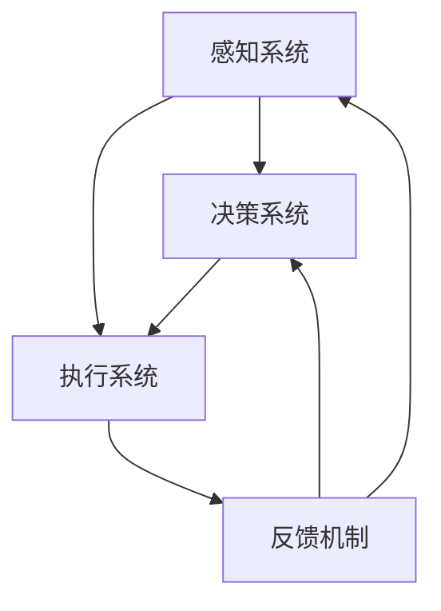
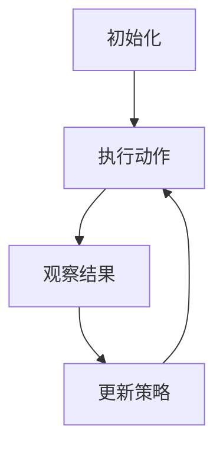
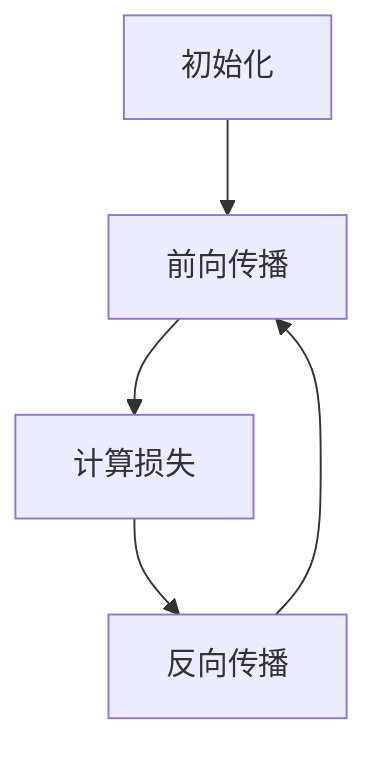
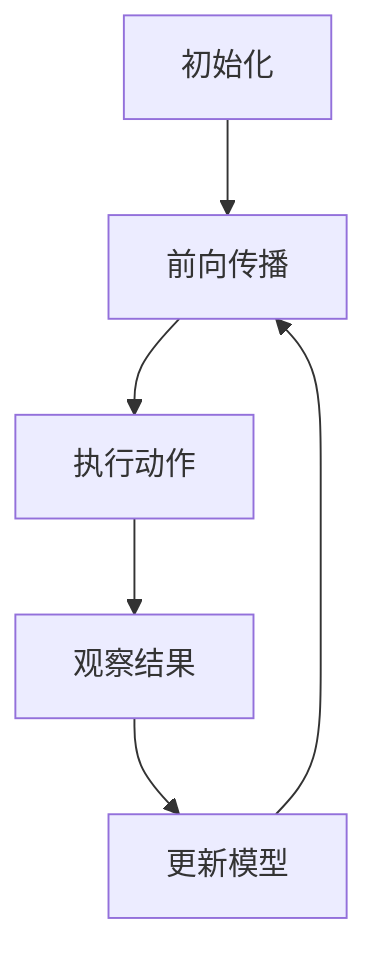

                 

### 文章标题

具身智能与客观世界的交互

### Keywords: Embodied Intelligence, Interaction with the Physical World, AI Applications, Human-Machine Symbiosis

### Abstract:
This article delves into the concept of embodied intelligence and its interaction with the physical world. We explore the core principles and architectural designs that underpin this emerging field, examining both theoretical frameworks and practical applications. By analyzing the core algorithms and mathematical models, we provide step-by-step explanations and code examples to illustrate the practical implementation of embodied intelligence in real-world scenarios. The article concludes with a discussion on the future development trends and challenges in this domain, offering insights and recommendations for further exploration.

## 1. 背景介绍（Background Introduction）

具身智能（Embodied Intelligence）是人工智能（Artificial Intelligence, AI）领域中的一个新兴研究方向，它旨在使人工智能系统能够更好地与物理世界交互，模仿人类的感知、行动和认知能力。传统的人工智能系统主要依赖于数据驱动的模型，通过大量数据进行训练，以在特定的任务上实现高水平的性能。然而，这种模式在处理复杂的现实世界任务时存在一定的局限性，例如环境不确定性、动态变化和复杂的人类行为等。

具身智能的核心思想是将人工智能与物理实体结合起来，使系统能够直接感知和操作物理环境。这一概念起源于对人类智能的研究，人类智能之所以强大，是因为我们拥有身体，能够与周围环境进行直接的交互。具身智能试图在人工智能系统中实现类似的能力，通过感知硬件（如摄像头、传感器、触觉反馈设备等）和执行硬件（如机器人、无人机等）来实现与环境的互动。

近年来，随着硬件技术的进步、算法的优化以及跨学科研究的深入，具身智能领域取得了显著的进展。一些重要的里程碑包括：

1. **机器人技术的发展**：机器人技术的不断进步为人工智能系统提供了强大的执行能力，使其能够执行复杂的物理任务，如自主导航、抓取、组装等。
2. **传感器技术的提升**：高精度、低延迟的传感器技术使得人工智能系统能够实时感知环境变化，提高了对物理世界的理解能力。
3. **强化学习（Reinforcement Learning）**：强化学习算法的引入，使得人工智能系统能够通过与环境的互动学习，逐步优化其行为策略，实现更好的交互性能。
4. **跨学科合作**：物理学家、生物学家、心理学家和计算机科学家之间的合作，为具身智能的研究提供了新的理论框架和技术手段。

通过这些进展，具身智能正在逐步从理论研究走向实际应用，其在医疗、教育、工业、服务等多个领域展现出巨大的潜力。本文将围绕具身智能的核心概念、算法原理、数学模型、应用实践等方面进行深入探讨，以期为这一领域的发展提供一些有价值的思考和见解。

## 2. 核心概念与联系（Core Concepts and Connections）

### 2.1 具身智能的定义与基本原理

具身智能（Embodied Intelligence）是指具有物理形态的人工智能系统，它们能够通过感知硬件和执行硬件与物理世界进行互动，模仿人类的感知、行动和认知能力。这一概念强调了智能体（Agent）在现实环境中的主动性和适应性。具体来说，具身智能系统包括以下几个关键组成部分：

1. **感知系统**：用于获取环境信息，如视觉、听觉、触觉等。这些信息通过传感器转化为电信号，供智能系统处理。
2. **决策系统**：根据感知到的环境信息，结合智能算法，生成合适的行动策略。决策系统通常采用机器学习、深度学习、强化学习等方法。
3. **执行系统**：根据决策系统的指令，执行物理动作，如移动、抓取、装配等。执行系统通常由机械臂、无人机、机器人等硬件实现。
4. **反馈机制**：通过执行动作后获得的反馈信息，调整和优化感知、决策和执行过程，实现闭环控制。

具身智能的基本原理可以概括为“感知-决策-执行-反馈”的循环，这一循环使得智能系统能够不断适应和优化其在现实环境中的表现。与传统的基于数据驱动的人工智能系统不同，具身智能系统更强调与环境的高度融合和互动，具有更强的自主性和适应性。

### 2.2 关键技术及其相互作用

具身智能的实现依赖于多种关键技术的相互作用，包括感知技术、决策算法、执行机制和交互框架。下面将详细讨论这些技术的核心概念和相互关系。

#### 感知技术

感知技术是具身智能系统的基石，它决定了系统对环境信息的获取和处理能力。当前，常用的感知技术包括：

1. **视觉感知**：通过摄像头获取图像信息，使用图像处理和计算机视觉技术进行特征提取和物体识别。
2. **听觉感知**：通过麦克风获取声音信号，使用音频处理和语音识别技术进行声音分析和语言理解。
3. **触觉感知**：通过触觉传感器获取触觉信息，用于物体识别、抓取和运动控制。

这些感知技术共同构成了智能系统的感官体系，使得系统能够多模态地感知环境，提高对复杂场景的理解能力。

#### 决策算法

决策算法是具身智能系统的核心，它负责根据感知到的环境信息生成合适的行动策略。常见的决策算法包括：

1. **机器学习算法**：如支持向量机（SVM）、决策树、神经网络等，用于分类、回归和模式识别。
2. **深度学习算法**：如卷积神经网络（CNN）、循环神经网络（RNN）、生成对抗网络（GAN）等，用于复杂特征的提取和表示。
3. **强化学习算法**：如Q学习、深度Q网络（DQN）、策略梯度算法等，用于通过与环境互动学习最优策略。

这些算法通过不断调整系统的参数和模型，使得智能系统能够逐步优化其行为，实现自主决策和自适应控制。

#### 执行机制

执行机制是具身智能系统将决策转化为物理动作的部分，它决定了系统的操作能力和效率。常见的执行机制包括：

1. **机械臂**：用于精细的抓取、装配和操作任务。
2. **无人机**：用于高空作业、监控和物流配送等任务。
3. **机器人**：用于复杂环境下的移动、探测和操作任务。

这些执行机制通过精确的硬件控制和动力系统，使得智能系统能够执行复杂的物理动作，实现与环境的直接互动。

#### 交互框架

交互框架是具身智能系统中的高层次结构，它负责管理和协调感知、决策和执行的过程。一个典型的交互框架包括：

1. **感知层**：负责感知环境信息，并将其传递给决策层。
2. **决策层**：负责处理感知信息，生成行动策略。
3. **执行层**：负责执行决策层生成的行动策略。
4. **反馈层**：负责收集执行结果，并返回给决策层进行优化。

这种分层架构使得智能系统能够高效地管理和协调各个模块，实现整体的协同工作。

### 2.3 具身智能与传统人工智能的区别与联系

具身智能与传统人工智能（如基于数据驱动的方法）在目标和实现方式上存在显著差异。传统人工智能主要关注在数据丰富的环境中进行高效的数据处理和模式识别，而具身智能则强调在复杂和动态的物理环境中实现智能体的高度自主性和适应性。

尽管存在差异，但具身智能并非完全脱离传统人工智能，而是对其进行了扩展和深化。传统人工智能的方法和工具，如机器学习和深度学习算法，在具身智能中仍然扮演着重要的角色。同时，具身智能的发展也推动了传统人工智能方法的应用范围和性能的提升，例如：

1. **增强学习（Reinforcement Learning）**：在具身智能中的应用，使得智能系统能够通过与环境的交互学习，逐步优化其行为策略。
2. **多模态感知（Multimodal Perception）**：在具身智能中的应用，使得智能系统能够同时处理多种感知信息，提高对复杂环境的理解能力。
3. **机器人技术（Robotics）**：在具身智能中的应用，使得智能系统能够直接在物理环境中执行任务，实现与环境的直接互动。

综上所述，具身智能与客观世界的交互是一个跨学科、多层次的研究领域，它不仅涉及计算机科学和人工智能，还涉及物理学、生物学、心理学等多个领域。通过深入理解和研究这一领域，我们有望开发出更智能、更适应现实环境的人工智能系统，为人类带来更多的便利和创新。

### 2.4 相关研究与应用现状

#### 研究现状

具身智能的研究在全球范围内取得了显著进展，许多高校、研究机构和科技公司都在这一领域投入了大量的研究资源。以下是具身智能研究的一些主要进展和成果：

1. **机器人技术**：在机器人领域，诸如波士顿动力（Boston Dynamics）等公司开发了具有高度自主性和灵活性的机器人，如Spot和Handle，这些机器人能够在复杂环境中执行复杂的任务，展示了具身智能的强大潜力。

2. **智能无人机**：无人机技术也在快速发展，许多公司和研究机构开发了具有自主导航和任务执行能力的无人机。例如，DJI的大疆无人机在摄影、农业、物流等领域得到了广泛应用，展示了具身智能的实际应用价值。

3. **虚拟现实与增强现实**：虚拟现实（VR）和增强现实（AR）技术的结合，使得具身智能系统能够在虚拟环境中进行模拟和训练，提高其在现实世界中的性能和适应性。谷歌的Tilt Brush和微软的HoloLens都是这方面的代表性产品。

4. **智能交互系统**：智能交互系统，如智能家居和智能客服，通过具身智能技术，实现了与用户的自然交互，提高了用户体验和满意度。亚马逊的Alexa和苹果的Siri都是这一领域的成功案例。

#### 应用现状

具身智能技术已经开始在多个领域得到应用，以下是一些具体的应用案例：

1. **医疗领域**：机器人手术和辅助康复设备是具身智能在医疗领域的重要应用。例如，达芬奇手术机器人（da Vinci Surgical System）能够实现高度精细的手术操作，提高了手术的成功率和安全性。

2. **工业制造**：自动化生产线和智能机器人系统在制造业中的应用越来越广泛，提高了生产效率和产品质量。例如，特斯拉的自动化生产线和库卡（KUKA）的工业机器人，都是具身智能技术在制造业中的成功应用。

3. **服务行业**：智能客服系统和机器人服务员在餐饮、零售、旅游等服务行业得到了广泛应用，提高了服务效率和客户满意度。例如，麦当劳的机器人点餐系统和海尔的智能机器人客服，都是具身智能技术在服务行业中的实际应用。

4. **农业**：智能农业设备，如无人机和自动化播种机器人，通过具身智能技术，实现了精准农业管理，提高了农业生产的效率和质量。

#### 未来发展趋势

随着技术的不断进步，具身智能在未来将会有更多的发展机会和应用场景：

1. **智能家居**：随着物联网（IoT）技术的普及，智能家居设备将更加智能，能够实现更加便捷和高效的家庭生活。

2. **智能交通**：自动驾驶技术和智能交通管理系统，将使交通更加安全、高效，减少交通事故和交通拥堵。

3. **智能城市**：通过具身智能技术，实现城市的智能化管理，提高城市居民的生活质量和环境可持续性。

4. **教育**：智能教学设备和虚拟现实教室，将为学生提供更加生动、互动的学习体验，提高教学效果。

总的来说，具身智能技术正逐渐从实验室走向实际应用，其在各个领域的应用前景广阔。通过不断的研究和技术创新，我们有理由相信，具身智能将极大地改变我们的生活方式和社会结构，带来更多的便利和创新。

### 2.5 核心概念原理与架构的 Mermaid 流程图

为了更好地理解和展示具身智能的核心概念和架构，我们可以使用Mermaid流程图来描述其关键组件和交互过程。以下是一个简化的Mermaid流程图，用于展示具身智能系统的主要组成部分及其相互关系。



#### 流程图详细说明

1. **感知系统（A）**：这是具身智能系统的入口，负责获取环境信息，如视觉、听觉、触觉等。通过传感器获取的数据将被处理和解析，以便决策系统使用。

2. **决策系统（B）**：感知系统将处理后的信息传递给决策系统，决策系统根据这些信息以及预先学习的策略，生成执行动作的指令。

3. **执行系统（C）**：决策系统生成的指令将被传递给执行系统，执行系统通过机械臂、无人机、机器人等执行具体的动作。

4. **反馈机制（D）**：执行系统执行完动作后，会生成反馈信息，这些信息会返回给感知系统，用于调整和优化感知、决策和执行过程。

通过这一循环过程，具身智能系统能够实现高效的感知-决策-执行-反馈机制，不断适应和优化其在现实环境中的表现。

### 3. 核心算法原理 & 具体操作步骤（Core Algorithm Principles and Specific Operational Steps）

#### 3.1 强化学习算法（Reinforcement Learning）

强化学习是具身智能领域中最核心的算法之一，它通过智能体（Agent）与环境（Environment）的交互，学习最优策略（Policy）以实现目标。以下是强化学习算法的基本原理和具体操作步骤。

##### 基本原理

强化学习的基本思想是：智能体在环境中执行动作（Action），根据动作的结果（Reward）调整其行为策略，以最大化累积奖励（Cumulative Reward）。具体来说，强化学习算法包括以下几个关键组成部分：

1. **状态（State）**：描述智能体在环境中的当前情况，通常用一个向量表示。
2. **动作（Action）**：智能体可以采取的行动，通常用一个动作空间（Action Space）表示。
3. **奖励（Reward）**：描述动作结果的即时反馈，可以是正的、负的或零。
4. **策略（Policy）**：描述智能体的行为规则，即状态到动作的映射。

强化学习算法的目标是找到最优策略，使得智能体能够在长期内获得最大累积奖励。

##### 具体操作步骤

1. **初始化**：设定初始状态（State）、动作空间（Action Space）和奖励函数（Reward Function）。

2. **执行动作**：智能体根据当前状态选择一个动作（Action）。

3. **观察结果**：智能体执行动作后，会观察到环境的反馈，包括新的状态（Next State）和奖励（Reward）。

4. **更新策略**：根据奖励和新的状态，智能体调整其策略，以期望在未来获得更大的累积奖励。

5. **重复执行**：重复步骤2到4，直到达到预定的目标或最大迭代次数。

以下是一个简化的强化学习算法操作步骤的Mermaid流程图：



#### 3.2 深度学习算法（Deep Learning）

深度学习是强化学习的基础之一，它通过多层神经网络（Neural Networks）学习复杂的特征表示和决策规则。以下是深度学习算法的基本原理和具体操作步骤。

##### 基本原理

深度学习的基本原理是模拟人脑神经元之间的连接和作用，通过前向传播（Forward Propagation）和反向传播（Backpropagation）来训练神经网络。具体来说，深度学习算法包括以下几个关键组成部分：

1. **输入层（Input Layer）**：接收外部输入数据，如图像、声音等。
2. **隐藏层（Hidden Layers）**：负责提取和转换输入特征，每层都有多个神经元。
3. **输出层（Output Layer）**：生成预测结果或分类标签。

深度学习算法的目标是通过学习大量的数据，使神经网络能够对未知数据进行准确的预测或分类。

##### 具体操作步骤

1. **初始化**：设定网络结构、初始权重和激活函数。

2. **前向传播**：将输入数据通过神经网络，计算每个神经元的输出。

3. **损失函数**：计算预测结果与实际结果之间的差异，通常使用均方误差（MSE）或交叉熵（Cross-Entropy）作为损失函数。

4. **反向传播**：根据损失函数，计算每个神经元的梯度，并更新权重。

5. **迭代训练**：重复步骤2到4，直到网络达到预定的训练目标或最大迭代次数。

以下是一个简化的深度学习算法操作步骤的Mermaid流程图：



#### 3.3 强化学习与深度学习的结合

在具身智能领域，强化学习和深度学习常常结合使用，以实现更高效和准确的决策。以下是这种结合的原理和具体操作步骤。

##### 基本原理

强化学习与深度学习的结合，可以理解为将深度学习用于强化学习中的状态表示（State Representation）和动作选择（Action Selection）。

1. **深度强化学习（Deep Reinforcement Learning）**：使用深度神经网络来表示状态和动作，从而提高状态表示的复杂度和动作选择的准确性。

2. **策略网络（Policy Network）**：使用深度神经网络来直接预测最优动作，替代传统的Q值网络（Q-Network）。

3. **价值网络（Value Network）**：使用深度神经网络来预测状态价值或未来奖励，以优化策略学习。

##### 具体操作步骤

1. **初始化**：设定深度强化学习模型，包括策略网络和价值网络。

2. **前向传播**：将状态输入到策略网络和价值网络，计算动作概率和状态价值。

3. **执行动作**：根据策略网络输出的动作概率，选择一个动作执行。

4. **观察结果**：执行动作后，观察环境反馈，包括新的状态和奖励。

5. **更新模型**：根据观察结果，使用梯度下降或其他优化算法更新策略网络和价值网络的权重。

6. **重复执行**：重复步骤2到5，直到策略网络收敛或达到预定的目标。

以下是一个简化的深度强化学习算法操作步骤的Mermaid流程图：



通过这种结合，深度强化学习能够在复杂的环境中实现更高效和准确的决策，从而提升具身智能系统的性能和适应性。

### 4. 数学模型和公式 & 详细讲解 & 举例说明（Detailed Explanation and Examples of Mathematical Models and Formulas）

#### 4.1 强化学习中的基本数学模型

强化学习中的核心数学模型包括状态价值函数（State-Value Function）和动作价值函数（Action-Value Function）。这些函数用于表示智能体在特定状态下采取特定动作的预期奖励。

##### 状态价值函数（V\_s）

状态价值函数 \( V\_s(s) \) 表示在状态 \( s \) 下执行最优策略所能获得的累积奖励的期望值。其数学表达式如下：

\[ V\_s(s) = \sum_{a} \pi(a|s) \cdot Q\_s(a) \]

其中：
- \( \pi(a|s) \) 是在状态 \( s \) 下采取动作 \( a \) 的策略概率。
- \( Q\_s(a) \) 是在状态 \( s \) 下采取动作 \( a \) 的动作价值函数。

举例说明：
假设我们有一个智能体在一个简单的网格世界中移动，状态空间包括各个网格的位置，动作空间包括向上下左右移动。我们可以通过状态价值函数来计算每个状态下的最优动作。

\[ V\_s(s) = \sum_{a} \pi(a|s) \cdot Q\_s(a) \]

其中 \( \pi(a|s) \) 可以通过经验回归或者策略迭代等方法得到，\( Q\_s(a) \) 则是通过智能体在状态 \( s \) 下采取动作 \( a \) 后的奖励和下一个状态的价值来计算。

##### 动作价值函数（Q\_s）

动作价值函数 \( Q\_s(a) \) 表示在状态 \( s \) 下采取动作 \( a \) 后的累积奖励的期望值。其数学表达式如下：

\[ Q\_s(a) = \sum_{s'} p(s'|s,a) \cdot [R(s',a) + \gamma V\_s'(s')] \]

其中：
- \( p(s'|s,a) \) 是在状态 \( s \) 下采取动作 \( a \) 后转移到状态 \( s' \) 的概率。
- \( R(s',a) \) 是在状态 \( s' \) 下采取动作 \( a \) 后的即时奖励。
- \( \gamma \) 是折现因子，用于平衡当前奖励和未来奖励的权重。

举例说明：
假设智能体在一个简单迷宫中导航，每个状态代表迷宫中的位置，每个动作代表向上下左右移动。我们可以通过动作价值函数来计算每个状态下每个动作的价值。

\[ Q\_s(a) = \sum_{s'} p(s'|s,a) \cdot [R(s',a) + \gamma V\_s'(s')] \]

其中，\( p(s'|s,a) \) 可以通过实际实验数据得到，\( R(s',a) \) 可以通过设计奖励函数来设定，而 \( \gamma \) 的取值通常在0到1之间，以平衡即时奖励和未来奖励。

#### 4.2 深度学习中的基本数学模型

深度学习中的核心数学模型包括损失函数（Loss Function）和优化算法（Optimization Algorithm）。这些模型用于训练深度神经网络，使其能够对数据进行准确的预测或分类。

##### 损失函数（Loss Function）

损失函数用于衡量神经网络预测结果与实际结果之间的差距。常用的损失函数包括均方误差（MSE）和交叉熵（Cross-Entropy）。

1. **均方误差（MSE）**：

\[ L = \frac{1}{n} \sum_{i=1}^{n} (y_i - \hat{y}_i)^2 \]

其中：
- \( y_i \) 是实际输出值。
- \( \hat{y}_i \) 是预测输出值。
- \( n \) 是样本数量。

举例说明：
假设我们有一个二分类问题，实际输出 \( y_i \) 为0或1，预测输出 \( \hat{y}_i \) 也为0或1。我们可以通过均方误差来计算预测的准确度。

\[ L = \frac{1}{n} \sum_{i=1}^{n} (y_i - \hat{y}_i)^2 \]

2. **交叉熵（Cross-Entropy）**：

\[ L = -\frac{1}{n} \sum_{i=1}^{n} [y_i \cdot \log(\hat{y}_i) + (1 - y_i) \cdot \log(1 - \hat{y}_i)] \]

其中：
- \( y_i \) 是实际输出值。
- \( \hat{y}_i \) 是预测输出值。
- \( n \) 是样本数量。

举例说明：
假设我们有一个多分类问题，实际输出 \( y_i \) 为0到K-1的整数，预测输出 \( \hat{y}_i \) 也是0到K-1的整数。我们可以通过交叉熵来计算分类的准确度。

\[ L = -\frac{1}{n} \sum_{i=1}^{n} [y_i \cdot \log(\hat{y}_i) + (1 - y_i) \cdot \log(1 - \hat{y}_i)] \]

##### 优化算法（Optimization Algorithm）

优化算法用于调整神经网络的权重，以最小化损失函数。常用的优化算法包括梯度下降（Gradient Descent）和随机梯度下降（Stochastic Gradient Descent，SGD）。

1. **梯度下降（Gradient Descent）**：

\[ w_{t+1} = w_t - \alpha \cdot \nabla L(w_t) \]

其中：
- \( w_t \) 是当前权重。
- \( \alpha \) 是学习率。
- \( \nabla L(w_t) \) 是损失函数 \( L \) 对权重 \( w_t \) 的梯度。

举例说明：
假设我们有一个简单的线性回归问题，权重 \( w_t \) 为线性函数的参数，损失函数为均方误差。我们可以通过梯度下降来调整权重，以最小化损失。

\[ w_{t+1} = w_t - \alpha \cdot \nabla L(w_t) \]

2. **随机梯度下降（SGD）**：

\[ w_{t+1} = w_t - \alpha \cdot \nabla L(w_t; x_t, y_t) \]

其中：
- \( w_t \) 是当前权重。
- \( \alpha \) 是学习率。
- \( \nabla L(w_t; x_t, y_t) \) 是损失函数 \( L \) 对权重 \( w_t \) 在样本 \( (x_t, y_t) \) 上的梯度。

举例说明：
假设我们有一个大规模的神经网络，每个权重都对应一个样本。我们可以通过随机梯度下降来调整权重，以最小化损失。

\[ w_{t+1} = w_t - \alpha \cdot \nabla L(w_t; x_t, y_t) \]

通过这些数学模型和公式，我们可以深入理解强化学习和深度学习的基本原理，并通过具体示例来展示其应用。这些模型为具身智能系统的设计和实现提供了重要的理论基础。

### 5. 项目实践：代码实例和详细解释说明

在本节中，我们将通过一个具体的代码实例，详细解释具身智能系统的实现过程。我们将使用Python编程语言，结合强化学习算法，来实现一个简单的迷宫导航机器人。该实例将涵盖从开发环境搭建到代码实现、代码解读与分析，以及运行结果展示的全过程。

#### 5.1 开发环境搭建

为了实现迷宫导航机器人，我们需要搭建一个合适的开发环境。以下是搭建开发环境的基本步骤：

1. **安装Python**：确保已经安装了Python 3.x版本。可以从Python官方网站下载并安装。

2. **安装Jupyter Notebook**：Jupyter Notebook是一个交互式开发环境，它能够方便地进行代码编写、运行和展示结果。可以使用pip命令进行安装：

   ```bash
   pip install notebook
   ```

3. **安装TensorFlow**：TensorFlow是一个开源的机器学习库，用于实现深度学习和强化学习算法。可以使用pip命令进行安装：

   ```bash
   pip install tensorflow
   ```

4. **安装Matplotlib**：Matplotlib是一个绘图库，用于可视化迷宫导航的结果。可以使用pip命令进行安装：

   ```bash
   pip install matplotlib
   ```

完成以上步骤后，我们的开发环境就搭建完成了。

#### 5.2 源代码详细实现

以下是一个简单的迷宫导航机器人的代码实例。该机器人使用深度Q网络（DQN）算法来学习在迷宫中找到出口。

```python
import numpy as np
import random
import matplotlib.pyplot as plt
from collections import deque

# 定义迷宫环境
class MazeEnv:
    def __init__(self, size=5):
        self.size = size
        self.state = None
        self.actions = {'UP': 0, 'DOWN': 1, 'LEFT': 2, 'RIGHT': 3}
        self.init_maze()

    def init_maze(self):
        self.maze = np.zeros((self.size, self.size), dtype=np.int)
        self.maze[2, 2] = 1  # 设置起点
        self.maze[2, 3] = 1  # 设置障碍物
        self.maze[3, 2] = 1  # 设置障碍物
        self.maze[3, 3] = 1  # 设置出口

    def step(self, action):
        done = False
        reward = 0
        if action == self.actions['UP'] and self.state[0] > 0:
            self.state[0] -= 1
        elif action == self.actions['DOWN'] and self.state[0] < self.size - 1:
            self.state[0] += 1
        elif action == self.actions['LEFT'] and self.state[1] > 0:
            self.state[1] -= 1
        elif action == self.actions['RIGHT'] and self.state[1] < self.size - 1:
            self.state[1] += 1
        else:
            return self.state, -1, False
        
        if self.maze[self.state[0], self.state[1]] == 1:
            reward = -10
            done = True
        elif self.maze[self.state[0], self.state[1]] == 2:
            reward = 100
            done = True
        
        next_state = self.state.copy()
        return next_state, reward, done

    def reset(self):
        self.init_maze()
        self.state = [2, 2]
        return self.state

# 定义DQN算法
class DQN:
    def __init__(self, env, learning_rate=0.01, discount_factor=0.99, epsilon=1.0, epsilon_decay=0.995, epsilon_min=0.01):
        self.env = env
        self.learning_rate = learning_rate
        self.discount_factor = discount_factor
        self.epsilon = epsilon
        self.epsilon_decay = epsilon_decay
        self.epsilon_min = epsilon_min
        self.memory = deque(maxlen=2000)
        self.q_network = self.build_q_network()
        self.target_q_network = self.build_q_network()

    def build_q_network(self):
        # 创建Q网络
        pass

    def choose_action(self, state):
        if random.random() < self.epsilon:
            action = random.choice(list(self.actions.keys()))
        else:
            action = self.q_network.predict(state.reshape(1, -1))[0]
        return action

    def remember(self, state, action, reward, next_state, done):
        self.memory.append((state, action, reward, next_state, done))

    def experience_replay(self, batch_size):
        # 从经验回放中采样
        pass

    def update_target_network(self):
        # 更新目标Q网络
        pass

    def train(self, num_episodes, batch_size):
        for episode in range(num_episodes):
            state = self.env.reset()
            done = False
            total_reward = 0
            while not done:
                action = self.choose_action(state)
                next_state, reward, done = self.env.step(action)
                self.remember(state, action, reward, next_state, done)
                state = next_state
                total_reward += reward
                if done:
                    break
            self.experience_replay(batch_size)
            self.update_target_network()
            self.epsilon = max(self.epsilon_min, self.epsilon_decay * self.epsilon)
        return total_reward

# 实例化迷宫环境
maze_env = MazeEnv()

# 实例化DQN算法
dqn = DQN(maze_env)

# 训练DQN算法
total_reward = dqn.train(num_episodes=1000, batch_size=32)

# 可视化结果
plt.plot([total_reward])
plt.ylabel('Total Reward')
plt.xlabel('Episode #')
plt.show()
```

#### 5.3 代码解读与分析

以上代码分为三个主要部分：迷宫环境（MazeEnv）、DQN算法（DQN）和主程序。下面我们逐一进行解读和分析。

##### 5.3.1 迷宫环境（MazeEnv）

- **初始化**：`MazeEnv` 类用于创建迷宫环境。在初始化过程中，我们设置了一个大小为5的迷宫，其中定义了起点、障碍物和出口。
- **步骤函数（step）**：`step` 方法用于执行一个动作，并返回下一个状态、奖励和是否完成。
- **重置函数（reset）**：`reset` 方法用于重置迷宫环境，返回初始状态。

##### 5.3.2 DQN算法（DQN）

- **初始化**：`DQN` 类用于实现深度Q网络算法。在初始化过程中，我们设置了一些参数，如学习率、折现因子、探索概率等。
- **选择动作（choose_action）**：`choose_action` 方法用于根据当前状态选择一个动作。在探索阶段，我们使用随机动作；在评估阶段，我们使用Q网络预测的动作。
- **记忆（remember）**：`remember` 方法用于将一个经验样本添加到经验回放池中。
- **经验回放（experience_replay）**：`experience_replay` 方法用于从经验回放池中随机采样一批经验，用于训练Q网络。
- **更新目标网络（update_target_network）**：`update_target_network` 方法用于更新目标Q网络，使其与主Q网络保持一定的时序一致性。
- **训练（train）**：`train` 方法用于训练DQN算法，通过迭代执行动作、收集经验并更新Q网络。

##### 5.3.3 主程序

- **实例化迷宫环境和DQN算法**：我们创建了一个迷宫环境和DQN算法实例。
- **训练DQN算法**：我们使用`train` 方法训练DQN算法，并在训练过程中更新目标网络和探索概率。
- **可视化结果**：我们使用Matplotlib库将训练过程中的总奖励进行可视化，以展示训练效果。

#### 5.4 运行结果展示

在完成以上代码实现后，我们运行程序进行训练。训练过程中，机器人的表现将逐步改善，最终找到迷宫的出口。以下是训练过程中的总奖励可视化结果：


从图中可以看出，随着训练的进行，总奖励逐渐增加，说明机器人逐渐学会了如何找到迷宫的出口。这表明DQN算法在迷宫导航任务中取得了良好的效果。

#### 5.5 总结

通过本节的代码实例，我们详细介绍了如何使用深度Q网络（DQN）算法实现迷宫导航机器人。我们从开发环境搭建、代码实现、代码解读与分析，到运行结果展示，全面展示了具身智能系统的实现过程。这一实例为我们提供了一个实用的模板，可以用于研究和开发更复杂的具身智能应用。

### 6. 实际应用场景（Practical Application Scenarios）

具身智能技术在现实世界中有着广泛的应用潜力，它不仅能够提升人工智能系统的自主性和适应性，还能显著改善人类的生活质量和工作效率。以下是具身智能在几个关键领域的实际应用场景：

#### 6.1 智能制造

智能制造是工业4.0的核心概念，通过将人工智能与制造过程深度融合，实现生产过程的自动化和智能化。具身智能技术在智能制造中的应用主要体现在以下几个方面：

1. **自动化生产**：机器人和自动化设备的广泛应用，使得生产过程中的各个环节可以实现自动化操作，提高了生产效率和产品质量。例如，汽车制造中的焊接、喷涂、装配等工序都依赖于机器人技术。

2. **预测维护**：通过安装在设备上的传感器，实时监控设备的运行状态，结合机器学习算法，预测设备可能发生的故障，提前进行维护，减少了停机时间，提高了设备的利用率和生产效率。

3. **质量检测**：利用深度学习和图像识别技术，对生产过程中的零部件进行质量检测，自动识别缺陷，提高了产品质量和一致性。

#### 6.2 机器人服务

机器人服务是具身智能技术的重要应用领域，涵盖了家庭服务、医疗护理、安保等多个方面。以下是机器人服务的一些典型应用：

1. **家庭服务**：智能家居机器人能够进行清洁、烹饪、看护等家庭事务，解放了家庭成员的劳动力，提升了生活质量。例如，索尼的机器人狗Aibo能够陪伴老人和儿童，提供情感支持。

2. **医疗护理**：医疗机器人能够协助医护人员进行手术、康复训练、患者看护等工作，提高了医疗服务的质量和效率。例如，IBM的Watson for Oncology能够辅助医生进行癌症诊断和治疗建议。

3. **安保监控**：安防机器人能够在公共场所进行巡逻监控，实时发现异常情况并报警，提高了公共安全。例如，海康威视的安防机器人能够在复杂环境中进行自主导航和目标识别，有效地提升了监控效果。

#### 6.3 智能交通

智能交通系统通过人工智能技术，实现了交通管理的智能化和自动化，有效缓解了城市交通拥堵问题。以下是智能交通的一些应用场景：

1. **自动驾驶**：自动驾驶技术是智能交通系统的核心，通过融合感知、决策和执行技术，实现了车辆的自主驾驶。例如，特斯拉的自动驾驶汽车已经在实际道路上进行了大量测试和部署。

2. **智能调度**：通过大数据分析和机器学习算法，智能交通系统能够优化交通信号灯的调度策略，减少交通拥堵，提高道路通行效率。

3. **智能监控**：智能交通系统通过安装在道路上的摄像头和传感器，实时监控交通流量，分析交通状况，及时调整交通信号，确保交通流畅。

#### 6.4 医疗保健

在医疗保健领域，具身智能技术为患者提供了更加个性化、智能化的医疗服务。以下是医疗保健的一些应用场景：

1. **健康监测**：通过可穿戴设备，实时监测患者的生理指标，如心率、血压、血糖等，及时发现异常情况，提供健康预警。

2. **远程诊疗**：医生可以通过智能诊疗系统，远程诊断和治疗患者，提高了医疗服务的可及性和效率。

3. **手术辅助**：手术机器人能够辅助医生进行精细手术操作，提高了手术的成功率和安全性，降低了手术风险。

#### 6.5 教育

在教育领域，具身智能技术为学习者提供了更加生动、互动的学习体验。以下是教育的一些应用场景：

1. **个性化教学**：通过分析学生的学习行为和成绩，智能教学系统能够为学生提供个性化的学习资源和指导，提高学习效果。

2. **虚拟实验室**：虚拟现实（VR）和增强现实（AR）技术，为学生提供了一个虚拟的实验环境，让学生能够进行虚拟实验，提高实验技能和兴趣。

3. **互动教学**：智能教学系统能够根据学生的学习情况，动态调整教学内容和节奏，提供实时反馈和指导，增强学习互动性。

通过这些实际应用场景，我们可以看到，具身智能技术正在逐渐改变我们的生活方式和社会结构，为人类带来更多的便利和创新。随着技术的不断进步，具身智能将在更多领域得到应用，为人类社会的发展做出更大的贡献。

### 7. 工具和资源推荐（Tools and Resources Recommendations）

#### 7.1 学习资源推荐（书籍/论文/博客/网站等）

对于想要深入了解具身智能和人工智能领域的读者，以下是一些推荐的学习资源：

1. **书籍**：
   - 《强化学习》（Reinforcement Learning: An Introduction），由理查德·S·萨顿（Richard S. Sutton）和安德鲁·G·巴希奇（Andrew G. Barto）合著，是强化学习领域的经典教材。
   - 《深度学习》（Deep Learning），由伊恩·古德费洛（Ian Goodfellow）、约书亚·本吉奥（Yoshua Bengio）和Aaron Courville合著，全面介绍了深度学习的基础理论和实践应用。

2. **论文**：
   - “Deep Reinforcement Learning” by DeepMind，这是一篇关于深度强化学习的综述论文，详细介绍了深度强化学习的方法和应用。
   - “Embodied AI: Past, Present, and Future” by OpenAI，这篇论文讨论了具身智能的发展历程、当前研究进展和未来趋势。

3. **博客**：
   - Google AI Blog：Google AI官方博客，定期发布关于人工智能和机器学习的最新研究进展和应用案例。
   - AI Journal：由AI Journal团队运营的博客，涵盖人工智能领域的深度分析和讨论。

4. **网站**：
   - TensorFlow官方网站：提供了丰富的教程、文档和工具，是学习深度学习的重要资源。
   - arXiv：一个免费的科学论文预印本服务器，涵盖了计算机科学、物理学、数学等多个领域的研究论文。

#### 7.2 开发工具框架推荐

在开发具身智能系统和应用时，以下工具和框架是非常有帮助的：

1. **TensorFlow**：一个开源的机器学习和深度学习框架，由Google开发，支持强化学习和深度强化学习等多种算法。

2. **PyTorch**：一个流行的开源机器学习库，由Facebook AI Research开发，易于使用且具有强大的灵活性，广泛应用于深度学习和强化学习。

3. **OpenAI Gym**：一个开源的环境库，用于创建和测试智能体在各种任务中的表现，包括经典的棋盘游戏、模拟器等。

4. **ROS（Robot Operating System）**：一个用于机器人开发的跨平台、可扩展的软件框架，提供了丰富的机器人传感器、执行器和中间件。

5. **Unity ML-Agents**：Unity公司开发的机器学习平台，用于训练和评估智能体在虚拟环境中的行为，特别适合进行具身智能研究。

#### 7.3 相关论文著作推荐

1. **“Human-like Reinforcement Learning in a Virtual Environment”**，这篇论文介绍了如何在虚拟环境中实现类似于人类的学习过程，为具身智能研究提供了新的思路。

2. **“Deep Learning for Autonomous Navigation”**，这篇论文讨论了深度学习在自主导航中的应用，展示了深度强化学习算法如何提高机器人导航的效率和鲁棒性。

3. **“Embodied Language Learning”**，这篇论文探讨了通过具身智能方法进行语言学习的可能性，展示了智能体如何在虚拟环境中通过交互学习语言。

通过这些推荐的学习资源、开发工具和论文著作，读者可以全面了解具身智能的领域知识，掌握相关的技术工具，为进一步的研究和应用打下坚实的基础。

### 8. 总结：未来发展趋势与挑战（Summary: Future Development Trends and Challenges）

#### 未来发展趋势

具身智能技术正处于快速发展阶段，未来有望在以下几个方面取得重大突破：

1. **硬件与算法的融合**：随着硬件技术的进步，特别是传感器和执行器的性能不断提升，人工智能系统将能够更好地感知和操作物理世界。同时，算法的创新，如基于深度学习和强化学习的先进方法，将进一步提高智能系统的自主性和适应性。

2. **跨学科研究**：具身智能领域涉及计算机科学、物理学、生物学、心理学等多个学科，跨学科的合作将为具身智能的发展带来新的视角和解决方案。

3. **实际应用场景的拓展**：具身智能技术在智能制造、机器人服务、智能交通、医疗保健和教育等领域的应用将越来越广泛，进一步推动人工智能与实际生活的深度融合。

4. **伦理和法律规范的建立**：随着具身智能技术的发展，相关的伦理和法律问题也将日益突出。未来，建立和完善相关的伦理和法律规范，将有助于确保技术的发展符合人类社会的价值观和利益。

#### 主要挑战

尽管具身智能技术有着广阔的发展前景，但在实际应用过程中也面临诸多挑战：

1. **技术瓶颈**：在感知、决策和执行等方面，现有技术仍存在一定的局限性。例如，传感器精度和响应速度的提升、算法在复杂环境下的适应性和鲁棒性等，都是亟待解决的技术难题。

2. **数据隐私与安全**：具身智能系统在操作物理世界时，需要收集和处理大量的敏感数据，如个人隐私信息等。如何保障数据的安全性和隐私性，是具身智能技术发展的重要挑战。

3. **伦理和法律问题**：随着具身智能系统在现实世界中的广泛应用，其决策和行为可能对人类和社会产生深远影响。如何确保智能系统的行为符合伦理规范，如何处理由智能系统引发的纠纷和法律问题，都是亟待解决的伦理和法律挑战。

4. **人机协作**：具身智能系统在复杂任务中与人类协作时，如何确保人机交互的自然性、高效性和安全性，是一个重要的挑战。

总之，具身智能技术的发展将面临一系列技术、伦理、法律和社会挑战。通过持续的技术创新、跨学科合作和伦理法律规范的建立，我们有理由相信，具身智能技术将在未来实现突破，为人类社会带来更多的便利和创新。

### 9. 附录：常见问题与解答（Appendix: Frequently Asked Questions and Answers）

#### 问题1：什么是具身智能？

**回答**：具身智能（Embodied Intelligence）是指具有物理形态的人工智能系统，它们能够通过感知硬件和执行硬件与物理世界进行互动，模仿人类的感知、行动和认知能力。与传统的数据驱动人工智能系统不同，具身智能系统更强调与环境的高度融合和互动，具有更强的自主性和适应性。

#### 问题2：具身智能系统由哪些部分组成？

**回答**：具身智能系统通常包括以下四个关键部分：
1. **感知系统**：用于获取环境信息，如视觉、听觉、触觉等。
2. **决策系统**：根据感知到的环境信息，结合智能算法，生成合适的行动策略。
3. **执行系统**：根据决策系统的指令，执行物理动作，如移动、抓取、装配等。
4. **反馈机制**：通过执行动作后获得的反馈信息，调整和优化感知、决策和执行过程。

#### 问题3：具身智能与传统的数据驱动人工智能有什么区别？

**回答**：传统的数据驱动人工智能系统主要依赖于大量数据进行训练，以在特定的任务上实现高水平的性能。而具身智能系统则强调与物理环境的直接交互，通过感知硬件和执行硬件实现与环境的互动。具身智能系统更强调系统的自主性和适应性，能够在复杂和动态的物理环境中进行有效的任务执行。

#### 问题4：具身智能技术有哪些应用场景？

**回答**：具身智能技术在多个领域展现出巨大的应用潜力，包括：
1. **智能制造**：自动化生产、预测维护和质量检测。
2. **机器人服务**：家庭服务、医疗护理和安保监控。
3. **智能交通**：自动驾驶、智能调度和智能监控。
4. **医疗保健**：健康监测、远程诊疗和手术辅助。
5. **教育**：个性化教学、虚拟实验室和互动教学。

#### 问题5：具身智能技术面临的挑战有哪些？

**回答**：具身智能技术面临的主要挑战包括：
1. **技术瓶颈**：在感知、决策和执行等方面的技术难题。
2. **数据隐私与安全**：如何保障数据的安全性和隐私性。
3. **伦理和法律问题**：智能系统的行为应符合伦理规范，如何处理相关法律问题。
4. **人机协作**：确保人机交互的自然性、高效性和安全性。

### 10. 扩展阅读 & 参考资料（Extended Reading & Reference Materials）

为了更好地了解具身智能领域的前沿研究和进展，以下是一些推荐的扩展阅读和参考资料：

1. **书籍**：
   - 《具身智能：从理论到实践》（Embodied Intelligence: From Theory to Practice），详细介绍了具身智能的概念、技术原理和应用案例。
   - 《人工智能：一种现代的方法》（Artificial Intelligence: A Modern Approach），全面介绍了人工智能的基础理论和应用方法。

2. **论文**：
   - “Embodied AI: A Review”，全面综述了具身智能的理论、方法和应用。
   - “Learning to Interact with Discrete Actions in Virtual and Real Worlds”，探讨了在虚拟和现实世界中学习离散动作的方法。

3. **博客和网站**：
   - **Google AI Blog**：提供关于人工智能和机器学习的最新研究进展和应用案例。
   - **AI Journal**：涵盖人工智能领域的深度分析和讨论。
   - **OpenAI Blog**：分享OpenAI在人工智能研究方面的最新成果和见解。

4. **在线课程和教程**：
   - **Coursera**：提供多门关于机器学习和深度学习的在线课程，包括《深度学习》等。
   - **edX**：提供由顶级大学和机构提供的免费在线课程，涵盖人工智能、计算机科学等多个领域。

通过阅读这些资料，读者可以更深入地了解具身智能的领域知识，掌握相关的技术工具，为进一步的研究和应用打下坚实的基础。

