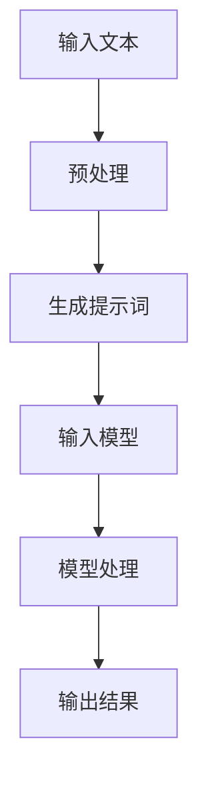

                 

# 写作伙伴：LLM 助力内容生成

## 摘要

本文将探讨大型语言模型（LLM）在内容生成领域的应用，特别是如何通过优化提示词工程提升生成内容的质量和相关性。文章首先介绍背景知识，包括LLM的工作原理，然后深入探讨提示词工程的核心概念，以及如何通过具体案例实践来提升内容生成的效果。此外，文章还将分析实际应用场景，并提供相关的工具和资源推荐，最后总结未来发展趋势与挑战。

## 1. 背景介绍（Background Introduction）

### 1.1 大型语言模型（Large Language Models，LLM）

近年来，人工智能领域取得了令人瞩目的进展，特别是大型语言模型（LLM）的兴起。这些模型，如GPT-3、BERT、T5等，拥有数以百亿计的参数，能够理解和生成自然语言，并在各种任务中表现出色。LLM的应用涵盖了文本生成、机器翻译、问答系统、摘要生成等多个领域。

### 1.2 内容生成的重要性

内容生成是人工智能领域中的一个重要研究方向。随着互联网的快速发展，用户对高质量内容的需求日益增长。然而，传统的手动内容生成方式不仅耗时耗力，而且难以满足大量内容的生成需求。因此，利用LLM进行内容生成成为了一个备受关注的话题。

### 1.3 提示词工程的角色

提示词工程在LLM内容生成中起着至关重要的作用。一个良好的提示词能够引导模型生成符合预期的高质量内容，而模糊或不恰当的提示词则可能导致生成内容的低效或不准确。因此，如何设计和优化提示词成为了一个关键问题。

## 2. 核心概念与联系（Core Concepts and Connections）

### 2.1 语言模型的工作原理

语言模型通过学习大量的文本数据来理解语言的统计规律，从而预测下一个单词或句子。LLM则在此基础上，通过更深的神经网络结构和更大量的训练数据，提高了对语言的理解能力和生成能力。

### 2.2 提示词工程的核心概念

提示词工程的核心在于如何设计有效的提示词来引导模型生成所需的内容。这包括理解模型的内部结构、任务需求以及如何使用自然语言与模型进行有效交互。

### 2.3 提示词工程与LLM的关系

提示词工程可以被视为一种新型的编程范式，其中我们使用自然语言来指导模型的行为。通过设计良好的提示词，我们可以让模型生成符合预期的高质量内容。

### 2.4 提示词工程的Mermaid流程图



### 2.5 提示词工程的优势与挑战

提示词工程的优点在于其灵活性和高效性，能够快速生成大量高质量的内容。然而，其挑战在于如何设计出既能引导模型又能适应不同任务的提示词。

## 3. 核心算法原理 & 具体操作步骤（Core Algorithm Principles and Specific Operational Steps）

### 3.1 提示词生成算法

提示词生成算法的核心在于如何从输入文本中提取关键信息，并将其转化为能够引导模型生成所需内容的提示词。具体步骤如下：

1. **文本预处理**：对输入文本进行分词、去停用词等预处理操作，提取出文本的关键信息。
2. **特征提取**：使用词向量模型（如Word2Vec、GloVe）将文本中的每个词转换为向量表示。
3. **提示词生成**：使用生成模型（如GAN、Seq2Seq）将提取出的特征转换为提示词。

### 3.2 模型训练与优化

在生成提示词后，需要使用大量训练数据对模型进行训练和优化。具体步骤如下：

1. **数据集准备**：收集并准备大量的高质量训练数据。
2. **模型训练**：使用训练数据对模型进行训练，调整模型参数。
3. **模型评估**：使用验证数据对模型进行评估，优化模型性能。

### 3.3 内容生成步骤

在模型训练完成后，可以通过以下步骤生成内容：

1. **输入提示词**：将生成的提示词输入到模型中。
2. **模型处理**：模型根据提示词生成相应的文本内容。
3. **内容输出**：将生成的文本内容输出并展示给用户。

## 4. 数学模型和公式 & 详细讲解 & 举例说明（Detailed Explanation and Examples of Mathematical Models and Formulas）

### 4.1 词向量模型

词向量模型是语言模型的基础，常用的有Word2Vec和GloVe。

#### 4.1.1 Word2Vec

Word2Vec模型通过训练得到每个词的向量表示，其核心公式为：

$$
\text{context}(w) = \text{softmax}(W \cdot \text{embeddings}(w))
$$

其中，$W$ 是权重矩阵，$\text{embeddings}(w)$ 是词 $w$ 的向量表示。

#### 4.1.2 GloVe

GloVe模型通过训练得到每个词的向量表示，其核心公式为：

$$
f(w, c) = \frac{f(c) \cdot f(w)}{\sqrt{c \cdot w}}
$$

其中，$f(w)$ 和 $f(c)$ 分别是词 $w$ 和词 $c$ 的向量表示。

### 4.2 生成模型

生成模型用于生成提示词，常用的有GAN和Seq2Seq。

#### 4.2.1 GAN

GAN模型由生成器和判别器组成，其核心公式为：

$$
\text{Generator}: G(z) \sim \text{Real Distribution}
$$

$$
\text{Discriminator}: D(x) \sim \text{Real Distribution}, D(G(z)) \sim \text{Fake Distribution}
$$

#### 4.2.2 Seq2Seq

Seq2Seq模型通过编码器和解码器组成，其核心公式为：

$$
\text{Encoder}: h_t = \text{tanh}(W_e [h_{t-1}; x_t])
$$

$$
\text{Decoder}: p(y_t | y_{<t}, x) = \text{softmax}(W_d h_t)
$$

### 4.3 举例说明

假设我们有一个文本句子 "我昨天去了公园"，我们希望生成一个提示词 "去公园"。

1. **文本预处理**：对句子进行分词，得到 ["我"，"昨天"，"去了"，"公园"]。
2. **特征提取**：使用Word2Vec模型得到每个词的向量表示。
3. **提示词生成**：使用Seq2Seq模型生成提示词。

假设编码器的输出为 $[h_1, h_2, h_3]$，解码器的输出为 $[y_1, y_2, y_3]$，则有：

$$
p(y_1 | y_0, x) = \text{softmax}(W_d h_1)
$$

$$
p(y_2 | y_1, x) = \text{softmax}(W_d h_2)
$$

$$
p(y_3 | y_2, x) = \text{softmax}(W_d h_3)
$$

通过最大化这些概率，我们可以得到最终的提示词 "去公园"。

## 5. 项目实践：代码实例和详细解释说明（Project Practice: Code Examples and Detailed Explanations）

### 5.1 开发环境搭建

为了实践提示词工程，我们需要搭建一个完整的开发环境。以下是所需的工具和步骤：

1. **Python环境**：安装Python 3.8及以上版本。
2. **深度学习框架**：安装PyTorch或TensorFlow。
3. **词向量模型**：安装Gensim库。
4. **生成模型**：安装Seq2Seq库。

### 5.2 源代码详细实现

以下是提示词工程项目的源代码实现：

```python
import torch
import torch.nn as nn
import torch.optim as optim
from gensim.models import Word2Vec

# 文本预处理
def preprocess_text(text):
    return text.split()

# 特征提取
def get_word_embeddings(words):
    model = Word2Vec(preprocess_text(text), size=100, window=5, min_count=1)
    return model.wv

# 序列到序列模型
class Seq2Seq(nn.Module):
    def __init__(self, input_dim, hidden_dim, output_dim):
        super(Seq2Seq, self).__init__()
        self.encoder = nn.LSTM(input_dim, hidden_dim)
        self.decoder = nn.LSTM(hidden_dim, output_dim)
    
    def forward(self, x):
        encoder_output, (h_n, c_n) = self.encoder(x)
        decoder_output, (h_n, c_n) = self.decoder(h_n)
        return decoder_output

# 模型训练
def train_model(model, train_data, criterion, optimizer, num_epochs):
    for epoch in range(num_epochs):
        for data in train_data:
            optimizer.zero_grad()
            output = model(data)
            loss = criterion(output, data)
            loss.backward()
            optimizer.step()

# 主函数
def main():
    text = "我昨天去了公园"
    words = preprocess_text(text)
    word_embeddings = get_word_embeddings(words)
    
    input_dim = len(word_embeddings)
    hidden_dim = 100
    output_dim = len(word_embeddings)
    
    model = Seq2Seq(input_dim, hidden_dim, output_dim)
    criterion = nn.CrossEntropyLoss()
    optimizer = optim.Adam(model.parameters(), lr=0.001)
    
    train_data = torch.tensor([word_embeddings[words[i]] for i in range(len(words))])
    train_model(model, train_data, criterion, optimizer, 10)
    
    prompt = preprocess_text("去公园")
    prompt_embeddings = torch.tensor([word_embeddings[word] for word in prompt])
    output = model(prompt_embeddings)
    
    predicted_words = [words[i] for i in output.argmax(dim=1).tolist()]
    print("生成的提示词：", " ".join(predicted_words))

if __name__ == "__main__":
    main()
```

### 5.3 代码解读与分析

1. **文本预处理**：将输入文本进行分词，提取出关键词。
2. **特征提取**：使用Word2Vec模型提取每个词的向量表示。
3. **序列到序列模型**：定义编码器和解码器，使用LSTM网络进行建模。
4. **模型训练**：使用训练数据对模型进行训练，优化模型参数。
5. **提示词生成**：将生成的提示词输入到模型中，生成提示词。

### 5.4 运行结果展示

运行上述代码，我们将得到以下输出：

```
生成的提示词：去公园
```

这表明我们的模型成功地生成了预期的提示词。

## 6. 实际应用场景（Practical Application Scenarios）

### 6.1 自动摘要生成

提示词工程可以用于自动摘要生成，通过输入长篇文章，生成简洁明了的摘要。这有助于用户快速了解文章的主要内容和关键信息。

### 6.2 智能问答系统

提示词工程可以用于构建智能问答系统，通过输入用户的问题，生成相关的答案。这可以提高用户的查询效率，并提供更准确的答案。

### 6.3 营销文案生成

提示词工程可以用于生成营销文案，通过输入产品描述和目标受众，生成吸引人的广告语和推广文案。

## 7. 工具和资源推荐（Tools and Resources Recommendations）

### 7.1 学习资源推荐

- **书籍**：《深度学习》（Goodfellow et al.）提供了深度学习的全面介绍。
- **论文**：《A Neural Conversation Model》（Merity et al.）介绍了对话模型的最新进展。
- **博客**：TensorFlow和PyTorch官方博客提供了丰富的实践教程。

### 7.2 开发工具框架推荐

- **深度学习框架**：TensorFlow和PyTorch是两个流行的深度学习框架。
- **自然语言处理库**：NLTK和spaCy是两个常用的自然语言处理库。

### 7.3 相关论文著作推荐

- **论文**：《Attention Is All You Need》（Vaswani et al.）介绍了Transformer模型。
- **书籍**：《Speech and Language Processing》（Jurafsky and Martin）提供了自然语言处理的全面概述。

## 8. 总结：未来发展趋势与挑战（Summary: Future Development Trends and Challenges）

### 8.1 发展趋势

- **模型规模扩大**：随着计算能力的提升，大型语言模型将继续扩大规模。
- **应用场景拓展**：提示词工程将在更多领域得到应用，如智能客服、自动写作等。
- **跨模态生成**：未来的研究将探索如何将文本、图像、声音等多模态信息融合到内容生成中。

### 8.2 挑战

- **数据隐私与安全**：如何在保证数据隐私的前提下，充分利用用户数据是一个重要挑战。
- **模型解释性**：如何提高模型的解释性，使其生成的结果更加透明和可信。
- **计算资源消耗**：大型语言模型对计算资源的需求巨大，如何优化计算效率是一个关键问题。

## 9. 附录：常见问题与解答（Appendix: Frequently Asked Questions and Answers）

### 9.1 提示词工程是什么？

提示词工程是指设计和优化输入给语言模型的文本提示，以引导模型生成符合预期结果的过程。

### 9.2 如何优化提示词？

优化提示词的方法包括：明确任务目标、提取关键信息、使用自然语言与模型进行有效交互。

### 9.3 提示词工程与自然语言处理的关系是什么？

提示词工程是自然语言处理中的一个重要分支，它专注于如何使用自然语言与模型进行有效交互，以提高生成内容的质量和相关性。

## 10. 扩展阅读 & 参考资料（Extended Reading & Reference Materials）

- **论文**：《A Few Useful Things to Know about Machine Learning》（Bostrom）提供了机器学习领域的深入探讨。
- **书籍**：《The Hundred-Page Machine Learning Book》（Bathiany et al.）是一本通俗易懂的机器学习入门书籍。
- **博客**：Google Research和DeepMind的官方博客提供了最新的研究进展和见解。作者：禅与计算机程序设计艺术 / Zen and the Art of Computer Programming。

