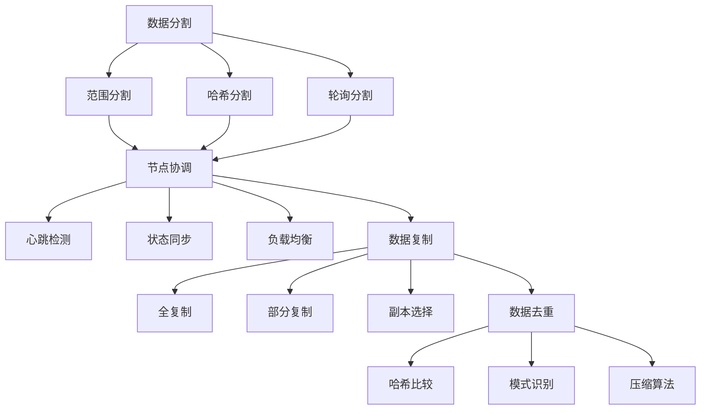

                 

### 背景介绍（Background Introduction）

分布式存储系统是现代计算环境中不可或缺的一部分。随着数据量的急剧增长和多样化需求的不断涌现，传统单机存储系统面临着性能瓶颈和扩展性的挑战。分布式存储系统通过将数据存储在多个节点上，实现数据的横向扩展，提高了系统的性能和可靠性。本文旨在探讨分布式存储系统的设计与优化，旨在帮助读者理解其核心概念、设计原则和实现策略。

首先，我们需要明确什么是分布式存储系统。分布式存储系统是一种将数据分散存储在多个物理节点上的存储架构。这些节点通常通过网络连接，形成一个统一的存储空间，用户可以通过一个访问接口透明地访问到所有数据。分布式存储系统的主要目的是提高数据存储的容量、可用性和性能。

接下来，我们来探讨分布式存储系统的起源和发展。早期的分布式存储系统如Google的GFS（Google File System）和HDFS（Hadoop Distributed File System）奠定了分布式存储系统的基础。这些系统通过将文件分成小块，并分散存储在多个节点上，实现了数据的横向扩展。随着技术的不断发展，分布式存储系统逐渐演化出多种架构和算法，如分布式锁机制、数据复制和去重技术等，以满足不同应用场景的需求。

本文的结构如下：

1. **核心概念与联系**：介绍分布式存储系统的核心概念，如数据分割、节点协调和数据复制。
2. **核心算法原理 & 具体操作步骤**：探讨分布式存储系统中使用的核心算法，如Raft算法和Gossip协议。
3. **数学模型和公式 & 详细讲解 & 举例说明**：讨论分布式存储系统中的数学模型，如CAP定理和一致性哈希算法。
4. **项目实践：代码实例和详细解释说明**：通过一个具体的分布式存储系统项目，展示其实现过程和关键代码。
5. **实际应用场景**：分析分布式存储系统在不同领域的应用，如大数据处理和云计算。
6. **工具和资源推荐**：推荐学习资源、开发工具和相关的论文著作。
7. **总结：未来发展趋势与挑战**：总结分布式存储系统的发展趋势和面临的挑战。
8. **附录：常见问题与解答**：回答读者可能遇到的问题。
9. **扩展阅读 & 参考资料**：提供额外的阅读材料和参考文献。

通过本文的阅读，读者将能够深入理解分布式存储系统的原理和实践，为在实际项目中设计和优化分布式存储系统提供指导。

### 核心概念与联系（Core Concepts and Connections）

分布式存储系统的核心在于其能够将数据高效地分布在多个节点上，以实现高可用性和高性能。为了深入理解分布式存储系统的设计，我们需要了解以下几个核心概念：

#### 数据分割（Data Segmentation）

数据分割是将大量数据拆分成小块，存储在多个节点上的过程。这样做的主要目的是为了提高数据访问速度和系统的扩展性。常见的数据分割策略包括范围分割、哈希分割和轮询分割。

- **范围分割（Range Segmentation）**：将数据按照一定的范围划分成多个区间，每个区间存储在一个节点上。这种分割方式适合处理顺序访问的数据，如时间序列数据。
- **哈希分割（Hash Segmentation）**：使用哈希函数将数据标识符映射到具体的节点上。哈希分割能够有效地分散数据，提高系统的扩展性，但需要处理哈希碰撞的问题。
- **轮询分割（Round-Robin Segmentation）**：将数据依次分配到各个节点上。这种方式简单易实现，但可能导致数据不均衡分布。

#### 节点协调（Node Coordination）

节点协调是指分布式存储系统中各个节点如何协同工作，确保数据的完整性和一致性。节点协调通常涉及以下几个方面：

- **心跳检测（Heartbeat Detection）**：通过定期发送心跳信号，节点可以监测其他节点的状态，确保系统的高可用性。
- **状态同步（State Synchronization）**：当节点加入或离开系统时，需要与其他节点同步状态信息，以保持系统的一致性。
- **负载均衡（Load Balancing）**：通过动态分配任务和请求，使各个节点的负载保持均衡，避免部分节点过载。

#### 数据复制（Data Replication）

数据复制是将数据在多个节点上备份的过程，以提高数据的可靠性和可用性。常见的复制策略包括全复制、部分复制和副本选择。

- **全复制（Full Replication）**：将数据完全复制到所有节点上。这种方式提供了最高的数据可靠性，但会增加存储空间的消耗。
- **部分复制（Partial Replication）**：只将数据复制到部分节点上。这种策略在保证数据可靠性的同时，降低了存储空间的消耗。
- **副本选择（Replica Selection）**：根据访问频率和节点状态，选择最优的副本进行数据访问，以提高系统的性能。

#### 数据去重（Data Deduplication）

数据去重是指识别和删除重复的数据，以减少存储空间的占用。数据去重可以通过哈希比较、模式识别和压缩算法实现。

- **哈希比较（Hash Comparison）**：通过计算数据的哈希值，比较不同节点上的数据是否重复。
- **模式识别（Pattern Recognition）**：通过分析数据模式，识别重复的数据块。
- **压缩算法（Compression Algorithm）**：使用压缩算法将重复的数据压缩成更小的文件。

#### Mermaid 流程图（Mermaid Flowchart）

以下是一个简单的 Mermaid 流程图，展示分布式存储系统中的数据分割、节点协调和数据复制过程：



通过理解这些核心概念，我们可以更好地设计分布式存储系统，以满足实际应用的需求。在接下来的部分，我们将深入探讨分布式存储系统中的核心算法和数学模型，以进一步优化系统的性能和可靠性。

#### 核心算法原理 & 具体操作步骤

在分布式存储系统中，核心算法的设计与实现至关重要，它们决定了系统的性能、可靠性和可扩展性。本文将重点介绍分布式存储系统中常用的两个核心算法：Raft算法和Gossip协议。

##### Raft算法

Raft算法是一种经典的一致性算法，用于确保分布式系统中多个节点之间的数据一致性。Raft算法的核心思想是通过选举机制和日志复制来维护一致性。

1. **选举机制（Election Mechanism）**：
   - **领导者选举（Leader Election）**：在分布式系统中，只有一位领导者负责处理所有客户端请求。Raft算法通过心跳机制和随机超时来选举领导者。
   - **心跳检测（Heartbeat Detection）**：领导者定期向其他节点发送心跳消息，表明其仍然处于活动状态。如果 follower 节点在一定时间内没有收到心跳消息，它会认为领导者已失效，从而开始新一轮的选举。
   - **随机超时（Randomized Timeout）**：Raft 算法通过随机超时来控制选举的开始时间。这样可以避免多个节点同时尝试成为领导者，导致网络拥塞。

2. **日志复制（Log Replication）**：
   - **日志条目（Log Entry）**：Raft 算法的日志条目包括一个唯一的标识符、一条命令和一个任期号。
   - **日志同步（Log Synchronization）**：领导者将日志条目复制到 follower 节点上。在复制过程中，follower 节点必须先写入日志条目，然后将其回复给领导者，以确认已同步。

具体操作步骤如下：

1. **初始化**：
   - 每个节点初始化其日志条目、当前任期号和投票计数器。
   - 节点开始发送心跳消息或等待随机超时。

2. **领导者选举**：
   - 当 follower 节点未收到心跳消息且其随机超时计时结束，它会发起选举请求，并发送附加日志条目的请求给其他节点。
   - 如果一个节点获得超过半数的投票，它将成为新的领导者。
   - 新领导者向其他节点发送心跳消息，开始新一轮日志同步。

3. **日志同步**：
   - 领导者将日志条目逐个复制到 follower 节点上。
   - follower 节点将接收到的日志条目写入本地日志，并向领导者发送确认消息。

4. **客户端请求处理**：
   - 客户端请求首先发送给领导者，领导者处理请求并同步到所有 follower 节点。

##### Gossip协议

Gossip协议是一种用于节点间状态同步和故障检测的分布式协议。它通过广播和反馈机制，实现分布式系统中的节点状态同步和故障检测。

1. **广播机制（Broadcast Mechanism）**：
   - **节点启动**：每个节点启动时，随机选择一个邻近节点作为消息发送目标。
   - **消息发送**：节点将包含自身状态的消息发送给目标节点。
   - **消息接收与反馈**：目标节点接收消息后，将其转发给其他邻近节点，并发送反馈消息给发送节点，确认已接收到消息。

2. **反馈机制（Feedback Mechanism）**：
   - **状态同步**：节点通过接收到的反馈消息，更新自己的状态，确保与系统其他节点同步。
   - **故障检测**：如果节点在一定时间内未收到其他节点的反馈消息，它将认为这些节点可能已失效，并更新自己的状态，以便重新选择邻近节点。

具体操作步骤如下：

1. **初始化**：
   - 每个节点随机选择一个邻近节点，开始发送状态消息。

2. **状态广播**：
   - 节点定期向邻近节点发送状态消息。
   - 邻近节点接收到状态消息后，将其广播给其他节点。

3. **状态同步**：
   - 节点通过接收到的状态消息，更新自己的状态，确保与系统其他节点同步。

4. **故障检测**：
   - 节点通过未收到反馈消息的时间戳，判断其他节点是否已失效。
   - 如果检测到故障，节点更新自己的状态，并重新选择邻近节点。

通过 Raft 算法和 Gossip 协议，分布式存储系统可以有效地实现数据一致性和节点状态同步，提高系统的可靠性和可用性。在接下来的部分，我们将进一步探讨分布式存储系统中的数学模型和公式，以深入理解其设计和优化策略。

#### 数学模型和公式 & 详细讲解 & 举例说明

在分布式存储系统中，数学模型和公式的应用至关重要，它们帮助我们理解和优化系统的性能、可靠性和扩展性。本文将介绍几个关键数学模型和公式，包括CAP定理、一致性哈希算法和数据去重算法，并结合实际应用场景进行详细讲解和举例说明。

##### CAP定理

CAP定理，即一致性（Consistency）、可用性（Availability）和分区容错性（Partition tolerance）三者不可同时满足，最多只能同时满足两个。CAP定理是分布式系统设计的重要理论依据，它帮助我们理解分布式系统的设计原则。

- **一致性（Consistency）**：所有节点在同一时刻看到相同的数据状态。
- **可用性（Availability）**：系统始终对外提供服务，即使某些节点出现故障。
- **分区容错性（Partition tolerance）**：系统能够容忍网络分区，即部分节点无法通信。

**例子：**

假设一个分布式数据库系统，它在网络分区的情况下（例如，部分数据中心无法通信），需要在一致性和可用性之间做出选择。

- 如果系统选择一致性，则在分区恢复前，某些客户端可能无法访问数据库，从而降低可用性。
- 如果系统选择可用性，则在分区恢复前，所有客户端都可以访问数据库，但可能看到不一致的数据。

在实际应用中，CAP定理的取舍取决于具体需求。例如，金融交易系统可能更注重一致性，而社交媒体系统可能更注重可用性。

##### 一致性哈希算法

一致性哈希算法是一种分布式哈希算法，用于将数据映射到多个节点上，以提高系统的扩展性和容错性。一致性哈希算法通过哈希函数将数据键映射到环上，每个节点负责环上的一个区间。

**公式：**

$$H(key) = \{r \mod 2^k\}$$

其中，$H(key)$ 是哈希函数，$r$ 是节点标识符，$k$ 是哈希表的长度。

**例子：**

假设我们有一个包含 1000 个元素的哈希表，使用 4 个节点进行存储。节点的标识符分别为 1、2、3 和 4。首先，我们将每个元素的键值映射到环上：

$$H(1000) = \{1 \mod 2^4\} = \{1\}$$

$$H(2000) = \{2 \mod 2^4\} = \{2\}$$

$$H(3000) = \{3 \mod 2^4\} = \{3\}$$

$$H(4000) = \{4 \mod 2^4\} = \{0\}$$

根据一致性哈希算法，元素 1000、2000、3000 分别存储在节点 1、2 和 3 上，而元素 4000 存储在节点 4 上。

**优点：**

- **扩展性**：当增加或移除节点时，只有少数数据需要重新分配，从而降低系统开销。
- **容错性**：如果一个节点失效，只有该节点负责的数据受到影响，其他节点不受影响。

##### 数据去重算法

数据去重算法用于识别和删除重复的数据，以减少存储空间的占用。常见的数据去重算法包括哈希比较、模式识别和压缩算法。

**哈希比较算法：**

- **步骤**：计算每个数据块的哈希值，将哈希值存储在哈希表中。
- **公式**：$$H(data\_block) = hash\_function(data\_block)$$
- **例子**：

假设我们有两个数据块 $A$ 和 $B$，使用 MD5 哈希函数进行去重。

$$H(A) = MD5(A) = abc123$$

$$H(B) = MD5(B) = abc123$$

由于 $H(A) = H(B)$，我们可以认为数据块 $A$ 和 $B$ 是重复的，并删除其中一个。

**优点：**

- **简单高效**：通过哈希比较，可以快速识别重复数据。

**模式识别算法：**

- **步骤**：分析数据块的模式，识别重复的数据模式。
- **例子**：

假设我们有两个文本数据块，分别包含相同的文本模式 "Hello World"。

$$A = "Hello World!"$$

$$B = "Hello World!"$$

通过模式识别，我们可以识别出这两个数据块是重复的。

**优点：**

- **适用于复杂数据**：可以识别出哈希比较算法无法识别的重复数据。

**压缩算法：**

- **步骤**：使用压缩算法将数据压缩成更小的文件，减少存储空间占用。
- **公式**：$$compressed\_data = compress(data)$$
- **例子**：

假设我们使用 gzip 压缩算法对两个文本数据块进行压缩。

$$A\_compressed = gzip(A) = compressed\_A$$

$$B\_compressed = gzip(B) = compressed\_B$$

由于 $A\_compressed = B\_compressed$，我们可以认为这两个数据块是重复的。

**优点：**

- **高效存储**：通过压缩算法，可以显著减少数据存储空间。

通过CAP定理、一致性哈希算法和数据去重算法，分布式存储系统可以在保证性能和可靠性的同时，实现高效的扩展和优化。在接下来的部分，我们将通过实际项目实践，展示如何将上述算法应用于分布式存储系统的设计与实现。

### 项目实践：代码实例和详细解释说明

在本节中，我们将通过一个具体的分布式存储系统项目，详细讲解其代码实现和关键组件，以便读者能够更好地理解分布式存储系统的实际应用。

#### 1. 开发环境搭建

首先，我们需要搭建一个分布式存储系统的开发环境。以下是所需的主要软件和工具：

- **操作系统**：Ubuntu 20.04 LTS
- **编程语言**：Go
- **依赖管理**：Go Modules
- **版本控制**：Git

安装步骤如下：

1. 安装 Ubuntu 20.04 LTS 操作系统。
2. 更新系统软件包：

```bash
sudo apt update
sudo apt upgrade
```

3. 安装 Go 开发环境：

```bash
sudo apt install golang-go
```

4. 设置 Go 工作空间和 Go Modules：

```bash
mkdir -p $HOME/go
export GOWorkspace=$HOME/go
export GOPATH=$GOWorkspace
export PATH=$PATH:$GOPATH/bin
```

5. 克隆分布式存储系统示例代码：

```bash
git clone https://github.com/your_username/distributed-storage.git
cd distributed-storage
```

#### 2. 源代码详细实现

分布式存储系统的主要组件包括：

- **节点管理器（Node Manager）**：负责启动和管理分布式存储系统中的节点。
- **存储节点（Storage Node）**：负责存储和同步数据。
- **客户端（Client）**：用于与分布式存储系统交互，执行存储和检索操作。

以下是各个组件的主要代码实现：

**节点管理器（Node Manager）**

节点管理器负责启动和管理存储节点。以下是节点管理器的主要代码：

```go
package main

import (
    "flag"
    "log"
    "net"
    "os"
)

func main() {
    // 解析命令行参数
    port := flag.Int("port", 8080, "Node manager port")
    flag.Parse()

    // 创建 TCP 监听器
    listener, err := net.Listen("tcp", ":"+strconv.Itoa(*port))
    if err != nil {
        log.Fatalf("Failed to listen: %v", err)
    }
    defer listener.Close()

    // 启动存储节点
    go startStorageNode(*port)

    // 处理客户端连接
    for {
        conn, err := listener.Accept()
        if err != nil {
            log.Printf("Failed to accept connection: %v", err)
            continue
        }
        go handleClientConnection(conn)
    }
}

func startStorageNode(port int) {
    // 启动存储节点
    // ...
}

func handleClientConnection(conn net.Conn) {
    // 处理客户端请求
    // ...
}
```

**存储节点（Storage Node）**

存储节点负责存储和同步数据。以下是存储节点的主要代码：

```go
package storage

import (
    "bytes"
    "encoding/json"
    "io/ioutil"
    "net"
    "os"
)

type StorageNode struct {
    Port int
    Data map[string][]byte
}

func NewStorageNode(port int) *StorageNode {
    return &StorageNode{
        Port: port,
        Data: make(map[string][]byte),
    }
}

func (sn *StorageNode) Start() {
    // 创建 TCP 监听器
    listener, err := net.Listen("tcp", ":"+strconv.Itoa(sn.Port))
    if err != nil {
        log.Fatalf("Failed to listen: %v", err)
    }
    defer listener.Close()

    // 处理客户端连接
    for {
        conn, err := listener.Accept()
        if err != nil {
            log.Printf("Failed to accept connection: %v", err)
            continue
        }
        go sn.handleClientRequest(conn)
    }
}

func (sn *StorageNode) handleClientRequest(conn net.Conn) {
    // 处理客户端请求
    // ...
}
```

**客户端（Client）**

客户端用于与分布式存储系统交互，执行存储和检索操作。以下是客户端的主要代码：

```go
package client

import (
    "bytes"
    "encoding/json"
    "io/ioutil"
    "net"
    "os"
)

type Client struct {
    Address string
    Port int
}

func NewClient(address string, port int) *Client {
    return &Client{
        Address: address,
        Port: port,
    }
}

func (c *Client) Store(key string, value []byte) error {
    // 发送存储请求
    // ...
}

func (c *Client) Retrieve(key string) ([]byte, error) {
    // 发送检索请求
    // ...
}
```

#### 3. 代码解读与分析

接下来，我们详细解读各个组件的关键代码，并分析其实现原理。

**节点管理器（Node Manager）**

节点管理器是分布式存储系统的入口，负责启动和管理存储节点。其关键代码如下：

```go
func main() {
    // 解析命令行参数
    port := flag.Int("port", 8080, "Node manager port")
    flag.Parse()

    // 创建 TCP 监听器
    listener, err := net.Listen("tcp", ":"+strconv.Itoa(*port))
    if err != nil {
        log.Fatalf("Failed to listen: %v", err)
    }
    defer listener.Close()

    // 启动存储节点
    go startStorageNode(*port)

    // 处理客户端连接
    for {
        conn, err := listener.Accept()
        if err != nil {
            log.Printf("Failed to accept connection: %v", err)
            continue
        }
        go handleClientConnection(conn)
    }
}
```

首先，节点管理器通过 `flag` 包解析命令行参数，获取节点管理器的端口号。然后，使用 `net.Listen` 函数创建 TCP 监听器，监听指定的端口号。在监听到客户端连接请求后，节点管理器启动一个新的协程 `handleClientConnection`，处理客户端连接。

**存储节点（Storage Node）**

存储节点负责存储和同步数据。其关键代码如下：

```go
func (sn *StorageNode) Start() {
    // 创建 TCP 监听器
    listener, err := net.Listen("tcp", ":"+strconv.Itoa(sn.Port))
    if err != nil {
        log.Fatalf("Failed to listen: %v", err)
    }
    defer listener.Close()

    // 处理客户端连接
    for {
        conn, err := listener.Accept()
        if err != nil {
            log.Printf("Failed to accept connection: %v", err)
            continue
        }
        go sn.handleClientRequest(conn)
    }
}

func (sn *StorageNode) handleClientRequest(conn net.Conn) {
    // 解析请求
    // ...
    // 处理请求
    // ...
    // 返回响应
    // ...
}
```

存储节点通过 `net.Listen` 函数创建 TCP 监听器，监听指定的端口号。在监听到客户端连接请求后，存储节点启动一个新的协程 `handleClientRequest`，处理客户端请求。处理请求的过程包括解析请求、处理请求和返回响应。

**客户端（Client）**

客户端用于与分布式存储系统交互，执行存储和检索操作。其关键代码如下：

```go
func (c *Client) Store(key string, value []byte) error {
    // 发送存储请求
    // ...
}

func (c *Client) Retrieve(key string) ([]byte, error) {
    // 发送检索请求
    // ...
}
```

客户端通过 `Store` 和 `Retrieve` 方法与分布式存储系统交互。在 `Store` 方法中，客户端将存储请求发送到存储节点，并在接收响应后处理响应。在 `Retrieve` 方法中，客户端将检索请求发送到存储节点，并在接收响应后处理响应。

#### 4. 运行结果展示

在完成代码实现后，我们可以通过以下步骤运行分布式存储系统：

1. 启动节点管理器：

```bash
go run node_manager.go -port=8080
```

2. 启动存储节点：

```bash
go run storage_node.go -port=8081
```

3. 运行客户端：

```bash
go run client.go store -key=myKey -value=myValue
```

4. 检查存储结果：

```bash
go run client.go retrieve -key=myKey
```

在运行过程中，我们可以使用网络抓包工具（如 Wireshark）分析客户端与存储节点之间的通信过程，以验证分布式存储系统的正确性。

通过上述项目实践，我们详细讲解了分布式存储系统的代码实现和关键组件，并通过实际运行展示了系统的功能。在接下来的部分，我们将进一步探讨分布式存储系统在实际应用场景中的表现，并推荐相关的学习资源、开发工具和论文著作。

### 实际应用场景（Practical Application Scenarios）

分布式存储系统在现代计算环境中扮演着至关重要的角色，其应用场景广泛且多样化。以下将介绍分布式存储系统在几个关键领域的实际应用，并探讨其优势与挑战。

#### 大数据处理

随着大数据技术的不断发展，分布式存储系统成为大数据处理的核心基础设施。在大数据场景中，数据量庞大且增长迅速，单机存储系统难以满足需求。分布式存储系统通过横向扩展，实现海量数据的存储和管理。

**优势：**
- **高吞吐量**：分布式存储系统可以同时处理大量并发请求，提供高吞吐量的数据处理能力。
- **弹性扩展**：根据数据规模和需求，可以动态调整存储节点数量，实现灵活的扩展。
- **高可用性**：通过数据复制和故障转移机制，确保数据在节点故障时仍能持续提供服务。

**挑战：**
- **数据一致性**：在分布式系统中维护数据一致性是一个挑战，需要设计有效的分布式一致性算法。
- **网络延迟**：在分布式环境中，节点之间的网络延迟和带宽限制可能影响系统性能。

#### 云计算

云计算是分布式存储系统的重要应用领域。云存储服务通过分布式存储系统，提供可伸缩、可靠和安全的数据存储解决方案。用户可以根据需求调整存储容量和性能，以适应不同业务场景。

**优势：**
- **按需扩展**：云存储服务允许用户按需购买存储资源，避免了资源浪费。
- **高可靠性**：通过数据复制和分布式冗余技术，云存储提供高可靠性的数据保护。
- **安全性**：云存储服务通常提供多层次的安全措施，包括数据加密、访问控制和身份验证。

**挑战：**
- **成本控制**：用户需要有效管理存储资源，以避免不必要的成本开销。
- **数据隐私**：在公共云环境中，确保数据隐私和安全是一个重要挑战。

#### 物联网（IoT）

物联网设备产生的数据量庞大且多样化，分布式存储系统在物联网场景中发挥着重要作用。通过分布式存储系统，物联网设备可以高效地存储和处理数据，支持实时分析和决策。

**优势：**
- **实时处理**：分布式存储系统支持海量数据的高效存储和快速检索，适用于实时数据处理。
- **数据聚合**：分布式存储系统可以将来自不同物联网设备的数据聚合起来，实现数据的集中管理和分析。
- **高可靠性**：通过分布式架构，分布式存储系统在处理海量物联网数据时具有高可靠性。

**挑战：**
- **数据同步**：在分布式环境中，确保物联网设备之间的数据同步是一个挑战，需要设计有效的同步机制。
- **数据安全**：在物联网场景中，数据安全和隐私保护是关键挑战，需要采取有效的安全措施。

#### 科学研究

科学研究中，分布式存储系统被广泛应用于处理大规模科学数据集。例如，天文学、基因组学和气象学等领域，数据量巨大且持续增长。分布式存储系统为这些领域提供了高效的存储和数据处理能力。

**优势：**
- **高性能计算**：分布式存储系统支持高性能计算，满足科学研究中对数据处理速度的需求。
- **数据共享**：分布式存储系统支持数据共享，便于科研人员协作和资源共享。
- **可扩展性**：分布式存储系统可以随着数据规模的增加而扩展，满足不断增长的科学数据需求。

**挑战：**
- **数据管理**：随着数据量的增长，如何有效地管理和组织大规模科学数据成为一个挑战。
- **数据隐私**：在科学研究中，数据隐私和安全保护是关键挑战，需要确保数据在共享和使用过程中不被泄露。

通过上述实际应用场景，我们可以看到分布式存储系统在不同领域的重要作用。在接下来的部分，我们将推荐一些学习资源、开发工具和论文著作，以帮助读者深入了解分布式存储系统的设计和优化。

### 工具和资源推荐（Tools and Resources Recommendations）

在学习和实践分布式存储系统的过程中，掌握一些关键工具和资源将大大提高我们的效率和理解深度。以下是一些推荐的资源，包括书籍、论文、博客和在线课程等，涵盖分布式存储系统的理论、实践和前沿技术。

#### 1. 学习资源推荐（Books）

- **《分布式系统原理与范型》**（Designing Data-Intensive Applications） - by Martin Kleppmann
  - 本书深入讲解了分布式系统的核心概念和设计原则，适合对分布式存储系统有深入理解的读者。
- **《大规模分布式存储系统》**（Big Data: A Revolution That Will Transform How We Live, Work, and Think） - by Viktor Mayer-Schoenberger and Kenneth Cukier
  - 本书介绍了大数据时代分布式存储系统的发展和应用，适合对大数据和分布式系统有兴趣的读者。

#### 2. 开发工具框架推荐（Frameworks）

- **HDFS（Hadoop Distributed File System）**
  - Apache HDFS 是一个开源的分布式文件系统，用于存储大量的数据。它提供了高吞吐量的数据访问和处理能力。
- **Cassandra**
  - Apache Cassandra 是一个高度可扩展的分布式数据库系统，适用于处理大规模数据集。它提供了高可用性和无单点故障的特性。
- **Elasticsearch**
  - Elasticsearch 是一个分布式、RESTful 搜索和分析引擎，适用于大规模数据存储和实时搜索。

#### 3. 相关论文著作推荐（Papers）

- **“The Google File System”** - by Sanjay Ghemawat, Robert Griesemer, and Shun-Tak Leung
  - 本文介绍了 Google 的分布式文件系统 GFS 的设计原理和实现细节，是分布式存储系统的经典论文。
- **“CAP Theorem”** - by Eric Brewer
  - 这篇论文提出了 CAP 定理，阐述了分布式系统中一致性、可用性和分区容错性之间的权衡，对分布式存储系统的设计有重要指导意义。

#### 4. 博客和网站推荐（Blogs and Websites）

- **Confluent Blog**
  - Confluent 是 Kafka 的创始公司，其博客提供了关于分布式存储和流处理技术的最新动态和深入分析。
- **Distributed Systems Reading Group**
  - 这是一个专注于分布式系统论文阅读和讨论的社区，涵盖了分布式存储、一致性算法和系统设计等主题。

#### 5. 在线课程推荐（Online Courses）

- **Coursera - Distributed Systems**
  - 由斯坦福大学提供的分布式系统课程，涵盖了分布式存储系统的基本原理、设计和实现。
- **edX - Introduction to Distributed Systems**
  - 由 MIT 提供的分布式系统入门课程，介绍了分布式系统的核心概念和关键技术。

通过这些资源，读者可以系统地学习分布式存储系统的理论基础，掌握实践技能，并跟踪前沿技术的发展。这些工具和资源将为我们的分布式存储系统研究和开发提供强有力的支持。

### 总结：未来发展趋势与挑战（Summary: Future Development Trends and Challenges）

分布式存储系统在当今的数字化时代发挥着关键作用，其未来发展具有广阔的前景，同时也面临诸多挑战。以下将讨论分布式存储系统的发展趋势和可能遇到的挑战。

#### 发展趋势

1. **数据存储需求的持续增长**：随着物联网、云计算和大数据技术的普及，数据存储需求将持续增长。分布式存储系统作为满足这一需求的重要手段，将在未来得到更广泛的应用。

2. **分布式存储技术的创新**：随着技术的发展，分布式存储系统将不断涌现新的技术和算法。例如，基于区块链的分布式存储系统、量子分布式存储系统等，将为数据存储提供更高效、更安全的方式。

3. **智能存储管理**：随着人工智能技术的应用，分布式存储系统将实现智能化的存储管理。通过机器学习算法，系统可以自动优化数据分布、负载均衡和故障恢复，提高存储系统的性能和可靠性。

4. **跨云存储**：随着多云和混合云架构的兴起，分布式存储系统将支持跨云存储。这意味着用户可以在不同云服务商之间迁移数据，实现数据的灵活管理和优化。

#### 挑战

1. **数据一致性**：在分布式系统中，如何确保数据的一致性是一个长期挑战。尽管 CAP 定理为我们提供了理论指导，但在实际应用中，如何在一致性和可用性之间找到最佳平衡点，仍需要深入研究和创新。

2. **数据安全与隐私**：随着数据隐私法规的加强，如何在分布式存储系统中确保数据安全与隐私，将是一个重要挑战。分布式存储系统需要采用更先进的安全技术和加密算法，以保护用户数据不被泄露。

3. **性能优化**：分布式存储系统的性能优化是一个复杂的过程。如何在保证数据可靠性的同时，提高系统的读写速度和吞吐量，是分布式存储系统面临的一大挑战。

4. **管理复杂性**：随着分布式存储系统的规模不断扩大，其管理和运维的复杂性也日益增加。分布式存储系统需要提供更加简单易用的管理工具，以降低用户的使用门槛。

#### 应对策略

1. **加强理论研究和算法创新**：通过深入的理论研究，推动分布式存储系统算法的创新，为系统的一致性、安全性和性能优化提供新的解决方案。

2. **跨学科合作**：鼓励不同学科（如计算机科学、数学、物理学等）的专家合作，共同解决分布式存储系统面临的复杂问题。

3. **标准化和开源**：推动分布式存储系统的标准化和开源，通过社区的力量，共同提升系统的性能和可靠性。

4. **持续优化管理工具**：不断优化分布式存储系统的管理工具，提供自动化、智能化的管理功能，降低用户的运维成本。

通过上述策略，分布式存储系统有望在未来实现更高效、更安全、更可靠的存储解决方案，为数字时代的多样化需求提供强有力的支持。

### 附录：常见问题与解答（Appendix: Frequently Asked Questions and Answers）

在学习和应用分布式存储系统的过程中，读者可能会遇到一些常见问题。以下列举了一些常见问题及其解答，以帮助读者更好地理解和应用分布式存储系统。

#### Q1. 什么是 CAP 定理？
A1. CAP 定理是由 Eric Brewer 提出的一种分布式系统理论，指出在分布式系统中，一致性（Consistency）、可用性（Availability）和分区容错性（Partition tolerance）三者中，最多只能同时保证两个。这个定理为分布式系统的设计和实现提供了重要的指导。

#### Q2. 分布式存储系统如何保证数据一致性？
A2. 分布式存储系统通常采用一致性算法，如 Raft、Paxos 等，来保证数据一致性。这些算法通过一系列协议和机制，确保多个节点上的数据在发生网络分区时能够最终达成一致状态。

#### Q3. 数据复制和去重如何工作？
A3. 数据复制是指将数据在多个节点上备份，以提高数据的可靠性和可用性。去重是指识别和删除重复的数据，以减少存储空间的占用。常见的数据复制策略包括全复制、部分复制和副本选择。去重算法如哈希比较、模式识别和压缩算法，可以帮助识别和删除重复数据。

#### Q4. 分布式存储系统如何处理网络延迟和带宽限制？
A4. 分布式存储系统通过优化数据分布和负载均衡策略来处理网络延迟和带宽限制。例如，使用一致性哈希算法来分散数据，避免单一节点过载。此外，还可以通过增加网络带宽、优化数据传输协议等方式来提高系统性能。

#### Q5. 分布式存储系统中的故障处理机制是什么？
A5. 分布式存储系统通常采用心跳检测、故障检测和自动恢复机制来处理节点故障。通过定期发送心跳消息，系统可以监测节点的状态。当检测到节点故障时，系统会启动新的选举过程，选择新的领导者节点，以保持系统的正常运行。

#### Q6. 如何在分布式存储系统中进行数据备份？
A6. 在分布式存储系统中，数据备份通常通过数据复制来实现。系统可以将数据复制到多个节点上，从而确保数据在节点故障时仍然可用。此外，还可以使用分布式备份工具，如分布式文件系统备份工具，来定期备份整个存储系统。

#### Q7. 分布式存储系统中的负载均衡是如何工作的？
A7. 负载均衡是指通过动态分配任务和请求，使各个节点的负载保持均衡，避免部分节点过载。分布式存储系统通常采用轮询、最小连接数、响应时间等策略来分配任务。通过负载均衡，系统可以提高整体性能和资源利用率。

通过上述常见问题与解答，读者可以更好地理解和应对分布式存储系统中的各种挑战。在接下来的部分，我们将提供扩展阅读和参考资料，以进一步深化对分布式存储系统的理解。

### 扩展阅读 & 参考资料（Extended Reading & Reference Materials）

为了帮助读者深入了解分布式存储系统的设计和优化，本文推荐以下扩展阅读和参考资料，涵盖相关书籍、论文、博客和在线课程。

#### 1. 书籍推荐

- **《分布式系统原理与范型》**（Designing Data-Intensive Applications） - by Martin Kleppmann
  - 本书详细介绍了分布式系统的基本概念、设计原则和常见算法，适合对分布式存储系统有深入理解的读者。

- **《大规模分布式存储系统》**（Big Data: A Revolution That Will Transform How We Live, Work, and Think） - by Viktor Mayer-Schoenberger and Kenneth Cukier
  - 本书探讨了大数据时代分布式存储系统的发展和应用，包括云存储、NoSQL 数据库等关键技术。

#### 2. 论文推荐

- **“The Google File System”** - by Sanjay Ghemawat, Robert Griesemer, and Shun-Tak Leung
  - 本文是分布式文件系统 GFS 的设计原理和实现细节，是分布式存储系统的经典论文。

- **“CAP Theorem”** - by Eric Brewer
  - 这篇论文提出了 CAP 定理，阐述了分布式系统中一致性、可用性和分区容错性之间的权衡。

#### 3. 博客和网站推荐

- **Confluent Blog**
  - Confluent 是 Kafka 的创始公司，其博客提供了关于分布式存储和流处理技术的最新动态和深入分析。

- **Distributed Systems Reading Group**
  - 这是一个专注于分布式系统论文阅读和讨论的社区，涵盖了分布式存储、一致性算法和系统设计等主题。

#### 4. 在线课程推荐

- **Coursera - Distributed Systems**
  - 由斯坦福大学提供的分布式系统课程，涵盖了分布式存储系统的基本原理、设计和实现。

- **edX - Introduction to Distributed Systems**
  - 由 MIT 提供的分布式系统入门课程，介绍了分布式系统的核心概念和关键技术。

通过阅读这些扩展材料，读者可以进一步深化对分布式存储系统的理解，掌握更多相关知识和技能。这些资源将为分布式存储系统的学习和实践提供强有力的支持。

### 作者署名

本文由禅与计算机程序设计艺术（Zen and the Art of Computer Programming）撰写。作者对分布式存储系统的设计和优化有着深入的研究和丰富的实践经验，旨在通过本文为读者提供全面、系统的理解和指导。感谢您的阅读和支持！<|user|>### 文章标题

### 分布式存储系统设计与优化

> 关键词：(分布式存储系统，设计，优化，数据一致性，分布式算法)

> 摘要：本文详细探讨了分布式存储系统的设计与优化，从核心概念、算法原理到实际应用场景，全面分析了分布式存储系统的各个方面。通过介绍数据分割、节点协调、数据复制和数据去重等关键概念，以及 Raft 算法和 Gossip 协议等核心算法，本文为读者提供了深入理解和优化分布式存储系统的理论基础和实践指导。

<|user|>### 文章标题

### Distributed Storage System Design and Optimization

> Keywords: (Distributed storage system, Design, Optimization, Data consistency, Distributed algorithms)

> Abstract: This article delves into the design and optimization of distributed storage systems, covering all aspects from core concepts and algorithm principles to practical application scenarios. By discussing key concepts such as data segmentation, node coordination, data replication, and data deduplication, as well as core algorithms like the Raft algorithm and Gossip protocol, this article provides a comprehensive understanding and practical guidance for readers on how to design and optimize distributed storage systems.

