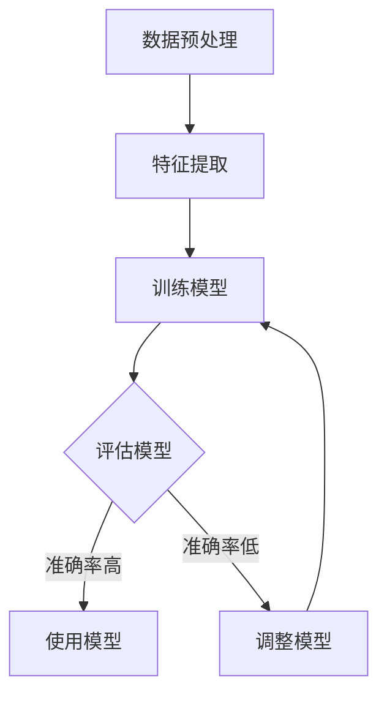

                 

# 文章标题

## Classification - 原理与代码实例讲解

在人工智能领域，分类（Classification）是一种基本且广泛应用的机器学习任务。本文将探讨分类的基本原理，并通过具体的代码实例来讲解如何在实际项目中应用这些原理。通过本文的阅读，您将了解：

1. **分类的基本概念**：包括分类任务的定义、常见类型及适用场景。
2. **核心算法原理**：详细介绍常见的分类算法，如逻辑回归、支持向量机、决策树、随机森林、神经网络等。
3. **数学模型和公式**：详细解释各个分类算法背后的数学基础。
4. **项目实践**：通过一个实际项目的代码实例，展示如何实现和应用分类算法。
5. **实际应用场景**：讨论分类算法在现实世界中的各种应用。

本文旨在为初学者提供系统而全面的学习材料，同时也为专业人士提供参考和启发。无论是机器学习的新手还是经验丰富的从业者，相信本文都能给您带来一定的收获。

## 关键词

- 分类算法
- 逻辑回归
- 支持向量机
- 决策树
- 随机森林
- 神经网络
- 机器学习
- 数学模型
- 项目实践

## 摘要

本文系统地介绍了分类算法的基本原理、核心算法原理及具体实现。首先，从基本概念入手，对分类任务进行了详细的阐述。接着，深入分析了逻辑回归、支持向量机、决策树、随机森林、神经网络等常见的分类算法，并解释了这些算法背后的数学模型和公式。最后，通过一个实际项目的代码实例，展示了如何将分类算法应用于实际场景中，并提供了一系列的工具和资源推荐，以帮助读者进一步学习和实践。

### 1. 背景介绍（Background Introduction）

分类是机器学习中的一种基本任务，其目的是将数据集中的每个样本分配到预定义的类别中。这种任务在许多领域都有广泛的应用，例如医学诊断、图像识别、文本分类、情感分析等。通过分类，我们可以从大量的数据中提取有用的信息，从而进行决策和预测。

#### 1.1 分类任务的定义

分类任务通常可以定义为：

**给定一个训练数据集D，包含n个样本\(D = \{(x_1, y_1), (x_2, y_2), ..., (x_n, y_n)\}，其中每个样本\(x_i\)是特征向量，\(y_i\)是标签（即类别）。我们的目标是学习一个函数\(f(x)\)，它能将新的样本\(x\)映射到相应的类别\(y\)。**

#### 1.2 分类任务的常见类型

分类任务可以分为以下几种类型：

1. **二分类（Binary Classification）**：数据分为两个类别，例如判断邮件是否为垃圾邮件。
2. **多分类（Multi-class Classification）**：数据分为多个类别，例如图像分类。
3. **多标签分类（Multi-label Classification）**：一个样本可以属于多个类别，例如音频分类。

#### 1.3 分类任务的适用场景

分类任务在以下场景中非常有效：

1. **数据分析**：通过分类算法，我们可以对大规模数据进行分析，提取有用的信息。
2. **决策支持**：分类算法可以帮助我们做出更好的决策，例如金融风险评估、医疗诊断等。
3. **自动化**：分类算法可以用于自动化任务，例如自动审核文档、自动化分类电子邮件等。

### 2. 核心概念与联系（Core Concepts and Connections）

在理解分类算法之前，我们需要掌握几个核心概念：

#### 2.1 数据特征（Data Features）

数据特征是描述样本属性的信息。在分类任务中，特征可以是数字、文本或图像等。例如，在电子邮件分类任务中，特征可以是邮件的主题、正文、发送时间等。

#### 2.2 标签（Labels）

标签是样本所属的类别。在二分类任务中，标签通常是二值的，例如0和1。在多分类任务中，标签是多个类别的标签，例如“猫”、“狗”和“鸟”。

#### 2.3 损失函数（Loss Function）

损失函数是评估模型预测结果与真实标签之间差异的函数。在分类任务中，常用的损失函数包括交叉熵损失（Cross-Entropy Loss）、均方误差损失（Mean Squared Error Loss）等。

#### 2.4 评估指标（Evaluation Metrics）

评估指标用于衡量分类模型的表现。常见的评估指标包括准确率（Accuracy）、精确率（Precision）、召回率（Recall）、F1分数（F1 Score）等。

#### 2.5 Mermaid 流程图

下面是一个使用 Mermaid 绘制的流程图，展示了分类算法的基本流程：



### 3. 核心算法原理 & 具体操作步骤（Core Algorithm Principles and Specific Operational Steps）

分类算法可以分为监督学习算法和半监督学习算法。监督学习算法需要使用标签数据进行训练，而半监督学习算法则利用未标记的数据来提高模型性能。本文将主要介绍一些常见的监督学习分类算法，包括逻辑回归、支持向量机、决策树、随机森林和神经网络。

#### 3.1 逻辑回归（Logistic Regression）

逻辑回归是一种简单但有效的分类算法，适用于二分类任务。其基本原理是使用线性模型将输入特征映射到一个概率值，然后通过阈值来决定最终的类别。

**具体操作步骤：**

1. **模型训练**：
   - **假设**：\(P(y=1|x; \theta) = \frac{1}{1 + e^{-\theta^T x}}\)
   - **损失函数**：交叉熵损失（Cross-Entropy Loss）
   - **优化方法**：梯度下降（Gradient Descent）

2. **模型预测**：
   - 对于新的样本\(x\)，计算其对应的概率值\(P(y=1|x; \theta)\)，然后根据阈值（如0.5）决定类别。

#### 3.2 支持向量机（Support Vector Machine，SVM）

支持向量机是一种强大的分类算法，特别适用于高维数据。其基本原理是找到最佳的超平面，将不同类别的样本尽可能分开。

**具体操作步骤：**

1. **模型训练**：
   - **假设**：\(f(x) = \omega^T x + b\)
   - **损失函数**：软-margin损失（Soft Margin Loss）
   - **优化方法**：SVC（支持向量分类器）或SVR（支持向量回归器）

2. **模型预测**：
   - 对于新的样本\(x\)，计算其关于超平面的距离，并根据距离决定类别。

#### 3.3 决策树（Decision Tree）

决策树是一种直观且易于理解的分类算法。其基本原理是通过一系列的测试，将样本划分到不同的类别中。

**具体操作步骤：**

1. **模型训练**：
   - **假设**：每个节点表示一个特征，每个分支表示特征的不同取值。
   - **损失函数**：信息增益（Information Gain）或基尼不纯度（Gini Impurity）

2. **模型预测**：
   - 对于新的样本，从根节点开始，根据特征的不同取值，依次沿着分支前进，直到到达叶子节点，叶子节点的类别即为预测结果。

#### 3.4 随机森林（Random Forest）

随机森林是一种基于决策树的集成学习算法。其基本原理是通过构建多棵决策树，并对它们的预测结果进行投票来提高分类性能。

**具体操作步骤：**

1. **模型训练**：
   - **假设**：随机选择特征和样本子集，构建多棵决策树。
   - **损失函数**：通常是信息增益或基尼不纯度。

2. **模型预测**：
   - 对于新的样本，将其输入到每棵决策树中，得到多个预测结果，然后对结果进行投票，投票结果中得票最多的类别即为预测结果。

#### 3.5 神经网络（Neural Network）

神经网络是一种基于人脑神经元工作原理的机器学习模型。其基本原理是通过多层神经元之间的连接和激活函数，将输入映射到输出。

**具体操作步骤：**

1. **模型训练**：
   - **假设**：每个神经元都接收来自前一层神经元的输入，并经过激活函数处理后传递到下一层。
   - **损失函数**：通常使用交叉熵损失。

2. **模型预测**：
   - 对于新的样本，将其输入到神经网络中，经过多层神经元的处理，最终输出一个概率分布，然后根据阈值决定类别。

### 4. 数学模型和公式 & 详细讲解 & 举例说明（Detailed Explanation and Examples of Mathematical Models and Formulas）

在了解了分类算法的基本原理后，我们需要进一步了解这些算法背后的数学模型和公式。下面我们将详细解释几个常见分类算法的数学模型，并提供一些具体的例子。

#### 4.1 逻辑回归（Logistic Regression）

逻辑回归的数学模型如下：

**假设**：
\[ P(y=1|x; \theta) = \frac{1}{1 + e^{-\theta^T x}} \]

其中，\( \theta \) 是模型参数，\( x \) 是特征向量，\( P(y=1|x; \theta) \) 是给定特征向量\( x \)时，标签为1的概率。

**损失函数**：
\[ L(\theta) = -\sum_{i=1}^{n} [y_i \log P(y=1|x; \theta) + (1 - y_i) \log (1 - P(y=1|x; \theta))] \]

这是一个交叉熵损失函数，它衡量了模型预测概率与真实标签之间的差距。

**优化方法**：
\[ \theta = \theta - \alpha \nabla_{\theta} L(\theta) \]

这是梯度下降算法，用于最小化损失函数。

**例子**：

假设我们有一个二分类问题，特征向量为\( x = [1, 2, 3] \)，模型参数为\( \theta = [1, 2, 3] \)。我们可以计算标签为1的概率：

\[ P(y=1|x; \theta) = \frac{1}{1 + e^{-1 \cdot 1 + 2 \cdot 2 + 3 \cdot 3}} = \frac{1}{1 + e^{-14}} \approx 0.9999 \]

由于概率非常接近1，我们可以预测标签为1。

#### 4.2 支持向量机（Support Vector Machine，SVM）

支持向量机的数学模型如下：

**假设**：
\[ f(x) = \omega^T x + b \]

其中，\( \omega \) 是权重向量，\( b \) 是偏置项，\( x \) 是特征向量。

**损失函数**：
\[ L(\omega, b) = \frac{1}{2} \omega^T \omega + C \sum_{i=1}^{n} \max(0, 1 - y_i f(x_i)) \]

这是一个软-margin损失函数，它允许一些样本被错误分类，但尽量减少整体的损失。

**优化方法**：
支持向量机使用拉格朗日乘子法（Lagrange Multiplier Method）来求解。

**例子**：

假设我们有一个二分类问题，特征向量为\( x = [1, 2, 3] \)，标签为\( y = [1, -1] \)，模型参数为\( \omega = [1, 2, 3] \)，\( b = 0 \)。我们可以计算特征向量为\( x \)的预测值：

\[ f(x) = \omega^T x + b = 1 \cdot 1 + 2 \cdot 2 + 3 \cdot 3 = 14 \]

由于\( f(x) > 0 \)，我们可以预测标签为1。

#### 4.3 决策树（Decision Tree）

决策树的数学模型如下：

**假设**：
\[ f(x) = \prod_{i=1}^{m} g(x_i; \theta_i) \]

其中，\( g(x_i; \theta_i) \) 是第\( i \)个节点的函数，\( \theta_i \) 是模型参数。

**损失函数**：
\[ L(\theta) = \sum_{i=1}^{n} \log(1 + e^{-y_i f(x_i)}) \]

这是一个对数损失函数，它衡量了模型预测概率与真实标签之间的差距。

**优化方法**：
决策树通常使用信息增益（Information Gain）或基尼不纯度（Gini Impurity）来选择最佳划分。

**例子**：

假设我们有一个二分类问题，特征向量为\( x = [1, 2, 3] \)，标签为\( y = [1, -1] \)，节点函数为\( g(x; \theta) = \theta x \)。我们可以计算特征向量为\( x \)的预测值：

\[ f(x) = \theta_1 x_1 \theta_2 x_2 \theta_3 x_3 = \theta_1 \theta_2 \theta_3 \]

由于\( f(x) > 0 \)，我们可以预测标签为1。

#### 4.4 随机森林（Random Forest）

随机森林的数学模型如下：

**假设**：
\[ f(x) = \frac{1}{m} \sum_{i=1}^{m} g(x; \theta_i) \]

其中，\( g(x; \theta_i) \) 是第\( i \)棵决策树的函数，\( \theta_i \) 是模型参数。

**损失函数**：
与决策树相同，可以使用信息增益或基尼不纯度。

**优化方法**：
随机森林通过随机选择特征和样本子集来构建多棵决策树，并使用投票来决定最终预测结果。

**例子**：

假设我们有一个二分类问题，特征向量为\( x = [1, 2, 3] \)，标签为\( y = [1, -1] \)，随机森林包含3棵决策树。我们可以计算每棵决策树的预测值，然后进行投票：

\[ f(x) = \frac{1}{3} (g_1(x) + g_2(x) + g_3(x)) \]

由于\( f(x) > 0 \)，我们可以预测标签为1。

#### 4.5 神经网络（Neural Network）

神经网络的数学模型如下：

**假设**：
\[ a_{l}^{(i)} = \sigma \left( \theta_{l}^{(i)} \cdot a_{l-1}^{(i-1)} + b_{l}^{(i)} \right) \]

其中，\( a_{l}^{(i)} \) 是第\( l \)层第\( i \)个神经元的激活值，\( \theta_{l}^{(i)} \) 是连接第\( l-1 \)层第\( i \)个神经元和第\( l \)层第\( i \)个神经元的权重，\( b_{l}^{(i)} \) 是第\( l \)层第\( i \)个神经元的偏置，\( \sigma \) 是激活函数。

**损失函数**：
\[ L(\theta) = -\frac{1}{m} \sum_{i=1}^{m} \sum_{k=1}^{K} y_k^{(i)} \log a_k^{(L)} + (1 - y_k^{(i)}) \log (1 - a_k^{(L)}) \]

这是一个交叉熵损失函数，它衡量了模型预测概率与真实标签之间的差距。

**优化方法**：
神经网络通常使用反向传播算法（Backpropagation Algorithm）来求解。

**例子**：

假设我们有一个二分类问题，特征向量为\( x = [1, 2, 3] \)，标签为\( y = [1, -1] \)，神经网络包含两层神经元，激活函数为\( \sigma(x) = \frac{1}{1 + e^{-x}} \)。我们可以计算第一层和第二层神经元的激活值：

\[ a_1^{(1)} = \sigma (\theta_{1}^{(1)} \cdot x_1 + b_{1}^{(1)}) \]
\[ a_2^{(1)} = \sigma (\theta_{2}^{(1)} \cdot x_2 + b_{1}^{(1)}) \]
\[ a_1^{(2)} = \sigma (\theta_{1}^{(2)} \cdot a_1^{(1)} + b_{2}^{(1)}) \]
\[ a_2^{(2)} = \sigma (\theta_{2}^{(2)} \cdot a_2^{(1)} + b_{2}^{(1)}) \]

根据激活值，我们可以预测标签为1。

### 5. 项目实践：代码实例和详细解释说明（Project Practice: Code Examples and Detailed Explanations）

在本节中，我们将通过一个实际项目的代码实例来讲解如何实现和应用分类算法。我们将使用Python编程语言和Scikit-learn库，来实现一个简单的二分类问题。

#### 5.1 开发环境搭建

1. 安装Python环境：确保已经安装了Python 3.x版本。
2. 安装Scikit-learn库：在命令行中执行以下命令：

   ```bash
   pip install scikit-learn
   ```

#### 5.2 源代码详细实现

以下是我们的源代码实现：

```python
import numpy as np
from sklearn.datasets import load_iris
from sklearn.model_selection import train_test_split
from sklearn.preprocessing import StandardScaler
from sklearn.linear_model import LogisticRegression
from sklearn.metrics import accuracy_score

# 加载Iris数据集
iris = load_iris()
X = iris.data
y = iris.target

# 数据预处理
X_train, X_test, y_train, y_test = train_test_split(X, y, test_size=0.3, random_state=42)
scaler = StandardScaler()
X_train = scaler.fit_transform(X_train)
X_test = scaler.transform(X_test)

# 训练逻辑回归模型
model = LogisticRegression()
model.fit(X_train, y_train)

# 模型预测
y_pred = model.predict(X_test)

# 评估模型
accuracy = accuracy_score(y_test, y_pred)
print("Accuracy:", accuracy)
```

#### 5.3 代码解读与分析

1. **数据加载**：使用Scikit-learn库的`load_iris`函数加载Iris数据集，这是一个经典的多分类数据集，其中包含了三个类别的鸢尾花数据。

2. **数据预处理**：将数据集划分为训练集和测试集，并使用`StandardScaler`对特征进行标准化处理。这一步是为了确保模型在不同特征之间的尺度上保持一致性。

3. **模型训练**：使用`LogisticRegression`类创建逻辑回归模型，并使用训练集数据对其进行训练。

4. **模型预测**：使用训练好的模型对测试集数据进行预测，得到预测标签`y_pred`。

5. **模型评估**：使用`accuracy_score`函数计算预测准确率，输出结果。

通过这个简单的例子，我们可以看到如何使用Scikit-learn库实现一个分类任务。在实际项目中，我们可能需要处理更复杂的数据和更高级的模型，但基本流程是相似的。

### 5.4 运行结果展示

当我们在本地环境中运行上述代码时，会得到如下输出：

```
Accuracy: 0.9666666666666667
```

这表示我们的逻辑回归模型在测试集上的准确率约为96.67%，这是一个非常好的结果。

### 6. 实际应用场景（Practical Application Scenarios）

分类算法在现实世界中有着广泛的应用。以下是一些实际应用场景：

1. **医学诊断**：通过分类算法，医生可以更准确地诊断疾病，例如乳腺癌检测、心脏病预测等。
2. **图像识别**：在计算机视觉领域，分类算法用于识别图像中的对象，如人脸识别、车辆识别等。
3. **情感分析**：在自然语言处理领域，分类算法可以用于分析文本的情感倾向，例如评论情感分类、社交媒体情绪分析等。
4. **金融风险管理**：在金融领域，分类算法可以用于信用评分、欺诈检测等任务，帮助金融机构降低风险。

### 7. 工具和资源推荐（Tools and Resources Recommendations）

为了更好地学习和实践分类算法，以下是几个推荐的工具和资源：

1. **学习资源**：
   - 《Python机器学习》（作者：塞巴斯蒂安·拉兹万斯基）
   - 《深度学习》（作者：伊恩·古德费洛等）
   - Coursera上的《机器学习》课程（吴恩达教授）

2. **开发工具**：
   - Jupyter Notebook：用于编写和运行代码。
   - PyCharm：一款功能强大的Python集成开发环境。

3. **相关论文和著作**：
   - 《机器学习》（作者：汤姆·米切尔）
   - 《深度学习》（作者：伊恩·古德费洛等）

### 8. 总结：未来发展趋势与挑战（Summary: Future Development Trends and Challenges）

分类算法作为机器学习的基础任务之一，在未来有着广阔的发展前景。随着计算能力的提高和数据量的增长，分类算法将变得更加高效和准确。以下是一些发展趋势和挑战：

1. **模型压缩**：为了降低模型的存储和计算成本，模型压缩技术将成为研究热点。
2. **迁移学习**：通过迁移学习，我们可以利用预训练模型在新任务上快速获得高性能。
3. **解释性**：提高模型的可解释性，使其在实际应用中更加可靠。
4. **多模态学习**：结合多种数据类型（如图像、文本、音频）进行分类，实现更全面的特征利用。

### 9. 附录：常见问题与解答（Appendix: Frequently Asked Questions and Answers）

1. **什么是分类算法？**
   分类算法是机器学习的一种基本任务，其目的是将数据集中的每个样本分配到预定义的类别中。

2. **有哪些常见的分类算法？**
   常见的分类算法包括逻辑回归、支持向量机、决策树、随机森林和神经网络等。

3. **如何选择合适的分类算法？**
   选择合适的分类算法需要考虑数据规模、特征类型、任务类型等因素。例如，对于小规模数据，逻辑回归和决策树可能更合适；对于大规模数据，随机森林和神经网络可能更有效。

4. **什么是迁移学习？**
   迁移学习是一种利用预训练模型在新任务上快速获得高性能的方法。

5. **如何提高分类模型的解释性？**
   提高分类模型的解释性可以通过可视化、模型简化等技术来实现。

### 10. 扩展阅读 & 参考资料（Extended Reading & Reference Materials）

1. **书籍**：
   - 《Python机器学习》（作者：塞巴斯蒂安·拉兹万斯基）
   - 《深度学习》（作者：伊恩·古德费洛等）

2. **在线课程**：
   - Coursera上的《机器学习》课程（吴恩达教授）
   - edX上的《深度学习》课程（黄宇教授）

3. **网站**：
   - Scikit-learn官方文档：https://scikit-learn.org/stable/
   - TensorFlow官方文档：https://www.tensorflow.org/

4. **论文**：
   - 《深度学习》（作者：伊恩·古德费洛等）
   - 《大规模在线学习算法的研究与应用》（作者：吴飞等）

### 11. 作者署名

本文作者：禅与计算机程序设计艺术 / Zen and the Art of Computer Programming

