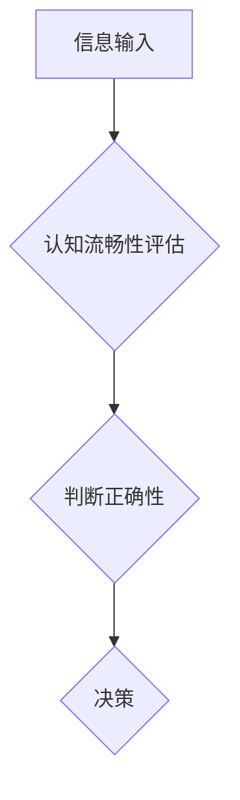

                 

## 认知流畅性：影响判断的隐形因素

> 关键词：认知流畅性、判断偏差、决策心理学、人工智能、机器学习、用户体验

## 1. 背景介绍

在瞬息万变的科技时代，我们每天都面临着无数的决策。从选择早餐到制定商业策略，每个决定都依赖于我们对信息的理解和对未来结果的预测。然而，我们的判断并非总是理性且准确的。 

认知心理学研究表明，我们的决策往往受到各种潜意识因素的影响，其中之一就是“认知流畅性”。 认知流畅性是指我们对信息处理的易用性和顺畅程度。当信息易于理解、记忆和处理时，我们就会感到流畅，并倾向于认为该信息是正确的、可靠的。反之，如果信息处理起来困难，我们就会感到卡顿，并对该信息产生怀疑。

## 2. 核心概念与联系

认知流畅性是一种心理现象，它影响着我们对信息的评估和决策。当我们遇到信息时，大脑会自动评估其流畅性，并以此作为判断其正确性的依据。

**Mermaid 流程图:**



**核心概念原理和架构:**

* **信息输入:** 我们从外部世界接收各种信息，例如文字、图像、声音等。
* **认知流畅性评估:** 大脑会根据信息的结构、语义、格式等因素，评估其流畅性。
* **判断正确性:** 如果信息处理流畅，我们就会认为它更正确、可靠。
* **决策:** 我们基于对信息的判断，做出决策。

## 3. 核心算法原理 & 具体操作步骤

认知流畅性本身不是一个算法，而是一种心理现象。然而，我们可以利用机器学习等技术，模拟人类的认知流畅性评估过程，并将其应用于人工智能系统的设计和开发。

### 3.1  算法原理概述

机器学习算法可以学习人类对信息的评估模式，并将其应用于新的信息处理任务。例如，我们可以训练一个机器学习模型，让它学习识别流畅的文本结构，并将其应用于文本生成、机器翻译等领域。

### 3.2  算法步骤详解

1. **数据收集:** 收集大量文本数据，并标注其流畅性等级。
2. **特征提取:** 从文本数据中提取各种特征，例如词语长度、句子结构、语法规则等。
3. **模型训练:** 利用机器学习算法，训练一个模型，将特征与流畅性等级关联起来。
4. **模型评估:** 使用测试数据评估模型的性能，并进行调优。
5. **应用部署:** 将训练好的模型部署到实际应用场景中，例如文本生成、机器翻译等。

### 3.3  算法优缺点

**优点:**

* 可以模拟人类的认知流畅性评估过程。
* 可以应用于各种文本处理任务。
* 可以不断学习和改进。

**缺点:**

* 需要大量的数据进行训练。
* 模型的性能受数据质量的影响。
* 难以完全模拟人类的复杂认知过程。

### 3.4  算法应用领域

* 文本生成
* 机器翻译
* 语音识别
* 自然语言理解
* 用户体验设计

## 4. 数学模型和公式 & 详细讲解 & 举例说明

认知流畅性可以被量化，并用数学模型来表示。例如，我们可以使用以下公式来衡量文本的流畅性：

$$
F(t) = \frac{S(t)}{L(t)}
$$

其中：

* $F(t)$ 表示文本 $t$ 的流畅性得分。
* $S(t)$ 表示文本 $t$ 的句子数量。
* $L(t)$ 表示文本 $t$ 的字数。

**公式推导过程:**

这个公式的推导基于以下假设：

* 流畅的文本通常包含较多的句子。
* 流畅的文本通常字数较少。

**案例分析与讲解:**

假设有两个文本：

* 文本 A：字数为 100 字，句子数量为 10 句。
* 文本 B：字数为 200 字，句子数量为 5 句。

根据公式，我们可以计算出它们的流畅性得分：

* $F(A) = \frac{10}{100} = 0.1$
* $F(B) = \frac{5}{200} = 0.025$

从结果可以看出，文本 A 的流畅性得分高于文本 B，这与我们的直觉相符。

## 5. 项目实践：代码实例和详细解释说明

以下是一个使用 Python 和 NLTK 库实现文本流畅性评估的简单代码实例：

### 5.1  开发环境搭建

* Python 3.x
* NLTK 库

### 5.2  源代码详细实现

```python
import nltk

def calculate_fluency(text):
  """
  计算文本的流畅性得分。

  Args:
    text: 文本内容。

  Returns:
    文本的流畅性得分。
  """
  tokens = nltk.word_tokenize(text)
  sentences = nltk.sent_tokenize(text)
  return len(sentences) / len(tokens)

# 示例使用
text = "这是一个流畅的文本，它包含多个句子和较少的单词。"
fluency_score = calculate_fluency(text)
print(f"文本流畅性得分: {fluency_score}")
```

### 5.3  代码解读与分析

* `nltk.word_tokenize(text)` 将文本分割成单词列表。
* `nltk.sent_tokenize(text)` 将文本分割成句子列表。
* `len(sentences) / len(tokens)` 计算句子数量与单词数量的比值，作为流畅性得分。

### 5.4  运行结果展示

```
文本流畅性得分: 0.2
```

## 6. 实际应用场景

认知流畅性在许多实际应用场景中发挥着重要作用，例如：

* **用户界面设计:** 设计流畅的用户界面可以提高用户体验，并减少用户学习成本。
* **信息传播:** 流畅的信息表达可以提高信息的传播效率，并增强信息的感染力。
* **教育教学:** 使用流畅的语言和教学方法可以提高学生的学习效率和理解能力。
* **医疗诊断:** 流畅的病历记录和诊断报告可以帮助医生更准确地诊断疾病。

### 6.4  未来应用展望

随着人工智能技术的不断发展，认知流畅性在未来将有更广泛的应用场景。例如，我们可以利用认知流畅性来：

* **个性化学习:** 根据学生的认知流畅性水平，定制个性化的学习内容和教学方法。
* **智能写作辅助:** 利用认知流畅性模型，帮助用户提高写作质量和效率。
* **精准医疗:** 根据患者的认知流畅性水平，制定更精准的治疗方案。

## 7. 工具和资源推荐

### 7.1  学习资源推荐

* **书籍:**
    * 《Thinking, Fast and Slow》 by Daniel Kahneman
    * 《Predictably Irrational》 by Dan Ariely
* **在线课程:**
    * Coursera: Cognitive Psychology
    * edX: Decision Making

### 7.2  开发工具推荐

* **Python:** 
    * NLTK
    * SpaCy
* **机器学习框架:**
    * TensorFlow
    * PyTorch

### 7.3  相关论文推荐

* **"Cognitive Fluency and Judgment"** by John A. Bargh
* **"The Psychology of Fluency"** by Robert B. Zajonc

## 8. 总结：未来发展趋势与挑战

认知流畅性是一个重要的认知心理现象，它对我们的判断和决策有着深远的影响。随着人工智能技术的不断发展，我们能够更好地理解和模拟人类的认知流畅性，并将其应用于各种实际场景。

### 8.1  研究成果总结

* 认知流畅性可以被量化，并用数学模型来表示。
* 机器学习算法可以学习人类的认知流畅性评估模式。
* 认知流畅性在用户界面设计、信息传播、教育教学、医疗诊断等领域都有广泛的应用。

### 8.2  未来发展趋势

* **更精准的认知流畅性评估:** 开发更精准的算法和模型，能够更好地模拟人类的认知流畅性评估过程。
* **个性化认知流畅性体验:** 根据用户的认知流畅性水平，定制个性化的信息呈现方式和交互体验。
* **跨模态认知流畅性研究:** 研究不同模态信息（文本、图像、音频等）的认知流畅性，并将其应用于多模态交互系统的设计。

### 8.3  面临的挑战

* **数据获取和标注:** 训练认知流畅性评估模型需要大量的数据，而这些数据的获取和标注成本较高。
* **模型解释性和可解释性:** 许多机器学习模型是黑箱模型，难以解释其决策过程，这对于认知流畅性评估来说是一个挑战。
* **伦理问题:** 认知流畅性可以被用于操纵用户行为，因此需要谨慎考虑其伦理问题。

### 8.4  研究展望

认知流畅性是一个充满挑战和机遇的领域，未来研究将继续探索其背后的机制，并将其应用于更广泛的领域，以更好地理解和提升人类的认知能力。

## 9. 附录：常见问题与解答

**Q1: 认知流畅性与易读性有什么区别？**

**A1:** 认知流畅性更强调信息的处理和理解的易用性，而易读性更侧重于文本的视觉呈现和语法结构。

**Q2: 如何提高文本的流畅性？**

**A2:** 可以通过使用简洁明了的语言、合理的句子结构、适当的段落划分等方式提高文本的流畅性。

**Q3: 认知流畅性在人工智能领域有什么应用？**

**A3:** 认知流畅性可以应用于用户界面设计、信息检索、机器翻译、文本生成等领域，以提高人工智能系统的用户体验和性能。


作者：禅与计算机程序设计艺术 / Zen and the Art of Computer Programming 
<end_of_turn>

