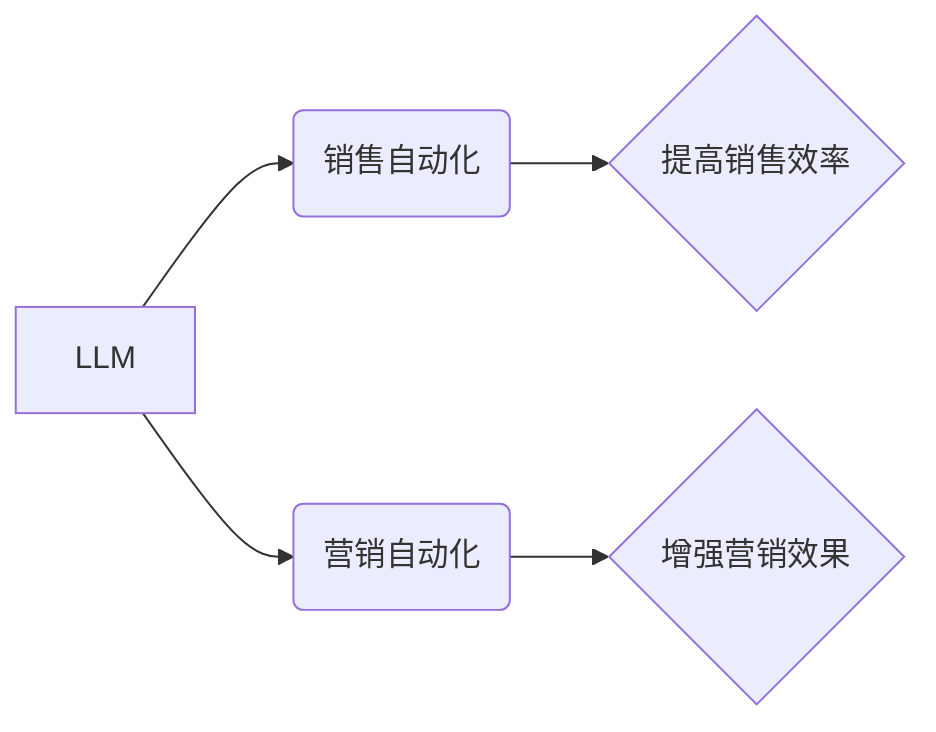

                 

## 销售和营销策略：LLM 增强竞争力

> 关键词：LLM, 大语言模型, 销售策略, 营销策略, 个性化体验, 自动化, 内容创作, 客户服务

### 1. 背景介绍

在当今数据爆炸和科技飞速发展的时代，企业面临着前所未有的竞争压力。传统的销售和营销策略已经难以满足日益复杂的市场需求。大型语言模型（LLM）的出现为企业提供了全新的机遇，其强大的自然语言处理能力和生成能力可以彻底改变销售和营销模式，帮助企业提升效率、增强竞争力。

LLM 是一种能够理解和生成人类语言的深度学习模型，其训练数据通常包含海量的文本和代码。通过学习这些数据，LLM 可以执行各种自然语言任务，例如文本分类、问答、翻译、摘要、对话生成等。

### 2. 核心概念与联系

**2.1 核心概念**

* **LLM (Large Language Model):** 大型语言模型，是一种能够理解和生成人类语言的深度学习模型。
* **自然语言处理 (NLP):** 自然语言处理，是指计算机理解、处理和生成人类语言的技术。
* **销售自动化:** 利用技术手段自动完成销售流程中的重复性任务，例如发送邮件、预约会议、跟进客户等。
* **营销自动化:** 利用技术手段自动完成营销流程中的重复性任务，例如发送广告、分析数据、个性化推荐等。

**2.2 架构关系**



**2.3 联系分析**

LLM 的强大自然语言处理能力可以被应用于销售和营销自动化，从而提高效率和效果。

* **销售自动化:** LLM 可以自动生成销售邮件、回复客户咨询、分析客户需求等，解放销售人员的时间，让他们专注于更重要的工作。
* **营销自动化:** LLM 可以根据客户数据自动生成个性化营销内容、推荐产品、分析市场趋势等，提高营销精准度和转化率。

### 3. 核心算法原理 & 具体操作步骤

**3.1 算法原理概述**

LLM 的核心算法是基于 Transformer 架构的深度神经网络。Transformer 架构能够有效地处理长序列数据，并具有强大的并行计算能力，使其在自然语言处理任务中表现出色。

LLM 的训练过程是通过大量的文本数据进行监督学习。模型会学习文本的语法、语义和上下文关系，从而能够理解和生成人类语言。

**3.2 算法步骤详解**

1. **数据预处理:** 将文本数据进行清洗、分词、标记等预处理操作，使其能够被模型理解。
2. **模型训练:** 使用 Transformer 架构的深度神经网络模型，对预处理后的文本数据进行训练。训练过程包括输入文本数据、计算模型输出、调整模型参数等步骤。
3. **模型评估:** 使用测试数据评估模型的性能，例如准确率、召回率、BLEU 等指标。
4. **模型部署:** 将训练好的模型部署到生产环境中，用于实际应用。

**3.3 算法优缺点**

**优点:**

* 强大的自然语言理解和生成能力
* 可以处理长序列数据
* 具有良好的并行计算能力

**缺点:**

* 训练成本高
* 需要大量的训练数据
* 容易受到训练数据偏差的影响

**3.4 算法应用领域**

* 文本分类
* 问答系统
* 机器翻译
* 文本摘要
* 对话生成
* 内容创作
* 客户服务

### 4. 数学模型和公式 & 详细讲解 & 举例说明

**4.1 数学模型构建**

LLM 的数学模型通常基于 Transformer 架构，其核心是注意力机制。注意力机制能够帮助模型关注输入序列中与当前任务相关的部分，从而提高模型的理解和生成能力。

**4.2 公式推导过程**

注意力机制的计算公式如下：

$$
Attention(Q, K, V) = softmax(\frac{QK^T}{\sqrt{d_k}})V
$$

其中：

* $Q$：查询矩阵
* $K$：键矩阵
* $V$：值矩阵
* $d_k$：键向量的维度
* $softmax$：softmax 函数

**4.3 案例分析与讲解**

假设我们有一个句子 "我爱吃苹果"，我们要用注意力机制来计算每个词对句子整体含义的贡献。

* $Q$：查询矩阵，表示每个词对句子的整体关注度。
* $K$：键矩阵，表示每个词的语义特征。
* $V$：值矩阵，表示每个词的词义信息。

通过计算 $QK^T$，我们可以得到每个词对其他词的注意力权重。然后，通过 softmax 函数将这些权重归一化，得到每个词对句子的最终注意力分数。

### 5. 项目实践：代码实例和详细解释说明

**5.1 开发环境搭建**

* Python 3.7+
* PyTorch 或 TensorFlow
* CUDA 和 cuDNN (可选)

**5.2 源代码详细实现**

```python
import torch
import torch.nn as nn

class Attention(nn.Module):
    def __init__(self, d_model, num_heads):
        super(Attention, self).__init__()
        self.d_model = d_model
        self.num_heads = num_heads
        self.head_dim = d_model // num_heads

        self.query = nn.Linear(d_model, d_model)
        self.key = nn.Linear(d_model, d_model)
        self.value = nn.Linear(d_model, d_model)
        self.fc_out = nn.Linear(d_model, d_model)

    def forward(self, query, key, value, mask=None):
        batch_size = query.size(0)

        # Linear projections
        Q = self.query(query).view(batch_size, -1, self.num_heads, self.head_dim).transpose(1, 2)
        K = self.key(key).view(batch_size, -1, self.num_heads, self.head_dim).transpose(1, 2)
        V = self.value(value).view(batch_size, -1, self.num_heads, self.head_dim).transpose(1, 2)

        # Scaled dot-product attention
        scores = torch.matmul(Q, K.transpose(-2, -1)) / torch.sqrt(torch.tensor(self.head_dim, dtype=torch.float))
        if mask is not None:
            scores = scores.masked_fill(mask == 0, -1e9)
        attention = torch.softmax(scores, dim=-1)

        # Weighted sum of values
        context = torch.matmul(attention, V)

        # Concatenate heads and project
        context = context.transpose(1, 2).contiguous().view(batch_size, -1, self.d_model)
        output = self.fc_out(context)

        return output
```

**5.3 代码解读与分析**

这段代码实现了 Transformer 架构中的注意力机制。

* `Attention` 类定义了注意力机制的结构。
* `forward` 方法计算注意力分数和上下文向量。
* `query`, `key`, `value` 线性投影将输入数据转换为不同的表示形式。
* `softmax` 函数将注意力分数归一化。
* `fc_out` 线性投影将上下文向量转换为最终输出。

**5.4 运行结果展示**

运行该代码可以得到每个词对句子的注意力分数，从而分析每个词对句子的整体含义的贡献。

### 6. 实际应用场景

**6.1 个性化营销**

LLM 可以根据客户的购买历史、浏览记录、社交媒体行为等数据，生成个性化的营销内容，例如推荐产品、发送促销信息、定制广告等。

**6.2 智能客服**

LLM 可以构建智能客服系统，自动回复客户咨询，解决常见问题，提高客户服务效率。

**6.3 内容创作**

LLM 可以辅助内容创作，例如生成文章标题、撰写新闻稿、创作广告文案等。

**6.4 市场分析**

LLM 可以分析市场数据，例如社交媒体趋势、客户评论、竞争对手信息等，帮助企业了解市场动态，制定营销策略。

**6.5 未来应用展望**

LLM 在销售和营销领域的应用前景广阔，未来可能出现以下应用场景：

* 更智能的个性化推荐系统
* 更精准的营销自动化
* 更人性化的客户服务
* 更高效的内容创作

### 7. 工具和资源推荐

**7.1 学习资源推荐**

* **书籍:**
    * 《深度学习》
    * 《自然语言处理》
* **在线课程:**
    * Coursera: 自然语言处理
    * edX: 深度学习
* **博客:**
    * The Gradient
    * Towards Data Science

**7.2 开发工具推荐**

* **框架:**
    * PyTorch
    * TensorFlow
* **库:**
    * Hugging Face Transformers
    * Gensim

**7.3 相关论文推荐**

* Attention Is All You Need
* BERT: Pre-training of Deep Bidirectional Transformers for Language Understanding

### 8. 总结：未来发展趋势与挑战

**8.1 研究成果总结**

LLM 在销售和营销领域的应用取得了显著成果，例如提高了营销精准度、增强了客户服务效率、降低了营销成本等。

**8.2 未来发展趋势**

LLM 的未来发展趋势包括：

* 模型规模的进一步扩大
* 算法性能的持续提升
* 应用场景的不断拓展

**8.3 面临的挑战**

LLM 在实际应用中还面临一些挑战，例如：

* 数据安全和隐私问题
* 模型解释性和可信度问题
* 伦理和社会影响问题

**8.4 研究展望**

未来研究方向包括：

* 开发更安全、更可靠、更可解释的 LLM 模型
* 探索 LLM 在更多销售和营销领域的应用场景
* 研究 LLM 的伦理和社会影响，并制定相应的规范和政策

### 9. 附录：常见问题与解答

**9.1 如何选择合适的 LLM 模型？**

选择合适的 LLM 模型需要根据具体的应用场景和需求进行考虑。例如，对于需要处理大量文本数据的任务，可以选择规模更大的模型；对于需要快速响应的任务，可以选择训练速度更快的小型模型。

**9.2 如何训练自己的 LLM 模型？**

训练自己的 LLM 模型需要大量的计算资源和专业知识。可以参考开源的 LLM 模型训练代码和教程，并根据自己的需求进行调整。

**9.3 如何解决 LLM 模型的偏差问题？**

LLM 模型的训练数据可能存在偏差，导致模型输出结果存在偏见。可以通过使用更全面、更均衡的训练数据、进行数据清洗和预处理、使用正则化技术等方法来解决这个问题。


作者：禅与计算机程序设计艺术 / Zen and the Art of Computer Programming 
<end_of_turn>

