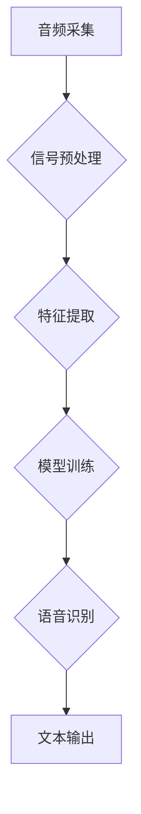
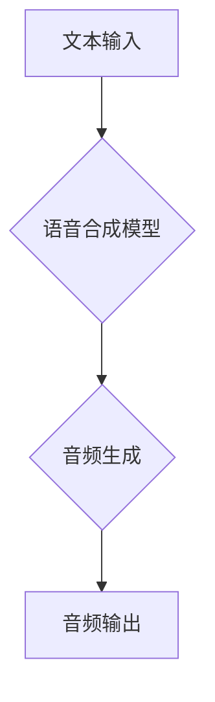

                 

## 音频信号处理：语音识别与合成技术

> 关键词：音频信号处理、语音识别、语音合成、信号分析、机器学习、深度学习、声学建模、自然语言处理

## 1. 背景介绍

音频信号处理是计算机科学和信号处理领域的重要分支，它涉及到对声音信号的采集、分析、处理和合成。语音识别和语音合成是音频信号处理的两个重要应用领域，它们在我们的日常生活中扮演着越来越重要的角色。

语音识别技术能够将语音信号转换为文本，而语音合成技术能够将文本转换为语音信号。这两项技术在许多应用场景中发挥着重要作用，例如：

* **智能语音助手:** Siri、Alexa 和 Google Assistant 等智能语音助手依赖于语音识别技术来理解用户的语音指令，并通过语音合成技术提供相应的回复。
* **自动语音转录:** 语音识别技术可以用于将会议、演讲或视频中的语音转换为文本，方便用户进行记录和回顾。
* **语音控制:** 语音识别技术可以用于控制智能家居设备、汽车和游戏等，提供更加便捷的用户体验。
* **辅助听力设备:** 语音合成技术可以用于帮助听力障碍者理解语音信息，例如将文本转换为语音或放大声音。

随着人工智能技术的快速发展，语音识别和语音合成技术取得了长足的进步。深度学习算法的应用使得语音识别和语音合成技术更加准确、流畅和自然。

## 2. 核心概念与联系

语音识别和语音合成技术都依赖于对音频信号的深入理解和处理。

**语音识别流程:**



**语音合成流程:**



**核心概念:**

* **音频信号:** 音频信号是声音的物理表示，通常用波形来表示。
* **信号预处理:** 对音频信号进行滤波、增益调整等处理，以去除噪声和增强语音信号的质量。
* **特征提取:** 从音频信号中提取关键特征，例如梅尔频率倒谱系数 (MFCC) 和线性预测系数 (LPC)。
* **模型训练:** 使用训练数据训练语音识别或语音合成模型，例如深度神经网络。
* **语音识别:** 将语音信号转换为文本。
* **语音合成:** 将文本转换为语音信号。

## 3. 核心算法原理 & 具体操作步骤

### 3.1  算法原理概述

语音识别和语音合成技术都依赖于复杂的算法和模型。

**语音识别算法:**

* **隐马尔可夫模型 (HMM):** HMM 是一种统计模型，用于描述语音信号的时序特征。
* **条件随机场 (CRF):** CRF 是一种概率模型，用于描述语音信号之间的依赖关系。
* **深度神经网络 (DNN):** DNN 是一种强大的机器学习模型，可以学习复杂的语音特征和语音识别规则。

**语音合成算法:**

* **声学建模:** 使用声学模型来生成语音信号，例如基于隐马尔可夫模型的声学模型。
* **声韵律建模:** 使用声韵律模型来控制语音信号的节奏和语调。
* **文本到语音 (TTS) 模型:** 使用深度学习模型将文本转换为语音信号。

### 3.2  算法步骤详解

**语音识别算法步骤:**

1. **音频采集:** 使用麦克风或其他音频设备采集语音信号。
2. **信号预处理:** 对音频信号进行滤波、增益调整等处理，以去除噪声和增强语音信号的质量。
3. **特征提取:** 从音频信号中提取关键特征，例如 MFCC 和 LPC。
4. **模型训练:** 使用训练数据训练语音识别模型，例如 DNN。
5. **语音识别:** 将提取的特征输入到训练好的模型中，进行语音识别，并输出文本。

**语音合成算法步骤:**

1. **文本预处理:** 将文本进行分词、标点符号处理等预处理。
2. **声学建模:** 使用声学模型生成语音信号。
3. **声韵律建模:** 使用声韵律模型控制语音信号的节奏和语调。
4. **音频生成:** 将声学模型和声韵律模型生成的语音信号合成在一起，生成最终的语音输出。

### 3.3  算法优缺点

**语音识别算法:**

* **优点:** 准确率不断提高，可以识别多种语言和口音。
* **缺点:** 对噪声和背景声音敏感，识别速度可能较慢。

**语音合成算法:**

* **优点:** 可以生成自然流畅的语音，可以根据不同的语调和情感进行调整。
* **缺点:** 语音质量可能不如真人，难以完全模仿人类的语音特点。

### 3.4  算法应用领域

语音识别和语音合成技术在许多领域都有广泛的应用，例如：

* **智能家居:** 语音控制智能设备，例如灯光、空调和电视。
* **医疗保健:** 语音识别用于记录病历和诊断结果，语音合成用于辅助听力障碍者。
* **教育:** 语音识别用于批改作业和提供个性化学习辅导，语音合成用于朗读课本和讲解知识。
* **交通运输:** 语音识别用于导航和语音助手，语音合成用于广播交通信息。

## 4. 数学模型和公式 & 详细讲解 & 举例说明

### 4.1  数学模型构建

语音识别和语音合成技术都依赖于复杂的数学模型。

**语音信号模型:**

语音信号可以被建模为一个时变的线性系统，其输出信号取决于输入信号和系统的参数。

**声学模型:**

声学模型用于描述语音信号的声学特征，例如声频谱和声波形。常用的声学模型包括隐马尔可夫模型 (HMM) 和深度神经网络 (DNN)。

**声韵律模型:**

声韵律模型用于控制语音信号的节奏和语调。常用的声韵律模型包括隐马尔可夫模型 (HMM) 和条件随机场 (CRF)。

### 4.2  公式推导过程

**隐马尔可夫模型 (HMM):**

HMM 的核心是状态转移概率矩阵和观测概率矩阵。

* 状态转移概率矩阵 $A$ 描述了系统在不同状态之间的转移概率。
* 观测概率矩阵 $B$ 描述了在不同状态下观测到不同语音特征的概率。

**深度神经网络 (DNN):**

DNN 使用多层神经元网络来学习复杂的语音特征和语音识别规则。

DNN 的输出可以表示为：

$$
y = f(W x + b)
$$

其中：

* $y$ 是输出向量。
* $x$ 是输入向量。
* $W$ 是权重矩阵。
* $b$ 是偏置向量。
* $f$ 是激活函数。

### 4.3  案例分析与讲解

**语音识别案例:**

使用 DNN 模型进行语音识别，可以将语音信号转换为文本。

**语音合成案例:**

使用 TTS 模型将文本转换为语音信号，可以生成自然流畅的语音。

## 5. 项目实践：代码实例和详细解释说明

### 5.1  开发环境搭建

语音识别和语音合成技术通常使用 Python 语言进行开发。

需要安装以下软件包：

* **Librosa:** 用于音频信号处理。
* **PyTorch 或 TensorFlow:** 用于深度学习模型训练。
* **SpeechRecognition:** 用于语音识别。
* **gTTS:** 用于语音合成。

### 5.2  源代码详细实现

**语音识别代码示例:**

```python
import speech_recognition as sr

# 初始化语音识别器
r = sr.Recognizer()

# 使用麦克风录音
with sr.Microphone() as source:
    print("请说话:")
    audio = r.listen(source)

# 使用 Google Speech Recognition 进行语音识别
try:
    text = r.recognize_google(audio)
    print("识别结果:", text)
except sr.UnknownValueError:
    print("无法识别语音")
except sr.RequestError as e:
    print("无法连接到 Google Speech Recognition服务; {0}".format(e))
```

**语音合成代码示例:**

```python
from gtts import gTTS

# 输入文本
text = "你好，世界！"

# 使用 gTTS 将文本转换为语音
tts = gTTS(text=text, lang='zh-CN')

# 保存语音文件
tts.save("hello.mp3")
```

### 5.3  代码解读与分析

**语音识别代码:**

* 使用 `speech_recognition` 库初始化语音识别器。
* 使用麦克风录音，并将音频数据存储在 `audio` 变量中。
* 使用 `recognize_google` 函数将音频数据发送到 Google Speech Recognition 服务进行识别。
* 如果识别成功，则打印识别结果；否则，打印错误信息。

**语音合成代码:**

* 使用 `gTTS` 库将文本转换为语音。
* 设置语言为中文 (`lang='zh-CN'`)。
* 使用 `save` 函数将生成的语音数据保存为 MP3 文件。

### 5.4  运行结果展示

运行语音识别代码，可以将语音转换为文本。

运行语音合成代码，可以生成一个名为 "hello.mp3" 的语音文件，包含 "你好，世界！" 的语音内容。

## 6. 实际应用场景

### 6.1  智能语音助手

智能语音助手，例如 Siri、Alexa 和 Google Assistant，依赖于语音识别和语音合成技术来理解用户的语音指令并提供相应的回复。

### 6.2  自动语音转录

自动语音转录技术可以将会议、演讲或视频中的语音转换为文本，方便用户进行记录和回顾。

### 6.3  语音控制

语音控制技术可以用于控制智能家居设备、汽车和游戏等，提供更加便捷的用户体验。

### 6.4  未来应用展望

语音识别和语音合成技术在未来将有更广泛的应用，例如：

* **个性化教育:** 根据学生的学习进度和需求提供个性化的语音辅导。
* **远程医疗:** 通过语音识别和语音合成技术，医生可以远程诊断和治疗患者。
* **虚拟现实和增强现实:** 使用语音交互来增强虚拟现实和增强现实体验。

## 7. 工具和资源推荐

### 7.1  学习资源推荐

* **Coursera:** 提供语音识别和语音合成相关的在线课程。
* **Udacity:** 提供语音识别和语音合成相关的 nanodegree 程序。
* **Stanford CS224N:** 自然语言处理课程，包含语音识别和语音合成的内容。

### 7.2  开发工具推荐

* **Kaldi:** 开源语音识别工具包。
* **espnet:** 开源语音识别和语音合成工具包。
* **Tacotron 2:** 开源文本到语音合成模型。

### 7.3  相关论文推荐

* **Deep Speech 2:** Baidu Research.
* **Tacotron:** Google Research.
* **WaveNet:** DeepMind.

## 8. 总结：未来发展趋势与挑战

### 8.1  研究成果总结

语音识别和语音合成技术取得了长足的进步，准确率和自然度不断提高。深度学习算法的应用使得这些技术更加强大和灵活。

### 8.2  未来发展趋势

* **更准确的语音识别:** 提高语音识别在噪声环境和方言识别方面的准确率。
* **更自然流畅的语音合成:** 生成更加逼真、个性化的语音。
* **跨语言语音识别和合成:** 支持多种语言的语音识别和语音合成。
* **多模态语音交互:** 将语音识别和语音合成与其他模态，例如图像和视频，结合起来，实现更加丰富的交互体验。

### 8.3  面临的挑战

* **数据获取和标注:** 语音识别和语音合成需要大量的训练数据，获取和标注这些数据是一项挑战。
* **模型复杂度:** 语音识别和语音合成模型通常非常复杂，训练和部署这些模型需要强大的计算资源。
* **伦理问题:** 语音识别和语音合成技术可能被用于恶意目的，例如身份盗窃和隐私侵犯，需要考虑伦理问题。

### 8.4  研究展望

未来，语音识别和语音合成技术将继续发展，在更多领域发挥重要作用。研究者将继续探索新的算法和模型，提高技术性能，并解决技术面临的挑战。


## 9. 附录：常见问题与解答

**常见问题:**

* **语音识别准确率如何？**

语音识别准确率取决于多种因素，例如语音质量、噪声水平、语言模型的复杂度等。目前，深度学习算法可以实现相当高的语音识别准确率，但在某些情况下，例如噪声环境和方言识别，准确率可能较低。

* **语音合成技术如何生成自然流畅的语音？**

语音合成技术使用声学模型和声韵律模型来生成语音信号。声学模型负责生成语音的声频谱，声韵律模型负责控制语音的节奏和语调。深度学习算法可以学习复杂的语音特征和语音生成规则，从而生成更加自然流畅的语音。

* **语音识别和语音合成技术有哪些应用场景？**

语音识别和语音合成技术在许多领域都有广泛的应用，例如智能语音助手、自动语音转录、语音控制、个性化教育、远程医疗等。

**作者：禅与计算机程序设计艺术**<end_of_turn>

