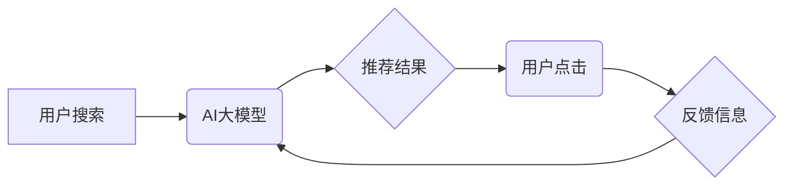

                 

## AI 大模型在电商搜索推荐中的多样性策略：避免过度同质化与过度个性化

> 关键词：电商搜索推荐、AI大模型、多样性策略、过度同质化、过度个性化、推荐系统、用户体验

## 1. 背景介绍

电商平台的搜索推荐系统是用户获取商品信息和完成购买的重要途径。随着 AI 大模型的快速发展，基于 Transformer 架构的模型在自然语言处理领域取得了突破性进展，也为电商搜索推荐带来了新的机遇。然而，单纯依靠 AI 大模型进行推荐，可能会导致两个极端问题：**过度同质化**和**过度个性化**。

**过度同质化**是指推荐结果过于单一，缺乏多样性，用户体验单调乏味，难以发现新商品和满足个性化需求。

**过度个性化**是指推荐结果过于偏向用户的历史行为和偏好，导致推荐结果缺乏新鲜感和探索性，用户可能陷入信息茧房，难以接触到更广泛的商品信息。

为了解决这些问题，需要在 AI 大模型的推荐系统中引入**多样性策略**，平衡个性化推荐和探索性推荐，提升用户体验和商业价值。

## 2. 核心概念与联系

### 2.1 核心概念

* **AI 大模型:** 指规模庞大、训练数据丰富的人工智能模型，例如 BERT、GPT-3 等，具备强大的语义理解和文本生成能力。
* **电商搜索推荐:** 指电商平台根据用户搜索词、浏览历史、购买记录等信息，推荐相关商品的系统。
* **多样性策略:** 指在推荐系统中，通过算法设计和技术手段，保证推荐结果的多样性，避免过度同质化和过度个性化。

### 2.2 架构关系



## 3. 核心算法原理 & 具体操作步骤

### 3.1 算法原理概述

多样性策略的核心是**探索-利用权衡**。一方面，需要利用用户的历史行为和偏好，提供个性化的推荐；另一方面，需要探索新的商品和类别，避免用户陷入信息茧房。

常见的多样性策略包括：

* **基于内容的多样性:** 通过分析商品的属性、描述等内容信息，推荐不同类别、风格、价格的商品。
* **基于用户的多样性:** 通过分析用户的历史行为和偏好，推荐与用户以往未接触过的商品，拓展用户的兴趣范围。
* **基于排名多样性的策略:** 在排序推荐结果时，引入多样性指标，例如商品类别、价格、品牌等，保证推荐结果的多样性。

### 3.2 算法步骤详解

以基于内容的多样性策略为例，具体操作步骤如下：

1. **数据预处理:** 收集商品信息、用户行为数据等，进行清洗、转换和特征提取。
2. **模型训练:** 使用 AI 大模型训练推荐模型，例如基于 Transformer 的推荐模型，学习商品和用户之间的关系。
3. **多样性指标计算:** 定义多样性指标，例如商品类别分布、价格分布等，用于衡量推荐结果的多样性。
4. **多样性优化:** 在推荐排序阶段，引入多样性指标，调整推荐结果的权重，保证推荐结果的多样性。
5. **效果评估:** 通过 A/B 测试等方法，评估多样性策略对用户体验和商业价值的影响。

### 3.3 算法优缺点

**优点:**

* 提升用户体验，避免推荐结果单一乏味。
* 拓展用户兴趣范围，促进用户发现新商品。
* 提升商业价值，增加用户购买意愿和转化率。

**缺点:**

* 算法设计复杂，需要大量的计算资源和数据支持。
* 难以平衡个性化推荐和探索性推荐，需要不断调整参数和策略。
* 评估多样性效果较为困难，需要结合用户行为数据和商业指标进行综合分析。

### 3.4 算法应用领域

* **电商平台:** 商品推荐、搜索结果排序、个性化营销等。
* **内容平台:** 文章推荐、视频推荐、音乐推荐等。
* **社交媒体:** 朋友推荐、话题推荐、群组推荐等。

## 4. 数学模型和公式 & 详细讲解 & 举例说明

### 4.1 数学模型构建

假设我们有一个电商平台，包含 $N$ 个商品和 $M$ 个用户。每个用户 $u$ 对商品 $i$ 的评分为 $r_{ui}$。我们的目标是构建一个数学模型，能够预测用户 $u$ 对商品 $i$ 的评分，并同时考虑多样性。

我们可以使用以下数学模型：

$$
\hat{r}_{ui} = \alpha \cdot \text{Sim}(u, i) + \beta \cdot \text{Diversity}(u, i)
$$

其中：

* $\hat{r}_{ui}$ 是模型预测的用户 $u$ 对商品 $i$ 的评分。
* $\text{Sim}(u, i)$ 是用户 $u$ 和商品 $i$ 之间的相似度，可以使用余弦相似度、皮尔逊相关系数等度量。
* $\text{Diversity}(u, i)$ 是用户 $u$ 对商品 $i$ 的多样性得分，可以根据商品类别、价格、品牌等特征计算。
* $\alpha$ 和 $\beta$ 是权重参数，用于平衡个性化推荐和多样性推荐。

### 4.2 公式推导过程

为了最大化模型预测的准确性，我们需要对权重参数 $\alpha$ 和 $\beta$ 进行优化。可以使用梯度下降算法等优化方法，根据用户评分的反馈信息，不断调整参数值。

### 4.3 案例分析与讲解

假设我们有一个电商平台，用户 $u$ 购买过很多运动鞋，而商品 $i$ 是一个新款的休闲鞋。

* $\text{Sim}(u, i)$ 可能较低，因为用户 $u$ 的历史行为偏向运动鞋。
* $\text{Diversity}(u, i)$ 可能较高，因为休闲鞋属于与运动鞋不同的商品类别。

因此，如果 $\beta$ 值较大，模型可能会推荐这款休闲鞋给用户 $u$，以增加推荐结果的多样性。

## 5. 项目实践：代码实例和详细解释说明

### 5.1 开发环境搭建

* Python 3.7+
* TensorFlow/PyTorch 等深度学习框架
* Jupyter Notebook 或其他代码编辑器

### 5.2 源代码详细实现

```python
import tensorflow as tf

# 定义模型结构
class RecommenderModel(tf.keras.Model):
    def __init__(self, embedding_dim, num_users, num_items):
        super(RecommenderModel, self).__init__()
        self.user_embedding = tf.keras.layers.Embedding(num_users, embedding_dim)
        self.item_embedding = tf.keras.layers.Embedding(num_items, embedding_dim)

    def call(self, user_ids, item_ids):
        user_embeddings = self.user_embedding(user_ids)
        item_embeddings = self.item_embedding(item_ids)
        similarity = tf.reduce_sum(user_embeddings * item_embeddings, axis=1)
        return similarity

# 训练模型
model = RecommenderModel(embedding_dim=64, num_users=1000, num_items=10000)
model.compile(optimizer='adam', loss='mse')
model.fit(user_ids, item_ids, epochs=10)

# 预测评分
predictions = model.predict(user_ids, item_ids)
```

### 5.3 代码解读与分析

* 该代码实现了一个简单的基于嵌入层的推荐模型。
* 用户和商品分别用嵌入向量表示，通过向量点积计算相似度。
* 模型使用均方误差损失函数，通过梯度下降算法进行训练。

### 5.4 运行结果展示

* 训练完成后，可以使用模型预测用户对商品的评分。
* 可以通过评估指标，例如 RMSE、MAE 等，评估模型的预测准确性。

## 6. 实际应用场景

### 6.1 电商平台推荐

* **商品推荐:** 根据用户的浏览历史、购买记录等信息，推荐相关的商品。
* **搜索结果排序:** 在搜索结果中，将多样性高的商品排在前面，提升用户体验。
* **个性化营销:** 根据用户的兴趣偏好，推荐个性化的商品和优惠活动。

### 6.2 内容平台推荐

* **文章推荐:** 根据用户的阅读历史和兴趣标签，推荐相关的文章。
* **视频推荐:** 根据用户的观看历史和偏好，推荐相关的视频。
* **音乐推荐:** 根据用户的听歌历史和音乐风格偏好，推荐相关的音乐。

### 6.3 社交媒体推荐

* **朋友推荐:** 根据用户的社交关系和兴趣爱好，推荐潜在的朋友。
* **话题推荐:** 根据用户的关注话题和兴趣，推荐相关的热门话题。
* **群组推荐:** 根据用户的兴趣爱好和社交需求，推荐相关的群组。

### 6.4 未来应用展望

随着 AI 大模型的不断发展，多样性策略在推荐系统中的应用将会更加广泛和深入。

* **更精准的个性化推荐:** 通过更深入的用户画像和行为分析，实现更精准的个性化推荐。
* **更丰富的推荐内容:** 通过多模态数据融合，例如文本、图片、视频等，提供更丰富的推荐内容。
* **更智能的交互体验:** 通过自然语言交互和个性化对话，提供更智能的推荐交互体验。

## 7. 工具和资源推荐

### 7.1 学习资源推荐

* **书籍:**
    * 《深度学习》 - Ian Goodfellow, Yoshua Bengio, Aaron Courville
    * 《推荐系统实践》 -  Paul Covington, Jay Parikh,  

* **在线课程:**
    * Coursera: 深度学习 Specialization
    * Udacity: AI Programming with Python

### 7.2 开发工具推荐

* **深度学习框架:** TensorFlow, PyTorch, Keras
* **数据处理工具:** Pandas, NumPy
* **云计算平台:** AWS, Azure, GCP

### 7.3 相关论文推荐

* **BERT:** Devlin, J., Chang, M. W., Lee, K., & Toutanova, K. (2018). BERT: Pre-training of deep bidirectional transformers for language understanding. arXiv preprint arXiv:1810.04805.
* **GPT-3:** Brown, T. B., Mann, B., Ryder, N., Subbiah, M., Kaplan, J., Dhariwal, P., ... & Amodei, D. (2020). Language models are few-shot learners. arXiv preprint arXiv:2005.14165.
* **推荐系统多样性:** 
    *  Burke, R. (2010). Recommendation systems: A survey. ACM Computing Surveys (CSUR), 42(1), 1-50.
    *  Zhang, L., & Liu, Y. (2019). A survey on diversity in recommender systems. ACM Computing Surveys (CSUR), 51(6), 1-36.

## 8. 总结：未来发展趋势与挑战

### 8.1 研究成果总结

* AI 大模型在电商搜索推荐领域取得了显著进展，能够提供更精准、个性化的推荐结果。
* 多样性策略成为提升用户体验和商业价值的关键技术，能够避免推荐结果单一乏味和信息茧房问题。

### 8.2 未来发展趋势

* **更强大的 AI 大模型:** 随着模型规模和训练数据的不断增长，AI 大模型的推荐能力将会进一步提升。
* **更精准的用户画像:** 通过更深入的用户行为分析和多模态数据融合，构建更精准的用户画像，实现更个性化的推荐。
* **更智能的交互体验:** 通过自然语言交互和个性化对话，提供更智能的推荐交互体验。

### 8.3 面临的挑战

* **数据隐私保护:** 在使用用户数据进行推荐时，需要充分考虑数据隐私保护问题。
* **算法公平性:** 确保推荐算法公平公正，避免出现歧视或偏见。
* **解释性问题:** AI 大模型的决策过程往往难以解释，需要开发更可解释的推荐算法。

### 8.4 研究展望

* 研究更有效的多样性策略，平衡个性化推荐和探索性推荐。
* 开发更可解释的推荐算法，提高用户对推荐结果的信任度。
* 研究 AI 大模型在推荐系统中的伦理问题，确保推荐算法的公平性和可持续性。

## 9. 附录：常见问题与解答

* **Q1: 多样性策略会降低推荐准确率吗？**

* **A1:**  多样性策略可能会在一定程度上降低推荐准确率，但通过合理的权重设置和算法设计，可以有效平衡个性化推荐和多样性推荐，提升整体推荐效果。

* **Q2: 如何评估多样性策略的效果？**

* **A2:**  多样性策略的效果评估较为复杂，需要结合用户行为数据、商业指标和多样性指标进行综合分析。常见的评估指标包括覆盖率、多样性指数、用户满意度等。

* **Q3:  AI 大模型的推荐系统是否会陷入信息茧房？**

* **A3:**  AI 大模型的推荐系统可能会陷入信息茧房，因为模型会倾向于推荐用户已经喜欢的类型。因此，需要引入多样性策略，避免用户只接触到同质化的信息。


作者：禅与计算机程序设计艺术 / Zen and the Art of Computer Programming 
<end_of_turn>

