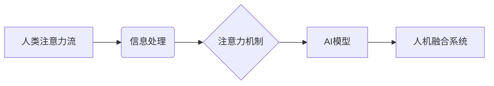

                 

## AI与人类注意力流：打造人机融合的未来

> 关键词：人工智能、注意力机制、人类注意力流、人机交互、深度学习、认知科学

### 1. 背景介绍

在信息爆炸的时代，人类面临着前所未有的信息过载挑战。我们每天需要处理海量的文字、图像、音频等信息，而我们的注意力资源却有限。如何有效地捕捉和利用信息，成为了一个至关重要的课题。

人工智能（AI）的快速发展为解决这一问题提供了新的思路。近年来，深度学习技术取得了突破性进展，特别是在自然语言处理（NLP）和计算机视觉（CV）领域。其中，注意力机制（Attention Mechanism）作为一种重要的学习策略，在处理序列数据时展现出强大的能力，能够帮助模型聚焦于关键信息，提高信息处理效率。

### 2. 核心概念与联系

**2.1 人类注意力流**

人类的注意力是一种有限且可调控的资源，它能够帮助我们从纷繁的信息中筛选出重要信息，并进行深入理解和加工。注意力流可以被理解为人类在信息处理过程中，对不同信息进行分配和调节的过程。

**2.2 注意力机制**

注意力机制是一种模仿人类注意力机制的机器学习算法。它通过学习不同输入元素之间的重要性关系，将模型的注意力集中在关键信息上，从而提高模型的性能。

**2.3 人机融合**

人机融合是指将人类的智慧和机器的计算能力相结合，创造出超越单一智能的协同系统。在AI与人类注意力流的结合中，我们可以利用注意力机制帮助AI更好地理解人类的注意力模式，从而实现更自然、更有效的交互。

**2.4 架构图**



### 3. 核心算法原理 & 具体操作步骤

**3.1 算法原理概述**

注意力机制的核心思想是学习不同输入元素之间的权重，并根据这些权重对输入进行加权求和。权重可以理解为每个输入元素的重要性程度，注意力机制通过训练学习出这些权重，从而聚焦于关键信息。

**3.2 算法步骤详解**

1. **输入数据:** 将输入数据（例如文本序列）表示为一个向量序列。
2. **计算注意力权重:** 使用一个注意力函数计算每个输入元素与目标元素之间的注意力权重。
3. **加权求和:** 根据注意力权重对输入向量序列进行加权求和，得到一个新的表示向量。
4. **输出结果:** 将新的表示向量作为模型的输入，进行后续的处理。

**3.3 算法优缺点**

**优点:**

* 能够有效地聚焦于关键信息，提高模型的性能。
* 可以处理长序列数据，克服传统RNN模型的梯度消失问题。
* 在NLP、CV等领域取得了显著的成果。

**缺点:**

* 计算复杂度较高，训练时间较长。
* 需要大量的训练数据才能达到最佳效果。
* 难以解释注意力权重，难以理解模型的决策过程。

**3.4 算法应用领域**

注意力机制在NLP、CV、语音识别、机器翻译等领域都有广泛的应用。例如，在机器翻译中，注意力机制可以帮助模型关注源语言中的关键词，从而提高翻译质量。

### 4. 数学模型和公式 & 详细讲解 & 举例说明

**4.1 数学模型构建**

假设我们有一个输入序列 $X = \{x_1, x_2, ..., x_n\}$，目标是学习一个注意力权重向量 $a = \{a_1, a_2, ..., a_n\}$，其中 $a_i$ 表示输入元素 $x_i$ 的注意力权重。

**4.2 公式推导过程**

注意力权重通常使用一个注意力函数计算，例如Scaled Dot-Product Attention:

$$
a_i = \frac{\exp( \frac{x_i \cdot h}{\sqrt{d}} )}{\sum_{j=1}^{n} \exp( \frac{x_j \cdot h}{\sqrt{d}} )}
$$

其中，$h$ 是一个查询向量，$d$ 是向量的维度。

**4.3 案例分析与讲解**

例如，在机器翻译中，源语言的词向量 $x_i$ 作为输入，目标语言的词向量 $h$ 作为查询向量。注意力权重 $a_i$ 表示源语言词 $x_i$ 对目标语言词 $h$ 的重要性。

**举例说明:**

假设我们有一个源语言句子 "The cat sat on the mat"，目标语言句子 "Le chat s'est assis sur le tapis"。

在翻译 "sat" 时，注意力机制会将注意力集中在 "cat" 和 "on" 两个词上，因为它们与 "sat" 的语义关系密切。

### 5. 项目实践：代码实例和详细解释说明

**5.1 开发环境搭建**

* Python 3.6+
* TensorFlow/PyTorch
* Jupyter Notebook

**5.2 源代码详细实现**

```python
import tensorflow as tf

# 定义注意力函数
def scaled_dot_product_attention(query, key, value, mask=None):
    # 计算注意力权重
    scores = tf.matmul(query, key, transpose_b=True) / tf.math.sqrt(tf.cast(key.shape[-1], tf.float32))
    if mask is not None:
        scores += (mask * -1e9)
    # 计算softmax
    attention_weights = tf.nn.softmax(scores, axis=-1)
    # 加权求和
    context_vector = tf.matmul(attention_weights, value)
    return context_vector, attention_weights

# 定义Transformer模型
class Transformer(tf.keras.Model):
    def __init__(self, num_layers, d_model, num_heads):
        super(Transformer, self).__init__()
        self.num_layers = num_layers
        self.d_model = d_model
        self.num_heads = num_heads
        # ... 其他层

    def call(self, inputs):
        # ... 模型前向传播过程
        return outputs

# ... 模型训练和评估
```

**5.3 代码解读与分析**

* `scaled_dot_product_attention` 函数实现注意力机制的核心逻辑，计算注意力权重并进行加权求和。
* `Transformer` 类定义了一个Transformer模型，包含多层注意力机制和前馈神经网络。
* 模型训练和评估过程需要根据具体任务进行调整。

**5.4 运行结果展示**

* 模型训练完成后，可以评估模型的性能，例如在机器翻译任务中，可以使用BLEU分数来衡量翻译质量。
* 可以使用可视化工具来展示注意力权重，观察模型是如何聚焦于关键信息。

### 6. 实际应用场景

**6.1 个性化推荐系统**

注意力机制可以帮助推荐系统更好地理解用户的兴趣偏好，并推荐更个性化的内容。

**6.2 智能客服系统**

注意力机制可以帮助智能客服系统更好地理解用户的需求，并提供更准确的回复。

**6.3 医疗诊断辅助系统**

注意力机制可以帮助医疗诊断辅助系统聚焦于病人的关键症状，提高诊断准确率。

**6.4 未来应用展望**

* 人机交互：注意力机制可以帮助AI更好地理解人类的意图和情感，从而实现更自然、更流畅的人机交互。
* 教育领域：注意力机制可以帮助AI个性化教学，根据学生的学习进度和理解能力提供定制化的学习内容。
* 科学研究：注意力机制可以帮助AI分析复杂的数据，发现隐藏的模式和规律。

### 7. 工具和资源推荐

**7.1 学习资源推荐**

* **论文:** "Attention Is All You Need"
* **博客:** Jay Alammar's Blog
* **课程:** Stanford CS224N: Natural Language Processing with Deep Learning

**7.2 开发工具推荐**

* TensorFlow
* PyTorch
* Hugging Face Transformers

**7.3 相关论文推荐**

* "BERT: Pre-training of Deep Bidirectional Transformers for Language Understanding"
* "GPT-3: Language Models are Few-Shot Learners"
* "T5: Text-to-Text Transfer Transformer"

### 8. 总结：未来发展趋势与挑战

**8.1 研究成果总结**

注意力机制在AI领域取得了显著的成果，为处理序列数据提供了新的思路，并推动了NLP、CV等领域的进步。

**8.2 未来发展趋势**

* **更有效的注意力机制:** 研究更有效的注意力机制，提高模型的性能和效率。
* **跨模态注意力:** 研究跨模态注意力机制，能够处理不同模态的数据，例如文本、图像、音频等。
* **可解释性:** 研究注意力机制的可解释性，帮助我们更好地理解模型的决策过程。

**8.3 面临的挑战**

* **计算复杂度:** 注意力机制的计算复杂度较高，需要更高效的算法和硬件支持。
* **数据需求:** 注意力机制需要大量的训练数据才能达到最佳效果。
* **伦理问题:** 注意力机制可能被用于监控和控制用户行为，需要谨慎考虑其伦理问题。

**8.4 研究展望**

未来，注意力机制将继续在AI领域发挥重要作用，并推动人工智能技术向更智能、更安全、更可解释的方向发展。


### 9. 附录：常见问题与解答

**9.1 什么是注意力机制？**

注意力机制是一种模仿人类注意力机制的机器学习算法，能够帮助模型聚焦于关键信息。

**9.2 注意力机制有哪些类型？**

常见的注意力机制类型包括Scaled Dot-Product Attention、Bahdanau Attention、Luong Attention等。

**9.3 注意力机制的应用场景有哪些？**

注意力机制在NLP、CV、语音识别、机器翻译等领域都有广泛的应用。

**9.4 如何理解注意力权重？**

注意力权重表示每个输入元素与目标元素之间的重要性程度。

**9.5 注意力机制的优势和劣势是什么？**

注意力机制的优势在于能够有效地聚焦于关键信息，提高模型的性能。劣势在于计算复杂度较高，需要大量的训练数据。


作者：禅与计算机程序设计艺术 / Zen and the Art of Computer Programming 
<end_of_turn>

