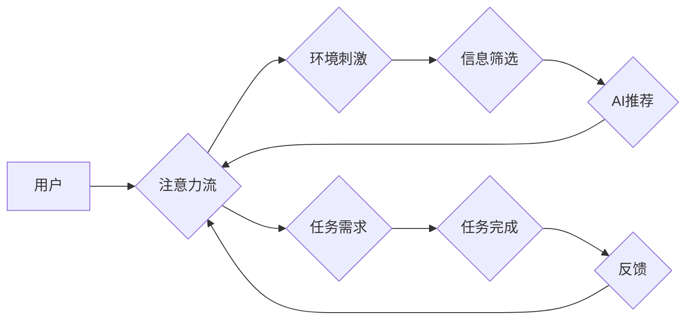

                 

## AI与人类注意力流：未来的工作、生活与注意力管理

> 关键词：人工智能、注意力流、深度学习、认知科学、用户体验、注意力管理、未来趋势

### 1. 背景介绍

在信息爆炸的时代，人类的注意力正受到前所未有的挑战。我们每天被来自互联网、社交媒体、电子邮件等各种渠道的信息轰炸，难以集中精力完成任务，保持专注力。同时，人工智能（AI）技术飞速发展，正在深刻地改变着我们的生活和工作方式。AI系统能够自动学习和处理海量数据，为我们提供个性化服务、智能辅助和决策支持。

然而，AI技术的发展也带来了新的问题：如何让AI更好地理解和尊重人类的注意力机制？如何利用AI技术帮助人们更好地管理注意力，提高工作效率和生活质量？

### 2. 核心概念与联系

**2.1 人类注意力流**

人类注意力是一种有限的资源，它可以被吸引、分散和恢复。注意力流是指注意力在不同时间和空间上的流动，它受多种因素影响，包括个体差异、环境刺激、任务难度等。

**2.2 AI与注意力流的交互**

AI系统可以通过多种方式影响人类的注意力流：

* **信息筛选和推荐:** AI算法可以分析用户的行为数据，识别用户的兴趣和偏好，并推荐相关信息，从而吸引用户的注意力。
* **个性化内容呈现:** AI系统可以根据用户的注意力流特征，动态调整内容的呈现方式，例如调整字体大小、颜色、布局等，以提高用户的注意力和理解度。
* **交互式体验设计:** AI可以根据用户的注意力变化，调整交互方式和节奏，例如提供适时的提示、反馈和引导，以保持用户的参与度和注意力。

**2.3  注意力流模型**

为了更好地理解AI与人类注意力流的交互，我们需要建立注意力流模型。这些模型可以模拟人类注意力机制，预测用户的注意力变化，并为AI系统提供决策依据。

**Mermaid 流程图**



### 3. 核心算法原理 & 具体操作步骤

**3.1 算法原理概述**

注意力机制是一种模仿人类注意力机制的机器学习算法。它通过学习哪些信息对任务最相关，并对这些信息给予更高的权重，从而提高模型的性能。

**3.2 算法步骤详解**

1. **输入数据:** 将输入数据（例如文本、图像）转换为向量表示。
2. **计算注意力权重:** 使用注意力机制计算每个输入元素对目标输出的注意力权重。
3. **加权求和:** 根据注意力权重对输入元素进行加权求和，得到最终的输出。

**3.3 算法优缺点**

**优点:**

* 可以学习到输入数据中的重要信息。
* 可以处理长序列数据。
* 可以提高模型的性能。

**缺点:**

* 计算复杂度较高。
* 需要大量的训练数据。

**3.4 算法应用领域**

注意力机制在自然语言处理、计算机视觉、机器翻译等领域都有广泛的应用。

### 4. 数学模型和公式 & 详细讲解 & 举例说明

**4.1 数学模型构建**

注意力机制的数学模型通常基于以下公式：

$$
\text{Attention}(Q, K, V) = \text{softmax}\left(\frac{Q K^T}{\sqrt{d_k}}\right) V
$$

其中：

* $Q$：查询向量
* $K$：键向量
* $V$：值向量
* $d_k$：键向量的维度
* $\text{softmax}$：softmax函数

**4.2 公式推导过程**

该公式的推导过程涉及到线性变换、点积运算和softmax函数。

* **线性变换:** 将输入数据转换为查询向量、键向量和值向量。
* **点积运算:** 计算查询向量与每个键向量的点积，得到注意力权重。
* **softmax函数:** 将注意力权重归一化，得到每个输入元素对目标输出的注意力分数。

**4.3 案例分析与讲解**

例如，在机器翻译任务中，可以使用注意力机制来学习源语言句子中哪些词语对目标语言句子翻译最相关。

### 5. 项目实践：代码实例和详细解释说明

**5.1 开发环境搭建**

使用Python语言和深度学习框架TensorFlow或PyTorch搭建开发环境。

**5.2 源代码详细实现**

```python
import tensorflow as tf

# 定义注意力机制层
class AttentionLayer(tf.keras.layers.Layer):
    def __init__(self, units):
        super(AttentionLayer, self).__init__()
        self.Wq = tf.keras.layers.Dense(units)
        self.Wk = tf.keras.layers.Dense(units)
        self.Wv = tf.keras.layers.Dense(units)
        self.fc = tf.keras.layers.Dense(units)

    def call(self, inputs):
        Q = self.Wq(inputs)
        K = self.Wk(inputs)
        V = self.Wv(inputs)
        attention_scores = tf.matmul(Q, K, transpose_b=True) / tf.math.sqrt(tf.cast(units, tf.float32))
        attention_weights = tf.nn.softmax(attention_scores, axis=-1)
        output = tf.matmul(attention_weights, V)
        return self.fc(output)

# 使用注意力机制层
model = tf.keras.Sequential([
    tf.keras.layers.Embedding(input_dim=10000, output_dim=128),
    AttentionLayer(units=64),
    tf.keras.layers.Dense(units=10, activation='softmax')
])
```

**5.3 代码解读与分析**

该代码实现了一个简单的注意力机制层，它可以用于文本分类任务。

* `AttentionLayer`类定义了注意力机制层，包括查询、键、值向量计算以及注意力权重计算。
* `call`方法实现了注意力机制层的计算过程。
* `model`对象是一个简单的深度学习模型，它包含了嵌入层、注意力机制层和全连接层。

**5.4 运行结果展示**

使用训练数据训练模型，并评估模型的性能。

### 6. 实际应用场景

**6.1 个性化推荐系统**

AI可以分析用户的浏览历史、购买记录等数据，学习用户的兴趣偏好，并推荐个性化的商品、内容或服务。

**6.2 智能客服系统**

AI可以理解用户的自然语言输入，并提供准确、及时、个性化的服务。

**6.3 教育辅助系统**

AI可以根据学生的学习进度和能力，提供个性化的学习内容和辅导。

**6.4 健康医疗辅助系统**

AI可以分析患者的病历、检查结果等数据，辅助医生诊断疾病、制定治疗方案。

**6.5 未来应用展望**

随着AI技术的不断发展，注意力流的应用场景将更加广泛，例如：

* **沉浸式体验:** AI可以根据用户的注意力流，动态调整虚拟现实或增强现实体验，提供更加沉浸式的体验。
* **脑机接口:** AI可以与脑机接口技术结合，理解用户的意图，并控制外部设备。
* **个性化医疗:** AI可以根据用户的注意力流特征，提供个性化的医疗干预和治疗方案。

### 7. 工具和资源推荐

**7.1 学习资源推荐**

* **书籍:**

    * 《深度学习》
    * 《Attention Is All You Need》

* **在线课程:**

    * Coursera: 深度学习
    * Udacity: 自然语言处理

**7.2 开发工具推荐**

* **TensorFlow:** 开源深度学习框架
* **PyTorch:** 开源深度学习框架
* **Keras:** 高级深度学习API

**7.3 相关论文推荐**

* 《Attention Is All You Need》
* 《BERT: Pre-training of Deep Bidirectional Transformers for Language Understanding》

### 8. 总结：未来发展趋势与挑战

**8.1 研究成果总结**

近年来，注意力机制在AI领域取得了显著的成果，例如在机器翻译、文本摘要、图像识别等任务中取得了state-of-the-art的性能。

**8.2 未来发展趋势**

未来，注意力机制的研究将朝着以下方向发展：

* **更有效的注意力机制:** 研究更有效的注意力机制，例如自注意力机制、多头注意力机制等。
* **跨模态注意力机制:** 研究跨模态注意力机制，例如将文本和图像等不同模态的信息融合在一起。
* **可解释性注意力机制:** 研究可解释性注意力机制，例如能够解释AI系统是如何分配注意力的。

**8.3 面临的挑战**

注意力机制也面临着一些挑战：

* **计算复杂度:** 某些注意力机制的计算复杂度较高，难以在资源有限的设备上运行。
* **数据依赖性:** 注意力机制需要大量的训练数据才能达到最佳性能。
* **伦理问题:** 注意力机制可能会被用于操纵用户行为，因此需要考虑其伦理问题。

**8.4 研究展望**

未来，我们需要继续研究和探索注意力机制，使其更好地服务于人类，帮助我们更好地理解世界，提高生活和工作效率。

### 9. 附录：常见问题与解答

**9.1 如何选择合适的注意力机制？**

选择合适的注意力机制取决于具体的应用场景和任务需求。例如，对于文本分类任务，可以使用自注意力机制；对于图像识别任务，可以使用空间注意力机制。

**9.2 如何评估注意力机制的性能？**

可以使用准确率、召回率、F1-score等指标来评估注意力机制的性能。

**9.3 注意力机制的未来发展趋势是什么？**

注意力机制的未来发展趋势包括更有效的注意力机制、跨模态注意力机制和可解释性注意力机制。


作者：禅与计算机程序设计艺术 / Zen and the Art of Computer Programming 
<end_of_turn>

