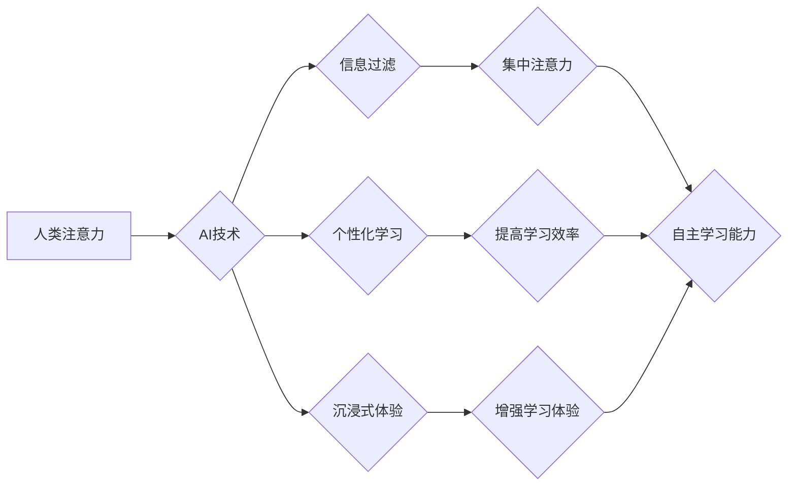

                 

## AI与人类注意力流：未来的教育与道德教育

> 关键词：人工智能、注意力流、教育、道德教育、深度学习、神经网络、认知科学、未来趋势

### 1. 背景介绍

在信息爆炸的时代，人类的注意力资源日益稀缺。我们被来自社交媒体、新闻推送、电子邮件等各种渠道的信息轰炸，难以集中精力完成重要任务。同时，人工智能（AI）技术飞速发展，其强大的计算能力和学习能力正在深刻地改变着我们的生活。AI技术能够分析海量数据，识别模式，并根据这些模式做出预测或决策。这使得AI在教育领域具有巨大的潜力，例如个性化学习、智能辅导、自动评估等。然而，AI技术也引发了一些伦理和社会问题，例如数据隐私、算法偏见、工作岗位替代等。其中，AI与人类注意力流的互动关系尤为值得关注。

### 2. 核心概念与联系

#### 2.1 人类注意力流

人类注意力流是一个复杂的心理过程，它涉及到选择性地关注某些信息，而忽略其他信息。注意力流受多种因素影响，包括个体差异、环境刺激、任务要求等。

#### 2.2 AI对注意力流的影响

AI技术可以通过多种方式影响人类注意力流：

* **信息过滤和推荐:** AI算法可以分析用户的行为数据，过滤掉无关信息，并推荐用户感兴趣的内容，从而集中用户的注意力。
* **个性化学习:** AI可以根据用户的学习进度和风格，定制个性化的学习内容和路径，提高用户的学习效率和注意力。
* **沉浸式体验:** AI驱动的虚拟现实（VR）和增强现实（AR）技术可以创造沉浸式的学习环境，吸引用户的注意力，增强学习体验。

#### 2.3 AI与注意力流的交互关系

AI技术与人类注意力流之间存在着复杂的交互关系。一方面，AI可以帮助我们集中注意力，提高学习效率；另一方面，过度依赖AI可能会导致注意力分散，降低我们的自主学习能力。

**Mermaid 流程图**



### 3. 核心算法原理 & 具体操作步骤

#### 3.1 算法原理概述

深度学习算法是AI技术的重要组成部分，其核心原理是利用多层神经网络模拟人类大脑的学习过程。深度学习算法能够从海量数据中学习复杂的模式，并根据这些模式进行预测或决策。

#### 3.2 算法步骤详解

1. **数据收集和预处理:** 收集大量相关数据，并进行清洗、格式化等预处理操作。
2. **网络结构设计:** 根据任务需求设计多层神经网络结构，包括输入层、隐藏层和输出层。
3. **参数初始化:** 为神经网络中的每个参数赋予初始值。
4. **前向传播:** 将输入数据通过神经网络传递，计算输出结果。
5. **反向传播:** 计算输出结果与真实值的误差，并根据误差调整神经网络参数。
6. **迭代训练:** 重复前向传播和反向传播过程，直到模型达到预设的精度。

#### 3.3 算法优缺点

**优点:**

* 能够学习复杂的模式，准确率高。
* 适用范围广，可应用于图像识别、自然语言处理、语音识别等多个领域。

**缺点:**

* 需要大量数据进行训练。
* 训练过程耗时和耗能。
* 模型解释性差，难以理解模型的决策过程。

#### 3.4 算法应用领域

深度学习算法广泛应用于各个领域，例如：

* **图像识别:** 人脸识别、物体检测、图像分类等。
* **自然语言处理:** 机器翻译、文本摘要、情感分析等。
* **语音识别:** 语音转文本、语音助手等。
* **推荐系统:** 商品推荐、内容推荐等。

### 4. 数学模型和公式 & 详细讲解 & 举例说明

#### 4.1 数学模型构建

深度学习模型通常采用多层感知机（MLP）或卷积神经网络（CNN）等结构。

**MLP模型:**

MLP模型由多个全连接层组成，每一层的神经元都与上一层的每个神经元连接。

**CNN模型:**

CNN模型利用卷积层和池化层来提取图像特征。卷积层通过卷积核对图像进行卷积运算，提取图像局部特征。池化层对卷积层的输出进行降维，提高模型的鲁棒性。

#### 4.2 公式推导过程

深度学习模型的训练过程基于梯度下降算法。梯度下降算法的目标是找到一个参数值，使得模型的损失函数最小化。

**损失函数:**

损失函数衡量模型预测结果与真实值的差异。常用的损失函数包括均方误差（MSE）、交叉熵损失（Cross-Entropy Loss）等。

**梯度下降公式:**

```latex
\theta = \theta - \alpha \nabla L(\theta)
```

其中：

* $\theta$ 是模型参数
* $\alpha$ 是学习率
* $\nabla L(\theta)$ 是损失函数对参数的梯度

#### 4.3 案例分析与讲解

以图像分类为例，假设我们训练一个CNN模型来识别猫和狗的图片。

1. **数据准备:** 收集大量猫和狗的图片，并进行标签标注。
2. **模型训练:** 使用梯度下降算法训练CNN模型，损失函数为交叉熵损失。
3. **模型评估:** 使用测试集评估模型的准确率。
4. **模型部署:** 将训练好的模型部署到实际应用场景中，例如识别用户上传的图片。

### 5. 项目实践：代码实例和详细解释说明

#### 5.1 开发环境搭建

* Python 3.x
* TensorFlow 或 PyTorch 深度学习框架
* Jupyter Notebook 或 VS Code 代码编辑器

#### 5.2 源代码详细实现

```python
# 使用 TensorFlow 框架实现一个简单的图像分类模型

import tensorflow as tf

# 定义模型结构
model = tf.keras.models.Sequential([
    tf.keras.layers.Conv2D(32, (3, 3), activation='relu', input_shape=(28, 28, 1)),
    tf.keras.layers.MaxPooling2D((2, 2)),
    tf.keras.layers.Conv2D(64, (3, 3), activation='relu'),
    tf.keras.layers.MaxPooling2D((2, 2)),
    tf.keras.layers.Flatten(),
    tf.keras.layers.Dense(10, activation='softmax')
])

# 编译模型
model.compile(optimizer='adam',
              loss='sparse_categorical_crossentropy',
              metrics=['accuracy'])

# 训练模型
model.fit(x_train, y_train, epochs=10)

# 评估模型
loss, accuracy = model.evaluate(x_test, y_test)
print('Test loss:', loss)
print('Test accuracy:', accuracy)
```

#### 5.3 代码解读与分析

* 代码首先定义了一个简单的CNN模型结构，包括卷积层、池化层和全连接层。
* 然后，使用Adam优化器和交叉熵损失函数编译模型。
* 最后，使用训练数据训练模型，并使用测试数据评估模型的性能。

#### 5.4 运行结果展示

训练完成后，可以查看模型的训练损失和准确率曲线，以及测试集上的准确率。

### 6. 实际应用场景

#### 6.1 个性化学习

AI技术可以根据学生的学习进度、风格和兴趣，定制个性化的学习内容和路径，提高学生的学习效率和兴趣。例如，AI驱动的学习平台可以根据学生的学习情况，推荐合适的学习资源，并提供个性化的辅导和反馈。

#### 6.2 智能辅导

AI可以作为学生的智能辅导员，提供24小时的学习支持。例如，AI聊天机器人可以回答学生的学习问题，提供学习建议，并帮助学生制定学习计划。

#### 6.3 自动评估

AI可以自动评估学生的作业和考试，节省教师的时间和精力。例如，AI可以自动批改学生的作文，并给出评分和反馈。

#### 6.4 未来应用展望

未来，AI技术将在教育领域发挥更重要的作用，例如：

* **沉浸式学习体验:** AI驱动的VR/AR技术可以创造更加沉浸式的学习环境，提高学生的学习兴趣和效果。
* **个性化学习路径:** AI可以根据学生的学习数据，动态调整学习路径，帮助学生更快地掌握知识。
* **智能教学助手:** AI可以协助教师进行教学工作，例如自动生成教学内容、批改作业、提供学生反馈等。

### 7. 工具和资源推荐

#### 7.1 学习资源推荐

* **在线课程:** Coursera、edX、Udacity 等平台提供丰富的AI课程。
* **书籍:** 《深度学习》、《机器学习》、《人工智能导论》等书籍。
* **博客和论坛:** TensorFlow、PyTorch 等框架的官方博客和论坛。

#### 7.2 开发工具推荐

* **Python:** 深度学习的常用编程语言。
* **TensorFlow:** Google开发的开源深度学习框架。
* **PyTorch:** Facebook开发的开源深度学习框架。
* **Jupyter Notebook:** 用于编写和运行Python代码的交互式笔记本环境。

#### 7.3 相关论文推荐

* **Attention Is All You Need:** https://arxiv.org/abs/1706.03762
* **BERT: Pre-training of Deep Bidirectional Transformers for Language Understanding:** https://arxiv.org/abs/1810.04805

### 8. 总结：未来发展趋势与挑战

#### 8.1 研究成果总结

近年来，AI技术在教育领域的应用取得了显著进展，例如个性化学习、智能辅导、自动评估等。深度学习算法是AI技术的重要组成部分，其强大的学习能力和准确率使其在教育领域具有巨大的潜力。

#### 8.2 未来发展趋势

未来，AI技术将在教育领域发挥更重要的作用，例如：

* **更加个性化的学习体验:** AI可以根据学生的学习数据，动态调整学习路径，提供更加个性化的学习体验。
* **更加智能的教学助手:** AI可以协助教师进行教学工作，例如自动生成教学内容、批改作业、提供学生反馈等。
* **更加沉浸式的学习环境:** AI驱动的VR/AR技术可以创造更加沉浸式的学习环境，提高学生的学习兴趣和效果。

#### 8.3 面临的挑战

AI技术在教育领域的应用也面临着一些挑战，例如：

* **数据隐私:** AI模型需要大量数据进行训练，如何保护学生的隐私数据是一个重要问题。
* **算法偏见:** AI算法可能会存在偏见，导致教育资源分配不公平。
* **伦理问题:** AI技术可能会改变教育的本质，例如，AI是否应该代替教师？如何确保AI技术被用于教育的善用？

#### 8.4 研究展望

未来，需要进一步研究AI技术在教育领域的应用，解决数据隐私、算法偏见等问题，并探讨AI技术对教育伦理的潜在影响。

### 9. 附录：常见问题与解答

**Q1: AI是否会取代教师？**

A1: AI技术可以辅助教师进行教学工作，但不会完全取代教师。教师仍然是教育的核心，他们能够提供情感支持、个性化指导和批判性思维培养等方面的帮助，这些是AI技术难以替代的。

**Q2: 如何确保AI技术在教育领域的公平使用？**

A2: 需要制定相应的政策和规范，确保AI算法不产生偏见，并公平地分配教育资源。

**Q3: 如何保护学生的隐私数据？**

A3: 需要采用加密技术、匿名化技术等方法保护学生的隐私数据，并制定相应的隐私政策。


作者：禅与计算机程序设计艺术 / Zen and the Art of Computer Programming 
<end_of_turn>

