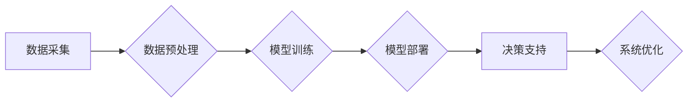

                 

## AI与人类计算：打造可持续发展的城市交通与基础设施建设与规划建设

> 关键词：人工智能、城市交通、基础设施建设、规划建设、可持续发展、人类计算、机器学习、深度学习、优化算法、数据分析

## 1. 背景介绍

随着全球人口的持续增长和城市化的加速推进，城市交通拥堵、基础设施老化、资源消耗过快等问题日益突出，严重影响着城市的可持续发展。传统的人工规划和管理方式已难以应对日益复杂的城市环境和需求。人工智能（AI）技术的快速发展为解决这些问题提供了新的思路和解决方案。

AI技术能够通过学习和分析海量数据，识别城市交通和基础设施建设中的模式和趋势，并提供智能化的决策支持和优化方案。例如，AI驱动的交通管理系统可以实时监测交通流量，优化信号灯控制，引导车辆行驶，从而缓解交通拥堵；AI驱动的基础设施管理系统可以预测设备故障，提前进行维护保养，提高基础设施的运行效率和安全性。

## 2. 核心概念与联系

**2.1 人类计算与AI计算**

人类计算是指人类利用自身的认知能力、经验和判断力进行计算和决策的过程。AI计算是指利用人工智能算法和模型，通过数据分析和模式识别，模拟人类的计算和决策能力。

**2.2 AI与城市交通与基础设施建设的联系**

AI技术可以与城市交通和基础设施建设密切结合，实现以下方面的应用：

* **交通管理:** 智能交通信号灯控制、车辆导航优化、交通流量预测、公共交通调度优化等。
* **基础设施管理:**  基础设施设备故障预测、维护保养优化、资源配置优化、安全风险评估等。
* **城市规划:** 城市发展规划、土地利用规划、公共服务设施布局规划等。

**2.3 AI计算架构**



**数据采集:** 从各种传感器、摄像头、GPS设备等收集城市交通和基础设施建设相关数据。

**数据预处理:** 对收集到的数据进行清洗、转换、格式化等处理，使其能够被AI模型所使用。

**模型训练:** 利用机器学习和深度学习算法，对预处理后的数据进行训练，建立预测和决策模型。

**模型部署:** 将训练好的模型部署到实际应用系统中，用于实时数据分析和决策支持。

**决策支持:** AI模型根据实时数据分析结果，提供决策建议和优化方案。

**系统优化:** 根据AI模型的决策建议，对城市交通和基础设施建设系统进行优化调整，提高效率和安全性。

## 3. 核心算法原理 & 具体操作步骤

**3.1 算法原理概述**

本节将介绍用于城市交通和基础设施建设规划的几种核心算法原理，包括：

* **机器学习:** 利用算法从数据中学习模式和规律，进行预测和分类。
* **深度学习:** 基于多层神经网络，能够学习更复杂的模式和关系。
* **强化学习:** 通过试错学习，找到最优的决策策略。
* **遗传算法:** 模拟自然选择机制，优化算法参数和决策方案。

**3.2 算法步骤详解**

**机器学习算法步骤:**

1. **数据收集和预处理:** 收集相关数据，并进行清洗、转换、特征提取等预处理。
2. **模型选择:** 根据具体应用场景选择合适的机器学习算法，例如线性回归、逻辑回归、决策树、支持向量机等。
3. **模型训练:** 利用训练数据对模型进行训练，调整模型参数，使其能够准确地预测或分类。
4. **模型评估:** 利用测试数据评估模型的性能，例如准确率、召回率、F1-score等。
5. **模型部署:** 将训练好的模型部署到实际应用系统中，用于实时数据分析和预测。

**3.3 算法优缺点**

**机器学习算法:**

* **优点:** 能够从数据中学习复杂模式，无需人工编程，具有较高的自动化程度。
* **缺点:** 需要大量的训练数据，对数据质量要求较高，解释性较差。

**深度学习算法:**

* **优点:** 能够学习更复杂的模式，性能优于传统机器学习算法。
* **缺点:** 需要更多的计算资源和训练时间，对数据质量要求更高，解释性更差。

**强化学习算法:**

* **优点:** 能够学习最优的决策策略，适用于动态环境下的决策问题。
* **缺点:** 训练过程复杂，需要大量的试错学习，容易陷入局部最优解。

**遗传算法:**

* **优点:** 能够全局搜索最优解，适用于复杂优化问题。
* **缺点:** 训练过程较慢，收敛速度较慢。

**3.4 算法应用领域**

* **交通流量预测:** 利用历史交通数据，预测未来交通流量，为交通管理提供决策依据。
* **交通拥堵缓解:** 根据实时交通数据，优化信号灯控制，引导车辆行驶，缓解交通拥堵。
* **基础设施设备故障预测:** 利用设备运行数据，预测设备故障，提前进行维护保养。
* **城市规划优化:** 利用人口数据、土地利用数据等，优化城市规划方案，提高城市资源利用效率。

## 4. 数学模型和公式 & 详细讲解 & 举例说明

**4.1 数学模型构建**

城市交通和基础设施建设的规划和管理是一个复杂的系统工程，需要建立数学模型来描述系统行为和优化目标。常见的数学模型包括：

* **线性规划模型:** 用于解决资源分配、成本优化等问题。
* **非线性规划模型:** 用于解决更复杂的优化问题，例如交通流量分配、基础设施网络设计等。
* **动态规划模型:** 用于解决时间序列问题，例如交通流量预测、基础设施维护计划等。

**4.2 公式推导过程**

例如，考虑一个简单的交通流量分配问题，假设有N个路段，每个路段的流量为$x_i$，目标是使总行驶时间最小化。

总行驶时间可以表示为：

$$T = \sum_{i=1}^{N} t_i(x_i)$$

其中，$t_i(x_i)$是路段i的行驶时间，与流量$x_i$有关。

为了最小化总行驶时间，需要对流量分配进行优化。可以使用线性规划模型来解决这个问题，目标函数为最小化总行驶时间，约束条件为流量分配满足交通容量限制。

**4.3 案例分析与讲解**

例如，可以使用深度学习算法来预测城市交通流量。

训练数据可以包括历史交通流量数据、天气数据、时间数据等。

模型可以采用多层神经网络结构，学习交通流量与各种因素之间的复杂关系。

训练好的模型可以用于预测未来交通流量，为交通管理提供决策依据。

## 5. 项目实践：代码实例和详细解释说明

**5.1 开发环境搭建**

本项目使用Python语言开发，需要安装以下软件：

* Python 3.x
* TensorFlow或PyTorch深度学习框架
* NumPy、Pandas数据处理库
* Matplotlib、Seaborn数据可视化库

**5.2 源代码详细实现**

以下是一个使用TensorFlow框架训练交通流量预测模型的代码示例：

```python
import tensorflow as tf
from tensorflow.keras.models import Sequential
from tensorflow.keras.layers import Dense

# 构建模型
model = Sequential()
model.add(Dense(64, activation='relu', input_shape=(10,)))
model.add(Dense(32, activation='relu'))
model.add(Dense(1))

# 编译模型
model.compile(optimizer='adam', loss='mse')

# 训练模型
model.fit(X_train, y_train, epochs=10, batch_size=32)

# 评估模型
loss = model.evaluate(X_test, y_test)
print('测试损失:', loss)
```

**5.3 代码解读与分析**

* 首先，导入必要的库。
* 然后，构建一个简单的多层神经网络模型。
* 模型包含三个全连接层，第一层输入维度为10，表示输入数据的特征数量。
* 激活函数使用ReLU函数，输出层使用线性激活函数。
* 模型使用Adam优化器和均方误差损失函数进行训练。
* 训练模型需要指定训练数据、训练轮数和批量大小。
* 训练完成后，可以使用测试数据评估模型的性能。

**5.4 运行结果展示**

训练完成后，可以将模型应用于实际数据，预测未来交通流量。

预测结果可以以图表形式展示，方便直观地观察预测效果。

## 6. 实际应用场景

**6.1 智能交通管理系统**

AI驱动的智能交通管理系统可以实时监测交通流量，优化信号灯控制，引导车辆行驶，缓解交通拥堵。

**6.2 基础设施设备故障预测系统**

AI驱动的基础设施设备故障预测系统可以利用设备运行数据，预测设备故障，提前进行维护保养，提高基础设施的运行效率和安全性。

**6.3 城市规划优化系统**

AI驱动的城市规划优化系统可以利用人口数据、土地利用数据等，优化城市规划方案，提高城市资源利用效率。

**6.4 未来应用展望**

随着AI技术的不断发展，其在城市交通和基础设施建设领域的应用将更加广泛和深入。

例如，未来可以利用AI技术实现无人驾驶车辆的普及，构建智能交通网络，提高交通效率和安全性。

也可以利用AI技术实现基础设施的智能化管理，提高基础设施的运行效率和可靠性。

## 7. 工具和资源推荐

**7.1 学习资源推荐**

* **在线课程:** Coursera、edX、Udacity等平台提供丰富的AI课程。
* **书籍:** 《深度学习》、《机器学习实战》等书籍是学习AI的基础教材。
* **开源项目:** TensorFlow、PyTorch等开源项目提供了丰富的代码示例和学习资源。

**7.2 开发工具推荐**

* **Python:** Python是AI开发最常用的编程语言。
* **TensorFlow:** TensorFlow是Google开发的开源深度学习框架。
* **PyTorch:** PyTorch是Facebook开发的开源深度学习框架。
* **Jupyter Notebook:** Jupyter Notebook是交互式编程环境，方便进行AI代码开发和调试。

**7.3 相关论文推荐**

* **《ImageNet Classification with Deep Convolutional Neural Networks》**
* **《Attention Is All You Need》**
* **《Deep Reinforcement Learning》**

## 8. 总结：未来发展趋势与挑战

**8.1 研究成果总结**

AI技术在城市交通和基础设施建设领域的应用取得了显著成果，例如交通流量预测、基础设施设备故障预测、城市规划优化等。

**8.2 未来发展趋势**

未来，AI技术在城市交通和基础设施建设领域的应用将更加智能化、自动化和个性化。

例如，无人驾驶车辆将更加普及，智能交通网络将更加完善，基础设施的智能化管理将更加深入。

**8.3 面临的挑战**

AI技术在城市交通和基础设施建设领域的应用也面临着一些挑战，例如数据安全、算法解释性、伦理问题等。

需要加强相关研究和规范，确保AI技术安全、可靠、可持续地发展。

**8.4 研究展望**

未来，需要进一步研究AI技术在城市交通和基础设施建设领域的应用，探索更智能、更有效的解决方案，为打造可持续发展的城市贡献力量。

## 9. 附录：常见问题与解答

**9.1 如何选择合适的AI算法？**

选择合适的AI算法需要根据具体应用场景和数据特点进行分析。

例如，对于交通流量预测问题，可以使用深度学习算法，因为它能够学习更复杂的模式。

**9.2 如何保证AI模型的准确性？**

保证AI模型的准确性需要高质量的数据、合理的模型结构和充分的训练。

需要不断地评估和改进模型，以提高其准确性。

**9.3 如何解决AI算法的解释性问题？**

AI算法的解释性问题是一个重要的研究方向。

目前，一些方法可以用于解释AI模型的决策过程，例如可解释机器学习、神经网络可视化等。


作者：禅与计算机程序设计艺术 / Zen and the Art of Computer Programming 
<end_of_turn>

