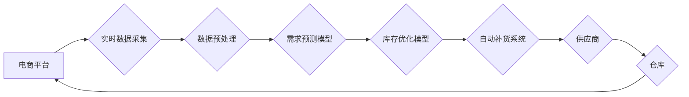

                 

## AI在电商实时库存管理中的应用

> 关键词：人工智能、电商、实时库存管理、预测模型、机器学习、深度学习、优化算法、数据分析

## 1. 背景介绍

随着电商行业的蓬勃发展，实时库存管理已成为电商企业运营的关键环节。传统的库存管理方式往往依赖于人工统计和预估，存在着数据滞后、预测不准确、库存周转率低等问题，难以满足快速变化的市场需求和消费者期望。

人工智能（AI）技术的快速发展为电商实时库存管理提供了新的解决方案。AI算法能够从海量数据中挖掘出隐藏的模式和趋势，实现对库存需求的更精准预测，从而优化库存水平，降低库存成本，提高服务效率。

## 2. 核心概念与联系

### 2.1  实时库存管理

实时库存管理是指通过实时数据采集、分析和决策，动态调整库存水平，以满足不断变化的市场需求。其核心目标是确保商品及时供应，避免缺货和积压，最大化库存利用率。

### 2.2  人工智能在库存管理中的应用

人工智能技术在库存管理中的应用主要包括以下几个方面：

* **需求预测:** 利用机器学习算法分析历史销售数据、市场趋势、季节性因素等，预测未来商品需求。
* **库存优化:** 根据预测结果，优化库存水平，确定最佳订货量和补货时间，降低库存成本。
* **异常检测:** 利用机器学习算法识别库存异常情况，例如缺货、积压、窜货等，及时采取措施进行处理。
* **自动补货:** 利用AI算法自动生成补货计划，并与供应商进行协同，实现自动补货。

**核心概念与架构流程图:**



## 3. 核心算法原理 & 具体操作步骤

### 3.1  算法原理概述

在电商实时库存管理中，常用的算法包括：

* **ARIMA模型:** 自回归移动平均模型，用于预测时间序列数据，例如历史销售数据。
* **Prophet模型:** Facebook开发的预测模型，能够处理时间序列数据中的季节性趋势和异常值。
* **机器学习算法:** 例如线性回归、决策树、支持向量机等，可以根据历史数据和多种特征预测未来需求。
* **深度学习算法:** 例如循环神经网络（RNN）、长短期记忆网络（LSTM）等，能够处理更复杂的序列数据，并学习更深层次的模式。

### 3.2  算法步骤详解

以ARIMA模型为例，其具体操作步骤如下：

1. **数据收集:** 收集历史销售数据，包括商品ID、日期、销售量等信息。
2. **数据预处理:** 对数据进行清洗、转换、归一化等处理，去除异常值、缺失值等。
3. **模型选择:** 根据数据特点和预测需求，选择合适的ARIMA模型参数。
4. **模型训练:** 利用训练数据训练ARIMA模型，并评估模型性能。
5. **模型预测:** 利用训练好的模型预测未来商品需求。
6. **库存优化:** 根据预测结果，优化库存水平，确定最佳订货量和补货时间。

### 3.3  算法优缺点

**ARIMA模型:**

* **优点:** 算法简单易懂，易于实现，对数据要求不高。
* **缺点:** 难以处理非线性数据和季节性趋势，预测精度有限。

**Prophet模型:**

* **优点:** 能够处理时间序列数据中的季节性趋势和异常值，预测精度较高。
* **缺点:** 对数据量要求较高，需要较长的训练时间。

**机器学习算法:**

* **优点:** 能够处理更复杂的非线性数据，预测精度更高。
* **缺点:** 算法复杂，需要大量的训练数据和专业知识。

**深度学习算法:**

* **优点:** 能够学习更深层次的模式，预测精度最高。
* **缺点:** 算法复杂，需要大量的训练数据和计算资源。

### 3.4  算法应用领域

以上算法在电商实时库存管理、物流配送、供应链管理等领域都有广泛应用。

## 4. 数学模型和公式 & 详细讲解 & 举例说明

### 4.1  数学模型构建

**ARIMA模型:**

ARIMA模型是一种统计模型，用于预测时间序列数据。其数学模型可以表示为：

$$
y_t = c + \phi_1 y_{t-1} + \phi_2 y_{t-2} + ... + \phi_p y_{t-p} + \theta_1 \epsilon_{t-1} + \theta_2 \epsilon_{t-2} + ... + \theta_q \epsilon_{t-q} + \epsilon_t
$$

其中：

* $y_t$ 表示时间t的观测值。
* $c$ 表示截距项。
* $\phi_i$ 表示自回归系数。
* $p$ 表示自回归阶数。
* $\theta_i$ 表示移动平均系数。
* $q$ 表示移动平均阶数。
* $\epsilon_t$ 表示时间t的随机误差项。

**Prophet模型:**

Prophet模型是一种基于时间序列分解的预测模型，其数学模型更加复杂，涉及到趋势、季节性、节日效应等多个因素。

### 4.2  公式推导过程

ARIMA模型的公式推导过程较为复杂，涉及到时间序列分析、统计学等多个领域。

### 4.3  案例分析与讲解

假设一家电商企业销售一款商品，其历史销售数据如下：

| 日期 | 销售量 |
|---|---|
| 2023-01-01 | 100 |
| 2023-01-02 | 120 |
| 2023-01-03 | 150 |
| 2023-01-04 | 130 |
| 2023-01-05 | 180 |

可以使用ARIMA模型对该商品的未来销售量进行预测。

## 5. 项目实践：代码实例和详细解释说明

### 5.1  开发环境搭建

* Python 3.x
* pandas
* scikit-learn
* matplotlib

### 5.2  源代码详细实现

```python
import pandas as pd
from sklearn.linear_model import LinearRegression

# 加载历史销售数据
data = pd.read_csv('sales_data.csv')

# 数据预处理
data['Date'] = pd.to_datetime(data['Date'])
data.set_index('Date', inplace=True)

# 训练线性回归模型
model = LinearRegression()
model.fit(data[['Date']], data['Sales'])

# 预测未来销售量
future_dates = pd.date_range(start='2023-01-06', periods=5)
future_sales = model.predict(future_dates.values.reshape(-1, 1))

# 展示预测结果
print(future_sales)
```

### 5.3  代码解读与分析

* 首先，加载历史销售数据并进行数据预处理，将日期转换为datetime类型，并设置日期作为索引。
* 然后，使用线性回归模型训练预测模型。
* 最后，利用训练好的模型预测未来5天的销售量，并展示预测结果。

### 5.4  运行结果展示

运行代码后，将输出未来5天预测的销售量。

## 6. 实际应用场景

AI在电商实时库存管理中的应用场景非常广泛，例如：

* **个性化库存管理:** 根据用户的购买历史、浏览记录、偏好等信息，为每个用户定制个性化的库存水平，提高商品推荐和销售转化率。
* **跨境电商库存管理:** 利用AI算法分析跨境市场需求，优化跨境库存布局，降低物流成本和运输时间。
* **供应链协同管理:** 利用AI算法实现供应商、物流公司、电商平台之间的协同管理，提高供应链效率和透明度。

### 6.4  未来应用展望

未来，AI在电商实时库存管理中的应用将更加智能化、个性化和自动化。例如：

* **基于深度学习的预测模型:** 利用深度学习算法，能够更准确地预测未来需求，并考虑更多因素，例如天气、节日、新闻事件等。
* **智能补货系统:** 利用AI算法自动生成补货计划，并与供应商进行协同，实现自动补货。
* **库存风险管理:** 利用AI算法识别库存风险，例如缺货、积压、窜货等，并及时采取措施进行处理。

## 7. 工具和资源推荐

### 7.1  学习资源推荐

* **书籍:**
    * 《Python机器学习实战》
    * 《深度学习》
* **在线课程:**
    * Coursera: Machine Learning
    * edX: Artificial Intelligence

### 7.2  开发工具推荐

* **Python:** 
    * pandas
    * scikit-learn
    * TensorFlow
    * PyTorch

### 7.3  相关论文推荐

* **ARIMA模型:**
    * Box, G. E. P., & Jenkins, G. M. (1976). Time series analysis: Forecasting and control. Holden-Day.
* **Prophet模型:**
    * Taylor, J. W., & Letham, C. (2017). Forecasting at scale. Proceedings of the 31st International Conference on Neural Information Processing Systems (pp. 3617-3625).

## 8. 总结：未来发展趋势与挑战

### 8.1  研究成果总结

AI在电商实时库存管理领域取得了显著成果，能够提高预测精度、优化库存水平、降低库存成本等。

### 8.2  未来发展趋势

未来，AI在电商实时库存管理领域将朝着以下方向发展：

* **更精准的预测:** 利用更先进的机器学习和深度学习算法，实现更精准的未来需求预测。
* **更智能的决策:** 利用AI算法自动生成库存决策，并根据实时数据进行动态调整。
* **更全面的协同:** 实现电商平台、供应商、物流公司等多方之间的协同管理，提高供应链效率。

### 8.3  面临的挑战

AI在电商实时库存管理领域也面临着一些挑战：

* **数据质量:** AI算法对数据质量要求较高，需要确保数据准确、完整、及时。
* **算法复杂度:** 一些AI算法过于复杂，需要专业的知识和技术才能实现。
* **隐私保护:** AI算法需要处理大量用户数据，需要确保用户隐私安全。

### 8.4  研究展望

未来，需要进一步研究以下问题：

* 如何提高AI算法对复杂数据和非线性关系的处理能力。
* 如何开发更易于使用和部署的AI库存管理系统。
* 如何确保AI算法在应用过程中公平、透明、可解释。

## 9. 附录：常见问题与解答

* **Q1: AI在电商实时库存管理中有哪些优势？**

* **A1:** AI能够从海量数据中挖掘出隐藏的模式和趋势，实现对库存需求的更精准预测，从而优化库存水平，降低库存成本，提高服务效率。

* **Q2: 如何选择合适的AI算法？**

* **A2:** 选择合适的AI算法需要根据数据特点、预测需求和业务场景进行综合考虑。

* **Q3: 如何确保AI算法的准确性？**

* **A3:** 确保AI算法的准确性需要进行充分的数据预处理、模型训练和评估。

* **Q4: AI在电商实时库存管理中有哪些伦理问题？**

* **A4:** AI算法需要处理大量用户数据，需要确保用户隐私安全，避免算法歧视和偏见。


作者：禅与计算机程序设计艺术 / Zen and the Art of Computer Programming 
<end_of_turn>

