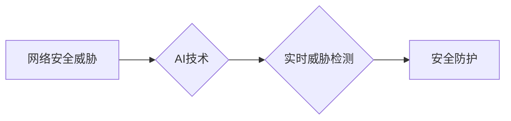

                 

## AI在网络安全中的应用：实时威胁检测

> 关键词：人工智能、机器学习、深度学习、网络安全、威胁检测、恶意软件、入侵检测系统

## 1. 背景介绍

随着互联网的蓬勃发展和数字化转型加速，网络安全威胁日益复杂和严峻。传统安全防护手段，例如基于规则的入侵检测系统 (IDS) 和防火墙，在面对新型攻击和零日漏洞时显得捉襟见肘。人工智能 (AI) 凭借其强大的学习和分析能力，为网络安全领域带来了新的希望。

AI在网络安全中的应用，特别是实时威胁检测，正成为一个重要的研究方向和实践领域。AI算法能够从海量网络数据中识别出异常行为和潜在威胁，并及时发出警报，帮助安全人员快速响应和防御攻击。

## 2. 核心概念与联系

### 2.1  网络安全威胁

网络安全威胁是指任何可能损害计算机系统、网络或数据安全的行为或事件。常见的网络安全威胁包括：

* **恶意软件:** 病毒、蠕虫、木马、勒索软件等恶意程序，旨在窃取数据、破坏系统或勒索金钱。
* **网络攻击:** 拒绝服务攻击 (DoS)、分布式拒绝服务攻击 (DDoS)、SQL注入、跨站脚本攻击 (XSS) 等攻击行为，旨在瘫痪系统、窃取数据或篡改信息。
* **数据泄露:** 未经授权访问、使用或披露敏感数据，可能导致隐私泄露、财务损失或商业机密曝光。

### 2.2  AI在网络安全中的应用

AI技术在网络安全领域主要应用于以下几个方面：

* **威胁检测:** 利用机器学习算法分析网络流量、系统日志等数据，识别出异常行为和潜在威胁。
* **恶意软件分析:** 使用深度学习算法分析恶意软件样本，识别其功能、传播方式和攻击目标。
* **漏洞发现:** 利用AI算法分析软件代码，识别出潜在的漏洞和安全缺陷。
* **安全态势感知:** 建立基于AI的网络安全态势感知平台，实时监控网络安全状况，并提供预警和建议。

### 2.3  实时威胁检测

实时威胁检测是指在攻击发生时，能够及时识别和响应的威胁检测机制。AI技术可以实现实时威胁检测，其优势在于：

* **自动化:** AI算法可以自动分析网络数据，无需人工干预，可以实现24/7的实时监控。
* **精准度:** AI算法可以学习和识别复杂的攻击模式，提高威胁检测的精准度。
* **适应性:** AI算法可以不断学习和更新，适应不断变化的攻击环境。

**核心概念与联系流程图:**



## 3. 核心算法原理 & 具体操作步骤

### 3.1  算法原理概述

实时威胁检测的核心算法主要包括：

* **机器学习:** 利用训练数据，训练模型识别威胁行为模式。
* **深度学习:** 使用多层神经网络，学习更复杂的特征和模式。
* **强化学习:** 通过奖励和惩罚机制，训练模型优化威胁检测策略。

### 3.2  算法步骤详解

**以机器学习算法为例，实时威胁检测的具体步骤如下：**

1. **数据收集:** 收集网络流量、系统日志、用户行为等数据。
2. **数据预处理:** 清洗、转换、格式化数据，使其适合模型训练。
3. **特征提取:** 从数据中提取特征，例如IP地址、端口号、协议类型、流量大小等。
4. **模型训练:** 使用机器学习算法，训练模型识别威胁行为模式。
5. **模型评估:** 使用测试数据评估模型的性能，例如准确率、召回率、F1-score等。
6. **模型部署:** 将训练好的模型部署到生产环境中，实时检测威胁。
7. **威胁响应:** 当模型检测到威胁时，触发相应的安全响应措施，例如封锁IP地址、隔离主机、报警等。

### 3.3  算法优缺点

**机器学习算法的优缺点:**

* **优点:**

    * 自动化程度高，可以实现实时检测。
    * 能够识别复杂的攻击模式。
    * 随着数据量的增加，模型性能会不断提升。

* **缺点:**

    * 需要大量的训练数据。
    * 对数据质量要求高，数据偏差会影响模型性能。
    * 难以解释模型的决策过程。

### 3.4  算法应用领域

机器学习算法在网络安全领域广泛应用于：

* **入侵检测:** 检测网络流量中的恶意行为，例如扫描、拒绝服务攻击等。
* **恶意软件检测:** 识别恶意软件样本，例如病毒、蠕虫、木马等。
* **网络钓鱼检测:** 识别网络钓鱼邮件和网站，防止用户泄露敏感信息。
* **数据泄露检测:** 检测数据泄露事件，例如未经授权访问、使用或披露敏感数据。

## 4. 数学模型和公式 & 详细讲解 & 举例说明

### 4.1  数学模型构建

在机器学习算法中，常用的数学模型包括：

* **线性回归:** 用于预测连续值，例如网络流量大小。
* **逻辑回归:** 用于分类问题，例如判断网络流量是否为恶意流量。
* **支持向量机 (SVM):** 用于分类和回归问题，能够处理高维数据。
* **决策树:** 用于分类和回归问题，易于理解和解释。
* **神经网络:** 用于处理复杂数据，能够学习更复杂的特征和模式。

### 4.2  公式推导过程

以逻辑回归为例，其目标是学习一个模型，将输入特征映射到输出类别概率。逻辑回归模型的输出为：

$$
p(y=1|x) = \frac{1}{1 + e^{-(w^T x + b)}}
$$

其中：

* $p(y=1|x)$ 是给定输入特征 $x$ 时，输出类别为 1 的概率。
* $w$ 是模型参数，代表特征权重。
* $b$ 是模型偏置项。
* $e$ 是自然对数的底数。

模型参数 $w$ 和 $b$ 通过最大似然估计 (MLE) 方法进行训练，其目标是最大化模型对训练数据的拟合程度。

### 4.3  案例分析与讲解

假设我们想要训练一个模型，识别网络流量是否为恶意流量。我们可以使用逻辑回归模型，将网络流量特征作为输入，输出为恶意流量的概率。

训练数据包括历史网络流量数据，以及对应的标签，例如恶意流量或正常流量。通过训练模型，我们可以学习到特征权重和偏置项，从而预测新的网络流量是否为恶意流量。

## 5. 项目实践：代码实例和详细解释说明

### 5.1  开发环境搭建

为了实现实时威胁检测项目，我们需要搭建一个开发环境，包括：

* **操作系统:** Linux 或 Windows
* **编程语言:** Python
* **机器学习库:** scikit-learn, TensorFlow, PyTorch 等
* **网络分析工具:** tcpdump, Wireshark 等
* **数据库:** MySQL, PostgreSQL 等

### 5.2  源代码详细实现

以下是一个使用 Python 和 scikit-learn 库实现简单的网络流量恶意检测模型的代码示例：

```python
import pandas as pd
from sklearn.model_selection import train_test_split
from sklearn.linear_model import LogisticRegression
from sklearn.metrics import accuracy_score

# 加载网络流量数据
data = pd.read_csv("network_traffic_data.csv")

# 选择特征和目标变量
features = ["src_ip", "dst_ip", "protocol", "port", "flow_size"]
target = "is_malicious"

# 将数据分割为训练集和测试集
X_train, X_test, y_train, y_test = train_test_split(data[features], data[target], test_size=0.2)

# 创建逻辑回归模型
model = LogisticRegression()

# 训练模型
model.fit(X_train, y_train)

# 对测试集进行预测
y_pred = model.predict(X_test)

# 计算模型准确率
accuracy = accuracy_score(y_test, y_pred)
print("模型准确率:", accuracy)
```

### 5.3  代码解读与分析

* **数据加载:** 使用 pandas 库加载网络流量数据。
* **特征选择:** 选择网络流量特征作为模型输入，例如源IP地址、目标IP地址、协议类型、端口号、流量大小等。
* **数据分割:** 将数据分割为训练集和测试集，用于模型训练和评估。
* **模型创建:** 使用 scikit-learn 库创建逻辑回归模型。
* **模型训练:** 使用训练集训练模型，学习特征权重和偏置项。
* **模型预测:** 使用测试集预测恶意流量标签。
* **模型评估:** 计算模型准确率，评估模型性能。

### 5.4  运行结果展示

运行上述代码后，会输出模型的准确率。

## 6. 实际应用场景

### 6.1  入侵检测系统 (IDS)

实时威胁检测技术可以集成到入侵检测系统中，提高 IDS 的检测能力和响应速度。

### 6.2  安全信息和事件管理 (SIEM)

SIEM 系统可以收集和分析来自不同安全设备的日志数据，实时威胁检测技术可以帮助 SIEM 系统识别威胁事件，并提供更精准的告警和分析报告。

### 6.3  云安全

云计算环境下，实时威胁检测技术可以帮助识别云平台上的恶意活动，保护云资源和数据安全。

### 6.4  未来应用展望

随着人工智能技术的不断发展，实时威胁检测技术将应用于更广泛的场景，例如：

* **终端安全:** 检测用户终端上的恶意软件和攻击行为。
* **网络流量分析:** 深入分析网络流量，识别更复杂的攻击模式。
* **自动化安全响应:** 自动化安全响应措施，例如封锁IP地址、隔离主机、删除恶意文件等。

## 7. 工具和资源推荐

### 7.1  学习资源推荐

* **书籍:**
    * "Hands-On Machine Learning with Scikit-Learn, Keras & TensorFlow" by Aurélien Géron
    * "Deep Learning" by Ian Goodfellow, Yoshua Bengio, and Aaron Courville
* **在线课程:**
    * Coursera: Machine Learning by Andrew Ng
    * Udacity: Deep Learning Nanodegree
* **博客和网站:**
    * Towards Data Science
    * Machine Learning Mastery

### 7.2  开发工具推荐

* **Python:** 广泛使用的编程语言，拥有丰富的机器学习库。
* **scikit-learn:** Python 的机器学习库，提供各种算法和工具。
* **TensorFlow:** Google 开发的深度学习框架。
* **PyTorch:** Facebook 开发的深度学习框架。
* **Jupyter Notebook:** 用于交互式编程和数据分析的工具。

### 7.3  相关论文推荐

* "Deep Learning for Intrusion Detection: A Survey"
* "A Survey on Machine Learning for Network Intrusion Detection"
* "Real-Time Network Intrusion Detection Using Machine Learning"

## 8. 总结：未来发展趋势与挑战

### 8.1  研究成果总结

AI技术在网络安全领域取得了显著成果，实时威胁检测技术已经成为网络安全的重要组成部分。

### 8.2  未来发展趋势

* **更强大的模型:** 深度学习模型将继续发展，能够识别更复杂的攻击模式。
* **自动化安全响应:** AI技术将推动自动化安全响应，提高安全响应速度和效率。
* **跨域协作:** AI技术将促进不同安全领域之间的协作，构建更全面的安全防护体系。

### 8.3  面临的挑战

* **数据质量:** AI模型的性能依赖于高质量的数据，数据偏差会影响模型准确性。
* **解释性:** 许多AI模型难以解释其决策过程，这可能会导致安全人员难以理解和信任模型的判断。
* **可解释性:** 许多AI模型难以解释其决策过程，这可能会导致安全人员难以理解和信任模型的判断。

### 8.4  研究展望

未来，AI技术在网络安全领域将继续发展，需要解决数据质量、解释性等挑战，并探索新的应用场景。


## 9. 附录：常见问题与解答

**Q1: AI在网络安全中的应用有哪些？**

**A1:** AI在网络安全领域应用广泛，包括威胁检测、恶意软件分析、漏洞发现、安全态势感知等。

**Q2: 实时威胁检测的优势是什么？**

**A2:** 实时威胁检测能够自动化检测威胁，提高检测精准度和响应速度。

**Q3: 如何评估AI模型的性能？**

**A3:** 可以使用准确率、召回率、F1-score等指标评估AI模型的性能。

**Q4: AI模型的训练需要哪些数据？**

**A4:** AI模型的训练需要大量的网络流量数据、系统日志等数据，以及对应的标签，例如恶意流量或正常流量。

**Q5: 如何解决AI模型数据偏差的问题？**

**A5:** 可以通过收集更多数据、数据清洗、数据增强等方法解决AI模型数据偏差的问题。


作者：禅与计算机程序设计艺术 / Zen and the Art of Computer Programming 
<end_of_turn>

