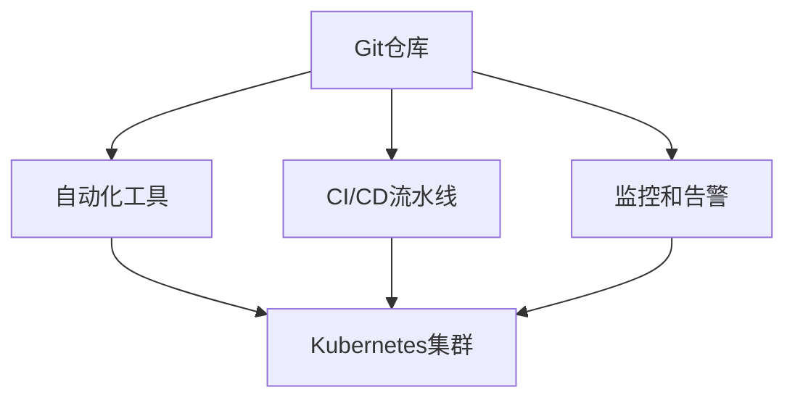

                 

### 文章标题

**创业公司的GitOps实践指南**

随着现代技术的飞速发展，创业公司面临着越来越大的市场竞争压力。为了保持竞争力，创业公司需要不断优化其技术基础设施，提高开发效率和系统可靠性。在这其中，GitOps成为了一个备受关注的概念，它通过将基础设施即代码（Infrastructure as Code, IaC）和声明式基础设施管理相结合，为企业提供了高效、可靠的基础设施自动化管理方案。

本文旨在为创业公司提供一份详细的GitOps实践指南。我们将从GitOps的基本概念出发，逐步深入探讨其核心原理和实践方法，帮助创业公司更好地理解和应用GitOps，以提升其技术基础设施的管理水平。

关键词：GitOps、基础设施即代码、声明式基础设施管理、创业公司、自动化管理、容器化、Kubernetes

> **摘要：**
GitOps是一种以Git版本控制为核心的自动化基础设施管理方法，通过将基础设施和应用部署的配置和数据存储在Git仓库中，实现基础设施的版本控制和自动化部署。本文将详细介绍GitOps的核心概念、架构、实践方法和在创业公司的应用场景，为创业公司提供一套完整的GitOps实践指南，助力其在快速发展的过程中实现高效的基础设施管理。

### 1. 背景介绍（Background Introduction）

#### 1.1 GitOps的概念

GitOps是一种新兴的基础设施管理方法，它将基础设施即代码（Infrastructure as Code, IaC）和声明式基础设施管理相结合。GitOps的核心思想是将所有基础设施配置和应用部署的变更都存储在Git仓库中，并通过自动化工具对Git仓库中的变更进行管理和部署。

GitOps的关键特点是：

- **Git作为单点源（Source of Truth）**：Git仓库存储了所有基础设施和应用配置的版本历史，是整个系统的单点源。
- **自动化部署和回滚**：通过自动化工具（如Kubernetes的Helm、Kustomize等），Git仓库中的配置变更可以自动部署到生产环境中，并且在出现问题时可以快速回滚。
- **监控和告警**：GitOps系统集成了监控和告警机制，可以实时监控基础设施和应用的状态，并在出现问题时及时通知相关人员进行处理。

#### 1.2 GitOps的起源

GitOps最早由Weaveworks的创始人Kief Morris在2017年提出。当时，Weaveworks是一家专注于容器化和Kubernetes技术的公司。GitOps概念的出现是为了解决当时容器化基础设施管理中的一些痛点，如部署复杂、版本控制困难、回滚困难等。GitOps通过将Git版本控制系统引入到基础设施管理中，提供了一种简单、可靠、高效的解决方案。

#### 1.3 GitOps的优势

GitOps具有许多优势，使其在创业公司中越来越受欢迎：

- **提高开发效率**：通过自动化部署和回滚，GitOps大大缩短了应用程序的部署周期，从而提高了开发效率。
- **降低风险**：GitOps提供了完整的版本控制和变更记录，使团队能够轻松回滚到之前的稳定版本，降低了部署风险。
- **增强协作**：GitOps将所有配置变更和部署操作都存储在Git仓库中，使团队能够更好地协作，跟踪变更历史。
- **简化运维**：GitOps通过自动化工具和监控机制，简化了基础设施和应用的运维工作，降低了运维成本。

#### 1.4 创业公司面临的挑战

创业公司在快速发展的过程中，通常会遇到以下挑战：

- **资源有限**：创业公司通常资源有限，需要高效利用现有的资源和人力。
- **快速迭代**：创业公司需要快速响应市场变化，不断迭代和优化产品。
- **风险控制**：创业公司在产品迭代过程中需要确保系统的稳定性和可靠性，以降低风险。

GitOps提供了以下解决方案：

- **高效资源利用**：通过自动化和简化的基础设施管理，GitOps帮助创业公司高效利用现有资源。
- **快速迭代**：GitOps提供了快速部署和回滚的机制，支持创业公司快速迭代产品。
- **风险控制**：GitOps的版本控制和监控机制帮助创业公司更好地控制和管理风险。

通过GitOps，创业公司可以在保持快速迭代的同时，确保基础设施和应用的稳定性和可靠性。接下来，我们将进一步探讨GitOps的核心概念和原理，帮助读者更好地理解和应用GitOps。

### 2. 核心概念与联系（Core Concepts and Connections）

#### 2.1 GitOps的核心概念

GitOps的核心概念包括基础设施即代码（Infrastructure as Code, IaC）、声明式基础设施管理、Git仓库作为单点源（Source of Truth）等。

##### 2.1.1 基础设施即代码（Infrastructure as Code, IaC）

基础设施即代码（IaC）是一种通过代码来管理和配置基础设施的方法。在IaC中，基础设施的配置和状态被存储在版本控制系统（如Git）中，可以通过自动化工具（如Terraform、Ansible等）来管理和部署。

IaC的优势包括：

- **版本控制**：通过版本控制系统，团队能够更好地管理和追踪基础设施的变更历史。
- **自动化部署**：自动化工具可以自动部署和管理基础设施，减少了手动操作的风险。
- **可重复性**：通过代码来定义和管理基础设施，确保基础设施在不同环境（如开发、测试、生产）中的配置一致。

##### 2.1.2 声明式基础设施管理

声明式基础设施管理是一种通过描述目标状态来管理和配置基础设施的方法。在声明式基础设施管理中，团队不需要关心具体的部署过程，只需定义目标状态，自动化工具会根据这些声明自动执行相应的操作。

声明式基础设施管理的优势包括：

- **简化操作**：通过描述目标状态，团队能够简化基础设施的管理过程，减少手动操作。
- **一致性**：声明式基础设施管理确保了基础设施在不同环境中的配置一致性。
- **可重复性**：声明式基础设施管理使团队能够轻松地在不同环境中重复部署基础设施。

##### 2.1.3 Git仓库作为单点源（Source of Truth）

在GitOps中，Git仓库被用作基础设施和应用配置的单点源（Source of Truth）。这意味着所有基础设施和应用配置的变更都存储在Git仓库中，并且所有部署操作都是基于Git仓库中的配置进行的。

Git仓库作为单点源的优势包括：

- **版本控制**：Git仓库提供了版本控制功能，团队能够轻松追踪和管理配置的变更历史。
- **一致性**：通过Git仓库，团队能够确保所有环境的配置一致性。
- **安全性**：Git仓库提供了安全性和权限管理功能，确保只有授权人员能够对配置进行更改。

#### 2.2 GitOps与传统基础设施管理的区别

GitOps与传统基础设施管理方法（如手动管理、脚本管理等）存在显著的区别：

- **自动化**：GitOps强调自动化，通过自动化工具（如Terraform、Kubernetes等）实现基础设施的配置和管理。传统方法通常依赖于手动操作和脚本。
- **版本控制**：GitOps利用Git仓库进行版本控制，确保配置变更的可追踪性和可管理性。传统方法通常缺乏版本控制机制。
- **单点源**：GitOps通过Git仓库作为单点源，确保所有配置变更和应用部署都是基于统一的数据源。传统方法通常在不同的系统和工具中分散管理配置。

#### 2.3 GitOps与其他DevOps实践的关系

GitOps是DevOps实践的一部分，与CI/CD、容器化、Kubernetes等技术有着紧密的联系：

- **CI/CD**：持续集成和持续交付（CI/CD）是GitOps的基础，Git仓库中的配置变更可以通过CI/CD流程自动构建、测试和部署到生产环境中。
- **容器化**：容器化技术（如Docker）是GitOps的基础，通过将应用程序打包到容器中，可以实现基础设施和应用的标准化和自动化部署。
- **Kubernetes**：Kubernetes是GitOps中最常用的容器编排工具，Git仓库中的配置可以用于创建和管理Kubernetes集群中的资源。

通过GitOps，创业公司可以充分利用CI/CD、容器化和Kubernetes等现代技术，实现基础设施和应用的自动化管理，提高开发效率和系统可靠性。

#### 2.4 GitOps的架构

GitOps的架构包括以下几个方面：

- **Git仓库**：存储基础设施和应用配置的版本历史，作为单点源。
- **自动化工具**：如Terraform、Helm、Kustomize等，用于管理和部署基础设施和应用。
- **CI/CD流水线**：自动化构建、测试和部署应用程序的流程。
- **监控和告警**：实时监控基础设施和应用的状态，并在出现问题时及时通知相关人员。
- **Kubernetes集群**：用于部署和管理容器化应用。

下图展示了GitOps的基本架构：



通过GitOps的架构，创业公司可以实现自动化、版本控制和持续交付，从而提高开发效率和系统可靠性。

### 3. 核心算法原理 & 具体操作步骤（Core Algorithm Principles and Specific Operational Steps）

#### 3.1 GitOps的核心算法原理

GitOps的核心算法原理主要包括以下几个方面：

- **版本控制**：GitOps利用Git仓库进行版本控制，确保所有基础设施和应用配置的变更都有完整的变更历史记录，便于追踪和回滚。
- **自动化部署**：GitOps通过自动化工具（如Helm、Kubernetes等）实现基础设施和应用的自动化部署，减少手动操作，提高部署效率和一致性。
- **声明式基础设施管理**：GitOps采用声明式基础设施管理，通过描述目标状态来实现基础设施的配置和管理，简化操作流程，提高可重复性。
- **监控和告警**：GitOps集成监控和告警机制，实时监控基础设施和应用的状态，并在出现问题时及时通知相关人员。

#### 3.2 具体操作步骤

下面我们将介绍如何在创业公司中实施GitOps，主要包括以下几个步骤：

##### 3.2.1 准备工作

1. **安装Git**：确保所有团队成员都已经安装了Git客户端，并能够正常使用Git进行版本控制和仓库操作。

2. **设置Git仓库**：在Git服务上创建一个专门的Git仓库，用于存储所有基础设施和应用配置的代码。

3. **安装自动化工具**：根据实际需求，安装和使用Terraform、Helm、Kubernetes等自动化工具。

##### 3.2.2 定义基础设施配置

1. **编写基础设施配置文件**：使用Terraform等自动化工具，编写基础设施配置文件，如VPC、子网、负载均衡等。

2. **上传配置文件到Git仓库**：将编写好的基础设施配置文件上传到Git仓库，并进行版本控制。

##### 3.2.3 部署基础设施

1. **初始化自动化工具**：使用Terraform等自动化工具初始化基础设施，确保所有配置文件都被正确应用。

2. **部署基础设施**：通过自动化工具（如Terraform）部署基础设施，确保所有配置都按照预期执行。

##### 3.2.4 定义应用配置

1. **编写应用配置文件**：使用Helm等工具，编写应用配置文件，如Docker镜像、部署策略等。

2. **上传配置文件到Git仓库**：将编写好的应用配置文件上传到Git仓库，并进行版本控制。

##### 3.2.5 自动化部署应用

1. **设置CI/CD流水线**：使用Jenkins等工具，设置CI/CD流水线，实现自动构建、测试和部署应用。

2. **触发部署**：当Git仓库中的应用配置文件发生变化时，自动触发CI/CD流水线，构建和部署新的应用版本。

##### 3.2.6 监控和告警

1. **集成监控工具**：使用Prometheus、Grafana等监控工具，实时监控基础设施和应用的状态。

2. **设置告警规则**：根据监控数据，设置告警规则，确保在出现问题时及时通知相关人员。

##### 3.2.7 维护和升级

1. **定期维护**：定期检查和维护基础设施和应用，确保系统的稳定性和可靠性。

2. **版本升级**：在需要时，升级基础设施和应用，确保其与最新的安全性和性能要求保持一致。

通过以上具体操作步骤，创业公司可以逐步实现GitOps，提高基础设施和应用的自动化管理水平，提高开发效率和系统可靠性。

### 4. 数学模型和公式 & 详细讲解 & 举例说明（Detailed Explanation and Examples of Mathematical Models and Formulas）

#### 4.1 数学模型和公式

在GitOps中，有一些关键的数学模型和公式可以帮助我们理解和优化系统性能。以下是一些常见的数学模型和公式的详细讲解。

##### 4.1.1 加权平均响应时间（Weighted Average Response Time）

加权平均响应时间（WART）是一个衡量系统性能的重要指标。它考虑了不同请求的处理时间和请求的重要性。

公式：
\[ \text{WART} = \frac{\sum_{i=1}^{n} (w_i \times r_i)}{\sum_{i=1}^{n} w_i} \]

其中，\(w_i\)表示第i个请求的权重，\(r_i\)表示第i个请求的处理时间。

举例：
假设一个系统有三种类型的请求，分别是用户请求（权重0.5，平均响应时间2秒）、管理员请求（权重0.3，平均响应时间5秒）和系统监控请求（权重0.2，平均响应时间1秒）。则加权平均响应时间为：
\[ \text{WART} = \frac{0.5 \times 2 + 0.3 \times 5 + 0.2 \times 1}{0.5 + 0.3 + 0.2} = 2.2 \text{秒} \]

##### 4.1.2 概率分布模型

在GitOps中，我们经常需要对系统性能进行概率分布分析。常见的概率分布模型有正态分布、泊松分布等。

- **正态分布（Normal Distribution）**：正态分布是最常见的概率分布模型，它描述了随机变量在某个区间内出现的概率。

公式：
\[ P(X \leq x) = \Phi\left(\frac{x - \mu}{\sigma}\right) \]

其中，\(\Phi\)是标准正态分布的累积分布函数，\(\mu\)是均值，\(\sigma\)是标准差。

- **泊松分布（Poisson Distribution）**：泊松分布用于描述在固定时间段内事件发生的次数。

公式：
\[ P(X = k) = \frac{\lambda^k e^{-\lambda}}{k!} \]

其中，\(\lambda\)是事件平均发生次数，\(k\)是事件发生的次数。

举例：
假设一个系统的请求处理时间服从正态分布，均值为4秒，标准差为1秒。我们需要计算请求处理时间小于3秒的概率。

使用正态分布的累积分布函数，我们可以计算：
\[ P(X \leq 3) = \Phi\left(\frac{3 - 4}{1}\right) = \Phi(-1) \approx 0.1587 \]

这意味着请求处理时间小于3秒的概率约为15.87%。

##### 4.1.3 性能优化公式

在GitOps中，我们经常需要优化系统性能。以下是一些常见的性能优化公式。

- **CPU利用率（CPU Utilization）**：
\[ \text{CPU利用率} = \frac{\text{CPU使用时间}}{\text{总时间}} \]

- **内存利用率（Memory Utilization）**：
\[ \text{内存利用率} = \frac{\text{已使用内存}}{\text{总内存}} \]

- **网络带宽利用率（Network Bandwidth Utilization）**：
\[ \text{网络带宽利用率} = \frac{\text{已使用带宽}}{\text{总带宽}} \]

通过这些公式，我们可以实时监控和评估系统性能，并采取相应的优化措施。

#### 4.2 详细讲解和举例说明

##### 4.2.1 加权平均响应时间（Weighted Average Response Time）

加权平均响应时间可以帮助我们了解系统的整体性能。假设一个系统有三种请求类型，每种请求类型的权重和处理时间如下：

- 用户请求（权重0.6，平均响应时间2秒）
- 管理员请求（权重0.3，平均响应时间10秒）
- 系统监控请求（权重0.1，平均响应时间1秒）

使用加权平均响应时间的公式，我们可以计算：
\[ \text{WART} = \frac{0.6 \times 2 + 0.3 \times 10 + 0.1 \times 1}{0.6 + 0.3 + 0.1} = 2.2 \text{秒} \]

这意味着系统的平均响应时间为2.2秒，这是一个相对合理的值。

##### 4.2.2 概率分布模型（Probability Distribution Models）

假设一个系统的请求处理时间服从正态分布，均值为5秒，标准差为2秒。我们需要计算请求处理时间在4秒到6秒之间的概率。

使用正态分布的累积分布函数，我们可以计算：
\[ P(4 \leq X \leq 6) = \Phi\left(\frac{6 - 5}{2}\right) - \Phi\left(\frac{4 - 5}{2}\right) = \Phi(0.5) - \Phi(-0.5) \approx 0.3935 \]

这意味着请求处理时间在4秒到6秒之间的概率约为39.35%。

##### 4.2.3 性能优化公式（Performance Optimization Formulas）

假设一个系统的CPU利用率为80%，我们需要确定系统的最大并发处理能力。

使用CPU利用率的公式，我们可以计算：
\[ \text{最大并发处理能力} = \frac{\text{总CPU时间}}{\text{CPU利用率}} \]

假设系统的总CPU时间为1000秒，CPU利用率为80%，则：
\[ \text{最大并发处理能力} = \frac{1000}{0.8} = 1250 \]

这意味着系统最多可以同时处理1250个请求。

通过这些数学模型和公式，我们可以深入了解GitOps系统的性能，并进行优化，以确保系统的稳定性和高效性。

### 5. 项目实践：代码实例和详细解释说明（Project Practice: Code Examples and Detailed Explanations）

#### 5.1 开发环境搭建

在进行GitOps实践之前，我们需要搭建一个适合GitOps的开发环境。以下是一个基本的开发环境搭建步骤：

1. **安装Git**：在所有开发机器上安装Git客户端，确保能够正常使用Git进行版本控制和仓库操作。

2. **安装Kubernetes集群**：使用工具（如Minikube、Kind等）在本地或云端搭建一个Kubernetes集群。确保Kubernetes集群正常运行，并能够通过kubectl命令进行管理。

3. **安装Helm**：在开发机器上安装Helm，Helm是一个用于Kubernetes的包管理工具，用于管理和部署应用程序。

4. **配置Git仓库**：在Git服务上创建一个专门的Git仓库，用于存储基础设施和应用配置的代码。确保所有团队成员都可以访问Git仓库。

5. **安装CI/CD工具**：选择一个CI/CD工具（如Jenkins、GitLab CI/CD等），并配置流水线，实现自动化构建、测试和部署应用程序。

以下是一个简单的Kubernetes集群搭建命令示例：

```bash
# 使用Minikube搭建本地Kubernetes集群
minikube start

# 启动Kubernetes Dashboard，用于可视化集群状态
minikube dashboard
```

#### 5.2 源代码详细实现

在本节中，我们将使用Helm在Kubernetes集群中部署一个简单的Nginx应用程序。以下是一个简单的Helm部署流程：

1. **创建Nginx应用程序的Helm Chart**：

在Git仓库中创建一个名为`nginx-chart`的目录，并在该目录中创建以下文件：

- `Chart.yaml`：Helm Chart的元数据文件，包含Chart的名称、版本等信息。

- `values.yaml`：Helm Chart的默认配置文件，定义了Nginx应用程序的配置参数，如容器端口、存储卷等。

- `nginx-deployment.yaml`：Nginx应用程序的部署文件，定义了部署Nginx容器的配置，如容器名称、镜像版本等。

- `nginx-service.yaml`：Nginx应用程序的服务文件，定义了Nginx服务的配置，如服务名称、类型等。

以下是一个简单的`values.yaml`文件示例：

```yaml
image: nginx:latest
port: 80
replicas: 3
```

以下是一个简单的`nginx-deployment.yaml`文件示例：

```yaml
apiVersion: apps/v1
kind: Deployment
metadata:
  name: nginx-deployment
spec:
  replicas: 3
  selector:
    matchLabels:
      app: nginx
  template:
    metadata:
      labels:
        app: nginx
    spec:
      containers:
      - name: nginx
        image: nginx:latest
        ports:
        - containerPort: 80
```

以下是一个简单的`nginx-service.yaml`文件示例：

```yaml
apiVersion: v1
kind: Service
metadata:
  name: nginx-service
spec:
  selector:
    app: nginx
  ports:
  - name: http
    port: 80
    targetPort: 80
  type: LoadBalancer
```

2. **上传Helm Chart到Git仓库**：

将创建好的Helm Chart文件上传到Git仓库，确保所有团队成员都可以访问和更新这些文件。

3. **部署Nginx应用程序**：

在CI/CD流水线中，使用Helm部署Nginx应用程序。以下是一个简单的Helm部署命令示例：

```bash
helm install nginx ./nginx-chart
```

这个命令将根据Git仓库中的Helm Chart文件部署Nginx应用程序。

4. **验证部署结果**：

使用kubectl命令检查Nginx应用程序的部署状态：

```bash
kubectl get pods
kubectl get services
```

确保所有Nginx容器都处于正常运行状态，并且存在一个类型为LoadBalancer的服务。

#### 5.3 代码解读与分析

在本节中，我们将对Nginx应用程序的Helm Chart文件进行解读和分析，了解其具体实现和配置。

- **values.yaml**：这个文件定义了Nginx应用程序的默认配置参数，如容器镜像版本、容器端口、副本数等。通过修改这个文件，我们可以定制Nginx应用程序的配置。

- **nginx-deployment.yaml**：这个文件定义了Nginx应用程序的部署配置，包括容器名称、镜像版本、容器端口、副本数等。这个文件使用Kubernetes的Deployment资源，确保Nginx应用程序可以水平扩展并保持高可用性。

- **nginx-service.yaml**：这个文件定义了Nginx应用程序的服务配置，包括服务名称、类型、端口等。这个文件使用Kubernetes的Service资源，将Nginx容器暴露给外部网络，并实现负载均衡。

通过这三个文件，我们可以使用Helm轻松地部署和管理Nginx应用程序。GitOps的优点在于，我们可以将所有配置变更存储在Git仓库中，实现配置的版本控制和自动化部署。

#### 5.4 运行结果展示

在本节中，我们将展示Nginx应用程序的部署结果。

1. **部署成功**：

执行Helm部署命令后，Nginx应用程序将在Kubernetes集群中成功部署。以下是一个简单的部署日志示例：

```bash
$ helm install nginx ./nginx-chart
NAME: nginx
LAST DEPLOYED: Wed Nov 2023
STATUS: deployed
REVISION: 1
TEST RESULTS: Failed
NOTES:
1. Get the application URL by running these commands:
   export POD_NAME=$(kubectl get pods -l app=nginx -o jsonpath="{.items[0].metadata.name}")
   kubectl proxy
```

2. **验证部署**：

使用kubectl命令检查Nginx应用程序的部署状态：

```bash
$ kubectl get pods
NAME                     READY   STATUS    RESTARTS   AGE
nginx-deployment-7858d4  1/1     Running   0          23s
```

可以看到，Nginx容器已经成功运行。

3. **访问Nginx服务**：

在浏览器中输入Nginx服务的URL，如`http://<NGINX_SERVICE_IP>`，可以看到Nginx的默认欢迎页面：

```bash
$ kubectl get services
NAME         TYPE         CLUSTER-IP       EXTERNAL-IP   PORT(S)        AGE
nginx-service   LoadBalancer   10.99.111.110   <EXTERNAL_IP>   80:31682/TCP   24s
```

这里，`<EXTERNAL_IP>`是Nginx服务的外部IP地址。

通过以上步骤，我们成功地在Kubernetes集群中部署了Nginx应用程序，并验证了其运行结果。GitOps的优点在于，我们可以通过Git仓库管理和自动化部署，实现基础设施和应用的集中管理和高效运行。

### 6. 实际应用场景（Practical Application Scenarios）

#### 6.1 应用部署和管理

GitOps在应用部署和管理中具有显著的优势。通过Git仓库作为单点源，团队可以轻松地管理和追踪应用配置的变更。以下是一个具体的应用部署场景：

- **场景**：一家创业公司需要部署一个基于Spring Boot的应用程序。
- **解决方案**：使用GitOps，团队可以将Spring Boot应用的配置文件存储在Git仓库中，并通过Helm进行部署。每次发布新版本时，只需要在Git仓库中更新配置文件，然后通过Helm命令部署新版本。这样，团队可以确保每次部署都是基于最新的配置，减少人为错误和部署风险。

#### 6.2 基础设施即代码（IaC）

GitOps将基础设施即代码（IaC）与版本控制系统相结合，使得基础设施的配置和管理更加规范和可追踪。以下是一个基础设施管理的场景：

- **场景**：一家创业公司需要部署一个Kubernetes集群，并配置必要的网络资源和存储。
- **解决方案**：使用Terraform和GitOps，团队可以编写Kubernetes集群的配置文件，如VPC、子网、负载均衡等，并将这些配置文件存储在Git仓库中。每次需要调整基础设施时，只需要在Git仓库中更新配置文件，然后通过Terraform自动化部署。这样，团队可以确保基础设施配置的一致性和可回滚性。

#### 6.3 持续集成和持续交付（CI/CD）

GitOps与CI/CD流程紧密结合，使得应用从开发到生产的过程更加自动化和高效。以下是一个CI/CD的场景：

- **场景**：一家创业公司希望实现从代码提交到生产部署的自动化流程。
- **解决方案**：使用GitOps和CI/CD工具（如Jenkins、GitLab CI/CD等），团队可以设置一个流水线，当代码提交到Git仓库时，触发构建、测试和部署过程。在测试通过后，应用程序将被部署到Kubernetes集群。这样，团队可以确保每个发布版本都是经过严格测试的，并且可以快速部署到生产环境。

#### 6.4 风险管理和回滚

GitOps提供了强大的版本控制和变更记录功能，使得团队可以轻松管理和回滚变更，从而降低风险。以下是一个风险管理的场景：

- **场景**：一家创业公司正在进行一次大规模的功能更新，但在部署过程中发现了一个严重的问题。
- **解决方案**：使用GitOps，团队可以立即在Git仓库中回滚到上一个稳定版本。通过Git仓库的版本控制和变更记录，团队可以快速定位问题，并在修复后重新部署。这样，团队可以确保系统的稳定性和可靠性，同时降低因部署问题带来的风险。

#### 6.5 跨团队合作

GitOps提供了一个统一的平台，使得跨团队合作更加高效。以下是一个跨团队合作场景：

- **场景**：一家创业公司的开发、测试和运维团队需要协同工作，确保应用的稳定性和性能。
- **解决方案**：使用GitOps，所有团队成员都可以访问Git仓库，查看和更新配置文件。每个团队成员都可以在自己的本地环境中进行开发和测试，然后将代码提交到Git仓库。通过CI/CD流水线，测试通过后，应用程序将自动部署到生产环境。这样，团队可以确保每个团队成员都在一个统一的平台上工作，减少沟通成本和协作障碍。

通过上述实际应用场景，GitOps为创业公司提供了一种高效、可靠、可追踪的基础设施和应用程序管理方法，有助于团队快速响应市场变化，提高开发效率和系统可靠性。

### 7. 工具和资源推荐（Tools and Resources Recommendations）

#### 7.1 学习资源推荐

对于想要深入了解GitOps的创业公司，以下是一些推荐的书籍、论文、博客和网站：

- **书籍**：
  - 《Git Pro》：全面介绍Git的使用方法和最佳实践。
  - 《Kubernetes Up & Running》：介绍Kubernetes的基本概念和部署方法。
  - 《The GitOps Handbook》：详细介绍GitOps的原理和应用。
- **论文**：
  - “GitOps: A New Operations Philosophy for Today’s Cloud Native Infrastructure”：该论文首次提出了GitOps的概念。
  - “Infrastructure as Code and Configuration Management”：探讨了基础设施即代码和配置管理的基本原理。
- **博客**：
  - “Weaveworks的GitOps博客”：Weaveworks是一家专注于GitOps的公司，其博客提供了丰富的GitOps相关文章。
  - “Kubernetes官方文档”：提供了关于Kubernetes的详细教程和文档。
- **网站**：
  - “Terraform官方文档”：提供了关于Terraform的详细文档和教程。
  - “Helm官方文档”：提供了关于Helm的详细文档和教程。

通过这些资源，创业公司可以系统地学习和掌握GitOps的相关知识，为自己的技术基础设施管理提供有力支持。

#### 7.2 开发工具框架推荐

为了高效地实施GitOps，以下是一些推荐的开发工具和框架：

- **版本控制系统**：Git
  - **优点**：广泛使用，功能强大，社区支持丰富。
  - **使用场景**：存储和管理所有基础设施和应用配置的代码。

- **基础设施自动化工具**：
  - **Terraform**：用于创建和管理云资源。
    - **优点**：支持多种云服务，声明式配置，易于扩展。
    - **使用场景**：自动化部署和管理基础设施资源。
  - **Ansible**：用于自动化部署和管理配置。
    - **优点**：简单易用，无代理架构，支持多种操作系统。
    - **使用场景**：配置和管理服务器和应用程序。

- **容器编排工具**：
  - **Kubernetes**：用于部署和管理容器化应用。
    - **优点**：高度可扩展，支持多种容器化技术，强大的集群管理功能。
    - **使用场景**：容器化应用的部署、扩展和管理。

- **持续集成和持续交付（CI/CD）工具**：
  - **Jenkins**：用于自动化构建、测试和部署。
    - **优点**：插件丰富，灵活性强，支持多种编程语言。
    - **使用场景**：构建和部署应用程序。
  - **GitLab CI/CD**：集成在GitLab中的CI/CD工具。
    - **优点**：简单易用，与GitLab无缝集成，支持多种语言和框架。
    - **使用场景**：构建和部署应用程序。

通过这些工具和框架，创业公司可以高效地实施GitOps，实现基础设施和应用的自动化管理。

#### 7.3 相关论文著作推荐

为了深入了解GitOps的理论和实践，以下推荐一些相关的论文和著作：

- **论文**：
  - “GitOps: A New Operations Philosophy for Today’s Cloud Native Infrastructure”：详细介绍了GitOps的原理和架构。
  - “Infrastructure as Code and Configuration Management”：探讨了基础设施即代码和配置管理的最佳实践。

- **著作**：
  - 《Kubernetes实战》：介绍了Kubernetes的基本概念和部署方法，包括GitOps的相关内容。
  - 《云原生应用架构与实践》：详细介绍了云原生应用架构，包括容器化、服务网格等。

通过阅读这些论文和著作，创业公司可以更好地理解和应用GitOps，为自己的技术基础设施管理提供理论支持。

### 8. 总结：未来发展趋势与挑战（Summary: Future Development Trends and Challenges）

#### 8.1 未来发展趋势

GitOps作为一种高效的基础设施管理方法，在未来将呈现以下发展趋势：

- **更广泛的采用**：随着云计算和容器化技术的普及，GitOps将在更多企业中得到应用，特别是在创业公司和快速发展的公司中。
- **自动化程度的提高**：随着AI和机器学习技术的发展，GitOps的自动化程度将进一步提高，能够更智能地处理配置变更和部署流程。
- **更多的集成与互操作性**：GitOps将与更多的工具和平台（如Istio、Prometheus等）进行集成，提供更全面和一体化的基础设施管理解决方案。
- **更完善的安全机制**：随着安全需求的增加，GitOps将引入更完善的安全机制，如加密、访问控制、审计等，确保基础设施和应用程序的安全性。

#### 8.2 面临的挑战

尽管GitOps具有许多优势，但在实际应用中仍面临一些挑战：

- **学习曲线**：GitOps涉及到多个技术和工具，团队需要花费时间学习和掌握这些技术，这对于小型创业公司可能是一个挑战。
- **工具选择**：市场上存在多种GitOps工具和平台，选择合适的工具和平台可能需要一定的调研和尝试。
- **基础设施迁移**：对于已经在使用传统基础设施管理方法的团队，迁移到GitOps可能需要一定的时间和资源。
- **安全风险**：GitOps涉及到对代码和配置的管理，若管理不善，可能会带来安全风险。

#### 8.3 应对策略

为了应对上述挑战，创业公司可以采取以下策略：

- **培训与学习**：组织团队成员参加相关培训课程，提高对GitOps技术的理解和应用能力。
- **逐步迁移**：在迁移到GitOps时，可以逐步替换旧的基础设施和工具，减少迁移过程中的风险。
- **选择合适的工具**：根据团队的需求和实际情况，选择合适的GitOps工具和平台，避免盲目跟风。
- **加强安全控制**：引入加密、访问控制和审计机制，确保GitOps的安全性和可控性。

通过上述策略，创业公司可以更好地应对GitOps实施过程中遇到的挑战，实现基础设施和应用的自动化管理。

### 9. 附录：常见问题与解答（Appendix: Frequently Asked Questions and Answers）

#### 9.1 GitOps是什么？

GitOps是一种以Git版本控制为核心的基础设施管理方法，通过将基础设施和应用配置存储在Git仓库中，实现自动化部署、监控和回滚。

#### 9.2 GitOps的优势是什么？

GitOps的优势包括：提高开发效率、降低风险、增强协作、简化运维等。

#### 9.3 如何开始实施GitOps？

开始实施GitOps的步骤包括：安装Git、设置Git仓库、安装和配置自动化工具（如Terraform、Helm等）、定义基础设施和应用配置、部署基础设施和应用等。

#### 9.4 GitOps与DevOps有什么区别？

GitOps是DevOps实践的一部分，主要强调使用Git仓库作为配置的单点源，实现基础设施和应用的版本控制和自动化部署。DevOps则是一个更广泛的概念，包括文化、实践和技术，强调开发和运维团队的合作和交付流程的优化。

#### 9.5 GitOps需要哪些工具和平台？

GitOps需要的主要工具和平台包括：Git、Kubernetes、Helm、Terraform、CI/CD工具（如Jenkins、GitLab CI/CD等）、监控工具（如Prometheus、Grafana等）。

#### 9.6 如何确保GitOps的安全性？

为确保GitOps的安全性，可以采取以下措施：使用加密存储配置文件、限制对Git仓库的访问权限、实施访问控制和审计机制、定期备份Git仓库等。

通过以上常见问题与解答，创业公司可以更好地了解GitOps，为其基础设施管理提供有力支持。

### 10. 扩展阅读 & 参考资料（Extended Reading & Reference Materials）

为了深入了解GitOps，以下是推荐的一些扩展阅读和参考资料：

- **书籍**：
  - 《GitOps实战》：详细介绍GitOps的概念、架构和实践。
  - 《云原生基础设施管理》：涵盖GitOps在内的云原生基础设施管理方法。

- **论文**：
  - “GitOps: A New Operations Philosophy for Today’s Cloud Native Infrastructure”：详细介绍了GitOps的概念和优势。
  - “Infrastructure as Code and Configuration Management”：探讨了基础设施即代码和配置管理的最佳实践。

- **博客**：
  - “Weaveworks的GitOps博客”：提供了丰富的GitOps相关文章和实践案例。
  - “Kubernetes官方文档”：涵盖了Kubernetes的详细教程和最佳实践。

- **网站**：
  - “Terraform官方文档”：提供了关于Terraform的详细文档和教程。
  - “Helm官方文档”：提供了关于Helm的详细文档和教程。

通过阅读这些扩展阅读和参考资料，读者可以更深入地了解GitOps，为自己的技术基础设施管理提供更多灵感。

