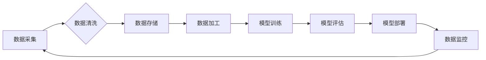

                 

## AI大模型重构电商搜索推荐的数据资产管理流程优化实践指南

> 关键词：AI大模型、电商搜索推荐、数据资产管理、数据质量、数据安全、数据治理、模型训练、模型部署

## 1. 背景介绍

随着电商行业的蓬勃发展，搜索推荐系统已成为电商平台的核心竞争力之一。传统的搜索推荐系统主要依赖于基于规则和特征工程的方法，其效果受限于人工设计的规则和特征的局限性。近年来，随着深度学习技术的快速发展，基于AI大模型的搜索推荐系统逐渐成为主流趋势。

AI大模型，例如Transformer、BERT等，凭借其强大的语义理解和学习能力，能够从海量数据中自动学习用户偏好、商品特征等复杂关系，从而实现更精准、个性化的搜索推荐。然而，AI大模型的训练和部署也带来了新的挑战，特别是数据资产管理方面。

传统的电商平台数据资产管理流程主要围绕着数据采集、存储、处理和分析等环节，而AI大模型的应用则需要更加注重数据质量、数据安全和数据治理等方面。

## 2. 核心概念与联系

### 2.1 数据资产管理

数据资产管理是指对企业内部的数据资源进行规划、组织、管理和利用，以实现数据价值最大化。

### 2.2 AI大模型

AI大模型是指在海量数据上训练的深度学习模型，具有强大的泛化能力和学习能力，能够处理复杂的任务，例如自然语言处理、图像识别、语音合成等。

### 2.3 数据资产管理流程优化

在AI大模型的应用场景下，数据资产管理流程需要进行优化，以满足AI大模型的训练和部署需求。

**数据资产管理流程优化流程图**



## 3. 核心算法原理 & 具体操作步骤

### 3.1 算法原理概述

在电商搜索推荐场景下，常用的AI大模型算法包括：

* **协同过滤算法:** 基于用户历史行为和商品购买记录，预测用户对商品的兴趣。
* **内容基元匹配算法:** 基于商品的属性和描述信息，匹配用户搜索的关键词。
* **深度学习推荐算法:** 利用深度神经网络，学习用户和商品之间的复杂关系，进行个性化推荐。

### 3.2 算法步骤详解

以深度学习推荐算法为例，其具体操作步骤如下：

1. **数据预处理:** 对原始数据进行清洗、转换和特征工程，构建训练模型所需的输入数据。
2. **模型构建:** 选择合适的深度学习模型架构，例如Transformer、BERT等，并根据业务需求进行参数调整。
3. **模型训练:** 利用训练数据训练模型，并通过评估指标，例如准确率、召回率等，评估模型性能。
4. **模型优化:** 根据评估结果，调整模型参数和训练策略，不断优化模型性能。
5. **模型部署:** 将训练好的模型部署到线上环境，用于实时推荐。

### 3.3 算法优缺点

**深度学习推荐算法**

* **优点:** 能够学习用户和商品之间的复杂关系，实现更精准的推荐。
* **缺点:** 需要海量数据进行训练，训练时间较长，模型参数较多，需要强大的计算资源。

### 3.4 算法应用领域

深度学习推荐算法广泛应用于电商搜索推荐、内容推荐、广告推荐等领域。

## 4. 数学模型和公式 & 详细讲解 & 举例说明

### 4.1 数学模型构建

深度学习推荐算法通常采用用户-商品交互矩阵作为输入数据，并利用神经网络学习用户和商品之间的关系。

**用户-商品交互矩阵:**

$$
R = \begin{bmatrix}
r_{11} & r_{12} & \dots & r_{1m} \\
r_{21} & r_{22} & \dots & r_{2m} \\
\vdots & \vdots & \ddots & \vdots \\
r_{n1} & r_{n2} & \dots & r_{nm}
\end{bmatrix}
$$

其中，$r_{ij}$表示用户$i$对商品$j$的评分或交互行为。

### 4.2 公式推导过程

深度学习推荐算法的具体公式推导过程较为复杂，涉及到神经网络的激活函数、损失函数、反向传播算法等。

### 4.3 案例分析与讲解

以Transformer模型为例，其在电商搜索推荐中的应用可以分为以下几个步骤：

1. **用户行为序列编码:** 将用户的历史搜索行为、购买记录等信息转换为序列数据，并利用Transformer模型进行编码，提取用户特征。
2. **商品信息编码:** 将商品的属性、描述信息等转换为序列数据，并利用Transformer模型进行编码，提取商品特征。
3. **用户-商品交互预测:** 将编码后的用户特征和商品特征作为输入，利用Transformer模型预测用户对商品的兴趣或评分。

## 5. 项目实践：代码实例和详细解释说明

### 5.1 开发环境搭建

* Python 3.6+
* TensorFlow/PyTorch
* CUDA/cuDNN

### 5.2 源代码详细实现

```python
# 导入必要的库
import tensorflow as tf

# 定义Transformer模型
class Transformer(tf.keras.Model):
    def __init__(self, vocab_size, embedding_dim, num_heads, num_layers):
        super(Transformer, self).__init__()
        self.embedding = tf.keras.layers.Embedding(vocab_size, embedding_dim)
        self.transformer_layers = tf.keras.layers.StackedRNNCells([tf.keras.layers.MultiHeadAttention(num_heads=num_heads, key_dim=embedding_dim) for _ in range(num_layers)])
        self.fc = tf.keras.layers.Dense(vocab_size)

    def call(self, inputs):
        embeddings = self.embedding(inputs)
        outputs = self.transformer_layers(embeddings)
        logits = self.fc(outputs)
        return logits

# 实例化模型
model = Transformer(vocab_size=10000, embedding_dim=128, num_heads=8, num_layers=6)

# 训练模型
model.compile(optimizer='adam', loss='sparse_categorical_crossentropy', metrics=['accuracy'])
model.fit(x_train, y_train, epochs=10)

# 部署模型
model.save('transformer_model.h5')
```

### 5.3 代码解读与分析

* 代码首先定义了Transformer模型的架构，包括嵌入层、多头注意力层和全连接层。
* 然后实例化模型并使用Adam优化器、交叉熵损失函数和准确率指标进行训练。
* 最后将训练好的模型保存为文件，以便后续部署。

### 5.4 运行结果展示

训练完成后，可以评估模型的性能，例如准确率、召回率等。

## 6. 实际应用场景

AI大模型重构电商搜索推荐的数据资产管理流程优化实践已在一些电商平台得到应用，取得了显著的效果。例如，某电商平台利用Transformer模型构建的搜索推荐系统，实现了用户点击率和转化率的提升。

### 6.4 未来应用展望

随着AI技术的不断发展，AI大模型在电商搜索推荐领域的应用将更加广泛。未来，AI大模型将能够更加精准地理解用户需求，提供更加个性化的推荐，从而提升用户体验和电商平台的商业价值。

## 7. 工具和资源推荐

### 7.1 学习资源推荐

* **书籍:**
    * 深度学习
    * 自然语言处理
* **在线课程:**
    * Coursera
    * edX
    * fast.ai

### 7.2 开发工具推荐

* **深度学习框架:** TensorFlow, PyTorch
* **数据处理工具:** Pandas, NumPy
* **云计算平台:** AWS, Azure, GCP

### 7.3 相关论文推荐

* Attention Is All You Need
* BERT: Pre-training of Deep Bidirectional Transformers for Language Understanding

## 8. 总结：未来发展趋势与挑战

### 8.1 研究成果总结

AI大模型重构电商搜索推荐的数据资产管理流程优化实践取得了显著成果，提升了推荐效果和用户体验。

### 8.2 未来发展趋势

* **模型规模和能力的提升:** 未来，AI大模型的规模和能力将进一步提升，能够处理更加复杂的任务，提供更加精准的推荐。
* **多模态融合:** AI大模型将融合文本、图像、视频等多模态数据，提供更加丰富的推荐体验。
* **个性化推荐的增强:** AI大模型将更加深入地理解用户的需求和偏好，提供更加个性化的推荐。

### 8.3 面临的挑战

* **数据质量和安全:** AI大模型的训练和部署依赖于高质量的数据，数据质量和安全问题需要得到有效解决。
* **模型解释性和可控性:** AI大模型的决策过程较为复杂，缺乏可解释性和可控性，需要进一步研究。
* **计算资源和成本:** AI大模型的训练和部署需要大量的计算资源和成本，需要探索更加高效的训练和部署方法。

### 8.4 研究展望

未来，AI大模型在电商搜索推荐领域的应用将更加广泛和深入，需要进一步研究模型架构、训练方法、数据管理等方面，以提升推荐效果和用户体验。

## 9. 附录：常见问题与解答

* **Q1: AI大模型的训练需要多少数据？**

* **A1:** AI大模型的训练需要海量数据，通常需要百万甚至数十亿条数据。

* **Q2: AI大模型的训练时间有多长？**

* **A2:** AI大模型的训练时间取决于模型规模、数据量和计算资源等因素，通常需要几天甚至几周的时间。

* **Q3: 如何保证AI大模型的安全性？**

* **A3:** 

    * 数据加密和脱敏
    * 模型安全评估和测试
    * 权限控制和访问日志

* **Q4: 如何解释AI大模型的决策过程？**

* **A4:** 

    * 可解释AI技术
    * 模型可视化和分析

* **Q5: 如何降低AI大模型的训练和部署成本？**

* **A5:** 

    * 模型压缩和优化
    * 云计算平台
    * 联邦学习


作者：禅与计算机程序设计艺术 / Zen and the Art of Computer Programming 
<end_of_turn>

