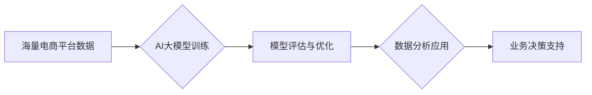

                 

## AI大模型：电商平台数据分析的新工具

> 关键词：AI大模型、电商平台、数据分析、自然语言处理、推荐系统、预测分析、机器学习、深度学习

## 1. 背景介绍

电子商务平台作为当今商业模式的重要组成部分，其核心竞争力在于对海量用户数据进行高效分析，从而实现精准营销、个性化推荐和风险控制等目标。传统的数据分析方法往往依赖于人工特征工程和规则化建模，难以应对数据规模的爆炸式增长和复杂性的挑战。近年来，随着深度学习技术的飞速发展，AI大模型的出现为电商平台数据分析带来了新的机遇。

AI大模型，是指在海量数据上训练的具有强大泛化能力的深度学习模型，其能够自动学习数据中的复杂模式和关系，并应用于各种数据分析任务。相较于传统方法，AI大模型具有以下优势：

* **自动特征提取:** AI大模型能够自动从原始数据中提取特征，无需人工干预，大大降低了数据预处理的成本和时间。
* **更强的表达能力:** AI大模型拥有更复杂的网络结构和参数量，能够学习到更丰富的特征表示，从而提升分析结果的准确性和鲁棒性。
* **更好的泛化能力:** AI大模型在海量数据上进行训练，能够更好地泛化到新的数据场景，提高模型的应用范围和实用价值。

## 2. 核心概念与联系

### 2.1 AI大模型

AI大模型是指在海量数据上训练的深度学习模型，其参数量通常在数十亿甚至数千亿级别。常见的AI大模型架构包括Transformer、BERT、GPT等。这些模型通过学习语言的语法和语义关系，能够理解和生成人类语言，并应用于各种自然语言处理任务，如文本分类、情感分析、机器翻译等。

### 2.2 电商平台数据分析

电商平台数据分析是指利用数据挖掘、机器学习等技术，从电商平台的海量用户数据中提取有价值的信息，以支持平台运营、营销推广、产品开发等决策。电商平台数据分析主要涉及以下几个方面：

* **用户画像:** 通过分析用户行为、购买记录、浏览历史等数据，构建用户画像，了解用户的兴趣爱好、消费习惯等特征。
* **商品推荐:** 根据用户的兴趣偏好和购买历史，推荐相关的商品，提高用户购物体验和转化率。
* **价格优化:** 分析市场价格趋势、用户需求等因素，制定合理的商品定价策略，最大化平台利润。
* **风险控制:** 通过分析用户行为、交易记录等数据，识别潜在的欺诈行为和风险，保障平台安全稳定运行。

### 2.3 AI大模型与电商平台数据分析的结合

AI大模型能够有效提升电商平台数据分析的效率和准确性。例如，利用BERT模型对用户评论进行情感分析，可以更准确地了解用户对商品的评价；利用Transformer模型对用户行为进行预测，可以更精准地推荐商品和个性化营销。

**AI大模型与电商平台数据分析的流程图:**



## 3. 核心算法原理 & 具体操作步骤

### 3.1 算法原理概述

AI大模型的训练主要基于深度学习算法，其中最常用的算法是反向传播算法。反向传播算法通过不断调整模型参数，使得模型输出与真实标签之间的误差最小化。

### 3.2 算法步骤详解

1. **数据预处理:** 将原始数据进行清洗、转换和格式化，使其适合模型训练。
2. **模型构建:** 选择合适的深度学习模型架构，并根据任务需求进行参数配置。
3. **模型训练:** 使用训练数据对模型进行训练，通过反向传播算法不断调整模型参数，降低模型误差。
4. **模型评估:** 使用测试数据对模型进行评估，并根据评估结果进行模型调优。
5. **模型部署:** 将训练好的模型部署到生产环境中，用于实际数据分析。

### 3.3 算法优缺点

**优点:**

* 能够自动学习数据中的复杂模式和关系。
* 具有较强的泛化能力，能够应用于新的数据场景。
* 能够处理海量数据，提高分析效率。

**缺点:**

* 训练成本高，需要大量的计算资源和时间。
* 模型解释性差，难以理解模型的决策过程。
* 对数据质量要求高，训练数据必须足够丰富和准确。

### 3.4 算法应用领域

AI大模型在电商平台数据分析领域具有广泛的应用场景，例如：

* **用户画像分析:** 通过分析用户行为、购买记录等数据，构建用户画像，了解用户的兴趣爱好、消费习惯等特征。
* **商品推荐系统:** 根据用户的兴趣偏好和购买历史，推荐相关的商品，提高用户购物体验和转化率。
* **价格优化:** 分析市场价格趋势、用户需求等因素，制定合理的商品定价策略，最大化平台利润。
* **欺诈检测:** 通过分析用户行为、交易记录等数据，识别潜在的欺诈行为，保障平台安全稳定运行。

## 4. 数学模型和公式 & 详细讲解 & 举例说明

### 4.1 数学模型构建

在电商平台数据分析中，常用的数学模型包括线性回归、逻辑回归、支持向量机、决策树等。这些模型通过建立数学公式，将输入数据与输出结果进行映射，从而实现数据分析和预测。

### 4.2 公式推导过程

例如，线性回归模型的数学公式如下：

$$
y = \beta_0 + \beta_1x_1 + \beta_2x_2 + ... + \beta_nx_n + \epsilon
$$

其中：

* $y$ 是预测结果
* $\beta_0, \beta_1, ..., \beta_n$ 是模型参数
* $x_1, x_2, ..., x_n$ 是输入特征
* $\epsilon$ 是误差项

通过最小化模型误差，可以求解出模型参数，从而建立线性回归模型。

### 4.3 案例分析与讲解

假设我们想要预测用户的购买行为，输入特征包括用户的年龄、性别、购买历史等，输出结果是用户是否购买商品。我们可以使用逻辑回归模型进行预测。逻辑回归模型将线性回归模型的输出结果映射到0到1之间，表示用户购买商品的概率。

## 5. 项目实践：代码实例和详细解释说明

### 5.1 开发环境搭建

为了实现AI大模型在电商平台数据分析的应用，需要搭建相应的开发环境。常用的开发环境包括Python、TensorFlow、PyTorch等。

### 5.2 源代码详细实现

以下是一个使用TensorFlow训练商品推荐系统的代码示例：

```python
import tensorflow as tf

# 定义模型结构
model = tf.keras.Sequential([
    tf.keras.layers.Embedding(input_dim=10000, output_dim=64),
    tf.keras.layers.Flatten(),
    tf.keras.layers.Dense(units=32, activation='relu'),
    tf.keras.layers.Dense(units=1, activation='sigmoid')
])

# 编译模型
model.compile(optimizer='adam',
              loss='binary_crossentropy',
              metrics=['accuracy'])

# 训练模型
model.fit(x_train, y_train, epochs=10)

# 评估模型
loss, accuracy = model.evaluate(x_test, y_test)
print('Loss:', loss)
print('Accuracy:', accuracy)
```

### 5.3 代码解读与分析

这段代码定义了一个简单的商品推荐系统模型，使用Embedding层将商品ID映射到向量空间，然后通过全连接层进行分类。模型使用Adam优化器，损失函数为二分类交叉熵，评价指标为准确率。

### 5.4 运行结果展示

训练完成后，可以将模型部署到生产环境中，用于预测用户的商品购买行为。

## 6. 实际应用场景

### 6.1 用户画像分析

AI大模型可以分析用户的行为数据，例如浏览历史、购买记录、评价内容等，构建用户画像，了解用户的兴趣爱好、消费习惯等特征。

### 6.2 商品推荐系统

AI大模型可以根据用户的兴趣偏好和购买历史，推荐相关的商品，提高用户购物体验和转化率。

### 6.3 价格优化

AI大模型可以分析市场价格趋势、用户需求等因素，制定合理的商品定价策略，最大化平台利润。

### 6.4 风险控制

AI大模型可以分析用户行为、交易记录等数据，识别潜在的欺诈行为和风险，保障平台安全稳定运行。

### 6.5 未来应用展望

随着AI技术的不断发展，AI大模型在电商平台数据分析领域将有更广泛的应用场景，例如：

* **个性化营销:** 根据用户的画像，进行精准的个性化营销，提高营销效果。
* **智能客服:** 利用AI大模型构建智能客服系统，自动解答用户问题，提高客户服务效率。
* **供应链优化:** 利用AI大模型预测商品需求，优化库存管理和物流配送，降低运营成本。

## 7. 工具和资源推荐

### 7.1 学习资源推荐

* **书籍:**
    * 《深度学习》
    * 《自然语言处理》
    * 《机器学习实战》
* **在线课程:**
    * Coursera
    * edX
    * Udacity

### 7.2 开发工具推荐

* **Python:** 
* **TensorFlow:** 
* **PyTorch:** 
* **Keras:** 

### 7.3 相关论文推荐

* **BERT: Pre-training of Deep Bidirectional Transformers for Language Understanding**
* **Attention Is All You Need**
* **Generative Pre-trained Transformer 2**

## 8. 总结：未来发展趋势与挑战

### 8.1 研究成果总结

AI大模型在电商平台数据分析领域取得了显著的成果，例如提高了推荐系统的准确率、优化了商品定价策略、降低了风险控制成本等。

### 8.2 未来发展趋势

未来，AI大模型在电商平台数据分析领域将朝着以下方向发展：

* **模型规模更大:** 随着计算资源的不断提升，AI大模型的规模将进一步扩大，学习能力将更加强大。
* **模型更加通用:** 将开发更加通用的AI大模型，能够应用于更广泛的数据分析任务。
* **模型解释性更强:** 研究更有效的模型解释方法，提高用户对AI模型决策的理解和信任。

### 8.3 面临的挑战

AI大模型在电商平台数据分析领域也面临一些挑战：

* **数据质量问题:** AI大模型对数据质量要求较高，需要保证训练数据的准确性和完整性。
* **模型训练成本:** 训练大型AI模型需要大量的计算资源和时间，成本较高。
* **模型解释性问题:** AI模型的决策过程往往难以理解，缺乏透明度，难以获得用户的信任。

### 8.4 研究展望

未来，需要进一步研究如何提高AI大模型的效率、通用性和解释性，使其更好地应用于电商平台数据分析，为电商平台的运营和发展提供更强大的数据支持。

## 9. 附录：常见问题与解答

### 9.1 如何选择合适的AI大模型？

选择合适的AI大模型需要根据具体的应用场景和数据特点进行选择。例如，对于文本分类任务，BERT模型效果较好；对于图像识别任务，CNN模型效果较好。

### 9.2 如何评估AI大模型的性能？

常用的AI大模型性能评估指标包括准确率、召回率、F1-score等。

### 9.3 如何部署AI大模型？

AI大模型的部署方式多种多样，可以部署到云服务器、边缘设备等。

### 9.4 如何解决AI大模型的解释性问题？

目前，一些研究方法可以提高AI模型的解释性，例如：

* **局部解释方法:** 例如LIME、SHAP等，可以解释单个预测结果背后的决策因素。
* **全局解释方法:** 例如特征重要性分析、可视化模型结构等，可以解释模型整体的决策机制。


作者：禅与计算机程序设计艺术 / Zen and the Art of Computer Programming 
<end_of_turn>

