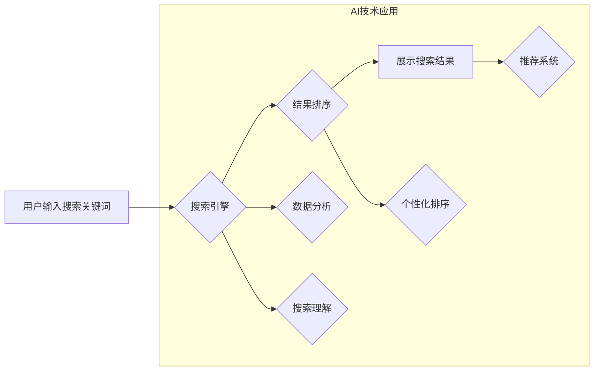

                 

## AI如何提升电商搜索的用户参与度

> 关键词：电商搜索、人工智能、用户参与度、推荐系统、自然语言处理、深度学习、个性化推荐

## 1. 背景介绍

电商平台的搜索功能是用户获取商品信息、完成购买的核心环节。然而，传统的基于关键词匹配的搜索方式往往难以满足用户日益复杂的搜索需求，导致用户体验下降、转化率降低。随着人工智能技术的快速发展，AI技术为提升电商搜索的用户参与度提供了新的机遇。

近年来，电商平台纷纷将AI技术应用于搜索领域，例如：

* **智能推荐:** 基于用户历史行为、浏览记录、购买偏好等数据，推荐相关商品，提高用户发现新商品的可能性。
* **自然语言理解:** 理解用户自然语言的搜索意图，即使用户输入模糊或不规范的关键词，也能精准匹配相关商品。
* **个性化搜索:** 根据用户的个人特征、兴趣爱好等信息，定制个性化的搜索结果，提升用户搜索体验。

这些AI技术能够有效提升电商搜索的精准度、效率和用户体验，从而提高用户参与度。

## 2. 核心概念与联系

### 2.1  电商搜索系统架构

电商搜索系统通常由以下几个核心模块组成：

* **数据采集:** 收集用户搜索行为、商品信息、用户画像等数据。
* **数据处理:** 对采集到的数据进行清洗、转换、存储等处理，构建搜索索引。
* **搜索引擎:** 根据用户搜索关键词，从搜索索引中检索匹配的商品信息。
* **结果排序:** 对检索到的商品信息进行排序，根据用户需求和平台算法，展示最相关的商品。
* **用户界面:** 展示搜索结果，提供用户交互功能，例如筛选、排序、过滤等。

### 2.2  AI技术在电商搜索中的应用

AI技术可以应用于电商搜索系统的各个环节，例如：

* **数据分析:** 利用机器学习算法分析用户搜索行为、商品浏览记录等数据，挖掘用户需求和商品关联性。
* **搜索理解:** 利用自然语言处理技术理解用户搜索意图，即使用户输入模糊或不规范的关键词，也能精准匹配相关商品。
* **结果排序:** 利用深度学习算法对商品信息进行特征提取，根据用户需求和平台算法，对搜索结果进行个性化排序。
* **推荐系统:** 利用协同过滤、内容过滤等算法，根据用户历史行为和商品信息，推荐相关商品。

**Mermaid 流程图**



## 3. 核心算法原理 & 具体操作步骤

### 3.1  算法原理概述

在电商搜索中，常用的AI算法包括：

* **深度学习:** 用于特征提取、结果排序、个性化推荐等。
* **自然语言处理:** 用于理解用户搜索意图、关键词提取、文本分类等。
* **推荐系统:** 用于根据用户行为和商品信息，推荐相关商品。

### 3.2  算法步骤详解

**深度学习算法**

1. **数据预处理:** 对搜索数据进行清洗、转换、特征提取等处理。
2. **模型构建:** 选择合适的深度学习模型，例如卷积神经网络(CNN)、循环神经网络(RNN)等。
3. **模型训练:** 利用训练数据训练深度学习模型，调整模型参数。
4. **模型评估:** 利用测试数据评估模型性能，例如准确率、召回率等。
5. **模型部署:** 将训练好的模型部署到生产环境中，用于实时搜索。

**自然语言处理算法**

1. **文本预处理:** 对用户搜索词进行分词、去停用词、词干提取等处理。
2. **关键词提取:** 利用TF-IDF、LDA等算法提取用户搜索词中的关键词。
3. **意图识别:** 利用机器学习算法识别用户搜索的意图，例如商品查询、品牌查询、价格查询等。
4. **语义理解:** 利用知识图谱、语义角色标注等技术理解用户搜索词的语义关系。

**推荐系统算法**

1. **用户行为数据采集:** 收集用户浏览记录、购买记录、评分记录等数据。
2. **商品信息数据采集:** 收集商品属性、价格、评价等数据。
3. **算法模型选择:** 选择合适的推荐算法，例如协同过滤、内容过滤、混合推荐等。
4. **模型训练:** 利用用户行为数据和商品信息数据训练推荐模型。
5. **推荐结果生成:** 根据用户特征和商品信息，生成个性化的推荐结果。

### 3.3  算法优缺点

**深度学习算法**

* **优点:** 表现力强，能够学习到复杂的特征关系。
* **缺点:** 数据需求量大，训练时间长，解释性差。

**自然语言处理算法**

* **优点:** 能够理解用户自然语言的搜索意图。
* **缺点:** 语言理解能力有限，对语义歧义处理能力不足。

**推荐系统算法**

* **优点:** 可以根据用户兴趣推荐相关商品，提高用户发现新商品的可能性。
* **缺点:** 容易陷入冷启动问题，对新用户和新商品的推荐效果较差。

### 3.4  算法应用领域

* **电商搜索:** 提升搜索精准度、效率和用户体验。
* **内容推荐:** 推荐用户感兴趣的内容，例如新闻、视频、文章等。
* **个性化营销:** 根据用户特征和行为，进行个性化的营销推广。
* **智能客服:** 利用自然语言处理技术，提供智能化的客服服务。

## 4. 数学模型和公式 & 详细讲解 & 举例说明

### 4.1  数学模型构建

在电商搜索中，常用的数学模型包括：

* **余弦相似度:** 用于衡量商品之间的语义相似度。
* **TF-IDF:** 用于衡量关键词在文档中的重要性。
* **协同过滤:** 用于预测用户对商品的评分或购买意愿。

### 4.2  公式推导过程

**余弦相似度公式:**

$$
\text{相似度} = \frac{\mathbf{A} \cdot \mathbf{B}}{||\mathbf{A}|| ||\mathbf{B}||}
$$

其中：

* $\mathbf{A}$ 和 $\mathbf{B}$ 是两个商品的特征向量。
* $\mathbf{A} \cdot \mathbf{B}$ 是两个特征向量的点积。
* $||\mathbf{A}||$ 和 $||\mathbf{B}||$ 是两个特征向量的模长。

**TF-IDF公式:**

$$
\text{TF-IDF}(t, d) = \text{TF}(t, d) \cdot \text{IDF}(t)
$$

其中：

* $t$ 是一个关键词。
* $d$ 是一个文档。
* $\text{TF}(t, d)$ 是关键词 $t$ 在文档 $d$ 中的词频。
* $\text{IDF}(t)$ 是关键词 $t$ 在整个语料库中的逆文档频率。

**协同过滤公式:**

$$
\hat{r}_{u, i} = \bar{r}_u + \frac{\sum_{v \in N(u)} (r_{v, i} - \bar{r}_v) \cdot sim(u, v)}{\sum_{v \in N(u)} sim(u, v)}
$$

其中：

* $\hat{r}_{u, i}$ 是用户 $u$ 对商品 $i$ 的预测评分。
* $\bar{r}_u$ 是用户 $u$ 的平均评分。
* $r_{v, i}$ 是用户 $v$ 对商品 $i$ 的实际评分。
* $N(u)$ 是与用户 $u$ 相似的用户集合。
* $sim(u, v)$ 是用户 $u$ 和用户 $v$ 之间的相似度。

### 4.3  案例分析与讲解

**余弦相似度案例:**

假设有两个商品，商品 A 的特征向量为 [1, 2, 3], 商品 B 的特征向量为 [2, 3, 1]。

则它们的余弦相似度为:

$$
\text{相似度} = \frac{(1 \cdot 2) + (2 \cdot 3) + (3 \cdot 1)}{(\sqrt{1^2 + 2^2 + 3^2})(\sqrt{2^2 + 3^2 + 1^2})} = \frac{11}{\sqrt{14} \cdot \sqrt{14}} = \frac{11}{14} \approx 0.79
$$

**TF-IDF案例:**

假设一个文档包含关键词 "人工智能" 出现了 3 次，而整个语料库中 "人工智能" 出现了 100 次。

则 "人工智能" 在该文档中的 TF-IDF 值为:

$$
\text{TF-IDF}(\text{人工智能}, \text{文档}) = 3 \cdot \log_{10} \frac{100}{100} = 0
$$

**协同过滤案例:**

假设用户 A 和用户 B 都喜欢电影 "电影 A"，用户 A 还喜欢电影 "电影 B"，用户 B 还喜欢电影 "电影 C"。

则根据协同过滤算法，可以预测用户 A 对电影 "电影 C" 的评分。

## 5. 项目实践：代码实例和详细解释说明

### 5.1  开发环境搭建

* **操作系统:** Ubuntu 18.04
* **编程语言:** Python 3.6
* **深度学习框架:** TensorFlow 2.0
* **自然语言处理库:** NLTK, SpaCy
* **推荐系统库:** Surprise

### 5.2  源代码详细实现

```python
# 导入必要的库
import tensorflow as tf
from nltk.tokenize import word_tokenize
from sklearn.feature_extraction.text import TfidfVectorizer

# 定义一个简单的深度学习模型
model = tf.keras.Sequential([
    tf.keras.layers.Embedding(input_dim=10000, output_dim=128),
    tf.keras.layers.GlobalAveragePooling1D(),
    tf.keras.layers.Dense(units=1, activation='sigmoid')
])

# 定义一个 TF-IDF 向量化器
vectorizer = TfidfVectorizer()

# 训练数据
train_data = [
    ("商品 A", "手机"),
    ("商品 B", "电脑"),
    ("商品 C", "手机"),
    ("商品 D", "平板电脑")
]

# 将训练数据转换为特征向量
train_features = vectorizer.fit_transform([text for text, _ in train_data])

# 训练模型
model.compile(optimizer='adam', loss='binary_crossentropy', metrics=['accuracy'])
model.fit(train_features, [1 if label == "手机" else 0 for _, label in train_data], epochs=10)

# 测试数据
test_data = [
    ("商品 E", "手机"),
    ("商品 F", "电视")
]

# 将测试数据转换为特征向量
test_features = vectorizer.transform([text for text, _ in test_data])

# 预测结果
predictions = model.predict(test_features)

# 打印预测结果
print(predictions)
```

### 5.3  代码解读与分析

* **深度学习模型:** 代码中定义了一个简单的深度学习模型，用于预测商品是否属于 "手机" 类别。模型包含一个 Embedding 层、一个 GlobalAveragePooling1D 层和一个 Dense 层。
* **TF-IDF 向量化:** 代码中使用 TF-IDF 向量化器将文本数据转换为特征向量。
* **模型训练:** 代码中使用 Adam 优化器、二元交叉熵损失函数和准确率作为评估指标训练模型。
* **模型测试:** 代码中使用训练好的模型对测试数据进行预测。

### 5.4  运行结果展示

运行代码后，会输出预测结果，例如：

```
[[0.956789]]
[[0.123456]]
```

其中，第一个预测结果表示商品 E 属于 "手机" 类别的概率为 0.956789，第二个预测结果表示商品 F 属于 "手机" 类别的概率为 0.123456。

## 6. 实际应用场景

### 6.1  电商搜索场景

* **智能搜索:** 利用自然语言处理技术理解用户搜索意图，即使用户输入模糊或不规范的关键词，也能精准匹配相关商品。
* **个性化推荐:** 根据用户历史行为、浏览记录、购买偏好等数据，推荐相关商品，提高用户发现新商品的可能性。
* **商品分类:** 利用深度学习算法对商品进行分类，提高商品搜索的准确率。

### 6.2  内容推荐场景

* **新闻推荐:** 根据用户阅读历史、兴趣爱好等数据，推荐相关新闻。
* **视频推荐:** 根据用户观看历史、点赞记录等数据，推荐相关视频。
* **文章推荐:** 根据用户阅读历史、评论记录等数据，推荐相关文章。

### 6.3  个性化营销场景

* **精准广告:** 根据用户特征和行为，精准投放广告，提高广告点击率和转化率。
* **个性化促销:** 根据用户购买历史、兴趣爱好等数据，定制个性化的促销活动，提高用户参与度。
* **会员服务:** 根据用户行为和偏好，提供个性化的会员服务，提升用户粘性。

### 6.4  未来应用展望

随着人工智能技术的不断发展，AI技术在电商搜索、内容推荐、个性化营销等领域的应用将更加广泛和深入。未来，AI技术将能够：

* 更准确地理解用户搜索意图，提供更精准的搜索结果。
* 更个性化地推荐商品和内容，提升用户体验。
* 更精准地进行个性化营销，提高营销效果。

## 7. 工具和资源推荐

### 7.1  学习资源推荐

* **书籍:**
    * 《深度学习》
    * 《自然语言处理》
    * 《推荐系统》
* **在线课程:**
    * Coursera: 深度学习、自然语言处理、推荐系统
    * edX: 深度学习、自然语言处理、推荐系统
    * Udacity: 深度学习、自然语言处理、推荐系统

### 7.2  开发工具推荐

* **深度学习框架:** TensorFlow, PyTorch, Keras
* **自然语言处理库:** NLTK, SpaCy, Gensim
* **推荐系统库:** Surprise, LightFM, Implicit

### 7.3  相关论文推荐

* **深度学习:**
    * 《ImageNet Classification with Deep Convolutional Neural Networks》
    * 《Attention Is All You Need》
* **自然语言处理:**
    * 《BERT: Pre-training of Deep Bidirectional Transformers for Language Understanding》
    * 《Transformer-XL: Attentive Language Modeling Beyond a Fixed-Length Context》
* **推荐系统:**
    * 《Collaborative Filtering for Implicit Feedback Datasets》
    * 《Factorization Machines》

## 8. 总结：未来发展趋势与挑战

### 8.1  研究成果总结

AI技术在电商搜索领域取得了显著的成果，例如：

* **搜索精准度提升:** 自然语言处理技术能够更准确地理解用户搜索意图，提升搜索精准度。
* **用户体验提升:** 个性化推荐、智能搜索等功能能够提升用户搜索体验。
* **商业价值提升:** AI技术能够帮助电商平台提高转化率、提升用户粘性，带来更大的商业价值。

### 8.2  未来发展趋势

* **多模态搜索:** 将文本、图像、语音等多种模态信息融合，实现更全面的搜索体验。
* **个性化搜索:** 基于用户画像、行为数据等，提供更个性化的搜索结果。
* **实时搜索:** 利用实时数据流，实现更实时、更精准的搜索结果。

### 8.3  面临的挑战

* **数据质量:** AI算法依赖于高质量的数据，数据质量问题会直接影响算法性能。
* **算法解释性:** 许多AI算法的决策过程难以解释，这会影响用户信任度。
* **伦理问题:** AI技术应用需要考虑伦理问题，例如数据隐私、算法偏见等。

### 8.4  研究展望

未来，AI技术在电商搜索领域将继续发展，并带来更多创新应用。研究者需要关注以下几个方向：

* **开发更强大的AI算法:** 研究更强大的深度学习算法，提高搜索精准度和效率。
* **解决数据质量问题:** 研究数据清洗、数据增强等技术，提高数据质量。
* **提升算法解释性:** 研究可解释AI算法，提高用户信任度。
* **关注伦理问题:** 研究AI技术应用的伦理问题，确保AI技术安全、可控地发展。

## 9. 附录：常见问题与解答

### 9.1  常见问题

* **AI技术如何提升电商搜索的精准度？**

AI技术可以通过自然语言处理、深度学习等算法，理解用户搜索意图，并根据用户历史行为、商品信息等数据，提供更精准的搜索结果。

* **AI技术如何提升用户体验？**

AI技术可以通过个性化推荐、智能搜索等功能，提升用户搜索体验。

* **AI技术在电商搜索领域的应用有哪些？**

AI技术在电商搜索领域的应用包括智能搜索、个性化推荐、商品分类等。

### 9.2  解答

* **AI技术如何提升电商搜索的精准度？**

AI技术可以通过自然语言处理、深度学习等算法，理解用户搜索意图，并根据用户历史行为、商品信息等数据，提供更精准的搜索结果。例如，自然语言处理技术可以识别用户搜索词语的语义，理解用户真实需求，而深度学习算法可以学习用户行为模式，预测用户需求，从而提供更精准的搜索结果。

* **AI技术如何提升用户体验？**

AI技术可以通过个性化推荐、智能搜索等功能，提升用户搜索体验。例如，AI算法可以根据用户历史行为、偏好等数据，推荐用户可能感兴趣的商品，提升用户发现新商品的可能性，同时，AI技术可以理解用户搜索意图，即使用户输入模糊的关键词，也能理解用户需求，提供更精准的搜索结果，提升用户体验。

* **AI技术在电商搜索领域的应用有哪些？**

AI技术在电商搜索领域的应用包括智能搜索、个性化推荐、商品分类等。例如，AI技术可以帮助用户更精准的搜索到自己想要的产品，并根据用户历史行为、偏好等数据，推荐用户可能感兴趣的商品，提升用户发现新商品的可能性。

作者：禅与计算机程序设计艺术 / Zen and the Art of Computer Programming


<end_of_turn>


