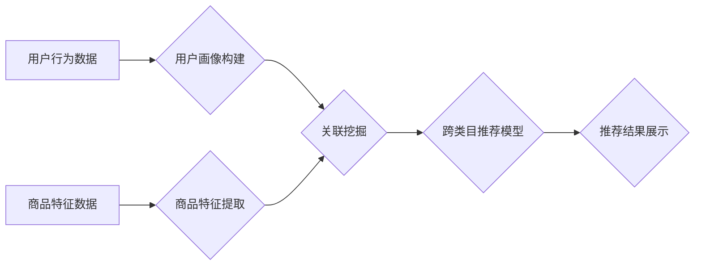

                 

## AI如何改善电商平台的跨类目推荐

> 关键词：跨类目推荐、电商平台、人工智能、协同过滤、深度学习、用户画像、推荐系统

## 1. 背景介绍

在当今数据爆炸的时代，电商平台面临着激烈的竞争。为用户提供个性化、精准的商品推荐是提升用户体验、提高转化率的关键。传统的推荐系统主要基于用户历史行为或商品属性进行单类目推荐，但这种方法难以捕捉用户潜在需求，且推荐结果缺乏多样性。跨类目推荐则旨在突破单类目限制，根据用户的兴趣偏好和购买历史，推荐跨越不同类别的商品，为用户提供更丰富的购物体验。

然而，跨类目推荐面临着诸多挑战：

* **数据稀疏性:** 用户跨类目购买行为数据相对稀疏，难以建立有效的推荐模型。
* **类别间关联性:** 不同类别的商品之间缺乏直接的语义关联，难以挖掘潜在的关联关系。
* **冷启动问题:** 新用户或新商品缺乏历史数据，难以进行有效的推荐。

## 2. 核心概念与联系

跨类目推荐的核心在于挖掘用户兴趣偏好和商品之间的潜在关联关系。

**2.1 核心概念**

* **用户画像:** 通过分析用户历史行为、偏好、属性等信息，构建用户画像，刻画用户的兴趣特征和购买模式。
* **商品特征:**  提取商品的属性信息、类别标签、描述文本等，构建商品特征向量，表示商品的本质属性。
* **关联挖掘:**  利用机器学习算法，挖掘用户行为和商品特征之间的关联关系，发现用户潜在的兴趣和商品之间的潜在联系。

**2.2 架构图**



## 3. 核心算法原理 & 具体操作步骤

### 3.1 算法原理概述

跨类目推荐算法主要分为以下几种类型：

* **基于内容的推荐:**  根据商品的属性特征和用户兴趣偏好进行推荐。
* **基于协同过滤的推荐:**  根据用户的历史购买行为和相似用户的购买行为进行推荐。
* **基于深度学习的推荐:**  利用深度神经网络，学习用户和商品之间的复杂关系，进行推荐。

### 3.2 算法步骤详解

以基于协同过滤的推荐算法为例，其具体操作步骤如下：

1. **数据预处理:**  收集用户行为数据，例如购买记录、浏览记录、评分记录等，并进行清洗、去重、格式转换等操作。
2. **用户-商品矩阵构建:**  将用户和商品映射到二维矩阵中，其中每个元素表示用户对商品的评分或购买行为。
3. **相似度计算:**  利用余弦相似度、皮尔逊相关系数等方法，计算用户之间的相似度和商品之间的相似度。
4. **推荐生成:**  根据用户的相似用户或商品的相似商品，生成推荐列表。

### 3.3 算法优缺点

**优点:**

* 能够捕捉用户隐性偏好，推荐更精准的商品。
* 不需要商品特征信息，能够推荐跨类别商品。

**缺点:**

* 数据稀疏性问题，难以建立有效的推荐模型。
* 冷启动问题，新用户或新商品难以进行推荐。

### 3.4 算法应用领域

基于协同过滤的推荐算法广泛应用于电商平台、视频网站、音乐平台等领域，用于个性化推荐商品、视频、音乐等内容。

## 4. 数学模型和公式 & 详细讲解 & 举例说明

### 4.1 数学模型构建

基于协同过滤的推荐算法的核心是用户-商品矩阵，其数学模型可以表示为：

$$
R = \begin{bmatrix}
r_{11} & r_{12} & \cdots & r_{1m} \\
r_{21} & r_{22} & \cdots & r_{2m} \\
\vdots & \vdots & \ddots & \vdots \\
r_{n1} & r_{n2} & \cdots & r_{nm}
\end{bmatrix}
$$

其中：

* $R$ 为用户-商品矩阵，$n$ 为用户数量，$m$ 为商品数量。
* $r_{ij}$ 表示用户 $i$ 对商品 $j$ 的评分或购买行为。

### 4.2 公式推导过程

用户相似度计算公式：

$$
Sim(u_i, u_j) = \frac{\sum_{k=1}^{m} r_{ik} \cdot r_{jk}}{\sqrt{\sum_{k=1}^{m} r_{ik}^2} \cdot \sqrt{\sum_{k=1}^{m} r_{jk}^2}}
$$

商品相似度计算公式：

$$
Sim(i, j) = \frac{\sum_{u=1}^{n} r_{ui} \cdot r_{uj}}{\sqrt{\sum_{u=1}^{n} r_{ui}^2} \cdot \sqrt{\sum_{u=1}^{n} r_{uj}^2}}
$$

### 4.3 案例分析与讲解

假设有两个用户 $u_1$ 和 $u_2$，他们对商品 $p_1$ 和 $p_2$ 的评分分别为：

* $u_1$: $r_{11} = 5$, $r_{12} = 3$
* $u_2$: $r_{21} = 4$, $r_{22} = 2$

根据用户相似度计算公式，我们可以计算出 $u_1$ 和 $u_2$ 的相似度为：

$$
Sim(u_1, u_2) = \frac{5 \cdot 4 + 3 \cdot 2}{\sqrt{5^2 + 3^2} \cdot \sqrt{4^2 + 2^2}} = \frac{20 + 6}{\sqrt{34} \cdot \sqrt{20}} = \frac{26}{\sqrt{680}}
$$

## 5. 项目实践：代码实例和详细解释说明

### 5.1 开发环境搭建

* Python 3.x
* scikit-learn
* pandas
* numpy

### 5.2 源代码详细实现

```python
import pandas as pd
from sklearn.metrics.pairwise import cosine_similarity

# 加载用户-商品矩阵数据
data = pd.read_csv('user_item_matrix.csv')

# 计算用户相似度
user_similarity = cosine_similarity(data)

# 获取用户1的相似用户
user1_id = 1
similar_users = user_similarity[user1_id].argsort()[:-6:-1]  # 排序获取前5个相似用户

# 推荐商品
recommended_items = []
for user_id in similar_users:
    # 获取相似用户对商品的评分
    user_ratings = data.iloc[user_id]
    # 过滤用户1已经购买的商品
    rated_items = user_ratings[user_ratings != 0].index
    # 推荐用户1未购买的商品
    for item_id in data.columns:
        if item_id not in rated_items:
            recommended_items.append(item_id)

# 输出推荐结果
print(f'用户{user1_id}的推荐商品：{recommended_items}')
```

### 5.3 代码解读与分析

* 代码首先加载用户-商品矩阵数据。
* 然后使用 cosine_similarity 函数计算用户之间的相似度。
* 获取用户1的相似用户，并根据相似用户的评分推荐用户1未购买的商品。

### 5.4 运行结果展示

运行代码后，将输出用户1的推荐商品列表。

## 6. 实际应用场景

跨类目推荐在电商平台的实际应用场景非常广泛，例如：

* **个性化商品推荐:**  根据用户的兴趣偏好和购买历史，推荐跨类别商品，例如推荐喜欢运动鞋的用户购买运动服、运动耳机等。
* **关联商品推荐:**  根据用户购买的商品，推荐与之相关的商品，例如推荐购买手机的用户购买手机壳、充电器等。
* **新品推荐:**  推荐新上架的商品，帮助用户发现新产品。

### 6.4 未来应用展望

随着人工智能技术的不断发展，跨类目推荐将更加精准、个性化。未来，跨类目推荐将应用于更多领域，例如：

* **医疗保健:**  根据患者的病史和症状，推荐相关的医疗服务、药品等。
* **教育:**  根据学生的学习情况和兴趣，推荐相关的学习资源、课程等。
* **金融:**  根据用户的财务状况和风险偏好，推荐相关的理财产品、投资策略等。

## 7. 工具和资源推荐

### 7.1 学习资源推荐

* **书籍:**
    * 《推荐系统实践》
    * 《深度学习》
* **在线课程:**
    * Coursera: Recommender Systems
    * Udacity: Deep Learning Nanodegree

### 7.2 开发工具推荐

* **Python:**  Python 是机器学习和深度学习的常用编程语言。
* **scikit-learn:**  scikit-learn 是一个强大的机器学习库，提供各种推荐算法的实现。
* **TensorFlow/PyTorch:**  TensorFlow 和 PyTorch 是深度学习框架，可以用于构建更复杂的推荐模型。

### 7.3 相关论文推荐

* **Collaborative Filtering for Implicit Feedback Datasets**
* **Deep Learning for Recommender Systems**

## 8. 总结：未来发展趋势与挑战

### 8.1 研究成果总结

跨类目推荐算法取得了显著的进展，能够有效地挖掘用户兴趣偏好和商品之间的关联关系，为用户提供更精准、个性化的商品推荐。

### 8.2 未来发展趋势

* **多模态推荐:**  融合文本、图像、视频等多模态数据，构建更全面的用户画像和商品特征，提高推荐的准确性和多样性。
* **个性化推荐:**  利用用户行为、偏好、属性等信息，构建更个性化的推荐模型，为每个用户提供独一无二的推荐结果。
* **实时推荐:**  利用实时数据流，动态更新用户画像和商品特征，实现实时个性化推荐。

### 8.3 面临的挑战

* **数据稀疏性:**  跨类目推荐数据稀疏性问题仍然是一个挑战，需要探索新的算法和方法来解决。
* **冷启动问题:**  新用户和新商品难以进行推荐，需要开发新的冷启动策略。
* **解释性:**  深度学习模型的推荐结果难以解释，需要提高模型的透明度和可解释性。

### 8.4 研究展望

未来，跨类目推荐将朝着更精准、个性化、智能化的方向发展，为用户提供更丰富的购物体验。


## 9. 附录：常见问题与解答

**Q1: 跨类目推荐和单类目推荐有什么区别？**

**A1:** 单类目推荐只推荐同类商品，而跨类目推荐则可以推荐跨越不同类别的商品。

**Q2: 跨类目推荐算法有哪些？**

**A2:** 常见的跨类目推荐算法包括基于内容的推荐、基于协同过滤的推荐和基于深度学习的推荐。

**Q3: 如何解决跨类目推荐中的数据稀疏性问题？**

**A3:** 可以利用矩阵分解、协同过滤等方法进行数据填充，或者使用迁移学习等技术来解决数据稀疏性问题。


作者：禅与计算机程序设计艺术 / Zen and the Art of Computer Programming 
<end_of_turn>

