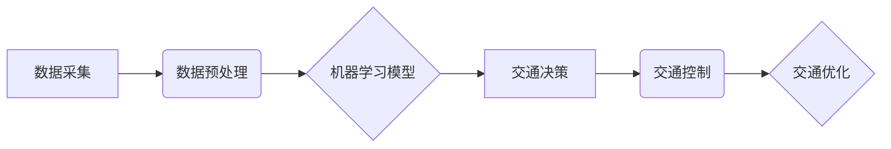

                 

## AI驱动的智能交通系统：优化城市流动

> 关键词：人工智能、智能交通、城市规划、交通流量优化、机器学习、深度学习、预测模型、交通管理

## 1. 背景介绍

随着全球人口的不断增长和城市化的加速，城市交通拥堵已成为一个日益严峻的全球性问题。传统的交通管理方式难以有效应对日益复杂的交通需求，导致交通效率低下、能源消耗增加、环境污染加剧等一系列负面影响。

人工智能（AI）技术的快速发展为解决城市交通拥堵问题提供了新的思路和解决方案。AI驱动的智能交通系统能够通过大数据分析、机器学习和深度学习等技术，对交通流量进行实时监测和预测，并根据预测结果优化交通信号灯控制、车辆导航、公共交通调度等方面，从而提高交通效率、减少拥堵和提升城市居民生活质量。

## 2. 核心概念与联系

**2.1 核心概念**

* **智能交通系统 (ITS):** 利用信息技术和通信技术，对交通系统进行智能化管理和控制的系统。
* **人工智能 (AI):** 能够模拟人类智能行为的计算机系统，包括机器学习、深度学习、自然语言处理等技术。
* **大数据:** 海量、高速度、高多样性的数据集合。
* **机器学习 (ML):** 算法能够从数据中学习并改进自身性能的机器学习技术。
* **深度学习 (DL):** 基于多层神经网络的机器学习技术，能够学习更复杂的模式和特征。

**2.2 架构关系**



**2.3 核心联系**

AI驱动的智能交通系统将数据采集、数据预处理、机器学习模型训练、交通决策、交通控制和交通优化等环节紧密结合，形成一个闭环系统。

* **数据采集:** 通过传感器、摄像头、GPS等设备采集交通流量、道路状况、天气信息等数据。
* **数据预处理:** 对采集到的原始数据进行清洗、转换、格式化等处理，使其能够被机器学习模型使用。
* **机器学习模型训练:** 利用机器学习算法对预处理后的数据进行训练，建立预测交通流量、识别交通拥堵等模型。
* **交通决策:** 根据机器学习模型的预测结果，制定相应的交通决策，例如调整交通信号灯时间、引导车辆行驶路线等。
* **交通控制:** 通过交通信号灯、电子显示屏、导航系统等设备，执行交通决策，控制交通流量。
* **交通优化:** 通过持续监测和分析交通状况，不断优化交通决策和控制策略，提高交通效率和安全性。

## 3. 核心算法原理 & 具体操作步骤

**3.1 算法原理概述**

AI驱动的智能交通系统中，常用的核心算法包括：

* **预测模型:** 用于预测未来交通流量、拥堵情况等，例如ARIMA、LSTM、Prophet等。
* **路径规划算法:** 用于规划车辆行驶路线，例如Dijkstra算法、A*算法等。
* **交通信号灯控制算法:** 用于优化交通信号灯时间，例如最短等待时间算法、协调算法等。

**3.2 算法步骤详解**

以预测交通流量为例，详细说明算法步骤：

1. **数据采集:** 收集历史交通流量数据、天气数据、时间数据等。
2. **数据预处理:** 清洗、转换、格式化数据，例如处理缺失值、归一化数据等。
3. **模型选择:** 选择合适的预测模型，例如ARIMA、LSTM等。
4. **模型训练:** 利用历史数据训练模型，调整模型参数，使其能够准确预测未来交通流量。
5. **模型评估:** 使用测试数据评估模型性能，例如计算均方误差、R^2等指标。
6. **模型部署:** 将训练好的模型部署到实际系统中，用于实时预测交通流量。

**3.3 算法优缺点**

* **优点:** 能够准确预测未来交通流量，提高交通效率，减少拥堵。
* **缺点:** 需要大量历史数据进行训练，模型训练时间较长，对数据质量要求较高。

**3.4 算法应用领域**

* 交通流量预测
* 交通拥堵预警
* 交通信号灯控制
* 车辆导航
* 公共交通调度

## 4. 数学模型和公式 & 详细讲解 & 举例说明

**4.1 数学模型构建**

交通流量预测模型通常采用时间序列模型，例如ARIMA模型。ARIMA模型假设时间序列数据具有自回归（AR）、移动平均（MA）和季节性（I）特性。

**4.2 公式推导过程**

ARIMA模型的数学表达式如下：

$$
y_t = c + \phi_1 y_{t-1} + \phi_2 y_{t-2} + ... + \phi_p y_{t-p} + \theta_1 \epsilon_{t-1} + \theta_2 \epsilon_{t-2} + ... + \theta_q \epsilon_{t-q} + \epsilon_t
$$

其中：

* $y_t$ 表示时间t的交通流量
* $c$ 表示截距项
* $\phi_i$ 表示自回归系数
* $y_{t-i}$ 表示时间t-i的交通流量
* $\theta_j$ 表示移动平均系数
* $\epsilon_{t-j}$ 表示时间t-j的随机误差项
* $p$ 表示自回归阶数
* $q$ 表示移动平均阶数

**4.3 案例分析与讲解**

假设我们想要预测某条道路的交通流量，可以使用ARIMA模型进行预测。首先，我们需要收集该道路的历史交通流量数据，然后根据数据特征选择合适的ARIMA模型参数（p, q）。最后，利用训练好的模型对未来时间段的交通流量进行预测。

## 5. 项目实践：代码实例和详细解释说明

**5.1 开发环境搭建**

* Python 3.x
* TensorFlow/PyTorch
* NumPy
* Pandas

**5.2 源代码详细实现**

```python
import pandas as pd
from sklearn.model_selection import train_test_split
from tensorflow.keras.models import Sequential
from tensorflow.keras.layers import LSTM, Dense

# 加载数据
data = pd.read_csv('traffic_data.csv')

# 数据预处理
# ...

# 划分训练集和测试集
X_train, X_test, y_train, y_test = train_test_split(data[['traffic_volume']], data[['traffic_volume']], test_size=0.2)

# 建立LSTM模型
model = Sequential()
model.add(LSTM(units=50, return_sequences=True, input_shape=(X_train.shape[1], 1)))
model.add(LSTM(units=50))
model.add(Dense(1))

# 编译模型
model.compile(loss='mean_squared_error', optimizer='adam')

# 训练模型
model.fit(X_train, y_train, epochs=100, batch_size=32)

# 评估模型
loss = model.evaluate(X_test, y_test)
print('Loss:', loss)

# 预测未来交通流量
# ...
```

**5.3 代码解读与分析**

* 代码首先加载交通流量数据，并进行预处理，例如处理缺失值、归一化数据等。
* 然后，将数据划分成训练集和测试集。
* 建立LSTM模型，并使用Adam优化器和均方误差损失函数进行训练。
* 训练完成后，使用测试集评估模型性能。
* 最后，可以使用训练好的模型预测未来交通流量。

**5.4 运行结果展示**

运行结果包括模型训练过程中的损失值以及模型在测试集上的预测精度。

## 6. 实际应用场景

**6.1 交通信号灯控制**

AI驱动的智能交通系统可以根据实时交通流量数据，动态调整交通信号灯的绿灯时间，从而优化交通流量，减少拥堵。

**6.2 车辆导航**

AI驱动的智能交通系统可以根据实时交通状况，为车辆提供最优的导航路线，避免拥堵路段，提高出行效率。

**6.3 公共交通调度**

AI驱动的智能交通系统可以根据乘客需求和实时交通状况，优化公交车、地铁等公共交通的运行路线和时间，提高公共交通的效率和服务质量。

**6.4 未来应用展望**

* **自动驾驶:** AI驱动的智能交通系统是自动驾驶技术的关键基础，可以帮助自动驾驶车辆安全、高效地行驶。
* **智慧城市:** AI驱动的智能交通系统是智慧城市建设的重要组成部分，可以帮助城市更好地管理交通资源，提高城市生活质量。
* **可持续发展:** AI驱动的智能交通系统可以帮助减少交通拥堵和碳排放，促进可持续发展。

## 7. 工具和资源推荐

**7.1 学习资源推荐**

* **书籍:**
    * 《深度学习》
    * 《机器学习实战》
    * 《智能交通系统》
* **在线课程:**
    * Coursera: 深度学习
    * edX: 机器学习
    * Udacity: 自动驾驶

**7.2 开发工具推荐**

* **Python:** 
* **TensorFlow/PyTorch:** 深度学习框架
* **NumPy/Pandas:** 数据处理库
* **Matplotlib/Seaborn:** 数据可视化库

**7.3 相关论文推荐**

* **交通流量预测:**
    * "A Deep Learning Approach for Traffic Flow Prediction"
    * "Traffic Flow Prediction Using LSTM Networks"
* **交通信号灯控制:**
    * "Adaptive Traffic Signal Control Using Deep Reinforcement Learning"
    * "Intelligent Traffic Signal Control with Machine Learning"

## 8. 总结：未来发展趋势与挑战

**8.1 研究成果总结**

AI驱动的智能交通系统取得了显著的成果，例如交通流量预测精度提高、交通拥堵缓解、出行效率提升等。

**8.2 未来发展趋势**

* **更精准的预测模型:** 利用更先进的机器学习算法和更丰富的交通数据，提高交通流量预测的精度和可靠性。
* **更智能的交通控制:** 利用AI技术，实现更智能的交通信号灯控制、车辆导航和公共交通调度，进一步优化交通流量。
* **更安全的交通环境:** 利用AI技术，识别交通违规行为、预防交通事故，提高交通安全。

**8.3 面临的挑战**

* **数据质量:** AI模型的性能依赖于数据质量，需要收集和处理高质量的交通数据。
* **模型解释性:** 许多AI模型是黑盒模型，难以解释其决策过程，需要提高模型的解释性。
* **隐私保护:** AI驱动的智能交通系统需要处理大量个人数据，需要加强隐私保护措施。

**8.4 研究展望**

未来，AI驱动的智能交通系统将朝着更智能、更安全、更可持续的方向发展，为城市交通管理提供更有效的解决方案。


## 9. 附录：常见问题与解答

**9.1 如何选择合适的AI模型？**

选择合适的AI模型需要根据具体应用场景和数据特征进行选择。例如，对于短期交通流量预测，ARIMA模型可能是一个不错的选择；而对于长期交通流量预测，LSTM模型可能更合适。

**9.2 如何处理交通数据中的缺失值？**

常用的处理缺失值的方法包括：删除缺失值、插值法、KNN填充等。

**9.3 如何评估AI模型的性能？**

常用的评估指标包括均方误差、R^2、平均绝对误差等。

**9.4 AI驱动的智能交通系统有哪些伦理问题？**

AI驱动的智能交通系统可能会带来一些伦理问题，例如数据隐私、算法偏见、责任归属等。需要在开发和应用过程中充分考虑这些问题，并制定相应的伦理规范和法律法规。


作者：禅与计算机程序设计艺术 / Zen and the Art of Computer Programming 
<end_of_turn>

