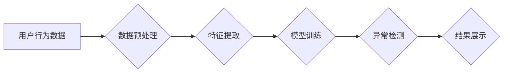

                 

## AI驱动的电商平台用户行为异常检测

> 关键词：电商平台、用户行为分析、异常检测、机器学习、深度学习、推荐系统、数据挖掘

## 1. 背景介绍

随着电商平台的蓬勃发展，用户数据量呈指数级增长。这些数据蕴藏着丰富的用户行为信息，为平台运营、产品推荐、风险控制等方面提供了宝贵的洞察。然而，用户行为数据也存在着异常情况，例如恶意刷单、虚假交易、账号盗用等，这些异常行为会对平台的正常运营造成严重损害。因此，如何有效地识别和处理用户行为异常问题，成为电商平台亟待解决的关键挑战。

传统的方法主要依赖于规则引擎，通过预先定义的规则来识别异常行为。然而，规则引擎难以应对复杂多变的用户行为模式，且需要不断更新和维护，成本较高。随着机器学习和深度学习技术的快速发展，AI驱动的异常检测方法逐渐成为主流，能够更灵活地学习用户行为模式，并识别出传统规则引擎难以发现的异常行为。

## 2. 核心概念与联系

### 2.1 用户行为分析

用户行为分析是指通过收集、分析用户在电商平台上的各种行为数据，例如浏览记录、购买历史、评价信息、评论内容等，以了解用户的兴趣、偏好、购买习惯等，并从中挖掘潜在的商业价值。

### 2.2 异常检测

异常检测是指识别出与正常行为模式显著不同的数据点，这些数据点可能代表着异常事件或潜在风险。异常检测在电商平台应用广泛，例如：

* **欺诈检测:** 识别恶意刷单、虚假交易、账号盗用等欺诈行为。
* **风险控制:** 识别高风险用户，例如频繁退货、恶意投诉的用户，并采取相应的风险控制措施。
* **用户体验优化:** 识别用户行为异常，例如长时间卡顿、页面跳出等，并进行优化，提升用户体验。

### 2.3 AI驱动的异常检测

AI驱动的异常检测利用机器学习和深度学习算法，从海量用户行为数据中学习正常行为模式，并识别出与正常模式显著不同的异常行为。

**Mermaid 流程图**



## 3. 核心算法原理 & 具体操作步骤

### 3.1 算法原理概述

常见的AI驱动的异常检测算法包括：

* **基于统计的异常检测算法:** 
    * 均值差分法：计算数据点与均值的差值，如果差值超过一定阈值，则判定为异常。
    * 标准差法：计算数据点与均值的标准差，如果标准差超过一定阈值，则判定为异常。
    * Z-score法：计算数据点与均值的标准化分数，如果分数超过一定阈值，则判定为异常。
* **基于机器学习的异常检测算法:**
    * K-近邻算法：根据数据点与最近K个邻居的距离，判断数据点是否为异常。
    * 支持向量机算法：通过寻找最佳超平面，将正常数据点和异常数据点分开。
    * 决策树算法：通过构建决策树模型，判断数据点是否为异常。
* **基于深度学习的异常检测算法:**
    * 自编码器：通过学习数据特征，将数据压缩编码，然后解码还原，如果解码结果与原始数据差异较大，则判定为异常。
    * 循环神经网络：能够学习时间序列数据中的模式，识别出异常行为。
    * 异常检测GAN：利用生成对抗网络，生成正常数据样本，并与真实数据样本进行比较，识别出异常数据样本。

### 3.2 算法步骤详解

以基于机器学习的K-近邻算法为例，详细说明其步骤：

1. **数据预处理:** 对用户行为数据进行清洗、转换、归一化等处理，使其适合模型训练。
2. **特征提取:** 从用户行为数据中提取特征，例如浏览时长、购买频率、商品类别等，这些特征能够反映用户的行为模式。
3. **模型训练:** 使用K-近邻算法训练模型，将用户行为数据作为训练样本，学习正常行为模式。
4. **异常检测:** 将新的用户行为数据输入到训练好的模型中，根据数据点与最近K个邻居的距离，判断数据点是否为异常。
5. **结果展示:** 将检测出的异常数据点进行标记，并可视化展示，方便人工进行复核和处理。

### 3.3 算法优缺点

**K-近邻算法**

* **优点:** 算法简单易懂，易于实现，无需进行复杂的模型训练。
* **缺点:** 对于高维数据，计算复杂度较高，容易受到噪声数据的影响。

### 3.4 算法应用领域

K-近邻算法广泛应用于各种领域，例如：

* **金融领域:** 识别欺诈交易、信用风险评估。
* **医疗领域:** 诊断疾病、预测患者风险。
* **电商领域:** 识别恶意刷单、虚假交易、用户行为异常。

## 4. 数学模型和公式 & 详细讲解 & 举例说明

### 4.1 数学模型构建

K-近邻算法的核心思想是基于距离度量，将数据点与最近的K个邻居进行比较，判断数据点是否为异常。

**距离度量:**

常用的距离度量方法包括欧氏距离、曼哈顿距离、余弦相似度等。

**欧氏距离:**

$$
d(x,y) = \sqrt{\sum_{i=1}^{n}(x_i - y_i)^2}
$$

其中，$x$和$y$是两个数据点，$x_i$和$y_i$是数据点在第i个特征上的值，$n$是特征数。

**举例说明:**

假设有两个数据点，$x = (1,2)$和$y = (3,4)$，则其欧氏距离为：

$$
d(x,y) = \sqrt{(1-3)^2 + (2-4)^2} = \sqrt{4 + 4} = 2\sqrt{2}
$$

### 4.2 公式推导过程

K-近邻算法的异常检测过程可以概括为以下步骤：

1. 计算新数据点与所有训练数据点的距离。
2. 根据距离排序，选取最近的K个邻居。
3. 统计最近K个邻居的类别，如果新数据点的类别与多数邻居类别不同，则判定为异常。

### 4.3 案例分析与讲解

假设我们有一个电商平台的用户行为数据，其中包含用户浏览记录、购买历史、评价信息等。我们想利用K-近邻算法识别恶意刷单用户。

1. **数据预处理:** 对用户行为数据进行清洗、转换、归一化等处理。
2. **特征提取:** 从用户行为数据中提取特征，例如浏览时长、购买频率、商品类别等。
3. **模型训练:** 使用K-近邻算法训练模型，将用户行为数据作为训练样本，学习正常用户行为模式。
4. **异常检测:** 将新的用户行为数据输入到训练好的模型中，根据数据点与最近K个邻居的距离，判断数据点是否为异常。
5. **结果展示:** 将检测出的异常数据点进行标记，并可视化展示，方便人工进行复核和处理。

## 5. 项目实践：代码实例和详细解释说明

### 5.1 开发环境搭建

* Python 3.x
* scikit-learn 库
* pandas 库
* matplotlib 库

### 5.2 源代码详细实现

```python
import pandas as pd
from sklearn.neighbors import KNeighborsClassifier
from sklearn.model_selection import train_test_split
from sklearn.metrics import accuracy_score

# 加载用户行为数据
data = pd.read_csv('user_behavior_data.csv')

# 特征选择
features = ['浏览时长', '购买频率', '商品类别']
target = '是否刷单'

# 数据分割
X_train, X_test, y_train, y_test = train_test_split(data[features], data[target], test_size=0.2, random_state=42)

# K近邻模型训练
knn = KNeighborsClassifier(n_neighbors=5)
knn.fit(X_train, y_train)

# 模型预测
y_pred = knn.predict(X_test)

# 模型评估
accuracy = accuracy_score(y_test, y_pred)
print('模型准确率:', accuracy)

# 异常检测
new_data = pd.DataFrame({'浏览时长': [10], '购买频率': [100], '商品类别': ['电子产品']})
prediction = knn.predict(new_data)
if prediction[0] == 1:
    print('该用户可能为刷单用户')
else:
    print('该用户可能不是刷单用户')
```

### 5.3 代码解读与分析

* **数据加载和预处理:** 使用pandas库加载用户行为数据，并选择需要使用的特征和目标变量。
* **数据分割:** 使用train_test_split函数将数据分割成训练集和测试集，用于模型训练和评估。
* **模型训练:** 使用KNeighborsClassifier类创建K近邻模型，并使用fit函数对模型进行训练。
* **模型预测:** 使用predict函数对测试数据进行预测，并计算模型的准确率。
* **异常检测:** 使用训练好的模型对新的用户行为数据进行预测，判断是否为异常行为。

### 5.4 运行结果展示

运行代码后，会输出模型的准确率以及对新数据的预测结果。

## 6. 实际应用场景

### 6.1 欺诈检测

电商平台经常面临着恶意刷单、虚假交易等欺诈行为，AI驱动的异常检测可以有效识别这些欺诈行为，保护平台利益。

### 6.2 风险控制

AI驱动的异常检测可以识别高风险用户，例如频繁退货、恶意投诉的用户，并采取相应的风险控制措施，例如限制用户购买额度、提高审核标准等。

### 6.3 用户体验优化

AI驱动的异常检测可以识别用户行为异常，例如长时间卡顿、页面跳出等，并进行优化，提升用户体验。

### 6.4 未来应用展望

随着人工智能技术的不断发展，AI驱动的异常检测将在电商平台的应用场景中得到更广泛的应用，例如：

* **个性化推荐:** 通过识别用户的异常行为模式，更精准地推荐用户感兴趣的商品。
* **智能客服:** 利用异常检测识别用户遇到的问题，并提供更有效的解决方案。
* **供应链管理:** 通过识别异常物流行为，提高供应链的效率和安全性。

## 7. 工具和资源推荐

### 7.1 学习资源推荐

* **书籍:**
    * 《机器学习》 - 周志华
    * 《深度学习》 - Ian Goodfellow
* **在线课程:**
    * Coursera: Machine Learning
    * edX: Deep Learning
* **博客和网站:**
    * Towards Data Science
    * Machine Learning Mastery

### 7.2 开发工具推荐

* **Python:** 
    * scikit-learn
    * TensorFlow
    * PyTorch
* **数据可视化工具:**
    * matplotlib
    * seaborn

### 7.3 相关论文推荐

* **Anomaly Detection in E-commerce Transactions Using Machine Learning**
* **Deep Learning for Anomaly Detection in Time Series Data**
* **A Survey on Anomaly Detection Techniques**

## 8. 总结：未来发展趋势与挑战

### 8.1 研究成果总结

AI驱动的异常检测在电商平台的应用取得了显著成果，能够有效识别各种异常行为，提升平台运营效率和安全性。

### 8.2 未来发展趋势

* **模型的复杂度和性能将不断提升:** 随着深度学习技术的进步，模型将能够学习更复杂的异常行为模式，提高检测精度。
* **异常检测将更加个性化和智能化:** 模型将能够根据用户的行为特征和上下文信息，提供更精准的异常检测结果。
* **异常检测将与其他技术融合:** 例如，异常检测将与推荐系统、智能客服等技术融合，提供更全面的解决方案。

### 8.3 面临的挑战

* **数据质量问题:** 异常检测模型的性能依赖于数据质量，数据不完整、不准确、不平衡等问题会影响模型的准确性。
* **算法解释性问题:** 许多深度学习模型的决策过程难以解释，这使得异常检测结果难以被理解和信任。
* **隐私保护问题:** 异常检测需要处理大量用户行为数据，如何保护用户隐私是一个重要的挑战。

### 8.4 研究展望

未来，AI驱动的异常检测将在以下方面继续深入研究：

* **开发更鲁棒、更解释性的异常检测算法。**
* **探索新的数据源和特征，提高异常检测的准确性。**
* **研究异常检测与隐私保护的平衡点。**


## 9. 附录：常见问题与解答

**Q1: 如何选择合适的K值？**

A1: K值的选择会影响模型的性能，可以使用交叉验证等方法进行调参，选择最优的K值。

**Q2: 如何处理异常数据？**

A2: 异常数据可以进行删除、替换、降维等处理，具体方法需要根据实际情况进行选择。

**Q3: 如何评估异常检测模型的性能？**

A3: 常用的评估指标包括准确率、召回率、F1-score等。

**作者：禅与计算机程序设计艺术 / Zen and the Art of Computer Programming**<end_of_turn>

