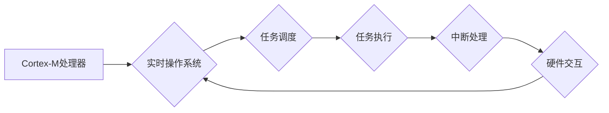

                 

## ARM Cortex-M系列：嵌入式实时系统开发

> 关键词：ARM Cortex-M, 嵌入式系统, 实时操作系统, MCU,  C/C++,  RTOS,  中断处理,  定时器

## 1. 背景介绍

嵌入式系统是现代社会不可或缺的一部分，它广泛应用于消费电子、工业控制、医疗设备、汽车电子等领域。随着技术的不断发展，对嵌入式系统的性能、功耗和可靠性要求越来越高。ARM Cortex-M系列处理器凭借其高性能、低功耗、丰富的 peripherals 和成熟的生态系统，成为嵌入式系统开发的首选之一。

ARM Cortex-M系列处理器由ARM公司设计，专为嵌入式应用而优化。它采用RISC指令集架构，具有32位宽的指令集和寄存器，支持多种内存访问模式，并提供丰富的 peripherals，例如定时器、ADC、DAC、UART、SPI、I2C等。

Cortex-M系列处理器分为多个型号，例如Cortex-M0、Cortex-M3、Cortex-M4、Cortex-M7等，每个型号的性能、功耗和功能有所不同。开发者可以根据项目的具体需求选择合适的型号。

## 2. 核心概念与联系

### 2.1  ARM Cortex-M架构

ARM Cortex-M架构是一种32位RISC处理器架构，其核心特点包括：

* **流水线结构:**  指令执行采用流水线机制，提高指令执行效率。
* **分级缓存:**  采用分级缓存结构，减少内存访问时间。
* **中断处理:**  支持多种中断类型，并提供高效的中断处理机制。
* **异常处理:**  提供异常处理机制，用于处理硬件故障和软件错误。
* **内存管理:**  支持多种内存管理模式，例如内存映射和分页。

### 2.2  嵌入式实时系统

嵌入式实时系统是指在特定硬件平台上运行的实时操作系统，其核心特点包括：

* **实时性:**  系统能够在规定时间内完成任务，满足实时性要求。
* **可靠性:**  系统能够在各种环境下稳定运行，保证任务的可靠执行。
* **资源约束:**  系统通常运行在资源有限的硬件平台上，需要高效地利用资源。

### 2.3  Cortex-M与实时系统的联系

ARM Cortex-M系列处理器为嵌入式实时系统开发提供了强大的硬件基础。其高效的指令集架构、丰富的 peripherals 和强大的中断处理机制，使得它能够满足实时系统的需求。

**Mermaid 流程图:**



## 3. 核心算法原理 & 具体操作步骤

### 3.1  算法原理概述

在嵌入式实时系统中，任务调度算法是核心算法之一，其目的是将多个任务分配到处理器上，并保证任务的实时性。常见的任务调度算法包括：

* **优先级调度:**  根据任务的优先级，优先执行优先级高的任务。
* **轮转调度:**  轮流执行每个任务，每个任务获得固定的执行时间。
* **时间片调度:**  每个任务获得固定的执行时间片，时间片结束后，调度器切换到下一个任务。

### 3.2  算法步骤详解

以优先级调度算法为例，其具体操作步骤如下：

1. **任务创建:**  系统管理员创建任务，并为每个任务分配优先级。
2. **任务入队:**  任务进入任务队列，队列按照优先级排序。
3. **调度器运行:**  调度器不断检查任务队列，选择优先级最高的待执行任务。
4. **任务执行:**  调度器将选中的任务分配给处理器执行。
5. **任务完成:**  任务执行完成后，调度器将任务从队列中移除。

### 3.3  算法优缺点

**优先级调度算法的优点:**

* **实时性强:**  优先级高的任务能够及时得到执行，满足实时性要求。
* **灵活度高:**  可以根据任务的优先级动态调整任务的执行顺序。

**优先级调度算法的缺点:**

* **容易出现饥饿现象:**  如果某个任务的优先级始终高于其他任务，则其他任务可能永远无法得到执行。
* **调度复杂度高:**  需要维护任务队列并进行优先级比较，调度复杂度较高。

### 3.4  算法应用领域

优先级调度算法广泛应用于各种嵌入式实时系统，例如：

* **工业控制系统:**  控制工业设备的运行，需要保证任务的实时性。
* **医疗设备:**  例如心电图仪、呼吸机等，需要实时监测患者的生理数据。
* **汽车电子:**  例如ABS、ESP等安全系统，需要实时响应驾驶员的操作。

## 4. 数学模型和公式 & 详细讲解 & 举例说明

### 4.1  数学模型构建

在嵌入式实时系统中，任务的执行时间和响应时间是关键指标。我们可以用数学模型来描述任务的执行时间和响应时间。

假设一个任务的执行时间为 $T_e$，响应时间为 $R_t$，则有以下公式：

$$R_t = T_e + D_t$$

其中 $D_t$ 为任务的延迟时间，即任务从提交到开始执行的时间。

### 4.2  公式推导过程

我们可以推导公式 $R_t$ 的含义：

* $T_e$ 代表任务执行所需的时间，它取决于任务的复杂度和处理器性能。
* $D_t$ 代表任务的延迟时间，它取决于任务的优先级、调度算法和系统负载等因素。

因此，任务的响应时间 $R_t$ 是任务执行时间 $T_e$ 和延迟时间 $D_t$ 的总和。

### 4.3  案例分析与讲解

例如，一个实时任务需要在 10 毫秒内完成执行，其执行时间为 5 毫秒，则其延迟时间 $D_t$ 不应超过 5 毫秒。

如果系统负载较高，导致任务的延迟时间超过 5 毫秒，则任务的响应时间将超过 10 毫秒，无法满足实时性要求。

## 5. 项目实践：代码实例和详细解释说明

### 5.1  开发环境搭建

为了开发嵌入式实时系统，需要搭建相应的开发环境。常见的开发环境包括：

* **IDE:**  集成开发环境，例如Keil MDK、IAR Embedded Workbench、STM32CubeIDE等。
* **交叉编译器:**  用于将C/C++代码编译成目标平台可执行文件。
* **调试器:**  用于调试嵌入式程序。

### 5.2  源代码详细实现

以下是一个简单的嵌入式实时系统代码示例，使用STM32F103C8T6芯片和FreeRTOS操作系统：

```c
#include "FreeRTOS.h"
#include "task.h"

void Task1(void *pvParameters) {
  while (1) {
    // 执行任务1的逻辑
    vTaskDelay(1000 / portTICK_PERIOD_MS);
  }
}

void Task2(void *pvParameters) {
  while (1) {
    // 执行任务2的逻辑
    vTaskDelay(500 / portTICK_PERIOD_MS);
  }
}

int main(void) {
  // 初始化FreeRTOS
  vTaskStartScheduler();

  // 永远不会到达这里
  while (1);
}
```

### 5.3  代码解读与分析

* `FreeRTOS.h` 和 `task.h` 是FreeRTOS操作系统的头文件。
* `Task1` 和 `Task2` 是两个任务函数，分别执行不同的逻辑。
* `vTaskDelay()` 函数用于暂停任务执行一段时间。
* `main()` 函数初始化FreeRTOS并启动任务调度器。

### 5.4  运行结果展示

运行该代码后，两个任务将同时执行，并轮流执行。

## 6. 实际应用场景

### 6.1  工业自动化

在工业自动化领域，嵌入式实时系统广泛应用于控制设备、监测环境和收集数据。例如，在生产线上，嵌入式实时系统可以控制机器人的运动、监测产品的质量和记录生产数据。

### 6.2  医疗设备

医疗设备也需要实时性高的嵌入式系统，例如心电图仪、呼吸机、手术机器人等。这些设备需要实时监测患者的生理数据，并根据数据做出相应的控制。

### 6.3  汽车电子

汽车电子系统也越来越依赖嵌入式实时系统，例如ABS、ESP、自动驾驶等功能都需要实时响应驾驶员的操作和车辆状态。

### 6.4  未来应用展望

随着技术的不断发展，嵌入式实时系统将应用于更多领域，例如：

* **物联网:**  嵌入式实时系统是物联网设备的核心，用于连接设备、收集数据和控制设备。
* **人工智能:**  嵌入式实时系统可以为人工智能算法提供实时数据处理和控制能力。
* **虚拟现实:**  嵌入式实时系统可以为虚拟现实设备提供实时渲染和交互体验。

## 7. 工具和资源推荐

### 7.1  学习资源推荐

* **ARM官方网站:**  https://www.arm.com/
* **FreeRTOS官方网站:**  https://www.freertos.org/
* **Keil MDK官方网站:**  https://www.keil.com/
* **IAR Embedded Workbench官方网站:**  https://www.iar.com/
* **STM32官方网站:**  https://www.st.com/en/microcontrollers/stm32.html

### 7.2  开发工具推荐

* **Keil MDK:**  一款功能强大的嵌入式开发环境，支持多种ARM处理器。
* **IAR Embedded Workbench:**  另一款成熟的嵌入式开发环境，提供丰富的调试工具。
* **STM32CubeIDE:**  ST公司提供的免费嵌入式开发环境，专门针对STM32芯片开发。

### 7.3  相关论文推荐

* **Real-Time Scheduling Algorithms for Embedded Systems**
* **FreeRTOS: A Real-Time Operating System for Microcontrollers**
* **ARM Cortex-M Processors: A Comprehensive Guide**

## 8. 总结：未来发展趋势与挑战

### 8.1  研究成果总结

ARM Cortex-M系列处理器为嵌入式实时系统开发提供了强大的硬件基础，并结合成熟的实时操作系统和开发工具，使得嵌入式系统开发更加便捷高效。

### 8.2  未来发展趋势

未来，嵌入式实时系统将朝着以下方向发展：

* **更高性能:**  处理器性能将继续提升，支持更复杂的算法和应用。
* **更低功耗:**  功耗将进一步降低，延长设备的续航时间。
* **更智能化:**  嵌入式系统将更加智能化，能够进行数据分析和决策。
* **更安全:**  嵌入式系统将更加安全可靠，能够抵御各种安全威胁。

### 8.3  面临的挑战

嵌入式实时系统开发也面临着一些挑战：

* **资源约束:**  嵌入式系统通常运行在资源有限的硬件平台上，需要高效地利用资源。
* **实时性要求:**  实时系统需要保证任务在规定时间内完成执行，需要设计高效的调度算法和实时操作系统。
* **安全性和可靠性:**  嵌入式系统需要保证安全性和可靠性，防止硬件故障和软件错误。

### 8.4  研究展望

未来，研究者将继续探索新的算法、架构和技术，以解决嵌入式实时系统开发面临的挑战，并推动嵌入式系统的进一步发展。

## 9. 附录：常见问题与解答

### 9.1  常见问题

* **什么是实时操作系统？**

实时操作系统是一种能够在规定时间内完成任务的操作系统，其核心特点包括实时性、可靠性和资源约束。

* **什么是任务调度算法？**

任务调度算法是嵌入式实时系统中的核心算法之一，其目的是将多个任务分配到处理器上，并保证任务的实时性。

* **ARM Cortex-M系列处理器有哪些特点？**

ARM Cortex-M系列处理器是专为嵌入式应用而优化的32位RISC处理器，其特点包括高效的指令集架构、丰富的 peripherals 和强大的中断处理机制。

* **如何选择合适的ARM Cortex-M处理器型号？**

选择合适的ARM Cortex-M处理器型号需要根据项目的具体需求，例如性能、功耗、内存大小和 peripherals 等。

* **如何搭建嵌入式实时系统开发环境？**

搭建嵌入式实时系统开发环境需要准备IDE、交叉编译器和调试器等工具。

### 9.2  解答

* **什么是实时操作系统？**

实时操作系统是一种能够在规定时间内完成任务的操作系统，其核心特点包括实时性、可靠性和资源约束。

* **什么是任务调度算法？**

任务调度算法是嵌入式实时系统中的核心算法之一，其目的是将多个任务分配到处理器上，并保证任务的实时性。

* **ARM Cortex-M系列处理器有哪些特点？**

ARM Cortex-M系列处理器是专为嵌入式应用而优化的32位RISC处理器，其特点包括高效的指令集架构、丰富的 peripherals 和强大的中断处理机制。

* **如何选择合适的ARM Cortex-M处理器型号？**

选择合适的ARM Cortex-M处理器型号需要根据项目的具体需求，例如性能、功耗、内存大小和 peripherals 等。

* **如何搭建嵌入式实时系统开发环境？**

搭建嵌入式实时系统开发环境需要准备IDE、交叉编译器和调试器等工具。


作者：禅与计算机程序设计艺术 / Zen and the Art of Computer Programming 
<end_of_turn>

