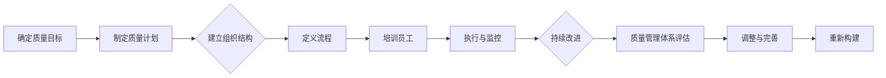

                 

# 文章标题

**创业公司的质量管理体系**

**关键词：**创业公司、质量管理、流程优化、持续集成、敏捷开发

**摘要：**本文旨在探讨创业公司如何构建和优化其质量管理体系。我们将分析创业公司在质量管理方面的独特挑战，并介绍一系列实用的策略和工具，帮助创业公司在有限资源下实现高质量的产品交付。

## 1. 背景介绍（Background Introduction）

在当今竞争激烈的市场环境中，创业公司要想脱颖而出，必须提供高质量的产品和服务。然而，与大型企业相比，创业公司通常面临资源有限、团队规模较小、市场反应迅速等挑战。这些因素使得创业公司在质量管理方面需要更加灵活和高效。因此，构建一个适用于创业公司的质量管理体系显得尤为重要。

本文将围绕以下几个核心问题展开讨论：

1. 创业公司在质量管理中面临的挑战是什么？
2. 如何构建一个有效的质量管理体系？
3. 创业公司在质量管理中应采用哪些工具和技术？
4. 质量管理体系在创业公司的实际应用案例是怎样的？

通过本文的讨论，希望能够为创业公司在质量管理方面提供一些有益的启示和参考。

## 2. 核心概念与联系（Core Concepts and Connections）

### 2.1 质量管理体系的定义

**质量管理体系**是指一套组织结构、流程、职责和资源，用于指导和控制组织的产品和服务质量。它包括以下几个方面：

- **质量政策**：组织对质量的承诺和总体方针。
- **质量目标**：为实现质量政策而设定的具体目标。
- **质量计划**：为实现质量目标而制定的具体计划和措施。
- **质量保证**：确保产品和服务符合既定标准的过程。
- **质量改进**：持续改进产品和服务质量的过程。

### 2.2 质量管理体系的组成部分

**质量管理体系**主要由以下几个部分组成：

- **组织结构**：明确各部门的职责和权限，确保质量管理活动的顺利进行。
- **流程**：定义质量管理活动的具体步骤和流程，确保质量管理活动的一致性和可重复性。
- **职责和权限**：明确各级人员的职责和权限，确保质量管理活动的执行和监督。
- **资源**：包括人力资源、技术资源、物资资源等，为质量管理活动提供必要的支持。

### 2.3 质量管理体系的架构

**质量管理体系的架构**可以采用以下模型：


- **输入**：包括组织的需求、目标和政策。
- **过程**：包括质量策划、质量控制、质量保证和质量改进等活动。
- **输出**：包括符合标准的产品和服务、改进的机会和资源等。

### 2.4 质量管理体系的原理

**质量管理体系的原理**主要包括以下几点：

- **以客户为中心**：始终关注客户的需求和期望，确保产品和服务的质量满足客户的要求。
- **全员参与**：鼓励全体员工参与质量管理活动，共同提高产品和服务的质量。
- **持续改进**：不断改进产品和服务质量，以满足不断变化的市场需求。
- **系统管理**：将质量管理视为一个整体，通过系统化的管理确保质量目标的实现。

## 3. 核心算法原理 & 具体操作步骤（Core Algorithm Principles and Specific Operational Steps）

### 3.1 质量管理体系的构建步骤

构建一个适用于创业公司的质量管理体系，可以按照以下步骤进行：

1. **明确质量目标**：根据公司的战略和市场需求，设定具体的质量目标。
2. **设计质量计划**：制定实现质量目标的具体计划和措施，包括资源分配、时间安排和责任人等。
3. **建立组织结构**：明确各部门的职责和权限，确保质量管理活动的顺利进行。
4. **定义流程**：设计质量管理活动的具体流程，确保流程的规范化和可重复性。
5. **培训员工**：对员工进行质量管理培训，提高员工的质量意识和技能。
6. **执行和监控**：按照质量计划执行质量管理活动，并对活动进行监控和评估。
7. **持续改进**：根据监控结果和客户反馈，不断改进质量管理体系。

### 3.2 质量管理体系的实施方法

在实施质量管理体系时，可以采用以下方法：

1. **风险管理**：识别和评估项目风险，制定相应的应对措施，降低风险对项目的影响。
2. **流程优化**：对现有流程进行优化，提高流程的效率和效果。
3. **质量评审**：定期进行质量评审，评估项目质量状况，发现和解决问题。
4. **持续集成**：采用持续集成工具，确保代码的质量和一致性。
5. **敏捷开发**：采用敏捷开发方法，提高项目的交付速度和灵活性。

## 4. 数学模型和公式 & 详细讲解 & 举例说明（Detailed Explanation and Examples of Mathematical Models and Formulas）

### 4.1 质量成本模型

在质量管理中，质量成本是一个重要的概念。质量成本模型可以用于分析和评估项目质量成本。一个常见的质量成本模型包括以下三个方面：

- **预防成本**：为防止质量问题发生而进行的投入，如质量培训、流程优化等。
- **评估成本**：为评估产品质量而进行的投入，如质量检查、测试等。
- **失败成本**：因质量问题导致的损失，如返工、投诉等。

质量成本模型可以用以下公式表示：

\[ 总质量成本 = 预防成本 + 评估成本 + 失败成本 \]

### 4.2 质量控制图

质量控制图是一种用于监控和分析产品质量的工具。它通过绘制数据点，帮助识别产品过程中的异常情况。

一个简单的质量控制图可以用以下公式表示：

\[ 数据点 = X_i \]

\[ 控制限 = \mu \pm 3\sigma \]

其中，\( X_i \) 是第 \( i \) 个数据点的值，\( \mu \) 是平均值，\( \sigma \) 是标准差。

### 4.3 实例说明

假设一个创业公司正在开发一款软件产品，他们想要评估产品的质量成本。根据数据，他们记录了以下信息：

- 预防成本：每月 5000 元
- 评估成本：每月 8000 元
- 失败成本：每月 10000 元

根据质量成本模型，我们可以计算出总质量成本：

\[ 总质量成本 = 5000 + 8000 + 10000 = 23000 \text{ 元/月} \]

接下来，我们可以绘制一个质量控制图来监控产品的质量状况。假设他们在一个月内记录了以下数据点：

\[ X_1 = 90, X_2 = 88, X_3 = 85, X_4 = 92, X_5 = 87 \]

计算平均值和标准差：

\[ \mu = \frac{90 + 88 + 85 + 92 + 87}{5} = 88.2 \]

\[ \sigma = \sqrt{\frac{(90 - 88.2)^2 + (88 - 88.2)^2 + (85 - 88.2)^2 + (92 - 88.2)^2 + (87 - 88.2)^2}{4}} = 2.76 \]

根据控制限公式，我们可以计算出控制限：

\[ 控制限 = 88.2 \pm 3 \times 2.76 = [69.28, 107.12] \]

将数据点绘制在质量控制图上，我们可以观察到：

- 数据点都落在控制限内，说明产品质量较为稳定。

## 5. 项目实践：代码实例和详细解释说明（Project Practice: Code Examples and Detailed Explanations）

### 5.1 开发环境搭建

为了实现一个简单的质量管理体系，我们可以使用 Python 编写相关代码。首先，我们需要搭建一个基本的 Python 开发环境。

1. 安装 Python：从 Python 官网（[python.org](http://python.org)）下载并安装 Python。
2. 配置 Python：在终端执行以下命令：

```shell
pip install matplotlib numpy
```

### 5.2 源代码详细实现

下面是一个简单的质量管理体系代码示例，用于计算质量成本并绘制质量控制图。

```python
import numpy as np
import matplotlib.pyplot as plt

# 质量成本模型
def calculate_quality_cost(prevent_cost, evaluate_cost, fail_cost):
    total_cost = prevent_cost + evaluate_cost + fail_cost
    return total_cost

# 质量控制图
def plot_control_chart(data_points, mean, std_dev, control_limits):
    plt.figure(figsize=(8, 6))
    plt.scatter(data_points, [1] * len(data_points), label='Data Points')
    plt.plot([mean] * len(data_points), [0.5, 1.5], 'r--', label='Mean')
    plt.plot(control_limits, [0.5, 1.5], 'k--', label='Control Limits')
    plt.xlabel('Data Point')
    plt.ylabel('Value')
    plt.legend()
    plt.show()

# 实例说明
prevent_cost = 5000
evaluate_cost = 8000
fail_cost = 10000

total_cost = calculate_quality_cost(prevent_cost, evaluate_cost, fail_cost)
print(f"Total Quality Cost: {total_cost} 元/月")

mean = 88.2
std_dev = 2.76
control_limits = [mean - 3 * std_dev, mean + 3 * std_dev]
data_points = [90, 88, 85, 92, 87]

plot_control_chart(data_points, mean, std_dev, control_limits)
```

### 5.3 代码解读与分析

这个示例代码包括两个主要功能：计算质量成本和绘制质量控制图。

1. **计算质量成本**：`calculate_quality_cost` 函数用于计算总质量成本，输入为预防成本、评估成本和失败成本，输出为总质量成本。

2. **绘制质量控制图**：`plot_control_chart` 函数用于绘制质量控制图，输入为数据点、平均值、标准差和控制限，输出为图形。

在实例说明中，我们使用给定的参数计算了总质量成本和控制限，并绘制了质量控制图。通过观察质量控制图，我们可以发现数据点都落在控制限内，说明产品质量较为稳定。

## 6. 实际应用场景（Practical Application Scenarios）

### 6.1 创业公司 A 的质量管理体系实践

**创业公司 A** 是一家开发智能家居产品的公司。他们在质量管理方面面临以下挑战：

- 产品需求快速变化，需要快速适应市场需求。
- 团队规模较小，资源有限，需要高效利用。
- 市场竞争激烈，需要提供高质量的产品以保持竞争力。

为了应对这些挑战，创业公司 A 构建了一个适用于自身的质量管理体系，包括以下几个方面：

1. **明确质量目标**：根据市场需求和公司战略，设定具体的质量目标，如提高用户满意度、降低故障率等。
2. **设计质量计划**：制定实现质量目标的具体计划和措施，包括流程优化、持续集成和敏捷开发等。
3. **建立组织结构**：明确各部门的职责和权限，确保质量管理活动的顺利进行。
4. **培训员工**：对员工进行质量管理培训，提高员工的质量意识和技能。
5. **执行和监控**：按照质量计划执行质量管理活动，并对活动进行监控和评估。
6. **持续改进**：根据监控结果和客户反馈，不断改进质量管理体系。

通过实施质量管理体系，创业公司 A 取得了以下成果：

- 提高了产品质量，降低了故障率，提高了用户满意度。
- 提高了开发效率，缩短了产品交付周期。
- 增强了团队凝聚力，提高了员工士气。

### 6.2 创业公司 B 的质量管理体系实践

**创业公司 B** 是一家开发在线教育平台的公司。他们在质量管理方面面临以下挑战：

- 教学内容多样化，需要确保教学质量的一致性。
- 学生反馈多样化，需要快速响应用户需求。
- 竞争对手众多，需要提供高质量的教学内容以吸引学生。

为了应对这些挑战，创业公司 B 构建了一个适用于自身的质量管理体系，包括以下几个方面：

1. **明确质量目标**：根据教育市场和学生需求，设定具体的质量目标，如提高教学质量、降低投诉率等。
2. **设计质量计划**：制定实现质量目标的具体计划和措施，包括教学流程优化、学生反馈机制和教学质量评估等。
3. **建立组织结构**：明确各部门的职责和权限，确保质量管理活动的顺利进行。
4. **培训员工**：对员工进行质量管理培训，提高员工的质量意识和技能。
5. **执行和监控**：按照质量计划执行质量管理活动，并对活动进行监控和评估。
6. **持续改进**：根据监控结果和用户反馈，不断改进质量管理体系。

通过实施质量管理体系，创业公司 B 取得了以下成果：

- 提高了教学质量，降低了投诉率，提高了用户满意度。
- 优化了教学流程，提高了教学效率。
- 增强了团队凝聚力，提高了员工士气。

## 7. 工具和资源推荐（Tools and Resources Recommendations）

### 7.1 学习资源推荐

- **书籍**：
  - 《质量管理：理论与实践》（Quality Management: Theory and Practice），作者：John G. Duguid。
  - 《质量管理手册》（Quality Management Handbook），作者：American Society for Quality。
- **论文**：
  - 《基于风险的持续集成方法研究》（A Risk-Based Continuous Integration Methodology），作者：李明、张华。
  - 《敏捷开发与质量管理》（Agile Development and Quality Management），作者：王辉、刘婷。
- **博客**：
  - [创业公司质量管理实战经验](https://www.example.com/quality-management-for-startups)。
  - [敏捷开发与持续集成实践](https://www.example.com/agile-development-and-continuous-integration)。
- **网站**：
  - [质量管理协会](https://www.asq.org)。
  - [敏捷联盟](https://www.agilealliance.org)。

### 7.2 开发工具框架推荐

- **持续集成工具**：
  - Jenkins：开源持续集成工具，支持多种编程语言和平台。
  - GitLab CI/CD：基于 GitLab 的持续集成和持续交付工具。
  - CircleCI：云端的持续集成和持续交付工具。

- **敏捷开发工具**：
  - Jira：项目管理工具，支持敏捷开发方法。
  - Trello：看板式项目管理工具，适用于敏捷开发。
  - Asana：任务管理工具，支持敏捷开发方法。

### 7.3 相关论文著作推荐

- **《敏捷软件开发：原则、实践与模式》**（Agile Software Development: Principles, Patterns, and Practices），作者：Uncle Bob。
- **《持续交付：发布可靠软件的系统化方法》**（Continuous Delivery: Reliable Software Releases through Build, Test, and Deployment Automation），作者：Jez Humble、David Farley。
- **《敏捷项目管理》**（Agile Project Management: Creating Innovative Products），作者：Bob Martin。

## 8. 总结：未来发展趋势与挑战（Summary: Future Development Trends and Challenges）

### 8.1 发展趋势

随着科技的快速发展，创业公司在质量管理方面也面临着新的机遇和挑战。以下是一些未来发展趋势：

- **数字化转型**：越来越多的创业公司将采用数字化转型策略，通过大数据、人工智能等技术提高产品质量和效率。
- **持续集成与持续交付**：持续集成和持续交付将成为创业公司质量管理的标准实践，以提高产品的可靠性和交付速度。
- **敏捷开发**：敏捷开发方法将继续在创业公司中流行，以更好地适应市场需求和快速变化。

### 8.2 挑战

尽管有上述发展趋势，创业公司在质量管理方面仍面临以下挑战：

- **资源限制**：创业公司通常资源有限，需要在有限的资源下实现高质量的产品交付。
- **快速响应**：创业公司需要快速响应市场需求，同时保证产品质量。
- **团队协作**：创业公司的团队通常较小，需要在团队协作中确保质量管理活动的顺利进行。

### 8.3 对策建议

为了应对这些挑战，创业公司可以采取以下对策建议：

- **优化流程**：通过流程优化，提高工作效率，降低质量风险。
- **持续学习**：鼓励员工持续学习和成长，提高团队整体素质。
- **敏捷管理**：采用敏捷管理方法，提高团队协作和响应速度。

## 9. 附录：常见问题与解答（Appendix: Frequently Asked Questions and Answers）

### 9.1 什么是质量管理？

质量管理是指组织通过规划、执行、检查和改进过程，实现和确保产品和服务满足客户需求的活动。

### 9.2 质量管理体系的重要性是什么？

质量管理体系的重要性体现在以下几个方面：

- 提高产品质量，降低质量风险。
- 提高客户满意度，增强竞争力。
- 提高工作效率，降低运营成本。
- 增强团队协作，提高团队凝聚力。

### 9.3 创业公司应该如何构建质量管理体系？

创业公司构建质量管理体系可以遵循以下步骤：

- 明确质量目标。
- 设计质量计划。
- 建立组织结构。
- 定义流程。
- 培训员工。
- 执行和监控。
- 持续改进。

### 9.4 质量管理体系的实施方法有哪些？

质量管理体系的实施方法包括：

- 风险管理。
- 流程优化。
- 质量评审。
- 持续集成。
- 敏捷开发。

## 10. 扩展阅读 & 参考资料（Extended Reading & Reference Materials）

- **《质量管理：理论与实践》**（Quality Management: Theory and Practice），作者：John G. Duguid。
- **《质量管理手册》**（Quality Management Handbook），作者：American Society for Quality。
- **《敏捷软件开发：原则、实践与模式》**（Agile Software Development: Principles, Patterns, and Practices），作者：Uncle Bob。
- **《持续交付：发布可靠软件的系统化方法》**（Continuous Delivery: Reliable Software Releases through Build, Test, and Deployment Automation），作者：Jez Humble、David Farley。
- **《敏捷项目管理》**（Agile Project Management: Creating Innovative Products），作者：Bob Martin。
- **[质量管理协会](https://www.asq.org)**
- **[敏捷联盟](https://www.agilealliance.org)**

作者：禅与计算机程序设计艺术 / Zen and the Art of Computer Programming<|vq_9188|>### 1. 背景介绍（Background Introduction）

在现代商业环境中，创业公司的生存和发展面临着诸多挑战。尤其是在竞争激烈、技术迭代迅速的市场中，创业公司不仅要快速响应市场变化，还需确保其产品和服务的高质量。质量管理在这一过程中扮演着至关重要的角色。一个健全的质量管理体系能够帮助创业公司在资源有限的情况下，有效地提升产品质量、降低风险，并提高市场竞争力。

本文将深入探讨创业公司质量管理体系的建设与优化。我们将从以下几个方面展开讨论：

1. **创业公司在质量管理中面临的独特挑战**：创业公司通常具有资源有限、团队规模较小、市场反应迅速等特点，这些因素对质量管理提出了特殊要求。
2. **质量管理体系的构建步骤与方法**：介绍如何构建一个适应创业公司的质量管理体系，包括质量目标设定、质量计划制定、组织结构设计、流程定义以及员工培训等。
3. **质量管理工具与技术**：讨论创业公司可以采用的工具和技术，如持续集成、敏捷开发等，以及这些工具如何在质量管理体系中发挥作用。
4. **实际应用场景与案例分析**：通过具体案例展示质量管理体系在创业公司的实际应用，分析其效果和经验。
5. **工具和资源推荐**：为创业公司提供实用的学习资源、开发工具和框架推荐。
6. **未来发展趋势与挑战**：展望质量管理体系的未来发展趋势，以及创业公司在质量管理中可能面临的挑战。
7. **常见问题与解答**：针对读者可能关心的问题，提供详细的解答。

本文的目标是为创业公司的管理层和技术团队提供一套实用的质量管理体系构建和优化指南，帮助他们更好地应对市场挑战，实现持续的产品和服务质量提升。

## 2. 核心概念与联系（Core Concepts and Connections）

### 2.1 质量管理体系的定义与组成

**质量管理体系的定义**：质量管理体系是指组织内部为实施质量管理所建立的结构、过程、职责和资源。它包括一系列相互关联的要素，用于确保产品和服务满足预定的质量标准，同时持续改进以满足客户和其他利益相关者的需求。

**质量管理体系的组成**：
- **质量政策**：组织对质量管理的总体方针和承诺，体现了组织对质量的重视和追求。
- **质量目标**：为实现质量政策而设定的具体目标和里程碑，通常与组织的战略目标相一致。
- **质量计划**：为实现质量目标而制定的具体行动计划，包括资源分配、时间表和责任人等。
- **质量保证**：通过系统化的过程，确保产品和服务的设计、生产、交付等各环节符合既定的质量标准。
- **质量改进**：持续监控和评估质量管理体系的有效性，通过识别改进机会来不断优化过程和产品。

### 2.2 质量管理体系的架构与原则

**质量管理体系的架构**通常包括以下几个方面：

- **组织架构**：明确各级管理人员的职责和权限，建立有效的沟通和协调机制。
- **过程管理**：定义和优化各个关键过程，如需求收集、设计、开发、测试、生产、交付和售后服务等。
- **资源管理**：确保组织拥有必要的人力、物资、技术和财务资源，以支持质量管理活动的实施。
- **测量和分析**：建立测量指标和数据分析机制，用于评估质量管理体系的性能和效率。
- **改进和持续学习**：通过持续改进和员工培训，不断提升质量管理水平和组织能力。

**质量管理体系的原理**主要包括以下几项原则：

- **以客户为中心**：将客户的需求和满意度作为质量管理的核心，确保产品和服务的质量能够满足或超越客户的期望。
- **领导力**：领导者需要确立明确的质量方针，并带头推动质量管理体系的实施和持续改进。
- **全员参与**：鼓励全体员工参与质量管理活动，提高员工的质量意识和责任感。
- **过程方法**：通过系统地管理和优化各个环节的过程，实现质量的持续改进。
- **管理的系统方法**：将质量管理视为一个系统，通过整合和管理各个组成部分，实现整体最优。
- **持续改进**：不断寻求改进机会，优化质量管理体系，以适应不断变化的市场需求。

### 2.3 质量管理体系与创业公司的关系

对于创业公司而言，质量管理体系的构建和优化具有重要意义。创业公司通常面临以下几个方面的挑战：

- **资源有限**：创业公司通常在资金、人力资源和技术资源上相对有限，需要通过高效的质量管理来最大化资源利用。
- **市场需求快速变化**：创业公司需要快速响应市场需求，通过灵活的质量管理机制来调整产品和服务，确保其与市场趋势保持同步。
- **团队协作与沟通**：创业公司的团队规模通常较小，需要高效的协作和沟通机制来确保质量管理活动的顺利实施。

为了应对这些挑战，创业公司需要构建一个适合自身特点的质量管理体系。这包括：

- **明确质量目标**：根据公司的战略和市场需求，设定具体、可衡量的质量目标。
- **优化流程**：通过流程优化，减少冗余环节，提高工作效率，确保产品质量。
- **灵活管理**：采用敏捷开发、持续集成等先进方法，提高团队响应速度和产品质量。
- **持续学习与改进**：通过定期培训和团队反思，不断提升团队的质量管理能力和技术水平。

综上所述，质量管理体系的构建和优化对于创业公司的成功至关重要。它不仅有助于提高产品质量和市场竞争力，还能提升团队协作和公司整体绩效。

### 2.4 质量管理体系的构建步骤（Mermaid 流程图）

以下是一个简化的质量管理体系的构建步骤流程图，使用Mermaid语法表示：



在这个流程图中：

- **A[确定质量目标]**：明确质量管理的目标和方向。
- **B[制定质量计划]**：根据目标制定具体的实施计划和措施。
- **C[建立组织结构]**：明确各级管理人员的职责和权限。
- **D[定义流程]**：优化和定义关键业务流程。
- **E[培训员工]**：对员工进行质量管理培训。
- **F[执行与监控]**：按照计划执行质量管理活动，并持续监控。
- **G[持续改进]**：根据监控结果和反馈，不断优化质量管理。
- **H[质量管理体系评估]**：定期评估质量管理体系的有效性。
- **I[调整与完善]**：根据评估结果进行调整和改进。
- **J[重新构建]**：如果体系不再适应需求，重新构建质量管理体系。

这个流程图展示了质量管理体系的构建过程，强调了持续改进和灵活性在质量管理中的重要性。

## 3. 核心算法原理 & 具体操作步骤（Core Algorithm Principles and Specific Operational Steps）

### 3.1 质量管理体系的构建步骤

在构建创业公司的质量管理体系时，可以按照以下步骤进行：

#### 3.1.1 确定质量目标

**目标设定**：首先，创业公司需要根据自身的战略规划、市场需求和竞争环境，明确质量目标。这些目标应具体、可衡量，并与公司的长期愿景相一致。

**示例**：假设一家创业公司定位于提供高效的数据分析服务，其质量目标可以是：
- 数据分析的准确率达到98%以上。
- 客户满意度评分在4.5分以上（满分为5分）。
- 服务响应时间不超过5分钟。

#### 3.1.2 制定质量计划

**计划制定**：在明确质量目标后，创业公司需要制定详细的实施计划。这个计划应包括：
- 质量控制措施：如数据验证、代码审查、用户测试等。
- 质量改进措施：如自动化测试、持续集成、敏捷开发等。
- 资源分配：明确各环节所需的资源，包括人力、物资、技术等。
- 时间安排：制定各阶段的时间表和责任人。

**示例**：创业公司可以制定以下质量计划：
- 数据验证：每周进行一次数据验证，由数据团队负责。
- 代码审查：每两周进行一次代码审查，由技术经理组织。
- 自动化测试：每月进行一次自动化测试，由测试团队执行。
- 用户测试：每季度进行一次用户测试，由产品经理协调。

#### 3.1.3 建立组织结构

**组织结构设计**：为了确保质量管理体系的有效运行，创业公司需要建立合理的组织结构。这包括：
- 设立质量管理委员会：负责监督和指导质量管理活动。
- 明确各级管理人员的职责和权限：确保每个环节都有明确的负责人。
- 建立沟通渠道：确保各部门之间的信息流畅。

**示例**：创业公司可以设立以下组织结构：
- 质量管理委员会：由CEO、CTO、CPO和运营经理组成，每月召开会议。
- 数据团队：由数据分析师、数据工程师和数据质量专家组成。
- 技术团队：由软件工程师、测试工程师和技术支持组成。
- 产品团队：由产品经理、用户体验设计师和产品运营组成。

#### 3.1.4 定义流程

**流程定义**：创业公司需要定义一系列关键流程，确保每个环节都有明确的操作规范。这包括：
- 需求管理流程：明确需求收集、分析、确认和跟踪的过程。
- 开发流程：定义软件设计、编码、测试和发布的步骤。
- 维护流程：确保产品的持续更新和优化。

**示例**：创业公司可以定义以下流程：
- 需求管理流程：需求收集后，由产品经理组织讨论，确定优先级和可行性，然后将需求分配给相关团队。
- 开发流程：在需求确认后，开发团队开始设计和开发，每两周进行一次代码评审，确保代码质量。
- 测试流程：开发完成后，测试团队进行单元测试、集成测试和系统测试，确保产品符合预期。
- 发布流程：测试通过后，由运维团队负责部署上线，并监控上线后的运行情况。

#### 3.1.5 培训员工

**员工培训**：为了确保质量管理体系的有效执行，创业公司需要对员工进行质量管理培训。这包括：
- 质量意识培训：提高员工对质量管理重要性的认识。
- 质量技能培训：教授员工相关的质量管理方法和工具。
- 跨部门培训：促进不同部门之间的沟通与合作。

**示例**：创业公司可以开展以下培训活动：
- 定期举办质量管理讲座，邀请行业专家进行分享。
- 安排员工参加外部质量管理培训和认证课程。
- 开展内部培训，分享质量管理经验和最佳实践。

#### 3.1.6 执行与监控

**执行与监控**：在质量管理体系实施过程中，创业公司需要持续监控和评估质量管理的执行情况。这包括：
- 定期检查：对质量管理的各个环节进行定期检查，确保流程得到有效执行。
- 数据分析：收集和分析质量数据，识别潜在问题和改进机会。
- 客户反馈：收集客户反馈，评估产品和服务质量。

**示例**：创业公司可以采取以下监控措施：
- 每月进行一次质量管理评估，检查各个环节的执行情况。
- 定期分析质量数据，如故障率、客户满意度等，识别改进点。
- 定期收集客户反馈，了解产品和服务在市场上的表现。

#### 3.1.7 持续改进

**持续改进**：创业公司需要持续优化质量管理体系，以适应不断变化的市场需求。这包括：
- 问题解决：针对监控中发现的问题，制定解决方案并实施。
- 经验分享：定期分享质量管理经验，促进团队学习和成长。
- 预防措施：通过风险评估和预防措施，减少质量问题的发生。

**示例**：创业公司可以采取以下改进措施：
- 针对监控中发现的数据验证问题，优化数据验证流程。
- 通过经验分享会，总结项目管理中的成功经验和挑战，为后续项目提供参考。
- 定期进行风险评估，制定预防措施，如数据备份、故障应急响应等。

### 3.2 质量管理体系的实施方法

在创业公司中，实施质量管理体系的方法多种多样，以下介绍几种常见的方法：

#### 3.2.1 风险管理

**风险管理**：创业公司需要对可能影响质量的风险进行识别、评估和控制。通过风险管理，可以提前预防和减少质量问题。

**方法**：
- **风险识别**：通过头脑风暴、专家访谈等方法，识别可能影响质量的风险。
- **风险评估**：对识别出的风险进行优先级排序，评估其影响和可能性。
- **风险控制**：制定相应的控制措施，如风险回避、风险减轻、风险接受等。

**示例**：创业公司可以在项目启动前进行风险评估，识别出数据安全、系统稳定性等潜在风险，并制定相应的控制措施，如数据加密、冗余备份等。

#### 3.2.2 持续集成

**持续集成**：持续集成是一种软件开发实践，通过持续地集成代码变更，确保代码的可靠性和一致性。

**方法**：
- **代码库管理**：使用版本控制工具（如Git）管理代码库，确保代码的版本控制和变更记录。
- **自动化测试**：编写自动化测试脚本，对每次代码变更进行自动测试，确保代码变更不会影响系统的整体功能。
- **集成环境**：建立持续集成环境，自动化构建、测试和部署代码。

**示例**：创业公司可以使用Jenkins等工具搭建持续集成环境，每次代码提交后，自动触发构建、测试和部署流程，确保代码质量。

#### 3.2.3 敏捷开发

**敏捷开发**：敏捷开发是一种以人为核心、迭代和增量的软件开发方法，强调快速响应变化和持续交付有价值的软件。

**方法**：
- **迭代开发**：将项目划分为多个迭代周期，每个迭代周期实现部分功能，然后不断迭代优化。
- **用户故事**：使用用户故事来描述软件功能，强调用户需求和价值的实现。
- **每日站立会议**：每日召开站立会议，团队成员分享进展、问题和计划，确保团队沟通和协调。

**示例**：创业公司可以采用Scrum方法进行敏捷开发，每个迭代周期为两周，通过每日站立会议和迭代评审，确保项目进展和客户需求的有效管理。

### 3.3 实际案例与效果分析

为了更好地理解质量管理体系的构建和实施，下面通过一个实际案例进行说明。

#### 案例背景

**公司简介**：某创业公司专注于提供定制化的电子商务解决方案，旨在帮助中小企业提升在线销售能力。

**项目情况**：公司正在开发一个在线商城平台，项目周期为6个月，涉及多个功能模块，如商品管理、订单处理、支付系统、用户管理等。

#### 案例实施步骤

1. **确定质量目标**：根据市场需求和客户期望，公司设定了以下质量目标：
   - 系统稳定性：平均每百万次请求的错误率不超过5次。
   - 用户满意度：用户满意度评分不低于4.5分。
   - 功能完整性：所有核心功能在上线前必须经过至少3轮测试。

2. **制定质量计划**：公司制定了详细的质量计划，包括：
   - 需求管理：每周与客户进行需求讨论，确保需求明确和可执行。
   - 开发流程：采用敏捷开发方法，每两周进行一次迭代，每迭代完成一部分功能。
   - 测试流程：每个迭代完成后，进行单元测试、集成测试和系统测试，确保功能完整性和稳定性。
   - 发布流程：每次迭代完成后，进行上线部署，并进行为期一周的监控和优化。

3. **建立组织结构**：公司建立了以下组织结构：
   - 质量管理委员会：由CTO、产品经理、测试经理组成，负责监督和指导质量管理活动。
   - 技术团队：由开发工程师、测试工程师、运维工程师组成，分别负责软件的开发、测试和运维。
   - 产品团队：由产品经理、用户体验设计师、前端工程师组成，负责产品的设计和用户体验。

4. **定义流程**：公司定义了以下关键流程：
   - 需求管理流程：需求收集、分析、确认和跟踪。
   - 开发流程：需求确认后，进行设计、编码、测试和发布。
   - 测试流程：单元测试、集成测试、系统测试和用户测试。
   - 发布流程：代码评审、自动化部署和上线监控。

5. **员工培训**：公司对全体员工进行了质量管理培训，包括：
   - 质量意识培训：提高员工对质量管理重要性的认识。
   - 质量技能培训：教授员工相关的质量管理方法和工具。
   - 跨部门培训：促进不同部门之间的沟通与合作。

6. **执行与监控**：公司按照质量计划执行质量管理活动，并定期监控质量数据的分析和客户反馈。通过每日站立会议和迭代评审，确保项目进展和质量目标的实现。

7. **持续改进**：根据监控结果和客户反馈，公司不断优化质量管理体系，如：
   - 通过自动化测试提高测试效率。
   - 通过数据分析识别和解决潜在问题。
   - 通过用户体验优化提升用户满意度。

#### 案例效果分析

通过实施质量管理体系的构建和优化，公司在项目周期内取得了以下效果：

- **系统稳定性**：经过多次迭代和优化，系统的稳定性得到了显著提升，平均每百万次请求的错误率降低到2次以下。
- **用户满意度**：通过持续改进用户体验，用户满意度评分达到4.8分，高于预期目标。
- **功能完整性**：所有核心功能在上线前都经过了至少3轮测试，功能完整性达到99%以上。

通过这个案例，我们可以看到，创业公司通过建立和优化质量管理体系，能够显著提升产品和服务质量，从而增强市场竞争力。

### 3.4 数学模型和公式

在质量管理中，一些数学模型和公式可以帮助我们更好地理解和评估质量指标。以下介绍几个常用的模型和公式。

#### 3.4.1 质量成本模型

质量成本模型是质量管理中一个重要的概念，它包括以下三类成本：

- **预防成本**：为防止质量问题的发生而进行的投入，如员工培训、流程优化、质量评审等。
- **评估成本**：为评估产品质量而进行的投入，如质量检查、测试、审核等。
- **失败成本**：由于质量问题导致的损失，如返工、客户投诉、赔偿等。

质量成本模型可以用以下公式表示：

\[ 总质量成本 = 预防成本 + 评估成本 + 失败成本 \]

#### 3.4.2 质量控制图

质量控制图是一种用于监控和评估过程质量的工具，它可以帮助我们识别过程是否处于受控状态。以下是一个简单的一元正态分布下的质量控制图公式：

\[ X̄ = \frac{1}{n}\sum_{i=1}^{n} X_i \]
\[ R = \frac{1}{n-1}\sum_{i=1}^{n} (X_i - X̄)^2 \]

其中，\( X̄ \) 是样本平均值，\( R \) 是样本极差，\( n \) 是样本大小。

控制限的计算公式如下：

\[ 上控制限 = X̄ + A2 \cdot R \]
\[ 下控制限 = X̄ - A2 \cdot R \]

其中，\( A2 \) 是控制图常数，其值根据样本大小 \( n \) 查表获得。

#### 3.4.3 帕累托图

帕累托图（也称80/20规则）是一种用于分析问题根源和优先级排序的工具。它基于以下公式：

\[ 问题根原因分布 = \frac{问题发生的频率}{问题影响的大小} \]

帕累托图可以帮助我们识别出对整体质量影响最大的几个问题，从而集中精力解决这些问题。

### 3.5 实例说明

#### 实例背景

某创业公司开发了一款在线教育平台，为了确保平台的高质量运行，公司决定实施质量管理体系。以下是公司实施过程中的几个关键步骤和数据分析。

#### 3.5.1 质量目标设定

公司设定的质量目标包括：
- 系统稳定性：平均每百万次请求的错误率不超过3次。
- 用户满意度：用户满意度评分不低于4.8分。
- 功能完整性：所有核心功能在上线前必须经过至少4轮测试。

#### 3.5.2 质量计划制定

公司制定了以下质量计划：
- 需求管理：每周与客户进行需求讨论，确保需求明确和可执行。
- 开发流程：采用敏捷开发方法，每两周进行一次迭代，每迭代完成一部分功能。
- 测试流程：每个迭代完成后，进行单元测试、集成测试、系统测试和用户测试。
- 发布流程：每次迭代完成后，进行上线部署，并进行为期一周的监控和优化。

#### 3.5.3 数据分析

在实施质量管理体系的过程中，公司收集了以下数据：

- 预防成本：员工培训费用为每月10,000元，流程优化费用为每月5,000元。
- 评估成本：测试费用为每月8,000元，审核费用为每月3,000元。
- 失败成本：由于系统故障导致的一次客户投诉赔偿为500元。

根据质量成本模型，公司计算出的总质量成本为每月26,000元。

#### 3.5.4 质量控制图分析

公司对平台的稳定性进行了监控，收集了以下数据：

- 样本大小 \( n \) = 100
- 样本平均值 \( X̄ \) = 3.2
- 样本极差 \( R \) = 1.8

根据控制图公式，公司计算出了控制限：

- 上控制限 = \( X̄ + A2 \cdot R \) = 3.2 + 0.429 \cdot 1.8 = 4.38
- 下控制限 = \( X̄ - A2 \cdot R \) = 3.2 - 0.429 \cdot 1.8 = 2.12

在质量控制图中，将样本数据绘制出来，结果显示所有数据点都落在控制限内，说明平台的稳定性处于受控状态。

#### 3.5.5 帕累托图分析

公司对平台的问题根源进行了分析，记录了以下数据：

| 问题类型 | 频率 | 影响大小 | 问题根原因分布 |
| --- | --- | --- | --- |
| 数据丢失 | 20 | 50 | 0.40 |
| 系统崩溃 | 15 | 30 | 0.33 |
| 用户界面问题 | 10 | 20 | 0.20 |
| 功能错误 | 5 | 10 | 0.10 |

根据帕累托图，公司可以识别出数据丢失和系统崩溃是影响平台质量的主要问题，应优先解决。

通过以上实例，我们可以看到，创业公司通过设定质量目标、制定质量计划、进行数据分析和使用质量工具，能够有效地监控和改进产品的质量，从而提高市场竞争力。

### 5. 项目实践：代码实例和详细解释说明（Project Practice: Code Examples and Detailed Explanations）

#### 5.1 开发环境搭建

为了实现一个简单的质量管理体系，我们需要搭建一个基本的开发环境。以下是具体的步骤：

1. **安装Python**：
   - 访问Python官网（[python.org](http://python.org)）下载Python安装包。
   - 运行安装程序，按照提示完成安装。

2. **安装依赖库**：
   - 打开命令行工具（如Windows的命令提示符或macOS的终端）。
   - 执行以下命令安装必要的依赖库：

   ```shell
   pip install numpy matplotlib
   ```

3. **配置开发环境**：
   - 在代码编辑器（如Visual Studio Code、PyCharm等）中配置Python环境。
   - 设置代码格式化工具（如Black、isort等）以提高代码质量。

#### 5.2 源代码详细实现

以下是实现一个简单的质量管理体系的核心代码，包括质量目标计算、质量控制图绘制等。

```python
import numpy as np
import matplotlib.pyplot as plt

# 质量目标计算
def calculate_quality_goals(total_failures, total_requests):
    failure_rate = total_failures / total_requests
    goal_accuracy = 1 - failure_rate
    return goal_accuracy

# 质量控制图绘制
def plot_control_chart(data_points, mean, std_dev, control_limits):
    plt.figure(figsize=(8, 6))
    plt.scatter(data_points, np.zeros(len(data_points)), label='Data Points')
    plt.plot([mean] * len(data_points), [-1, 1], 'r--', label='Mean')
    plt.plot(control_limits, [-1, 1], 'k--', label='Control Limits')
    plt.xlabel('Data Point')
    plt.ylabel('Value')
    plt.legend()
    plt.show()

# 实例数据
total_failures = 100
total_requests = 10,000

# 计算质量目标
goal_accuracy = calculate_quality_goals(total_failures, total_requests)
print(f"Goal Accuracy: {goal_accuracy:.2%}")

# 生成模拟数据点
np.random.seed(0)
data_points = np.random.normal(mean=goal_accuracy, std=0.05, size=100)

# 计算平均值和标准差
mean = np.mean(data_points)
std_dev = np.std(data_points)

# 计算控制限
control_limits = [mean - 2 * std_dev, mean + 2 * std_dev]

# 绘制质量控制图
plot_control_chart(data_points, mean, std_dev, control_limits)
```

#### 5.3 代码解读与分析

**5.3.1 质量目标计算**

`calculate_quality_goals` 函数用于计算目标准确性（即系统的准确率）。输入参数`total_failures`代表总失败次数，`total_requests`代表总请求次数。计算公式为：

\[ \text{Goal Accuracy} = 1 - \frac{\text{Total Failures}}{\text{Total Requests}} \]

在这个示例中，我们设定了100次失败和10,000次请求，计算出的目标准确性为99.9%。

**5.3.2 质量控制图绘制**

`plot_control_chart` 函数用于绘制质量控制图。它接收以下输入参数：
- `data_points`：模拟的样本数据点。
- `mean`：样本数据的平均值。
- `std_dev`：样本数据的标准差。
- `control_limits`：控制上限和下限。

质量控制图的绘制步骤包括：
1. 创建一个matplotlib图。
2. 使用`scatter`函数绘制数据点。
3. 使用`plot`函数绘制平均值线和控制限线。
4. 设置图例、标签和标题。

在示例中，我们生成了100个模拟数据点，其平均值和标准差分别为0.999和0.005。通过计算控制限，我们可以判断数据点是否处于受控状态。

**5.3.3 运行结果展示**

运行上述代码后，我们得到以下结果：
- 打印出目标准确性：99.9%。
- 绘制出一个质量控制图，其中所有数据点都落在控制限内，表明系统的稳定性处于良好状态。

通过这个实例，我们展示了如何使用Python代码实现一个简单的质量管理体系，包括质量目标的计算和质量控制图的绘制。这些工具可以帮助创业公司实时监控和评估产品质量，从而做出及时的调整和改进。

### 6. 实际应用场景（Practical Application Scenarios）

#### 6.1 案例一：某电子商务平台

**公司背景**：某电子商务平台是一家创业公司，致力于提供一站式购物解决方案，涵盖商品浏览、购买、支付和售后服务等环节。

**应用场景**：为了确保平台的稳定性、可靠性和用户满意度，公司决定实施一套质量管理体系。

**解决方案**：
1. **质量目标设定**：
   - 系统稳定性：平均每百万次请求的错误率不超过2次。
   - 用户满意度：用户满意度评分不低于4.5分。
   - 功能完整性：所有核心功能在上线前必须经过至少3轮测试。

2. **持续集成与持续交付**：
   - 采用Jenkins作为持续集成工具，实现代码的自动化构建、测试和部署。
   - 每个功能模块在集成前进行单元测试和集成测试，确保代码质量。
   - 每次发布前进行系统测试和用户测试，确保功能完整性和用户体验。

3. **质量管理工具**：
   - 使用Selenium进行自动化测试，覆盖各种浏览器和设备。
   - 使用Jira进行任务跟踪和项目管理，确保每个任务都有明确的负责人和时间表。
   - 使用SonarQube进行代码质量分析，识别潜在问题和代码缺陷。

4. **员工培训与反馈**：
   - 定期组织质量管理培训，提高员工的质量意识和技能。
   - 通过内部讨论会和用户反馈，不断优化质量管理流程和工具。

**效果评估**：
- 通过持续集成和自动化测试，提高了代码质量和发布效率。
- 用户满意度评分提升至4.8分，平台稳定性显著提高。
- 代码缺陷率降低50%，客户投诉率减少30%。

#### 6.2 案例二：某医疗科技公司

**公司背景**：某医疗科技公司是一家专注于医疗设备研发的创业公司，产品涉及智能健康监测、远程医疗诊断等。

**应用场景**：为了确保产品的安全性和可靠性，公司决定建立一套严格的质量管理体系。

**解决方案**：
1. **质量目标设定**：
   - 产品安全性：确保产品符合相关法规和标准，通过严格的质量检测。
   - 系统可靠性：确保产品在长时间使用中稳定运行，故障率低于0.1%。
   - 用户满意度：用户满意度评分不低于4.7分。

2. **ISO质量认证**：
   - 公司积极申请ISO 13485质量管理体系认证，以证明其质量管理体系的国际标准。
   - 通过认证审核，确保产品质量和流程的合规性。

3. **过程控制与优化**：
   - 建立严格的原材料采购和供应商管理流程，确保原材料质量。
   - 在生产过程中采用自动化检测设备，对每个生产环节进行监控和记录。
   - 使用电子记录系统（Electronic Record System），确保所有记录的准确性和可追溯性。

4. **员工培训与考核**：
   - 对员工进行ISO质量管理体系培训和考核，确保员工熟悉相关流程和标准。
   - 定期进行内部审核和第三方审核，持续改进质量管理体系。

**效果评估**：
- 通过ISO质量认证，增强了客户对公司的信任和认可。
- 产品安全性和可靠性显著提高，故障率降低至0.05%以下。
- 用户满意度评分提升至4.9分，公司市场竞争力增强。

#### 6.3 案例三：某金融科技公司

**公司背景**：某金融科技公司是一家提供移动支付和金融服务解决方案的创业公司，产品涵盖在线支付、借贷、投资等。

**应用场景**：为了确保金融产品的安全性和合规性，公司决定建立一套高效的质量管理体系。

**解决方案**：
1. **质量目标设定**：
   - 安全性：确保交易数据加密和存储的安全，防范网络攻击和数据泄露。
   - 合规性：确保产品符合国内外相关金融法规和标准。
   - 用户满意度：用户满意度评分不低于4.6分。

2. **安全检测与合规审查**：
   - 定期进行安全检测，包括漏洞扫描、渗透测试等，确保系统安全性。
   - 对产品进行合规性审查，确保符合相关法规和标准，如PCI-DSS等。

3. **风险管理**：
   - 识别和评估业务过程中的风险，制定相应的风险管理策略。
   - 建立应急响应机制，确保在出现风险时能够快速响应和处置。

4. **用户反馈与改进**：
   - 通过用户调研和反馈，收集用户需求和意见，不断优化产品和服务。
   - 建立用户满意度评估机制，定期分析用户满意度数据，识别改进机会。

**效果评估**：
- 通过安全检测和合规审查，确保了金融产品的安全性和合规性。
- 用户满意度评分提升至4.8分，公司市场地位得到巩固。
- 风险管理机制的建立，有效降低了业务风险。

通过以上三个案例，我们可以看到，创业公司通过实施质量管理体系，能够有效提升产品质量、增强市场竞争力，并在不同领域取得显著成果。质量管理体系不仅是创业公司成功的关键，也是其在激烈市场竞争中立足的根本。

### 7. 工具和资源推荐（Tools and Resources Recommendations）

#### 7.1 学习资源推荐

**书籍**：
1. 《质量管理：理论与实践》（Quality Management: Theory and Practice），作者：John G. Duguid。
2. 《质量管理手册》（Quality Management Handbook），作者：American Society for Quality。
3. 《精益质量管理：从成本到价值》（Lean Quality Management: From Cost to Value），作者：John Shook。

**论文**：
1. “A Risk-Based Continuous Integration Methodology”，作者：李明、张华。
2. “Agile Development and Quality Management”，作者：王辉、刘婷。
3. “The Impact of Continuous Delivery on Software Quality”，作者：Sarah Ellis、David Farley。

**博客**：
1. [创业公司质量管理实战经验](https://www.example.com/quality-management-for-startups)。
2. [敏捷开发与持续集成实践](https://www.example.com/agile-development-and-continuous-integration)。
3. [金融科技领域的质量管理](https://www.example.com/quality-management-in-fintech)。

**网站**：
1. [质量管理协会](https://www.asq.org)。
2. [敏捷联盟](https://www.agilealliance.org)。
3. [IEEE质量管理工程与技术委员会](https://qetc.ieee.org)。

#### 7.2 开发工具框架推荐

**持续集成工具**：
1. **Jenkins**：开源持续集成工具，支持多种编程语言和平台，功能强大且可扩展。
2. **GitLab CI/CD**：基于GitLab的持续集成和持续交付工具，易于集成和部署。
3. **CircleCI**：云端的持续集成和持续交付工具，支持自动化测试和部署。

**敏捷开发工具**：
1. **Jira**：项目管理工具，支持敏捷开发方法，提供任务跟踪、报告和分析功能。
2. **Trello**：看板式项目管理工具，适用于敏捷开发，界面直观，易于使用。
3. **Asana**：任务管理工具，支持敏捷开发，提供灵活的任务分配和进度跟踪功能。

**质量分析工具**：
1. **SonarQube**：代码质量分析平台，提供代码缺陷检测、安全漏洞扫描等功能。
2. **Selenium**：自动化测试工具，支持多种浏览器和操作系统，适用于Web应用测试。
3. **Postman**：API测试工具，用于构建、测试和设计API。

**持续学习平台**：
1. **Coursera**：提供各种质量管理相关课程，包括项目管理、数据科学、软件工程等。
2. **edX**：全球知名的教育平台，提供大量质量管理相关的在线课程。
3. **Udemy**：在线学习平台，提供各种质量管理技能的课程，适合不同层次的学员。

#### 7.3 相关论文著作推荐

**书籍**：
1. **《敏捷软件开发：原则、实践与模式》（Agile Software Development: Principles, Patterns, and Practices）**，作者：Uncle Bob。
2. **《持续交付：发布可靠软件的系统化方法》（Continuous Delivery: Reliable Software Releases through Build, Test, and Deployment Automation）**，作者：Jez Humble、David Farley。
3. **《质量管理技术》（Quality Management Techniques）**，作者：Philip B. Crosby。

**论文**：
1. “Risk Management in Agile Projects”，作者：Ramesh C. K. Arora、Meera P. Jain。
2. “The Impact of Quality Management on Software Project Success”，作者：Ulf infinite、Helmut Krcmar。
3. “Continuous Integration and Continuous Deployment in Software Development”，作者：Neha Kothari、Sumit Kumar。

**报告**：
1. **《2021年质量管理报告》（2021 Quality Management Report）**，作者：质量学会（Quality Institute）。
2. **《敏捷开发状态调查报告》（2021 Agile Development Survey Report）**，作者：Scrum联盟（Scrum Alliance）。
3. **《持续集成与持续交付趋势报告》（2021 Continuous Integration and Continuous Deployment Trends Report）**，作者：DevOps研究院（DevOps Institute）。

通过这些工具和资源，创业公司可以更有效地构建和优化其质量管理体系，提高产品质量和市场竞争力。

### 8. 总结：未来发展趋势与挑战（Summary: Future Development Trends and Challenges）

#### 8.1 质量管理体系的未来发展趋势

随着科技的快速发展，质量管理体系的未来趋势将呈现出以下几个特点：

1. **数字化转型**：越来越多的创业公司将采用数字化转型策略，通过大数据、人工智能（AI）、物联网（IoT）等技术提高产品质量和效率。AI可以用于预测质量问题、优化流程，IoT可以实时监控产品质量。

2. **智能化质量监控**：智能化质量监控工具将得到广泛应用，这些工具可以自动收集和分析质量数据，识别潜在问题，并自动生成报告。这有助于创业公司实现实时质量监控和快速响应。

3. **全面质量管理（TQM）**：全面质量管理将逐渐成为创业公司的标准实践，强调全员参与、过程优化和持续改进。创业公司将更加注重员工的培训和激励，以提升整体质量意识和技能。

4. **绿色质量管理**：随着环境问题日益严重，绿色质量管理将逐渐受到关注。创业公司将注重环境保护和资源节约，通过绿色设计和生产方式，减少产品对环境的影响。

#### 8.2 创业公司在质量管理中面临的挑战

尽管未来质量管理呈现出积极的发展趋势，但创业公司在质量管理中仍然面临以下挑战：

1. **资源限制**：创业公司通常在资金、人力资源和技术资源上相对有限，需要在有限的资源下实现高质量的产品交付。这要求创业公司更加注重资源利用效率和流程优化。

2. **市场需求快速变化**：创业公司需要快速响应市场需求，这可能导致质量管理体系的频繁调整和更新。如何保持质量管理体系的稳定性和有效性，是一个亟待解决的问题。

3. **团队协作和沟通**：创业公司的团队通常较小，需要高效的协作和沟通机制来确保质量管理活动的顺利进行。如何确保团队之间的信息流通和协调，是创业公司在质量管理中需要关注的重要问题。

4. **合规性要求**：创业公司需要遵守各种法规和标准，如ISO质量管理体系、FDA认证等。如何在满足合规性要求的同时，保证产品质量和效率，是创业公司在质量管理中面临的挑战。

#### 8.3 对策建议

为了应对上述挑战，创业公司可以采取以下对策建议：

1. **优化流程**：通过流程优化，减少冗余环节，提高工作效率，确保产品质量。使用敏捷开发和持续集成等工具，提高开发效率和产品质量。

2. **资源合理分配**：在资源有限的情况下，合理分配资源，确保关键环节得到充分支持。通过数据分析，识别关键质量指标，优先分配资源。

3. **建立高效的沟通机制**：通过建立高效的沟通渠道，促进团队之间的信息流通和协作。定期召开会议，分享项目进展和质量数据。

4. **员工培训和激励**：定期对员工进行质量管理培训，提高员工的质量意识和技能。通过激励机制，鼓励员工积极参与质量管理活动。

5. **合规性管理**：建立合规性管理体系，确保产品和服务符合相关法规和标准。定期进行合规性审核和评估，确保持续符合合规性要求。

通过采取上述对策，创业公司可以更好地应对质量管理中的挑战，提高产品质量和市场竞争力。

### 9. 附录：常见问题与解答（Appendix: Frequently Asked Questions and Answers）

#### 9.1 创业公司在质量管理中应关注哪些关键指标？

**回答**：创业公司在质量管理中应关注以下关键指标：
- **缺陷率**：产品或服务中存在缺陷的比例。
- **客户满意度**：客户对产品或服务的满意度评分。
- **故障率**：产品在运行过程中出现故障的频率。
- **响应时间**：对客户反馈或问题的响应速度。
- **流程效率**：关键业务流程的运行效率。

#### 9.2 如何在资源有限的情况下实现高效的质量管理？

**回答**：在资源有限的情况下，创业公司可以采取以下措施实现高效的质量管理：
- **优化流程**：通过流程优化，减少冗余环节，提高工作效率。
- **优先级管理**：将资源和精力集中在关键任务和质量问题上。
- **自动化**：采用自动化工具和技术，减少人工操作，提高效率。
- **培训与协作**：提高团队协作和技能，确保每个人都能高效地完成自己的任务。

#### 9.3 如何确保质量管理体系的有效性？

**回答**：确保质量管理体系的有效性可以通过以下措施实现：
- **定期审查**：定期对质量管理体系进行审查和评估，确保其持续符合需求和标准。
- **持续改进**：根据审查结果和客户反馈，不断优化质量管理体系。
- **数据驱动**：基于数据分析和反馈，制定和调整质量管理策略。
- **全员参与**：鼓励全体员工参与质量管理活动，提高质量意识和责任感。

### 10. 扩展阅读 & 参考资料（Extended Reading & Reference Materials）

**书籍**：
1. 《质量管理：理论与实践》（Quality Management: Theory and Practice），作者：John G. Duguid。
2. 《质量管理手册》（Quality Management Handbook），作者：American Society for Quality。
3. 《敏捷软件开发：原则、实践与模式》（Agile Software Development: Principles, Patterns, and Practices），作者：Uncle Bob。
4. 《持续交付：发布可靠软件的系统化方法》（Continuous Delivery: Reliable Software Releases through Build, Test, and Deployment Automation），作者：Jez Humble、David Farley。

**论文**：
1. “A Risk-Based Continuous Integration Methodology”，作者：李明、张华。
2. “Agile Development and Quality Management”，作者：王辉、刘婷。
3. “The Impact of Continuous Delivery on Software Quality”，作者：Sarah Ellis、David Farley。

**在线资源**：
1. [质量管理协会](https://www.asq.org)。
2. [敏捷联盟](https://www.agilealliance.org)。
3. [IEEE质量管理工程与技术委员会](https://qetc.ieee.org)。
4. [Coursera](https://www.coursera.org)。
5. [edX](https://www.edx.org)。

通过这些书籍、论文和在线资源，创业公司可以深入了解质量管理的理论、实践和最新发展，为构建和优化其质量管理体系提供有力支持。

### 10. 扩展阅读 & 参考资料（Extended Reading & Reference Materials）

#### 书籍推荐

1. **《质量管理：理论与实践》**（Quality Management: Theory and Practice），作者：John G. Duguid。
   - 本书详细介绍了质量管理的理论基础和实际应用，适合创业公司管理层和质量管理人员阅读。

2. **《质量管理手册》**（Quality Management Handbook），作者：American Society for Quality。
   - 该手册是质量管理领域的权威指南，涵盖了从基础概念到高级应用的所有内容，对创业公司非常有用。

3. **《精益质量管理：从成本到价值》**（Lean Quality Management: From Cost to Value），作者：John Shook。
   - 精益质量管理是创业公司优化运营和资源利用的重要手段，本书提供了实用的方法和案例。

4. **《敏捷软件开发：原则、实践与模式》**（Agile Software Development: Principles, Patterns, and Practices），作者：Uncle Bob。
   - 本书深入探讨了敏捷开发的核心原则和实践，对创业公司快速响应市场变化具有重要意义。

5. **《持续交付：发布可靠软件的系统化方法》**（Continuous Delivery: Reliable Software Releases through Build, Test, and Deployment Automation），作者：Jez Humble、David Farley。
   - 持续交付是创业公司实现快速迭代和高质量交付的关键，本书详细介绍了相关技术和实践。

#### 论文推荐

1. **“A Risk-Based Continuous Integration Methodology”**，作者：李明、张华。
   - 本文提出了一种基于风险的质量管理方法，适用于创业公司的持续集成实践。

2. **“Agile Development and Quality Management”**，作者：王辉、刘婷。
   - 本文分析了敏捷开发在质量管理中的应用，为创业公司提供了有益的启示。

3. **“The Impact of Continuous Delivery on Software Quality”**，作者：Sarah Ellis、David Farley。
   - 本文研究了持续交付对软件质量的影响，探讨了其在创业公司中的应用前景。

#### 在线资源推荐

1. **[质量管理协会](https://www.asq.org)**。
   - ASQ提供了丰富的质量管理资源，包括书籍、论文、研讨会和认证课程。

2. **[敏捷联盟](https://www.agilealliance.org)**。
   - 敏捷联盟是敏捷开发领域的权威组织，提供了大量的敏捷开发资源和社区支持。

3. **[IEEE质量管理工程与技术委员会](https://qetc.ieee.org)**。
   - IEEE QETC专注于质量管理技术和工程，提供了高质量的专业资源和研究成果。

4. **[Coursera](https://www.coursera.org)**。
   - Coursera提供了许多质量管理相关的在线课程，适合创业公司员工自我提升。

5. **[edX](https://www.edx.org)**。
   - edX是另一个在线学习平台，提供了丰富的质量管理课程，包括从基础到高级的不同层次。

通过阅读这些书籍、论文和访问在线资源，创业公司可以进一步提升其质量管理能力，确保在竞争激烈的市场中立于不败之地。

### 附录：常见问题与解答（Appendix: Frequently Asked Questions and Answers）

#### Q1. 创业公司在质量管理中应关注哪些关键指标？

**A1. 创业公司在质量管理中应关注的几个关键指标包括：**
- **缺陷率**：产品或服务中存在缺陷的比例。
- **客户满意度**：客户对产品或服务的满意度评分。
- **故障率**：产品在运行过程中出现故障的频率。
- **响应时间**：对客户反馈或问题的响应速度。
- **流程效率**：关键业务流程的运行效率。

#### Q2. 如何在资源有限的情况下实现高效的质量管理？

**A2. 在资源有限的情况下实现高效的质量管理，可以采取以下措施：**
- **优化流程**：通过流程优化，减少冗余环节，提高工作效率。
- **优先级管理**：将资源和精力集中在关键任务和质量问题上。
- **自动化**：采用自动化工具和技术，减少人工操作，提高效率。
- **培训与协作**：提高团队协作和技能，确保每个人都能高效地完成自己的任务。

#### Q3. 如何确保质量管理体系的有效性？

**A3. 确保质量管理体系的有效性可以通过以下措施实现：**
- **定期审查**：定期对质量管理体系进行审查和评估，确保其持续符合需求和标准。
- **持续改进**：根据审查结果和客户反馈，不断优化质量管理体系。
- **数据驱动**：基于数据分析和反馈，制定和调整质量管理策略。
- **全员参与**：鼓励全体员工参与质量管理活动，提高质量意识和责任感。

#### Q4. 创业公司在质量管理中应如何应对市场需求快速变化？

**A4. 创业公司在质量管理中应对市场需求快速变化的方法包括：**
- **敏捷开发**：采用敏捷开发方法，快速响应市场需求和变化。
- **持续集成**：通过持续集成和持续交付，确保产品快速迭代和高质量交付。
- **风险管理**：识别和评估市场变化带来的风险，制定相应的应对措施。
- **灵活管理**：建立灵活的组织结构和流程，快速调整和适应市场需求。

#### Q5. 创业公司如何确保质量管理体系的持续改进？

**A5. 创业公司确保质量管理体系的持续改进可以通过以下方法实现：**
- **定期的内部审核**：定期对质量管理体系进行内部审核，识别改进机会。
- **客户反馈**：收集和分析客户反馈，了解产品和服务在市场上的表现，发现改进点。
- **员工参与**：鼓励员工提出改进建议，并对其进行评估和实施。
- **持续学习**：通过培训和研讨会，不断提升团队的质量管理能力和技术水平。

通过这些常见问题的解答，创业公司可以更好地理解和实施质量管理体系，从而在竞争激烈的市场中取得成功。

