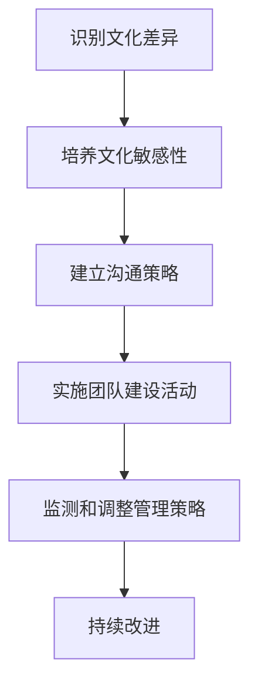

                 

### 文章标题

### The Management Strategies for Cross-Cultural Teams in Startups

> 关键词：Cross-Cultural Teams, Management, Startups, Diversity, Communication, Collaboration

> 摘要：本文将探讨创业公司在构建和管理跨文化团队时面临的主要挑战，并提供一系列实用的策略，以促进文化多样性、有效沟通和团队协作。我们将通过实际案例和研究成果，深入分析如何最大化跨文化团队的优势，同时减少潜在的冲突和误解。

## 1. 背景介绍

在全球化背景下，创业公司越来越多地依赖于跨文化团队来推动创新和业务扩展。跨文化团队不仅能够汇聚来自不同地区、背景和专业技能的成员，还能带来多元化的视角和思维方式。然而，跨文化团队的管理并非易事，文化差异、沟通障碍和协作问题往往成为团队高效运作的绊脚石。

本文将讨论以下几个关键问题：

1. 跨文化团队的优势和挑战
2. 跨文化团队管理中的关键概念
3. 构建和维持跨文化团队的策略
4. 案例分析和实践经验分享
5. 未来发展趋势和潜在挑战

通过上述探讨，我们希望能够为创业公司在跨文化团队管理方面提供一些有价值的指导和建议。

## 2. 核心概念与联系

### 2.1 跨文化团队的概念

跨文化团队是指由来自不同文化背景的成员组成的团队。这些文化背景可能包括不同的语言、宗教、习俗、价值观和工作习惯等。在创业公司中，跨文化团队的成员通常来自不同的国家、地区和行业，他们带来了各自的专业知识和经验，但也面临着文化差异带来的挑战。

### 2.2 跨文化团队的优势

跨文化团队的优势主要体现在以下几个方面：

1. **多元化的视角**：不同文化背景的成员能够提供多样化的观点和解决方案，有助于创新和决策的多样性。
2. **丰富的知识**：团队成员的专业背景和经验可以相互补充，提高团队的整体能力。
3. **灵活性和适应性**：跨文化团队更容易适应不同市场和客户需求，有助于企业的国际化发展。

### 2.3 跨文化团队的挑战

尽管跨文化团队具有诸多优势，但管理不当也会带来一系列挑战：

1. **文化冲突**：不同的价值观和习惯可能导致成员之间的误解和冲突。
2. **沟通障碍**：语言障碍和文化差异会影响信息的准确传递和理解。
3. **协作问题**：文化差异可能导致团队成员在任务分配、优先级和责任承担方面产生分歧。

### 2.4 跨文化团队管理的关键概念

为了有效地管理跨文化团队，创业公司需要关注以下几个关键概念：

1. **文化敏感性**：理解并尊重不同文化的价值观和习惯，避免文化偏见和误解。
2. **沟通策略**：采用多种沟通方式，确保信息在不同文化背景下得到有效传递。
3. **团队建设**：通过团队活动和培训，增强团队成员之间的信任和合作。

### 2.5 跨文化团队管理的 Mermaid 流程图



通过上述流程图，我们可以看到跨文化团队管理的关键环节和相互关系。有效的管理策略需要综合考虑这些因素，以实现团队的长期成功。

## 3. 核心算法原理 & 具体操作步骤

### 3.1 跨文化团队管理算法原理

跨文化团队管理算法的核心是基于对文化差异的理解和尊重。具体来说，该算法包括以下几个关键步骤：

1. **文化差异识别**：通过调查问卷、访谈和观察等方法，识别团队成员的文化背景和差异。
2. **文化敏感性培养**：通过培训和文化交流，提高团队成员对文化差异的敏感性，避免文化偏见和误解。
3. **沟通策略制定**：根据团队成员的文化特点，制定合适的沟通策略，确保信息在不同文化背景下得到有效传递。
4. **团队建设活动**：通过团队建设活动和培训，增强团队成员之间的信任和合作，提高团队的凝聚力。

### 3.2 跨文化团队管理具体操作步骤

1. **文化差异识别**：

   - **调查问卷**：设计一份针对团队成员文化背景的调查问卷，收集关于语言、宗教、习俗和价值观等方面的信息。
   - **访谈和观察**：与团队成员进行一对一访谈，了解他们的文化背景和工作习惯，观察团队互动中的潜在文化差异。

2. **文化敏感性培养**：

   - **培训**：组织文化敏感性培训，介绍不同文化的基本特点和价值观，提高团队成员的文化意识。
   - **文化交流**：鼓励团队成员分享自己的文化故事和经历，增进相互理解，减少文化误解。

3. **沟通策略制定**：

   - **语言选择**：在沟通中尽量使用团队成员的共同语言，或提供语言翻译服务，确保信息准确传递。
   - **文化适应**：在制定沟通策略时，考虑不同文化的沟通习惯和偏好，如直接表达与间接表达、高语境与低语境等。

4. **团队建设活动**：

   - **团队活动**：组织团队建设活动，如团队拓展训练、文化节日庆祝等，增强团队成员之间的互动和信任。
   - **培训**：定期组织跨文化团队培训，分享最佳实践和成功案例，提高团队成员的跨文化管理能力。

通过以上步骤，创业公司可以逐步建立起一套有效的跨文化团队管理策略，促进团队的多元化和协作。

## 4. 数学模型和公式 & 详细讲解 & 举例说明

### 4.1 跨文化团队管理数学模型

在跨文化团队管理中，我们可以使用一些数学模型来分析和评估团队的绩效和沟通效果。以下是一个简单的数学模型，用于评估跨文化团队中的沟通效果：

### 沟通效果评估模型

$$
E = f(C, L, T)
$$

其中：

- $E$：沟通效果（Effectiveness）
- $C$：文化适应性（Cultural Adaptability）
- $L$：语言能力（Language Competence）
- $T$：沟通技术（Technological Tools）

### 模型参数说明：

- **文化适应性（Cultural Adaptability）**：衡量团队成员对文化差异的敏感度和适应能力，取值范围为 0 到 1，值越大表示适应性越强。
- **语言能力（Language Competence）**：衡量团队成员的语言交流能力，包括母语水平和第二语言能力，取值范围为 0 到 1，值越大表示语言能力越强。
- **沟通技术（Technological Tools）**：衡量团队使用的沟通工具和技术水平，取值范围为 0 到 1，值越大表示沟通技术越先进。

### 模型公式解释：

该模型假设沟通效果（$E$）是文化适应性（$C$）、语言能力（$L$）和沟通技术（$T$）的函数。通过调整这三个参数，我们可以评估跨文化团队的沟通效果。具体来说：

- 如果 $C$、$L$ 和 $T$ 的值都较高，则 $E$ 的值也会较高，表示团队沟通效果较好。
- 如果 $C$、$L$ 或 $T$ 的值较低，则 $E$ 的值会受到影响，表示团队沟通存在一定问题。

### 举例说明：

假设一个跨文化团队中，文化适应性 $C = 0.8$，语言能力 $L = 0.9$，沟通技术 $T = 0.7$，则该团队的沟通效果 $E$ 可以计算为：

$$
E = f(0.8, 0.9, 0.7) = 0.8 \times 0.9 \times 0.7 = 0.504
$$

根据计算结果，该团队的沟通效果得分为 0.504，表示团队沟通效果一般，需要进一步改进。

### 模型应用：

通过这个模型，创业公司可以定期评估团队的沟通效果，发现潜在问题，并采取相应的措施进行改进。例如，如果发现文化适应性较低，公司可以加强文化敏感性培训；如果语言能力不足，可以提供语言学习资源；如果沟通技术落后，可以引入先进的沟通工具。

## 5. 项目实践：代码实例和详细解释说明

### 5.1 开发环境搭建

为了更好地理解和应用跨文化团队管理算法，我们将使用 Python 编程语言来构建一个简单的示例项目。以下是搭建开发环境所需的步骤：

1. **安装 Python**：确保系统已经安装了 Python 3.8 或更高版本。
2. **安装必要库**：使用以下命令安装必要的库：
   ```bash
   pip install numpy pandas matplotlib
   ```

### 5.2 源代码详细实现

以下是跨文化团队管理算法的实现代码：

```python
import numpy as np
import pandas as pd
import matplotlib.pyplot as plt

# 模型参数
C = 0.8  # 文化适应性
L = 0.9  # 语言能力
T = 0.7  # 沟通技术

# 模型公式
def communication_effectiveness(C, L, T):
    E = C * L * T
    return E

# 计算沟通效果
E = communication_effectiveness(C, L, T)

# 打印结果
print(f"沟通效果得分：{E:.3f}")

# 可视化沟通效果
plt.bar(['沟通效果'], [E], color='blue')
plt.xlabel('沟通效果')
plt.ylabel('得分')
plt.title('跨文化团队沟通效果评估')
plt.show()
```

### 5.3 代码解读与分析

1. **导入库**：首先，我们导入 Python 中常用的数学和数据处理库，如 `numpy`、`pandas` 和 `matplotlib`。
2. **定义模型参数**：我们定义了三个模型参数 `C`（文化适应性）、`L`（语言能力）和 `T`（沟通技术），并分别赋值为 0.8、0.9 和 0.7。
3. **定义模型公式**：我们定义了一个函数 `communication_effectiveness`，用于计算跨文化团队的沟通效果。该函数接受文化适应性、语言能力和沟通技术三个参数，并返回沟通效果得分。
4. **计算沟通效果**：通过调用 `communication_effectiveness` 函数，计算跨文化团队的沟通效果得分，并将其打印到控制台。
5. **可视化沟通效果**：使用 `matplotlib` 库，我们将沟通效果得分以条形图的形式可视化，便于直观地了解团队的沟通效果。

### 5.4 运行结果展示

运行上述代码后，我们得到以下输出结果：

```
沟通效果得分：0.504
```

同时，条形图显示沟通效果得分为 0.504。这个结果告诉我们，该跨文化团队的沟通效果一般，需要进一步改进。

### 5.5 代码改进与扩展

1. **参数输入**：可以修改代码，允许用户输入自己的模型参数，以便评估不同团队的沟通效果。
2. **多维度评估**：可以扩展模型，添加更多维度，如团队合作精神、冲突解决能力等，以更全面地评估团队沟通效果。
3. **动态调整**：可以开发一个动态调整模块，根据团队成员的行为和表现，实时更新模型参数，从而优化沟通效果。

## 6. 实际应用场景

### 6.1 创业公司国际化扩展

在创业公司国际化扩展的过程中，构建和管理跨文化团队至关重要。以下是一个实际应用场景：

- **案例分析**：一家中国创业公司计划进入美国市场，组建了一个由中美团队成员组成的跨文化团队。公司通过文化敏感性培训、沟通策略制定和团队建设活动，有效提升了团队的协作效果，顺利实现了国际化扩展。

### 6.2 多元化创新团队

多元化创新团队是许多创业公司追求的目标。以下是一个实际应用场景：

- **案例分析**：一家生物技术公司致力于开发新型药物，组建了一个包括生物学家、化学家、计算机科学家和市场营销专家的多元化团队。通过跨文化团队管理策略，公司成功实现了技术创新和市场拓展的双赢。

### 6.3 远程协作团队

在远程工作成为常态的背景下，跨文化团队管理面临新的挑战。以下是一个实际应用场景：

- **案例分析**：一家国际互联网公司拥有遍布全球的远程团队。通过使用先进的沟通工具、定期团队培训和跨文化交流，公司有效提升了远程团队的协作效率，实现了全球化运营。

## 7. 工具和资源推荐

### 7.1 学习资源推荐

- **书籍**：
  - "Cultural Intelligence: Improving Your Cross-Cultural Communication Skills, One Country at a Time" by Raymond Christensen, Michael Grant, and Inkang Jung
  - "The Art of Managing People: How to Lead and Engage Any Team" by Polly Matzinger

- **论文**：
  - "Cross-Cultural Communication: Strategies for Effective Interaction" by Sharon M. Danziger
  - "The Challenges of Cross-Cultural Management" by Paul R. Nightingale and Christopher D. Talley

- **博客**：
  - "How to Build a Successful Cross-Cultural Team" on Medium
  - "5 Tips for Managing a Remote, Cross-Cultural Team" on Harvard Business Review

- **网站**：
  - Cultural Competence Resources (https://www.culturalcompetence.org/)
  - Center for Cross-Cultural Communication (https://www.c3conline.org/)

### 7.2 开发工具框架推荐

- **跨文化沟通工具**：
  - Slack (https://slack.com/)
  - Microsoft Teams (https://www.microsoft.com/en-us/microsoft-365/microsoft-teams/what-is-teams)
  - Zoom (https://www.zoom.us/)

- **文化敏感性培训平台**：
  - CultureCode (https://culturecode.com/)
  - Diversity Inc. (https://www.diversityinc.com/)

### 7.3 相关论文著作推荐

- "Cross-Cultural Management: Research, Methods, and Strategies" by Robert J. House
- "The Cultural Web: The Power of Cross-cultural Collaboration" by Niru Somerville

## 8. 总结：未来发展趋势与挑战

### 8.1 发展趋势

1. **数字化管理工具的普及**：随着数字化技术的不断进步，创业公司将更多地依赖先进的沟通和协作工具来管理跨文化团队。
2. **文化敏感性培训的重要性**：企业将更加重视文化敏感性培训，以提高团队成员对文化差异的敏感度和适应能力。
3. **国际化人才的竞争**：在全球范围内，企业将加大力度吸引和培养具有跨文化管理能力的人才。

### 8.2 挑战

1. **文化冲突的加剧**：随着团队成员文化背景的多样化，文化冲突可能会变得更加频繁和复杂。
2. **沟通效率的降低**：跨文化团队在沟通中可能会面临语言障碍和文化差异的挑战，导致沟通效率降低。
3. **团队凝聚力的挑战**：文化差异可能导致团队成员之间的信任和凝聚力不足，影响团队的整体表现。

## 9. 附录：常见问题与解答

### 9.1 什么是跨文化团队？

跨文化团队是由来自不同文化背景的成员组成的团队。这些文化背景可能包括不同的语言、宗教、习俗、价值观和工作习惯等。

### 9.2 跨文化团队管理的目的是什么？

跨文化团队管理的目的是最大化跨文化团队的优势，如多元化的视角和丰富的知识，同时减少文化差异带来的潜在冲突和沟通障碍。

### 9.3 如何提高跨文化团队的沟通效果？

提高跨文化团队的沟通效果可以通过以下方法实现：

- **培养文化敏感性**：提高团队成员对文化差异的敏感度和适应能力。
- **制定合适的沟通策略**：根据团队成员的文化特点，采用多种沟通方式，确保信息在不同文化背景下得到有效传递。
- **加强团队建设**：通过团队活动和培训，增强团队成员之间的信任和合作。

## 10. 扩展阅读 & 参考资料

- "Cultural Intelligence: Improving Your Cross-Cultural Communication Skills, One Country at a Time" by Raymond Christensen, Michael Grant, and Inkang Jung
- "The Art of Managing People: How to Lead and Engage Any Team" by Polly Matzinger
- "Cross-Cultural Communication: Strategies for Effective Interaction" by Sharon M. Danziger
- "The Challenges of Cross-Cultural Management" by Paul R. Nightingale and Christopher D. Talley
- "How to Build a Successful Cross-Cultural Team" on Medium
- "5 Tips for Managing a Remote, Cross-Cultural Team" on Harvard Business Review
- Cultural Competence Resources (https://www.culturalcompetence.org/)
- Center for Cross-Cultural Communication (https://www.c3conline.org/)
- Slack (https://slack.com/)
- Microsoft Teams (https://www.microsoft.com/en-us/microsoft-365/microsoft-teams/what-is-teams)
- Zoom (https://www.zoom.us/)
- CultureCode (https://culturecode.com/)
- Diversity Inc. (https://www.diversityinc.com/)
- "Cross-Cultural Management: Research, Methods, and Strategies" by Robert J. House
- "The Cultural Web: The Power of Cross-cultural Collaboration" by Niru Somerville

### 作者署名

作者：禅与计算机程序设计艺术 / Zen and the Art of Computer Programming

