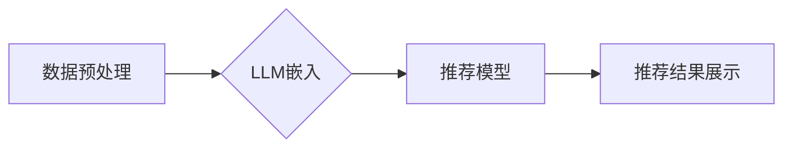

                 

## LLM推荐系统局限：硬件与算力需求

> 关键词：LLM,推荐系统,硬件,算力,效率,成本,优化,未来趋势

## 1. 背景介绍

近年来，大型语言模型（LLM）在自然语言处理领域取得了令人瞩目的成就，其强大的文本生成、理解和翻译能力为推荐系统带来了新的机遇。LLM推荐系统利用LLM的语义理解能力，可以更精准地捕捉用户需求和物品特征，从而提供更个性化、更相关的推荐结果。然而，LLM推荐系统的部署和运行面临着巨大的硬件和算力挑战。

传统的推荐系统主要依赖于基于内容的过滤、协同过滤等算法，这些算法通常需要处理海量用户行为数据和物品信息，但对文本语义的理解能力有限。LLM的出现改变了这一局势，它可以学习和理解复杂的文本语义，从而为推荐系统提供更丰富的特征和更精准的匹配。

例如，一个基于LLM的电影推荐系统可以分析用户的电影评论、观影历史和个人偏好，并利用LLM的文本生成能力，生成个性化的电影推荐文案，吸引用户点击。

## 2. 核心概念与联系

LLM推荐系统的核心概念包括：

* **大型语言模型 (LLM):** 训练于海量文本数据，具备强大的文本理解和生成能力的深度学习模型。
* **推荐系统:** 基于用户行为、物品特征等数据，预测用户对物品的偏好，并提供个性化推荐的系统。
* **语义理解:** 理解文本的深层含义，包括词义、句义和文本意图。
* **个性化推荐:** 根据用户的兴趣、偏好和历史行为，提供定制化的推荐结果。

LLM推荐系统的架构通常包括以下几个模块：

* **数据预处理:** 对用户行为数据、物品信息和文本数据进行清洗、转换和特征提取。
* **LLM嵌入:** 利用LLM将文本数据转换为向量表示，捕捉文本的语义信息。
* **推荐模型:** 基于LLM嵌入和用户行为数据，构建推荐模型，预测用户对物品的偏好。
* **推荐结果展示:** 将推荐结果以用户友好的方式展示给用户。



## 3. 核心算法原理 & 具体操作步骤

### 3.1  算法原理概述

LLM推荐系统通常采用以下几种核心算法：

* **基于内容的推荐:** 利用LLM对物品描述进行语义分析，找到与用户兴趣相似的物品。
* **协同过滤:** 基于用户对物品的评分或行为数据，找到具有相似兴趣的用户，并推荐他们喜欢的物品。
* **混合推荐:** 将基于内容的推荐和协同过滤相结合，提高推荐的准确性和个性化程度。

### 3.2  算法步骤详解

以基于内容的推荐为例，其具体操作步骤如下：

1. **数据预处理:** 收集用户行为数据、物品信息和文本数据，并进行清洗、转换和特征提取。
2. **LLM嵌入:** 利用预训练的LLM将物品描述转换为向量表示，捕捉物品的语义信息。
3. **用户兴趣建模:** 利用用户行为数据，例如用户点击、评分和评论等，构建用户兴趣模型。
4. **相似度计算:** 计算用户兴趣模型与物品语义向量之间的相似度，例如余弦相似度。
5. **推荐结果排序:** 根据相似度排序，推荐与用户兴趣最相似的物品。

### 3.3  算法优缺点

**优点:**

* **精准度高:** 利用LLM的语义理解能力，可以更精准地捕捉用户需求和物品特征。
* **个性化强:** 可以根据用户的兴趣和偏好，提供个性化的推荐结果。
* **可扩展性强:** 可以扩展到处理多种类型的文本数据，例如评论、文章和对话等。

**缺点:**

* **算力需求高:** LLM的训练和推理都需要大量的算力资源。
* **数据依赖性强:** LLM的性能依赖于训练数据的质量和数量。
* **解释性差:** LLM的决策过程较为复杂，难以解释推荐结果背后的原因。

### 3.4  算法应用领域

LLM推荐系统可以应用于各种领域，例如：

* **电商推荐:** 推荐商品、优惠券和促销活动。
* **内容推荐:** 推荐新闻、视频、音乐和书籍。
* **社交推荐:** 推荐好友、群组和活动。
* **教育推荐:** 推荐学习资源、课程和导师。

## 4. 数学模型和公式 & 详细讲解 & 举例说明

### 4.1  数学模型构建

LLM推荐系统通常采用以下数学模型：

* **余弦相似度:** 用于衡量两个向量的相似度。

$$
\text{cosine similarity}(u, v) = \frac{u \cdot v}{||u|| ||v||}
$$

其中，u和v是两个向量，u·v是它们的点积，||u||和||v||是它们的范数。

* **协同过滤矩阵分解:** 用于预测用户对物品的评分。

$$
\hat{r}_{u, i} = p_u^T q_i
$$

其中，$\hat{r}_{u, i}$是预测的用户u对物品i的评分，$p_u$是用户u的隐向量，$q_i$是物品i的隐向量。

### 4.2  公式推导过程

余弦相似度的推导过程如下：

1. 两个向量的点积表示它们在同一方向上的投影长度。
2. 向量的范数表示其长度。
3. 将点积除以两个向量的长度乘积，得到两个向量夹角的余弦值。
4. 余弦值表示两个向量的相似度，值越接近1，相似度越高。

### 4.3  案例分析与讲解

假设有两个用户，用户A和用户B，他们对以下两部电影的评分如下：

* 用户A: 电影1评分为5，电影2评分为3。
* 用户B: 电影1评分为4，电影2评分为2。

我们可以将用户评分转换为向量表示：

* 用户A: [5, 3]
* 用户B: [4, 2]

计算用户A和用户B的余弦相似度：

$$
\text{cosine similarity}(A, B) = \frac{[5, 3] \cdot [4, 2]}{|| [5, 3] || || [4, 2] ||} = \frac{20 + 6}{\sqrt{34} \sqrt{20}} \approx 0.82
$$

结果表明，用户A和用户B的兴趣相似度较高。

## 5. 项目实践：代码实例和详细解释说明

### 5.1  开发环境搭建

LLM推荐系统的开发环境通常包括：

* **操作系统:** Linux或macOS
* **编程语言:** Python
* **深度学习框架:** TensorFlow或PyTorch
* **LLM库:** HuggingFace Transformers

### 5.2  源代码详细实现

以下是一个基于LLM的电影推荐系统的代码示例，使用HuggingFace Transformers库和TensorFlow框架：

```python
import tensorflow as tf
from transformers import AutoModel, AutoTokenizer

# 加载预训练的LLM模型和词典
model_name = "bert-base-uncased"
model = AutoModel.from_pretrained(model_name)
tokenizer = AutoTokenizer.from_pretrained(model_name)

# 预处理电影描述数据
def preprocess_text(text):
  # ...

# 生成电影描述的LLM嵌入
def get_embedding(text):
  inputs = tokenizer(text, return_tensors="tf")
  outputs = model(**inputs)
  return outputs.last_hidden_state[:, 0, :]

# 计算用户兴趣和电影描述的相似度
def calculate_similarity(user_embedding, movie_embedding):
  return tf.reduce_sum(user_embedding * movie_embedding) / (tf.norm(user_embedding) * tf.norm(movie_embedding))

# 推荐电影
def recommend_movies(user_embedding, movies):
  similarities = [calculate_similarity(user_embedding, movie_embedding) for movie_embedding in movie_embeddings]
  return sorted(zip(movies, similarities), key=lambda x: x[1], reverse=True)

# ...
```

### 5.3  代码解读与分析

* 代码首先加载预训练的LLM模型和词典。
* 然后定义了预处理电影描述数据和生成LLM嵌入的函数。
* 计算用户兴趣和电影描述的相似度，并根据相似度推荐电影。

### 5.4  运行结果展示

运行代码后，可以得到用户感兴趣的电影推荐列表，并根据相似度排序。

## 6. 实际应用场景

LLM推荐系统在实际应用场景中展现出强大的潜力，例如：

* **电商推荐:** 淘宝、京东等电商平台可以使用LLM推荐系统推荐个性化的商品，提高用户购物体验。
* **内容推荐:** 新浪、腾讯等内容平台可以使用LLM推荐系统推荐个性化的新闻、视频和音乐，吸引用户阅读和观看。
* **社交推荐:** 微信、QQ等社交平台可以使用LLM推荐系统推荐个性化的好友、群组和活动，促进用户互动。

### 6.4  未来应用展望

随着LLM技术的不断发展，LLM推荐系统将在更多领域得到应用，例如：

* **医疗推荐:** 推荐个性化的医疗方案和健康建议。
* **教育推荐:** 推荐个性化的学习资源和课程。
* **金融推荐:** 推荐个性化的理财产品和投资建议。

## 7. 工具和资源推荐

### 7.1  学习资源推荐

* **HuggingFace Transformers:** https://huggingface.co/docs/transformers/index
* **TensorFlow:** https://www.tensorflow.org/
* **PyTorch:** https://pytorch.org/

### 7.2  开发工具推荐

* **Jupyter Notebook:** https://jupyter.org/
* **VS Code:** https://code.visualstudio.com/

### 7.3  相关论文推荐

* **BERT: Pre-training of Deep Bidirectional Transformers for Language Understanding**
* **XLNet: Generalized Autoregressive Pretraining for Language Understanding**
* **T5: Text-to-Text Transfer Transformer**

## 8. 总结：未来发展趋势与挑战

### 8.1  研究成果总结

LLM推荐系统在推荐精度、个性化程度和可扩展性方面取得了显著的进步，为推荐系统的发展带来了新的机遇。

### 8.2  未来发展趋势

未来LLM推荐系统的发展趋势包括：

* **模型效率优化:** 降低LLM模型的训练和推理成本，使其更易于部署和使用。
* **多模态融合:** 将文本数据与其他模态数据，例如图像、音频和视频，进行融合，提高推荐的准确性和丰富度。
* **可解释性增强:** 提高LLM推荐系统的可解释性，帮助用户理解推荐结果背后的原因。

### 8.3  面临的挑战

LLM推荐系统也面临着一些挑战，例如：

* **数据隐私:** LLM模型的训练需要大量用户数据，如何保护用户隐私是一个重要问题。
* **公平性:** LLM模型可能存在偏见，导致推荐结果不公平。
* **可控性:** LLM模型的决策过程较为复杂，难以控制和解释。

### 8.4  研究展望

未来研究将集中在解决上述挑战，并探索LLM推荐系统的更多应用场景。


## 9. 附录：常见问题与解答

* **Q: LLM推荐系统比传统的推荐系统有什么优势？**

A: LLM推荐系统可以更精准地捕捉用户需求和物品特征，从而提供更个性化、更相关的推荐结果。

* **Q: LLM推荐系统的算力需求很高吗？**

A: 是的，LLM的训练和推理都需要大量的算力资源。

* **Q: 如何解决LLM推荐系统中的数据隐私问题？**

A: 可以采用联邦学习等技术，在不泄露用户数据的情况下进行模型训练。


作者：禅与计算机程序设计艺术 / Zen and the Art of Computer Programming 
<end_of_turn>

