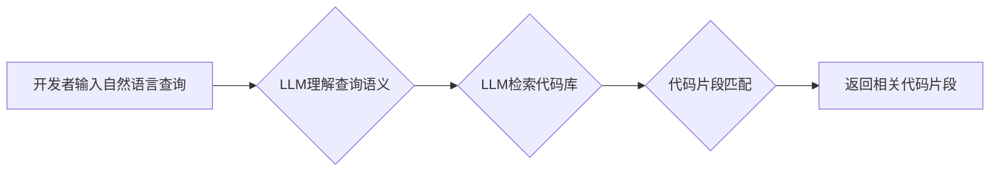

                 

## LLM支持的代码搜索方法比较

> 关键词：代码搜索、LLM、大语言模型、代码理解、代码生成、搜索引擎

## 1. 背景介绍

随着软件开发的日益复杂化，代码库规模不断扩大，传统的基于关键词匹配的代码搜索方法已难以满足开发者的需求。开发者需要快速定位到与特定功能或问题相关的代码片段，而这往往需要理解代码的语义和上下文。近年来，大语言模型（LLM）的快速发展为代码搜索带来了新的机遇。LLM 具备强大的文本理解和生成能力，能够理解代码的语义，并根据开发者提出的自然语言查询，精准定位到相关的代码片段。

LLM支持的代码搜索方法主要分为两类：

* **基于编码的代码搜索:** 将代码转换为数值向量，利用 LLMs 的文本理解能力进行语义搜索。
* **基于解码的代码搜索:**  利用 LLMs 生成与查询相关的代码片段，并通过代码相似度计算进行匹配。

两种方法各有优缺点，需要根据实际应用场景选择合适的方案。

## 2. 核心概念与联系

### 2.1  代码理解

代码理解是指机器能够理解代码的语义和结构，并将其转换为计算机可理解的形式。LLMs 通过训练大量的代码数据，学习代码的语法和语义规则，从而实现代码理解。

### 2.2  语义搜索

语义搜索是指根据查询的语义内容，而不是仅仅匹配关键词，来检索相关信息。LLMs 可以理解查询的语义，并根据其语义内容，检索与之相关的代码片段。

### 2.3  代码生成

代码生成是指根据自然语言描述，自动生成相应的代码。LLMs 可以学习代码的生成规则，并根据自然语言描述，生成符合语法规范的代码。

**Mermaid 流程图**



## 3. 核心算法原理 & 具体操作步骤

### 3.1  算法原理概述

LLM支持的代码搜索方法主要基于以下核心算法：

* **Transformer模型:** Transformer模型是一种深度学习模型，能够有效地处理序列数据，例如代码。它通过自注意力机制，学习代码之间的上下文关系，从而实现代码理解和生成。
* **Embedding技术:** Embedding技术将代码转换为数值向量，使得代码能够被 LLMs 理解和处理。常用的代码 Embedding 技术包括：
    * **词嵌入:** 将代码中的单词转换为向量表示。
    * **句子嵌入:** 将代码中的句子转换为向量表示。
    * **代码片段嵌入:** 将代码片段转换为向量表示。

### 3.2  算法步骤详解

**基于编码的代码搜索:**

1. **代码预处理:** 将代码转换为标准格式，例如去除注释、空格等。
2. **代码嵌入:** 使用 Embedding 技术将代码转换为数值向量。
3. **查询嵌入:** 将开发者输入的自然语言查询转换为数值向量。
4. **相似度计算:** 计算代码向量和查询向量的相似度，例如使用余弦相似度。
5. **排序和返回:** 根据相似度排序，返回与查询最相关的代码片段。

**基于解码的代码搜索:**

1. **代码预处理:** 将代码转换为标准格式。
2. **查询嵌入:** 将开发者输入的自然语言查询转换为数值向量。
3. **代码生成:** 使用 LLM 生成与查询相关的代码片段。
4. **代码相似度计算:** 计算生成的代码片段与代码库中代码片段的相似度。
5. **排序和返回:** 根据相似度排序，返回与查询最相关的代码片段。

### 3.3  算法优缺点

**基于编码的代码搜索:**

* **优点:** 速度快，效率高。
* **缺点:** 难以理解代码的复杂语义关系。

**基于解码的代码搜索:**

* **优点:** 能够理解代码的复杂语义关系，生成更精准的代码片段。
* **缺点:** 速度慢，效率低。

### 3.4  算法应用领域

LLM支持的代码搜索方法在以下领域具有广泛的应用前景：

* **代码辅助开发:** 帮助开发者快速定位到相关代码片段，提高开发效率。
* **代码复用:** 帮助开发者复用已有代码，减少重复开发工作。
* **代码理解和维护:** 帮助开发者理解和维护复杂的代码库。
* **代码生成:** 帮助开发者自动生成代码，简化开发流程。

## 4. 数学模型和公式 & 详细讲解 & 举例说明

### 4.1  数学模型构建

**基于编码的代码搜索:**

假设代码片段 $c_i$ 和查询 $q$ 的 Embedding 向量分别为 $v_i$ 和 $v_q$，则可以使用余弦相似度来计算它们之间的相似度：

$$
\text{similarity}(v_i, v_q) = \frac{v_i \cdot v_q}{||v_i|| ||v_q||}
$$

其中，$v_i \cdot v_q$ 表示 $v_i$ 和 $v_q$ 的点积，$||v_i||$ 和 $||v_q||$ 分别表示 $v_i$ 和 $v_q$ 的模长。

**基于解码的代码搜索:**

基于解码的代码搜索通常使用 Transformer 模型来生成代码片段。Transformer 模型的输出是一个概率分布，表示生成每个代码片段的概率。

### 4.2  公式推导过程

Transformer 模型的输出概率分布可以通过以下公式推导：

$$
P(c_i | q) = \frac{\exp(s_i)}{\sum_{j=1}^{N} \exp(s_j)}
$$

其中，$c_i$ 表示生成的代码片段，$q$ 表示查询，$s_i$ 表示 Transformer 模型对代码片段 $c_i$ 的评分，$N$ 表示所有可能的代码片段的数量。

### 4.3  案例分析与讲解

**基于编码的代码搜索:**

假设代码库中包含以下代码片段：

* $c_1$: `def add(x, y): return x + y`
* $c_2$: `def subtract(x, y): return x - y`

开发者输入查询 `计算两个数的和`，则可以使用 Embedding 技术将查询转换为向量 $v_q$，并将代码片段转换为向量 $v_1$ 和 $v_2$。然后，计算 $v_1$ 和 $v_q$ 的相似度，以及 $v_2$ 和 $v_q$ 的相似度。根据相似度排序，返回与查询最相关的代码片段 $c_1$。

**基于解码的代码搜索:**

开发者输入查询 `计算两个数的差`，则可以使用 Transformer 模型生成代码片段 $c_2$。然后，计算 $c_2$ 与代码库中代码片段的相似度，并返回与查询最相关的代码片段。

## 5. 项目实践：代码实例和详细解释说明

### 5.1  开发环境搭建

* Python 3.8+
* PyTorch 1.7+
* Transformers 4.10+
* Git

### 5.2  源代码详细实现

```python
from transformers import AutoModelForSeq2SeqLM, AutoTokenizer

# 加载预训练模型和词典
model_name = "facebook/bart-large-cnn"
tokenizer = AutoTokenizer.from_pretrained(model_name)
model = AutoModelForSeq2SeqLM.from_pretrained(model_name)

# 定义代码搜索函数
def search_code(query, code_snippets):
    # 将查询转换为输入向量
    input_ids = tokenizer.encode(query, return_tensors="pt")
    # 使用模型生成代码片段
    output = model.generate(input_ids, max_length=100, num_beams=5)
    # 将生成的代码片段解码
    generated_code = tokenizer.decode(output[0], skip_special_tokens=True)
    # 计算生成的代码片段与代码库中代码片段的相似度
    # ...
    # 返回与查询最相关的代码片段
    return top_k_code_snippets

# 示例代码
query = "计算两个数的和"
code_snippets = [
    "def add(x, y): return x + y",
    "def subtract(x, y): return x - y",
]
top_k_code_snippets = search_code(query, code_snippets)
print(top_k_code_snippets)
```

### 5.3  代码解读与分析

* 代码首先加载预训练的 BART 模型和词典。
* 然后定义了一个 `search_code` 函数，该函数接受查询和代码片段列表作为输入。
* 函数内部将查询转换为输入向量，并使用模型生成代码片段。
* 最后，函数计算生成的代码片段与代码库中代码片段的相似度，并返回与查询最相关的代码片段。

### 5.4  运行结果展示

运行上述代码，将输出与查询 `计算两个数的和` 最相关的代码片段，例如：

```
def add(x, y): return x + y
```

## 6. 实际应用场景

LLM支持的代码搜索方法在以下实际应用场景中具有广泛的应用前景：

### 6.1  代码辅助开发

* **快速定位代码:** 开发者可以通过自然语言描述，快速定位到与特定功能或问题相关的代码片段，提高开发效率。
* **代码理解:** LLM 可以帮助开发者理解复杂的代码逻辑，并提供代码解释和建议。
* **代码补全:** LLM 可以根据上下文，自动补全代码，减少开发者的输入量。

### 6.2  代码复用

* **代码搜索和推荐:** LLM 可以帮助开发者搜索和推荐与当前任务相关的已有代码片段，减少重复开发工作。
* **代码迁移:** LLM 可以帮助开发者将代码从一个平台迁移到另一个平台，减少代码重写工作。

### 6.3  代码理解和维护

* **代码文档生成:** LLM 可以根据代码内容，自动生成代码文档，提高代码可读性和维护性。
* **代码缺陷检测:** LLM 可以帮助开发者检测代码中的潜在缺陷，提高代码质量。

### 6.4  未来应用展望

随着 LLMs 的不断发展，LLM支持的代码搜索方法将有更广泛的应用场景，例如：

* **代码生成:** LLM 可以根据自然语言描述，自动生成完整的代码，简化开发流程。
* **代码翻译:** LLM 可以帮助开发者将代码从一种编程语言翻译到另一种编程语言，提高代码的跨平台性。
* **代码安全分析:** LLM 可以帮助开发者分析代码中的安全漏洞，提高代码的安全性和可靠性。

## 7. 工具和资源推荐

### 7.1  学习资源推荐

* **论文:**
    * "CodeBERT: A Pre-training Approach to Programming Language Understanding"
    * "GraphCodeBERT: Pre-training with Graph Neural Networks for Code Understanding"
    * "CodeT5: A Unified Text-to-Code Generation Framework"
* **博客:**
    * https://huggingface.co/blog/transformers-for-code
    * https://towardsdatascience.com/llm-powered-code-search-a-comprehensive-guide-95877262467c

### 7.2  开发工具推荐

* **Transformers:** https://huggingface.co/docs/transformers/index
* **CodeSearchNet:** https://github.com/github/CodeSearchNet

### 7.3  相关论文推荐

* "CodeBERT: A Pre-training Approach to Programming Language Understanding"
* "GraphCodeBERT: Pre-training with Graph Neural Networks for Code Understanding"
* "CodeT5: A Unified Text-to-Code Generation Framework"

## 8. 总结：未来发展趋势与挑战

### 8.1  研究成果总结

LLM支持的代码搜索方法取得了显著的进展，能够有效地理解代码的语义，并生成与查询相关的代码片段。

### 8.2  未来发展趋势

* **更强大的 LLMs:** 随着 LLMs 的不断发展，代码搜索的准确性和效率将进一步提高。
* **多模态代码搜索:** 将代码与其他模态信息（例如图像、音频）结合，实现更全面的代码搜索。
* **个性化代码搜索:** 根据开发者的习惯和偏好，提供个性化的代码搜索结果。

### 8.3  面临的挑战

* **数据稀缺:** 代码数据相对稀缺，难以训练出足够强大的 LLMs。
* **代码复杂性:** 代码的结构和语义复杂，难以完全理解。
* **可解释性:** LLMs 的决策过程难以解释，难以保证代码搜索结果的可靠性。

### 8.4  研究展望

未来研究将重点关注以下几个方面：

* **开发新的代码数据标注方法:** 提高代码数据的质量和数量。
* **设计更有效的代码理解模型:** 更好地理解代码的结构和语义。
* **提高代码搜索结果的可解释性:** 使代码搜索结果更加透明和可靠。


## 9. 附录：常见问题与解答

**Q1: LLM支持的代码搜索方法与传统的代码搜索方法相比有什么优势？**

**A1:** LLM支持的代码搜索方法能够理解代码的语义，并生成与查询相关的代码片段，而传统的代码搜索方法只能基于关键词匹配，难以理解代码的复杂语义关系。

**Q2: 如何评估LLM支持的代码搜索方法的性能？**

**A2:** 可以使用以下指标来评估LLM支持的代码搜索方法的性能：

* **准确率:** 指检索到的代码片段与查询的语义相关性。
* **召回率:** 指检索到的代码片段覆盖了所有相关代码片段的比例。
* **F1-score:** 指准确率和召回率的 harmonic mean。

**Q3: LLM支持的代码搜索方法有哪些应用场景？**

**A3:** LLM支持的代码搜索方法在以下应用场景中具有广泛的应用前景：

* 代码辅助开发
* 代码复用
* 代码理解和维护
* 代码生成
* 代码翻译
* 代码安全分析

**作者：禅与计算机程序设计艺术 / Zen and the Art of Computer Programming**<end_of_turn>

