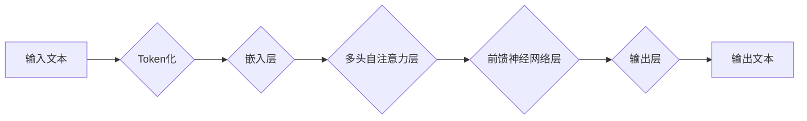

                 

## LLM：新一代计算机架构的崛起

> 关键词：大型语言模型 (LLM)、Transformer、深度学习、自然语言处理 (NLP)、人工智能 (AI)、计算架构、神经网络

### 1. 背景介绍

近年来，人工智能 (AI) 领域取得了令人瞩目的进展，其中大型语言模型 (LLM) 的出现尤为引人注目。LLM 作为一种新型的计算架构，以其强大的文本生成、理解和翻译能力，正在深刻地改变着我们与信息交互的方式。从 ChatGPT 的问答能力到 Google 的 LaMDA 的对话流，LLM 已经展现出其巨大的潜力，并引发了广泛的关注和讨论。

传统的计算机架构主要基于冯诺伊曼体系结构，其核心是将数据和指令存储在统一的内存中，并通过中央处理器 (CPU) 进行处理。然而，随着数据量的爆炸式增长和计算任务的复杂性增加，传统的冯诺伊曼体系结构逐渐面临瓶颈。LLM 的出现为计算机架构带来了新的思路，它将深度学习算法与海量数据相结合，构建了一种全新的计算模式。

### 2. 核心概念与联系

LLM 的核心概念是 Transformer 架构，它是一种基于神经网络的深度学习模型，能够有效地处理序列数据，例如文本。Transformer 架构的核心在于其自注意力机制 (Self-Attention)，它允许模型在处理文本时关注不同词语之间的关系，从而更好地理解上下文信息。

**Mermaid 流程图：LLM 架构**



LLM 的工作原理可以概括为以下步骤：

1. **Token化:** 将输入文本分割成一个个独立的单位，称为 Token。
2. **嵌入层:** 将每个 Token 映射到一个向量空间中，每个向量代表一个 Token 的语义信息。
3. **多头自注意力层:** 利用自注意力机制，计算每个 Token 与其他 Token 之间的相关性，并生成一个新的表示向量。
4. **前馈神经网络层:** 对每个 Token 的表示向量进行进一步的处理，提取更深层的语义信息。
5. **输出层:** 将处理后的表示向量解码成输出文本。

### 3. 核心算法原理 & 具体操作步骤

#### 3.1  算法原理概述

LLM 的核心算法是 Transformer 架构，它基于深度学习原理，利用多层神经网络结构来学习文本的语义表示。Transformer 架构的核心创新在于其自注意力机制，它能够捕捉文本中不同词语之间的长距离依赖关系，从而提高模型的理解能力。

#### 3.2  算法步骤详解

1. **输入处理:** 将输入文本分割成 Token，并将其映射到嵌入空间。
2. **多头自注意力层:** 对每个 Token 的嵌入向量进行多头自注意力计算，得到每个 Token 与其他 Token 之间的相关性信息。
3. **前馈神经网络层:** 对每个 Token 的自注意力输出进行前馈神经网络处理，提取更深层的语义信息。
4. **残差连接和层归一化:** 使用残差连接和层归一化技术来缓解梯度消失问题，提高模型训练的稳定性。
5. **重复步骤 2-4:** 将上述步骤重复多次，形成多层 Transformer 网络结构。
6. **输出层:** 将最终的隐藏状态映射到输出空间，生成预测文本。

#### 3.3  算法优缺点

**优点:**

* **强大的文本理解能力:** 自注意力机制能够捕捉文本中长距离依赖关系，提高模型的理解能力。
* **并行化训练:** Transformer 架构可以并行化训练，提高训练效率。
* **可扩展性:** Transformer 架构可以轻松扩展到更大的模型规模。

**缺点:**

* **训练成本高:** 训练大型 Transformer 模型需要大量的计算资源和时间。
* **参数量大:** Transformer 模型的参数量很大，需要大量的存储空间。
* **可解释性低:** Transformer 模型的内部机制比较复杂，难以解释其决策过程。

#### 3.4  算法应用领域

LLM 已经在多个领域取得了成功应用，例如：

* **自然语言处理 (NLP):** 文本生成、机器翻译、问答系统、文本摘要等。
* **对话系统:** 创建更自然、更智能的对话机器人。
* **代码生成:** 自动生成代码，提高开发效率。
* **创意写作:** 辅助人类进行创意写作，例如诗歌、剧本等。

### 4. 数学模型和公式 & 详细讲解 & 举例说明

#### 4.1  数学模型构建

LLM 的数学模型主要基于深度学习框架，例如 TensorFlow 或 PyTorch。模型的结构通常由多层 Transformer 模块组成，每个模块包含自注意力层、前馈神经网络层、残差连接和层归一化等组件。

#### 4.2  公式推导过程

Transformer 架构的核心是自注意力机制，其计算公式如下：

$$
Attention(Q, K, V) = softmax(\frac{QK^T}{\sqrt{d_k}})V
$$

其中：

* $Q$：查询矩阵
* $K$：键矩阵
* $V$：值矩阵
* $d_k$：键向量的维度
* $softmax$：softmax 函数

该公式计算每个查询向量与所有键向量的相关性，并将其加权平均，得到每个查询向量与所有值向量的加权和，即最终的注意力输出。

#### 4.3  案例分析与讲解

假设我们有一个句子 "The cat sat on the mat"，将其 Token 化后得到 [The, cat, sat, on, the, mat]。

对于每个 Token，我们分别计算其与其他 Token 之间的注意力权重。例如，对于 Token "cat"，其与 Token "sat" 之间的注意力权重较高，因为它们在语义上相关。

通过自注意力机制，LLM 可以捕捉到句子中不同词语之间的关系，从而更好地理解句子的含义。

### 5. 项目实践：代码实例和详细解释说明

#### 5.1  开发环境搭建

LLM 的开发环境通常需要安装深度学习框架 (例如 TensorFlow 或 PyTorch) 和相关的库 (例如 HuggingFace Transformers)。

#### 5.2  源代码详细实现

以下是一个使用 HuggingFace Transformers 库训练一个小型 LLM 的代码示例：

```python
from transformers import AutoModelForCausalLM, AutoTokenizer

# 加载预训练模型和词典
model_name = "gpt2"
tokenizer = AutoTokenizer.from_pretrained(model_name)
model = AutoModelForCausalLM.from_pretrained(model_name)

# 定义训练数据
train_data = [
    "The quick brown fox jumps over the lazy dog.",
    "This is a sample sentence for training.",
]

# 训练模型
model.train()
for text in train_data:
    inputs = tokenizer(text, return_tensors="pt")
    outputs = model.generate(**inputs)
    # 计算损失并进行反向传播
```

#### 5.3  代码解读与分析

该代码首先加载预训练的 GPT-2 模型和词典。然后，定义训练数据，并使用模型生成文本。最后，计算损失并进行反向传播，更新模型参数。

#### 5.4  运行结果展示

训练完成后，可以使用模型生成新的文本。例如，输入 "The cat sat on the"，模型可以生成 "mat"。

### 6. 实际应用场景

LLM 在多个实际应用场景中展现出其强大的能力：

#### 6.1  聊天机器人

LLM 可以用于构建更智能、更自然的聊天机器人，能够理解用户意图并提供更精准的回复。

#### 6.2  文本生成

LLM 可以用于生成各种类型的文本，例如文章、故事、诗歌等，辅助人类进行创作。

#### 6.3  机器翻译

LLM 可以用于实现更准确、更流畅的机器翻译，突破语言障碍。

#### 6.4  未来应用展望

LLM 的应用前景广阔，未来可能在以下领域发挥更大的作用：

* **个性化教育:** 根据学生的学习情况，提供个性化的学习内容和辅导。
* **医疗诊断:** 辅助医生进行疾病诊断，提高诊断准确率。
* **法律服务:** 自动分析法律文件，提供法律建议。

### 7. 工具和资源推荐

#### 7.1  学习资源推荐

* **HuggingFace Transformers:** https://huggingface.co/docs/transformers/index
* **OpenAI API:** https://beta.openai.com/docs/api-reference/introduction

#### 7.2  开发工具推荐

* **TensorFlow:** https://www.tensorflow.org/
* **PyTorch:** https://pytorch.org/

#### 7.3  相关论文推荐

* **Attention Is All You Need:** https://arxiv.org/abs/1706.03762
* **BERT: Pre-training of Deep Bidirectional Transformers for Language Understanding:** https://arxiv.org/abs/1810.04805

### 8. 总结：未来发展趋势与挑战

#### 8.1  研究成果总结

LLM 的出现标志着人工智能领域迈向新的里程碑，其强大的文本理解和生成能力为多个领域带来了革命性的变革。

#### 8.2  未来发展趋势

LLM 的未来发展趋势包括：

* **模型规模的进一步扩大:** 更大的模型规模能够带来更强的性能，但同时也带来更高的训练成本和计算资源需求。
* **模型效率的提升:** 研究更有效的训练算法和模型架构，降低训练成本和资源消耗。
* **多模态学习:** 将文本与其他模态信息 (例如图像、音频) 相结合，构建更全面的理解模型。

#### 8.3  面临的挑战

LLM 还面临着一些挑战：

* **数据偏见:** 训练数据可能存在偏见，导致模型输出结果也存在偏见。
* **可解释性:** LLM 的内部机制比较复杂，难以解释其决策过程，这限制了其在一些安全敏感领域的应用。
* **伦理问题:** LLM 的强大能力也带来了一些伦理问题，例如信息操纵、隐私泄露等。

#### 8.4  研究展望

未来，LLM 研究将继续朝着更强大、更安全、更可解释的方向发展，并为人类社会带来更多福祉。

### 9. 附录：常见问题与解答

**Q1: LLM 与传统机器学习模型有什么区别？**

**A1:** LLM 基于深度学习框架，利用 Transformer 架构和海量数据进行训练，能够捕捉文本中长距离依赖关系，具有更强的文本理解和生成能力。传统机器学习模型通常基于规则或特征工程，难以处理复杂文本数据。

**Q2: 如何训练一个 LLM 模型？**

**A2:** 训练 LLM 模型需要大量的计算资源和时间，通常需要使用深度学习框架 (例如 TensorFlow 或 PyTorch) 和预训练模型 (例如 GPT-2 或 BERT) 进行训练。

**Q3: LLM 的应用场景有哪些？**

**A3:** LLM 的应用场景非常广泛，包括聊天机器人、文本生成、机器翻译、代码生成、创意写作等。

**Q4: LLM 的伦理问题有哪些？**

**A4:** LLM 的强大能力也带来了一些伦理问题，例如信息操纵、隐私泄露、算法偏见等。需要谨慎使用 LLM，并制定相应的伦理规范和监管机制。


作者：禅与计算机程序设计艺术 / Zen and the Art of Computer Programming 
<end_of_turn>

