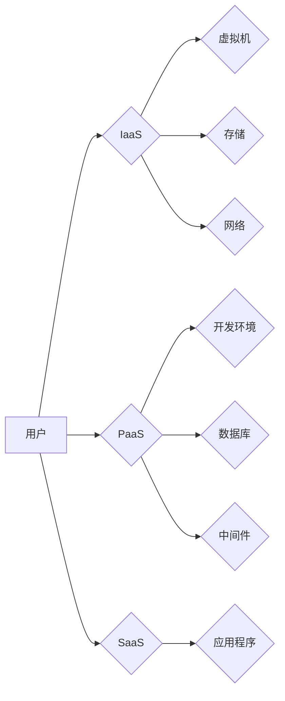

                 

## 云计算时代的程序员创业机会

> 关键词：云计算、程序员创业、SaaS、PaaS、IaaS、DevOps、微服务

### 1. 背景介绍

云计算的兴起彻底改变了软件开发和部署的方式，为程序员提供了前所未有的创业机遇。传统的软件开发模式依赖于昂贵的硬件基础设施和复杂的部署流程，而云计算则提供了弹性、可扩展和按需付费的计算资源，降低了创业门槛，加速了软件开发周期。

随着云计算技术的不断发展，出现了多种服务模式，例如基础设施即服务 (IaaS)、平台即服务 (PaaS) 和软件即服务 (SaaS)。这些服务模式为程序员提供了不同的开发和部署选项，满足了不同类型的创业需求。

### 2. 核心概念与联系

#### 2.1 云计算服务模式

云计算服务模式主要分为以下三种：

* **IaaS (基础设施即服务):** 提供虚拟化的计算资源，例如虚拟机、存储和网络，用户可以根据需要配置和管理自己的软件环境。
* **PaaS (平台即服务):** 提供开发和部署应用程序的平台，包括操作系统、数据库、中间件等，用户可以专注于应用程序的开发，而无需关心底层基础设施。
* **SaaS (软件即服务):** 提供完整的软件应用程序，用户可以通过网络访问和使用，无需安装和维护软件。

#### 2.2 云计算架构

云计算架构通常由以下几个关键组件组成：

* **计算资源:** 包括虚拟机、容器、服务器等，提供应用程序运行的计算能力。
* **存储资源:** 包括对象存储、块存储、文件存储等，提供应用程序数据存储和管理。
* **网络资源:** 包括虚拟私有云、负载均衡、网络安全等，提供应用程序之间的通信和网络安全保障。
* **管理平台:** 提供云计算资源的管理和监控，例如用户身份认证、资源调度、性能监控等。

**Mermaid 流程图:**



### 3. 核心算法原理 & 具体操作步骤

#### 3.1 算法原理概述

云计算中常用的算法包括：

* **虚拟化技术:** 将物理资源虚拟化成多个逻辑资源，提高资源利用率和灵活性。
* **容器技术:** 将应用程序及其依赖环境打包成容器，方便部署和管理。
* **微服务架构:** 将应用程序分解成多个小型、独立的服务，提高开发效率和系统可靠性。
* **DevOps:** 将开发和运维流程整合，提高软件交付速度和质量。

#### 3.2 算法步骤详解

* **虚拟化技术:**

1. 将物理硬件资源（CPU、内存、存储）抽象成虚拟资源。
2. 使用虚拟机管理软件（如VMware、Hyper-V）创建虚拟机，分配虚拟资源。
3. 在虚拟机上安装操作系统和应用程序。

* **容器技术:**

1. 使用Docker等容器化工具将应用程序及其依赖环境打包成容器镜像。
2. 在容器运行环境（如Docker Engine）中运行容器镜像。
3. 容器镜像可以轻松地在不同环境中部署和运行。

* **微服务架构:**

1. 将应用程序分解成多个小型、独立的服务，每个服务负责特定的功能。
2. 使用API进行服务间通信。
3. 每个服务可以独立部署和更新。

* **DevOps:**

1. 将开发和运维流程整合，实现自动化部署、监控和故障恢复。
2. 使用工具链（如Jenkins、GitLab CI）实现持续集成和持续交付。
3. 提高软件交付速度和质量。

#### 3.3 算法优缺点

* **虚拟化技术:**

    * **优点:** 提高资源利用率、灵活性、隔离性。
    * **缺点:** 性能开销、管理复杂度。

* **容器技术:**

    * **优点:** 轻量级、快速部署、易于管理。
    * **缺点:** 容器镜像大小可能较大、资源隔离性较弱。

* **微服务架构:**

    * **优点:** 开发效率高、系统可靠性高、可扩展性强。
    * **缺点:** 部署复杂、服务间通信复杂。

* **DevOps:**

    * **优点:** 提高软件交付速度和质量、降低运维成本。
    * **缺点:** 需要改变组织文化和流程。

#### 3.4 算法应用领域

* **虚拟化技术:** 数据中心虚拟化、桌面虚拟化、云计算平台。
* **容器技术:** 应用部署、微服务架构、持续集成和持续交付。
* **微服务架构:** 大型互联网应用、电商平台、金融系统。
* **DevOps:** 软件开发、运维、测试、安全等各个环节。

### 4. 数学模型和公式 & 详细讲解 & 举例说明

#### 4.1 数学模型构建

云计算资源的分配和调度可以建模为一个优化问题，目标是最大化资源利用率，同时满足用户需求。

#### 4.2 公式推导过程

资源分配问题可以采用线性规划模型解决，其目标函数为：

$$
\text{最大化} \quad \sum_{i=1}^{n} \alpha_i x_i
$$

其中：

* $n$ 是资源类型数量。
* $\alpha_i$ 是资源类型 $i$ 的价值。
* $x_i$ 是资源类型 $i$ 的分配量。

约束条件为：

$$
\sum_{i=1}^{n} a_{ij} x_i \leq b_j, \quad j = 1, 2, ..., m
$$

其中：

* $m$ 是约束条件数量。
* $a_{ij}$ 是资源类型 $i$ 对约束条件 $j$ 的消耗量。
* $b_j$ 是约束条件 $j$ 的限制值。

#### 4.3 案例分析与讲解

假设有两种资源类型：CPU 和内存，两种约束条件：CPU 限制和内存限制。

* CPU 价值：$\alpha_1 = 1$
* 内存价值：$\alpha_2 = 0.5$
* CPU 限制：$a_{11}x_1 \leq b_1$
* 内存限制：$a_{21}x_1 + a_{22}x_2 \leq b_2$

目标函数为：

$$
\text{最大化} \quad x_1 + 0.5x_2
$$

通过求解线性规划模型，可以得到资源分配方案，最大化资源利用率。

### 5. 项目实践：代码实例和详细解释说明

#### 5.1 开发环境搭建

* **操作系统:** Ubuntu 20.04 LTS
* **云平台:** AWS
* **开发工具:** Docker, Python, Flask

#### 5.2 源代码详细实现

```python
from flask import Flask, request, jsonify

app = Flask(__name__)

@app.route('/api/hello', methods=['GET'])
def hello():
    name = request.args.get('name', 'World')
    return jsonify({'message': f'Hello, {name}!'})

if __name__ == '__main__':
    app.run(host='0.0.0.0', port=5000)
```

#### 5.3 代码解读与分析

* 使用 Flask 框架构建一个简单的 RESTful API。
* `/api/hello` 路由接受 GET 请求，并返回一个 JSON 响应，包含 "Hello, World!" 的消息。
* `request.args.get('name', 'World')` 获取请求参数 `name`，如果没有则默认值为 "World"。
* `app.run(host='0.0.0.0', port=5000)` 启动 Flask 应用，监听所有网络接口，端口为 5000。

#### 5.4 运行结果展示

访问 `http://<你的云服务器IP>:5000/api/hello`，可以获取 "Hello, World!" 的响应。

### 6. 实际应用场景

#### 6.1 SaaS 应用

* **在线办公软件:** 如 Google Workspace、Microsoft 365，提供文档编辑、协作、通讯等功能。
* **客户关系管理 (CRM) 软件:** 如 Salesforce、HubSpot，帮助企业管理客户关系和销售线索。
* **企业资源规划 (ERP) 软件:** 如 SAP、Oracle，帮助企业管理财务、人力资源、供应链等业务。

#### 6.2 PaaS 应用

* **网站和应用程序托管:** 如 Heroku、AWS Elastic Beanstalk，提供开发和部署网站和应用程序的平台。
* **数据分析平台:** 如 Google Cloud Dataflow、AWS Glue，提供数据处理和分析的平台。
* **机器学习平台:** 如 Google AI Platform、AWS SageMaker，提供机器学习模型训练和部署的平台。

#### 6.3 IaaS 应用

* **虚拟化桌面:** 提供远程桌面访问，提高工作效率和安全性。
* **数据备份和灾难恢复:** 提供数据备份和恢复服务，保障数据安全。
* **测试和开发环境:** 提供弹性可扩展的测试和开发环境，满足不同项目需求。

#### 6.4 未来应用展望

* **边缘计算:** 将计算资源部署到靠近数据源的边缘设备，降低延迟和提高实时性。
* **人工智能 (AI):** 将 AI 技术应用于云计算平台，提供智能化服务，例如自动化的资源管理和故障诊断。
* **区块链:** 将区块链技术应用于云计算平台，提高数据安全性和透明度。

### 7. 工具和资源推荐

#### 7.1 学习资源推荐

* **书籍:**
    * 《云计算：原理、架构和应用》
    * 《云计算的未来》
    * 《云计算编程》
* **在线课程:**
    * Coursera: 云计算基础
    * Udemy: AWS 云计算入门
    * edX: 微服务架构

#### 7.2 开发工具推荐

* **云平台:** AWS, Azure, Google Cloud
* **容器化工具:** Docker, Kubernetes
* **开发框架:** Flask, Django, Spring Boot
* **数据库:** MySQL, PostgreSQL, MongoDB

#### 7.3 相关论文推荐

* 《云计算的未来趋势》
* 《微服务架构的演进》
* 《容器技术的应用与发展》

### 8. 总结：未来发展趋势与挑战

#### 8.1 研究成果总结

云计算技术已经取得了长足的进步，为程序员提供了丰富的创业机会。

#### 8.2 未来发展趋势

* **更强大的计算能力:** 云计算平台将继续提供更强大的计算能力，支持更复杂的应用程序和数据分析任务。
* **更智能化的服务:** AI 技术将被更广泛地应用于云计算平台，提供更智能化的服务，例如自动化的资源管理和故障诊断。
* **更安全的云环境:** 云计算平台将更加注重数据安全和隐私保护，提供更安全的云环境。

#### 8.3 面临的挑战

* **数据安全和隐私保护:** 云计算平台需要解决数据安全和隐私保护的挑战，确保用户数据安全。
* **网络安全:** 云计算平台需要应对不断变化的网络安全威胁，保障平台和用户数据安全。
* **成本控制:** 云计算平台需要提供更经济的解决方案，帮助用户控制成本。

#### 8.4 研究展望

未来云计算技术将继续发展，为程序员提供更多新的创业机会。程序员需要不断学习和掌握新的技术，才能抓住机遇，实现创业成功。

### 9. 附录：常见问题与解答

* **什么是云计算？**

云计算是一种基于互联网的计算服务模式，提供弹性、可扩展和按需付费的计算资源。

* **云计算有哪些服务模式？**

主要有 IaaS、PaaS 和 SaaS 三种服务模式。

* **云计算有哪些应用场景？**

云计算应用场景广泛，包括 SaaS 应用、PaaS 应用、IaaS 应用等。

* **如何选择合适的云平台？**

选择云平台需要考虑因素包括成本、功能、安全性、地域等。

* **如何进行云计算安全防护？**

云计算安全防护需要采取多方面的措施，例如身份认证、数据加密、网络安全等。


作者：禅与计算机程序设计艺术 / Zen and the Art of Computer Programming 
<end_of_turn>

