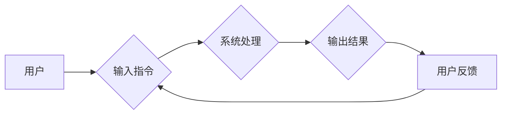

                 

## 人机交互：未来趋势与展望

> 关键词： 人机交互、自然语言处理、人工智能、增强现实、虚拟现实、情感计算、跨模态交互、可穿戴设备

## 1. 背景介绍

人机交互 (Human-Computer Interaction, HCI) 是计算机科学的一个重要分支，致力于研究人和计算机之间如何有效地交流和合作。随着科技的飞速发展，人机交互技术不断革新，从传统的鼠标键盘输入到语音识别、手势识别、脑机接口等，交互方式日益多样化，体验也更加便捷、自然。

早期的人机交互主要依赖于命令行界面和图形用户界面 (GUI)，用户需要通过特定的指令或操作来控制计算机。随着人工智能 (AI) 和自然语言处理 (NLP) 技术的进步，人机交互逐渐向更自然、更智能的方向发展。如今，我们能够通过自然语言与计算机进行对话，让计算机理解我们的意图，并提供相应的帮助。

## 2. 核心概念与联系

人机交互的核心概念包括：

* **用户体验 (User Experience, UX):** 指用户使用产品或服务时的整体感受，包括可用性、易用性、愉悦度等方面。
* **用户界面 (User Interface, UI):** 是用户与计算机交互的媒介，包括所有用户可以感知和操作的元素，例如按钮、菜单、对话框等。
* **交互设计 (Interaction Design):** 是设计用户与系统交互过程的艺术和科学，旨在创造出用户友好、高效、愉悦的交互体验。

**Mermaid 流程图:**



## 3. 核心算法原理 & 具体操作步骤

### 3.1  算法原理概述

人机交互算法的核心是理解用户的意图并提供相应的响应。这涉及到自然语言处理、机器学习、人工智能等多个领域的技术。

* **自然语言处理 (NLP):** 用于处理和理解人类语言，包括文本分析、语音识别、机器翻译等。
* **机器学习 (ML):** 允许计算机从数据中学习，识别模式并做出预测。
* **人工智能 (AI):** 旨在创建能够像人类一样思考和学习的智能系统。

### 3.2  算法步骤详解

1. **输入获取:** 收集用户的输入，例如文本、语音、手势等。
2. **预处理:** 对输入进行清洗、格式化和转换，例如去除停用词、分词、语音转文本等。
3. **意图识别:** 使用 NLP 和 ML 算法识别用户的意图，例如查询信息、执行命令、表达情感等。
4. **实体识别:** 从用户的输入中提取关键信息，例如人名、地名、时间等。
5. **对话管理:** 根据用户的意图和上下文，选择合适的响应并进行对话管理。
6. **输出生成:** 生成自然语言、语音、图像等形式的输出，并将其呈现给用户。

### 3.3  算法优缺点

**优点:**

* **更自然、更人性化:** 用户可以与计算机进行自然语言对话，体验更加便捷、舒适。
* **更智能、更个性化:** AI 算法可以学习用户的习惯和偏好，提供更智能、更个性化的服务。
* **更广泛的应用场景:** 人机交互技术可以应用于各个领域，例如医疗、教育、娱乐等。

**缺点:**

* **技术复杂:** 人机交互算法涉及多个领域的技术，开发难度较高。
* **数据依赖:** AI 算法需要大量的数据进行训练，数据质量直接影响算法性能。
* **伦理问题:** 人机交互技术的发展也带来了一些伦理问题，例如隐私保护、算法偏见等。

### 3.4  算法应用领域

* **智能客服:** 自动化处理用户咨询，提高服务效率。
* **语音助手:** 通过语音识别和自然语言理解，帮助用户完成各种任务。
* **虚拟助理:** 提供个性化的服务，例如日程安排、信息查询、娱乐推荐等。
* **游戏:** 创造更加沉浸式、交互式的游戏体验。
* **教育:** 提供个性化的学习体验，辅助教学和学习。

## 4. 数学模型和公式 & 详细讲解 & 举例说明

### 4.1  数学模型构建

人机交互算法中常用的数学模型包括：

* **概率模型:** 用于描述用户行为的概率分布，例如隐马尔可夫模型 (HMM) 用于语音识别，朴素贝叶斯模型 (Naive Bayes) 用于文本分类。
* **统计模型:** 用于分析用户数据，例如线性回归模型用于预测用户行为，逻辑回归模型用于分类用户。
* **神经网络模型:** 用于学习复杂的模式，例如卷积神经网络 (CNN) 用于图像识别，循环神经网络 (RNN) 用于自然语言处理。

### 4.2  公式推导过程

例如，朴素贝叶斯模型用于文本分类，其核心公式为：

$$P(C|D) = \frac{P(D|C)P(C)}{P(D)}$$

其中：

* $P(C|D)$ 是给定文档 $D$ 的情况下类别 $C$ 的概率。
* $P(D|C)$ 是给定类别 $C$ 的情况下文档 $D$ 的概率。
* $P(C)$ 是类别 $C$ 的先验概率。
* $P(D)$ 是文档 $D$ 的概率。

### 4.3  案例分析与讲解

假设我们有一个文本分类任务，需要将邮件分类为“垃圾邮件”或“正常邮件”。我们可以使用朴素贝叶斯模型进行分类。

首先，我们需要收集大量的邮件数据，并标记其类别。然后，我们可以使用这些数据训练朴素贝叶斯模型，学习“垃圾邮件”和“正常邮件”的特征。

当我们收到一封新的邮件时，我们可以使用训练好的模型来预测其类别。模型会根据邮件内容的特征，计算出邮件属于“垃圾邮件”或“正常邮件”的概率，并选择概率更高的类别作为预测结果。

## 5. 项目实践：代码实例和详细解释说明

### 5.1  开发环境搭建

* **操作系统:** Windows、macOS 或 Linux
* **编程语言:** Python
* **开发工具:** PyCharm、VS Code 等

### 5.2  源代码详细实现

```python
# 导入必要的库
import nltk
from nltk.corpus import stopwords
from sklearn.feature_extraction.text import TfidfVectorizer
from sklearn.naive_bayes import MultinomialNB
from sklearn.model_selection import train_test_split

# 加载邮件数据
emails = [
    ("This is spam.", "spam"),
    ("I love this product!", "ham"),
    ("Beware of phishing scams.", "spam"),
    ("Meeting tomorrow at 10am.", "ham"),
]

# 预处理邮件数据
stop_words = set(stopwords.words('english'))
def preprocess_email(email):
    words = nltk.word_tokenize(email)
    words = [word.lower() for word in words if word.isalnum() and word not in stop_words]
    return " ".join(words)

processed_emails = [preprocess_email(email) for email, label in emails]

# 训练模型
X_train, X_test, y_train, y_test = train_test_split(processed_emails, [label for email, label in emails], test_size=0.2)
vectorizer = TfidfVectorizer()
X_train = vectorizer.fit_transform(X_train)
X_test = vectorizer.transform(X_test)
model = MultinomialNB()
model.fit(X_train, y_train)

# 预测结果
predictions = model.predict(X_test)

# 评估模型性能
accuracy = (predictions == y_test).sum() / len(y_test)
print(f"Accuracy: {accuracy}")
```

### 5.3  代码解读与分析

这段代码演示了如何使用朴素贝叶斯模型进行邮件分类。

首先，我们导入必要的库，并加载邮件数据。然后，我们对邮件数据进行预处理，例如去除停用词、转换为小写等。

接下来，我们使用 `train_test_split` 函数将数据分为训练集和测试集。然后，我们使用 `TfidfVectorizer` 将文本数据转换为数字向量。

最后，我们使用 `MultinomialNB` 类训练朴素贝叶斯模型，并使用测试集评估模型性能。

### 5.4  运行结果展示

运行这段代码后，会输出模型的准确率。

## 6. 实际应用场景

### 6.1  智能客服

智能客服系统可以利用自然语言处理技术，自动理解用户的咨询内容，并提供相应的回复。例如，用户可以向智能客服询问产品信息、订单状态等问题，智能客服可以根据预先定义的知识库和规则，快速准确地回答用户问题。

### 6.2  语音助手

语音助手，例如 Siri、Alexa 和 Google Assistant，可以理解用户的语音指令，并执行相应的操作。例如，用户可以利用语音助手播放音乐、设置闹钟、发送短信等。

### 6.3  虚拟现实 (VR) 和增强现实 (AR)

VR 和 AR 技术可以创造更加沉浸式的交互体验。例如，在 VR 游戏中，用户可以通过手势控制虚拟角色，与虚拟世界进行互动。在 AR 应用中，用户可以利用手机摄像头，将虚拟物体叠加到现实世界中。

### 6.4  未来应用展望

人机交互技术的发展将带来更多创新应用场景，例如：

* **脑机接口:** 通过脑电波识别用户的意图，实现无障碍交互。
* **情感计算:** 识别用户的 emosi，提供更加个性化的服务。
* **跨模态交互:** 融合文本、语音、图像、视频等多种模态信息，创造更加自然、丰富的交互体验。

## 7. 工具和资源推荐

### 7.1  学习资源推荐

* **书籍:**
    * 《Designing for Emotion》 by Aarron Walter
    * 《Don't Make Me Think》 by Steve Krug
    * 《The Design of Everyday Things》 by Don Norman
* **在线课程:**
    * Coursera: Human-Computer Interaction Specialization
    * edX: Introduction to Human-Computer Interaction
    * Udemy: The Complete Guide to User Experience (UX) Design

### 7.2  开发工具推荐

* **设计工具:**
    * Figma
    * Sketch
    * Adobe XD
* **开发工具:**
    * Python
    * JavaScript
    * React
    * Angular

### 7.3  相关论文推荐

* **论文:**
    * "A Survey of Human-Computer Interaction" by John M. Carroll
    * "The Design of Everyday Things" by Don Norman
    * "Designing for Emotion" by Aarron Walter

## 8. 总结：未来发展趋势与挑战

### 8.1  研究成果总结

人机交互技术取得了显著的进展，从传统的命令行界面到如今的自然语言交互，用户体验不断提升。AI、NLP、机器学习等技术的进步推动了人机交互的智能化和个性化发展。

### 8.2  未来发展趋势

* **更自然、更智能的交互:** 人机交互将更加自然、智能，例如脑机接口、情感计算等技术将得到更广泛的应用。
* **跨模态交互:** 融合文本、语音、图像、视频等多种模态信息，创造更加丰富、沉浸式的交互体验。
* **个性化定制:** 人机交互系统将更加个性化，根据用户的习惯和偏好提供定制化的服务。

### 8.3  面临的挑战

* **数据安全和隐私保护:** 人机交互系统需要处理大量用户数据，如何保障数据安全和隐私是重要的挑战。
* **算法偏见:** 人工智能算法可能存在偏见，导致人机交互体验不公平。
* **伦理问题:** 人机交互技术的进步也带来了一些伦理问题，例如人工智能的责任和义务等。

### 8.4  研究展望

未来，人机交互研究将继续探索更自然、更智能、更安全的交互方式，为人类创造更加便捷、高效、愉悦的数字体验。

## 9. 附录：常见问题与解答

### 9.1  常见问题

* **什么是人机交互？**

人机交互 (HCI) 是研究人和计算机之间如何有效地交流和合作的学科。

* **人机交互有哪些重要概念？**

一些重要概念包括用户体验 (UX)、用户界面 (UI) 和交互设计。

* **人机交互技术有哪些应用场景？**

人机交互技术广泛应用于智能客服、语音助手、虚拟现实 (VR) 和增强现实 (AR) 等领域。

* **未来人机交互的发展趋势是什么？**

未来人机交互将更加自然、智能、个性化，例如脑机接口、情感计算等技术将得到更广泛的应用。

### 9.2  解答

* **什么是人机交互？**

人机交互 (HCI) 是研究人和计算机之间如何有效地交流和合作的学科。它涵盖了用户体验、用户界面设计、交互设计等多个方面。

* **人机交互有哪些重要概念？**

一些重要概念包括：

* **用户体验 (UX):** 指用户使用产品或服务时的整体感受，包括可用性、易用性、愉悦度等方面。
* **用户界面 (UI):** 是用户与计算机交互的媒介，包括所有用户可以感知和操作的元素，例如按钮、菜单、对话框等。
* **交互设计:** 是设计用户与系统交互过程的艺术和科学，旨在创造出用户友好、高效、愉悦的交互体验。

* **人机交互技术有哪些应用场景？**

人机交互技术广泛应用于各个领域，例如：

* **智能客服:** 自动化处理用户咨询，提高服务效率。
* **语音助手:** 通过语音识别和自然语言理解，帮助用户完成各种任务。
* **虚拟现实 (VR) 和增强现实 (AR):** 创造更加沉浸式的交互体验。
* **游戏:** 创造更加交互式、沉浸式的游戏体验。
* **教育:** 提供个性化的学习体验，辅助教学和学习。

* **未来人机交互的发展趋势是什么？**

未来人机交互将更加自然、智能、个性化，例如：

* **脑机接口:** 通过脑电波识别用户的意图，实现无障碍交互。
* **情感计算:** 识别用户的 emosi，提供更加个性化的服务。
* **跨模态交互:** 融合文本、语音、图像、视频等多种模态信息，创造更加丰富、沉浸式的交互体验。


作者：禅与计算机程序设计艺术 / Zen and the Art of Computer Programming<end_of_turn>

