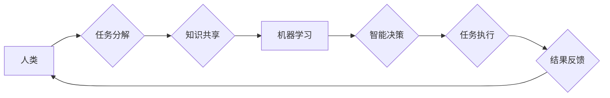

                 

## 人机协作：通向未来的智能之路

> 关键词： 人机协作、人工智能、协同智能、机器学习、自然语言处理、深度学习、未来趋势

### 1. 背景介绍

人类文明的发展离不开对工具的不断革新和利用。从石器时代的手工艺工具到现代的智能手机，工具的演变始终推动着人类社会进步。而人工智能（AI）的出现，无疑是人类历史上又一次重要的技术变革，它将深刻地改变我们与工具、与世界、与自身的互动方式。

传统的AI系统往往被视为独立的智能体，它们能够执行特定的任务，但缺乏与人类的有效协作能力。然而，随着人工智能技术的不断发展，人机协作（Human-Computer Collaboration）逐渐成为一个重要的研究方向。人机协作旨在通过融合人类的智慧和机器的计算能力，实现更高效、更智能的协作模式。

### 2. 核心概念与联系

人机协作的核心概念是将人类和机器视为平等的合作伙伴，共同完成复杂的任务。这种合作关系并非简单的指令型控制，而是基于对彼此能力的理解和互补，通过信息共享、任务分工、决策融合等方式实现协同智能。

**Mermaid 流程图：人机协作模式**



**2.1 人类角色**

* 提供高层目标和策略指导
* 提出问题、分析问题、解决问题
* 评估结果、提供反馈、调整策略

**2.2 机器角色**

* 快速处理大量数据、进行计算
* 提供数据分析、预测、建议
* 自动执行重复性任务、提高效率

**2.3 协作机制**

* **信息共享:** 人类和机器之间需要能够有效地共享信息，包括任务目标、数据、知识、经验等。
* **任务分工:** 根据各自的优势，将任务分解成不同的子任务，由人类和机器分别负责执行。
* **决策融合:** 人类和机器需要共同参与决策过程，将各自的判断和分析结果融合在一起，做出最终的决策。

### 3. 核心算法原理 & 具体操作步骤

人机协作的实现离不开各种算法的支持。以下将介绍一些常用的算法原理和具体操作步骤。

**3.1 算法原理概述**

* **强化学习 (Reinforcement Learning):** 机器通过与环境交互，学习最优的行为策略，以获得最大奖励。
* **迁移学习 (Transfer Learning):** 利用已有的知识和经验，迁移到新的任务或领域，提高学习效率。
* **联邦学习 (Federated Learning):** 在不共享原始数据的情况下，通过模型参数的更新迭代，实现分布式机器学习。

**3.2 算法步骤详解**

**强化学习:**

1. 定义奖励函数，明确机器的行为目标。
2. 设计环境模型，模拟真实世界或特定任务场景。
3. 机器在环境中采取行动，获得奖励或惩罚。
4. 根据奖励信号，更新机器的行为策略，使其在未来获得更高的奖励。

**迁移学习:**

1. 选择源任务和目标任务，源任务的数据量较大，目标任务的数据量较小。
2. 在源任务上训练模型，获得预训练模型。
3. 将预训练模型迁移到目标任务，并进行微调。

**联邦学习:**

1. 将训练数据分散存储在各个设备上。
2. 各设备训练模型，并上传模型参数到中央服务器。
3. 中央服务器聚合所有设备的模型参数，更新全局模型。
4. 将更新后的全局模型分发回各个设备，重复上述步骤。

**3.3 算法优缺点**

**强化学习:**

* **优点:** 可以学习复杂的行为策略，适应动态变化的环境。
* **缺点:** 需要大量的训练数据和计算资源，训练过程可能很漫长。

**迁移学习:**

* **优点:** 可以有效利用已有知识，降低目标任务的训练成本。
* **缺点:** 源任务和目标任务之间需要有一定的相似性，否则迁移效果不佳。

**联邦学习:**

* **优点:** 保护数据隐私，可以训练大型模型。
* **缺点:** 需要协调多个设备的训练过程，通信成本较高。

**3.4 算法应用领域**

* **强化学习:** 自动驾驶、机器人控制、游戏 AI
* **迁移学习:** 自然语言处理、图像识别、医疗诊断
* **联邦学习:** 医疗数据分析、金融风险评估、个性化推荐

### 4. 数学模型和公式 & 详细讲解 & 举例说明

人机协作的实现需要建立数学模型来描述和分析人类和机器之间的交互关系。以下将介绍一些常用的数学模型和公式，并结合实际例子进行讲解。

**4.1 数学模型构建**

* **合作博弈模型:** 将人机协作视为一个博弈过程，其中人类和机器是参与者，目标是共同获得最大收益。
* **贝叶斯网络:** 用于表示人类和机器之间的知识和信念，并进行概率推理。
* **多智能体系统模型:** 用于模拟多个智能体（包括人类和机器）之间的交互和协作。

**4.2 公式推导过程**

**合作博弈模型:**

假设人类和机器参与一个合作博弈，每个参与者都有自己的策略和收益函数。

* $u_h(s_h, s_m)$: 人类的收益函数，其中 $s_h$ 是人类的策略，$s_m$ 是机器的策略。
* $u_m(s_h, s_m)$: 机器人的收益函数。

合作博弈的目标是找到一个策略组合 $(s_h^*, s_m^*)$，使得人类和机器的总收益最大化。

$$
\max_{s_h, s_m} u_h(s_h, s_m) + u_m(s_h, s_m)
$$

**4.3 案例分析与讲解**

**自然语言处理:**

在机器翻译任务中，可以使用贝叶斯网络来表示人类和机器之间的知识和信念。例如，可以建立一个贝叶斯网络来表示单词之间的语义关系，以及句子结构的规则。通过对输入文本进行概率推理，机器可以生成更准确的翻译结果。

### 5. 项目实践：代码实例和详细解释说明

以下将以一个简单的代码实例，展示如何实现人机协作的文本生成任务。

**5.1 开发环境搭建**

* Python 3.x
* TensorFlow 或 PyTorch

**5.2 源代码详细实现**

```python
import tensorflow as tf

# 定义文本生成模型
model = tf.keras.Sequential([
    tf.keras.layers.Embedding(vocab_size, embedding_dim),
    tf.keras.layers.LSTM(units),
    tf.keras.layers.Dense(vocab_size, activation='softmax')
])

# 加载训练数据
(x_train, y_train), (x_test, y_test) = load_dataset()

# 训练模型
model.compile(loss='sparse_categorical_crossentropy', optimizer='adam')
model.fit(x_train, y_train, epochs=10)

# 人机协作文本生成
def generate_text(prompt):
    # 将提示文本转换为模型输入格式
    input_text = tf.convert_to_tensor([prompt])

    # 使用模型生成文本
    generated_text = model.predict(input_text)

    # 将预测结果转换为文本
    return decode_text(generated_text)

# 用户输入提示文本
prompt = "今天天气真好"

# 使用模型生成文本
generated_text = generate_text(prompt)

# 打印生成文本
print(generated_text)
```

**5.3 代码解读与分析**

* 代码首先定义了一个文本生成模型，使用 LSTM 网络结构。
* 然后加载训练数据，并使用 Adam 优化器训练模型。
* 在人机协作文本生成过程中，用户输入提示文本，模型根据提示文本生成后续文本。

**5.4 运行结果展示**

运行代码后，模型会根据用户输入的提示文本，生成一段相关的文本。例如，如果用户输入 "今天天气真好"，模型可能会生成 "适合出去散步" 这样的文本。

### 6. 实际应用场景

人机协作已经开始应用于各个领域，例如：

* **医疗保健:** 人工智能辅助诊断、个性化治疗方案
* **教育:** 智能辅导系统、个性化学习路径
* **金融:** 风险评估、欺诈检测
* **制造业:** 自动化生产、质量控制

**6.4 未来应用展望**

随着人工智能技术的不断发展，人机协作将更加广泛地应用于各个领域，例如：

* **科学研究:** 人工智能辅助科学发现、加速科研进度
* **艺术创作:** 人机协作创作音乐、绘画、文学作品
* **社会治理:** 人工智能辅助决策、提高社会效率

### 7. 工具和资源推荐

**7.1 学习资源推荐**

* **书籍:**
    * 人机协作：未来智能之路
    * 人工智能：一种现代方法
* **在线课程:**
    * Coursera: 人工智能
    * edX: 人工智能与机器学习

**7.2 开发工具推荐**

* **TensorFlow:** 开源深度学习框架
* **PyTorch:** 开源深度学习框架
* **OpenAI API:** 提供各种人工智能模型的 API

**7.3 相关论文推荐**

* 人机协作中的强化学习
* 迁移学习在自然语言处理中的应用
* 联邦学习在医疗数据分析中的应用

### 8. 总结：未来发展趋势与挑战

人机协作是人工智能发展的重要方向，它将深刻地改变我们的生活和工作方式。未来，人机协作将更加智能、更加协同、更加普惠。

**8.1 研究成果总结**

* 人机协作算法取得了显著进展，例如强化学习、迁移学习、联邦学习等。
* 人机协作系统在各个领域取得了应用成功，例如医疗保健、教育、金融等。

**8.2 未来发展趋势**

* 人机协作将更加智能化，能够更好地理解和响应人类的需求。
* 人机协作将更加协同化，能够更好地融合人类和机器的优势。
* 人机协作将更加普惠化，能够为更多的人提供便利和帮助。

**8.3 面临的挑战**

* 如何确保人机协作系统的安全性、可靠性和可解释性。
* 如何解决人机协作中的伦理问题，例如数据隐私、算法偏见等。
* 如何促进人机协作的普及和应用，让更多的人能够受益。

**8.4 研究展望**

* 深入研究人机交互的认知机制，设计更加自然、更加人性化的交互方式。
* 开发更加安全、更加可靠、更加可解释的人机协作算法。
* 探索人机协作在更多领域的新应用，推动社会进步。

### 9. 附录：常见问题与解答

**常见问题:**

* 人机协作与人工智能有什么区别？
* 人机协作有哪些应用场景？
* 如何学习人机协作相关知识？

**解答:**

* 人工智能是指机器能够模拟人类智能的行为，而人机协作是指人类和机器共同完成任务的合作模式。
* 人机协作的应用场景非常广泛，例如医疗保健、教育、金融、制造业等。
* 可以通过阅读相关书籍、在线课程、论文等方式学习人机协作相关知识。


作者：禅与计算机程序设计艺术 / Zen and the Art of Computer Programming 
<end_of_turn>

