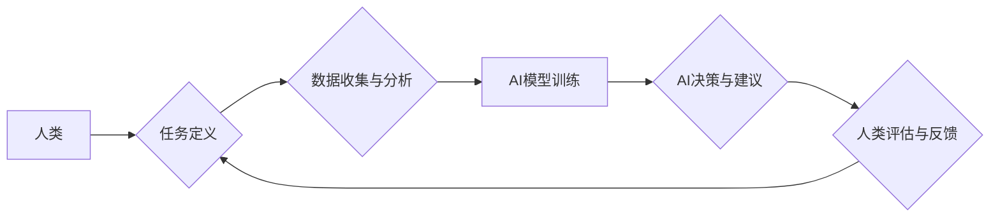

                 

## 人类-AI协作：为人类服务的设计

> 关键词：人工智能、协作、设计原则、人类中心、伦理、可解释性、未来趋势

### 1. 背景介绍

人工智能（AI）技术近年来发展迅速，已渗透到各个领域，从自动驾驶到医疗诊断，从个性化推荐到科学研究，AI正在改变着我们的生活方式和工作模式。然而，AI技术的发展也引发了许多伦理、社会和技术挑战。如何确保AI技术真正为人类服务，而不是成为人类的负担或威胁，成为一个亟待解决的问题。

人类-AI协作，即人类与人工智能系统共同完成任务，已成为解决这一问题的关键路径。通过充分发挥人类的创造力、批判性思维和情感智能，以及AI的计算能力、数据处理能力和自动化能力，人类-AI协作可以实现协同增效，创造更大的价值。

### 2. 核心概念与联系

**2.1 核心概念**

* **人类中心设计 (Human-Centered Design):** 将人类需求、目标和体验放在首位，以人为本的设计理念。
* **协作 (Collaboration):** 人类和AI系统之间相互配合、共同完成任务的过程。
* **可解释性 (Explainability):** AI系统决策过程的透明度和可理解性。
* **伦理 (Ethics):** AI技术应用的道德原则和规范。

**2.2 架构图**



**2.3 联系**

人类-AI协作的核心在于建立一种高效、透明、可控的合作关系。人类负责定义任务、提供数据和反馈，并对AI系统的决策进行评估和监督；AI系统负责数据分析、模型训练和决策建议，并根据人类反馈进行优化和改进。

### 3. 核心算法原理 & 具体操作步骤

**3.1 算法原理概述**

人类-AI协作的核心算法通常基于机器学习和深度学习技术。这些算法通过训练大量的样本数据，学习人类的决策模式和行为规律，从而能够辅助人类完成各种任务。

**3.2 算法步骤详解**

1. **数据收集与预处理:** 收集与任务相关的各种数据，并进行清洗、转换和特征提取等预处理工作。
2. **模型选择与训练:** 选择合适的机器学习或深度学习模型，并根据训练数据进行模型训练。
3. **模型评估与优化:** 使用测试数据评估模型的性能，并根据评估结果进行模型调优和改进。
4. **部署与应用:** 将训练好的模型部署到实际应用场景中，并与人类系统进行交互。

**3.3 算法优缺点**

* **优点:** 能够学习人类的复杂决策模式，提高任务完成效率和准确性。
* **缺点:** 需要大量的训练数据，训练过程耗时且资源消耗大。模型的决策过程可能难以解释，缺乏透明度。

**3.4 算法应用领域**

* **医疗诊断:** 利用AI辅助医生诊断疾病，提高诊断准确率。
* **金融风险管理:** 利用AI识别金融风险，降低风险损失。
* **个性化教育:** 利用AI根据学生的学习情况提供个性化的学习方案。
* **自动驾驶:** 利用AI控制车辆行驶，实现自动驾驶功能。

### 4. 数学模型和公式 & 详细讲解 & 举例说明

**4.1 数学模型构建**

人类-AI协作系统可以抽象为一个博弈模型，其中人类和AI系统是参与者，任务完成是目标。

**4.2 公式推导过程**

假设人类和AI系统分别拥有决策权重为 $w_h$ 和 $w_a$，则任务完成的最终决策可以表示为：

$$
D = w_h * D_h + w_a * D_a
$$

其中，$D$ 是最终决策，$D_h$ 是人类的决策，$D_a$ 是AI系统的决策。

**4.3 案例分析与讲解**

在自动驾驶场景中，人类驾驶员和AI系统可以协作完成驾驶任务。人类驾驶员负责制定全局路线和应对突发情况，AI系统负责控制车辆行驶，例如加速、减速、转向等。

假设人类驾驶员的决策权重为 $w_h = 0.7$，AI系统的决策权重为 $w_a = 0.3$。当车辆遇到红灯时，人类驾驶员会做出停车决策，而AI系统会根据路况和交通规则给出停车建议。最终的决策将根据权重进行加权平均，例如：

$$
D = 0.7 * D_h + 0.3 * D_a = 0.7 * \text{停车} + 0.3 * \text{停车} = \text{停车}
$$

### 5. 项目实践：代码实例和详细解释说明

**5.1 开发环境搭建**

* 操作系统：Ubuntu 20.04
* Python 版本：3.8
* 必要的库：TensorFlow、PyTorch、NumPy、Pandas

**5.2 源代码详细实现**

```python
import tensorflow as tf

# 定义模型结构
model = tf.keras.models.Sequential([
    tf.keras.layers.Dense(128, activation='relu', input_shape=(10,)),
    tf.keras.layers.Dense(64, activation='relu'),
    tf.keras.layers.Dense(1, activation='sigmoid')
])

# 编译模型
model.compile(optimizer='adam',
              loss='binary_crossentropy',
              metrics=['accuracy'])

# 训练模型
model.fit(x_train, y_train, epochs=10)

# 评估模型
loss, accuracy = model.evaluate(x_test, y_test)
print('Loss:', loss)
print('Accuracy:', accuracy)
```

**5.3 代码解读与分析**

这段代码实现了简单的机器学习模型训练。

* `tf.keras.models.Sequential` 定义了一个顺序模型，即层级结构的模型。
* `tf.keras.layers.Dense` 定义了全连接层，每个神经元都连接到上一层的每个神经元。
* `activation='relu'` 指定了激活函数为ReLU函数，用于引入非线性。
* `input_shape=(10,)` 指定了输入数据的形状为10维向量。
* `optimizer='adam'` 指定了优化算法为Adam算法，用于更新模型参数。
* `loss='binary_crossentropy'` 指定了损失函数为二分类交叉熵函数，用于衡量模型预测结果与真实标签之间的差异。
* `metrics=['accuracy']` 指定了评估指标为准确率，用于衡量模型预测结果的正确率。

**5.4 运行结果展示**

训练完成后，模型会输出训练过程中的损失值和准确率，以及测试集上的损失值和准确率。

### 6. 实际应用场景

**6.1 医疗诊断辅助**

AI可以辅助医生诊断疾病，例如识别肿瘤、预测患者风险等。

**6.2 金融风险管理**

AI可以识别金融风险，例如欺诈交易、信用风险等。

**6.3 个性化教育**

AI可以根据学生的学习情况提供个性化的学习方案，提高学习效率。

**6.4 自动驾驶**

AI可以控制车辆行驶，实现自动驾驶功能。

**6.5 未来应用展望**

随着AI技术的不断发展，人类-AI协作将应用于更多领域，例如科学研究、艺术创作、社会治理等。

### 7. 工具和资源推荐

**7.1 学习资源推荐**

* **书籍:**
    * 《深度学习》
    * 《人工智能：一种现代方法》
* **在线课程:**
    * Coursera 上的机器学习课程
    * edX 上的深度学习课程

**7.2 开发工具推荐**

* **TensorFlow:** 开源深度学习框架
* **PyTorch:** 开源深度学习框架
* **Scikit-learn:** 开源机器学习库

**7.3 相关论文推荐**

* 《Attention Is All You Need》
* 《BERT: Pre-training of Deep Bidirectional Transformers for Language Understanding》

### 8. 总结：未来发展趋势与挑战

**8.1 研究成果总结**

人类-AI协作已取得显著成果，在多个领域展现出巨大的应用潜力。

**8.2 未来发展趋势**

* **更强的可解释性:** 研究更可解释的AI算法，提高人类对AI决策的理解。
* **更强的安全性:** 研究更安全的AI系统，防止AI被恶意利用。
* **更广泛的应用:** 将AI应用于更多领域，解决更多人类面临的挑战。

**8.3 面临的挑战**

* **数据获取和隐私保护:** AI算法需要大量数据进行训练，如何获取高质量数据并保护用户隐私是一个重要挑战。
* **算法偏见:** AI算法可能存在偏见，导致不公平的结果，需要研究如何消除算法偏见。
* **伦理规范:** AI技术的应用需要遵循伦理规范，避免造成负面影响。

**8.4 研究展望**

未来，人类-AI协作将继续朝着更智能、更安全、更可解释的方向发展，为人类社会创造更大的价值。

### 9. 附录：常见问题与解答

**9.1 如何确保AI系统安全可靠？**

* 使用安全的机器学习算法和训练数据。
* 对AI系统进行严格的测试和评估。
* 建立完善的监控和安全机制。

**9.2 如何解决AI算法的偏见问题？**

* 使用多样化的训练数据，减少数据偏差。
* 开发算法去偏见的方法。
* 对AI系统进行公平性评估和监控。

**9.3 如何提高AI系统的可解释性？**

* 使用可解释的机器学习算法。
* 开发可视化工具，帮助人类理解AI决策过程。
* 建立AI决策的解释框架。


作者：禅与计算机程序设计艺术 / Zen and the Art of Computer Programming 
<end_of_turn>

