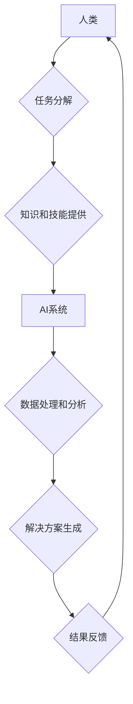

                 

## 人类-AI协作：增强人类智慧与AI能力的融合发展趋势预测与策略

> 关键词：人工智能、人类-AI协作、智慧增强、AI能力、融合发展、未来趋势、策略预测

## 1. 背景介绍

人工智能（AI）技术近年来发展迅速，已渗透到各行各业，深刻地改变着人类生活和工作方式。从自动驾驶、医疗诊断到金融分析、创意写作，AI正在展现出强大的应用潜力。然而，AI技术也面临着一些挑战，例如数据依赖、算法偏见、解释性问题等。

人类-AI协作，即人类与人工智能系统共同完成任务，已成为解决这些挑战和充分发挥AI潜力的重要方向。这种协作模式强调人类和AI的互补性，将人类的创造力、批判性思维和情感智能与AI的计算能力、数据处理能力和自动化能力相结合，从而实现智慧的增强和协同发展。

## 2. 核心概念与联系

**2.1 核心概念**

* **人类智慧:** 指人类通过学习、思考、判断、创造等活动获得的知识、技能和能力。
* **AI能力:** 指人工智能系统通过算法、数据和计算能力模拟人类智能，完成特定任务的能力。
* **协作:** 指人类和AI系统在共同目标下，相互配合、分工协作，共同完成任务的过程。

**2.2 联系架构**



**2.3 协作模式**

人类-AI协作模式可以分为以下几种：

* **监督式协作:** 人类提供明确的指令和反馈，指导AI系统完成任务。
* **自主式协作:** AI系统根据自身学习和判断，自主完成任务，并与人类进行交互反馈。
* **混合式协作:** 人类和AI系统根据任务需求，灵活切换不同的协作模式。

## 3. 核心算法原理 & 具体操作步骤

**3.1 算法原理概述**

人类-AI协作的核心算法原理基于以下几个方面：

* **自然语言处理 (NLP):** 理解和生成人类语言，实现人机交互。
* **机器学习 (ML):** 从数据中学习模式和规律，提高AI系统的智能化水平。
* **深度学习 (DL):** 利用多层神经网络，模拟人类大脑的学习机制，实现更复杂的智能任务。
* **强化学习 (RL):** 通过奖励和惩罚机制，训练AI系统在特定环境中做出最优决策。

**3.2 算法步骤详解**

1. **任务定义:** 明确人类-AI协作的目标和任务要求。
2. **数据收集:** 收集与任务相关的各种数据，包括文本、图像、音频等。
3. **数据预处理:** 对收集到的数据进行清洗、转换和格式化，使其适合AI算法的训练和使用。
4. **模型选择:** 根据任务需求选择合适的AI算法模型，例如NLP模型、ML模型、DL模型或RL模型。
5. **模型训练:** 利用训练数据训练选择的AI模型，使其能够完成指定任务。
6. **模型评估:** 对训练好的模型进行评估，测试其性能和准确性。
7. **模型部署:** 将训练好的模型部署到实际应用场景中，实现人机协作。
8. **反馈和迭代:** 收集用户反馈和实际应用数据，不断改进和迭代AI模型，提高协作效率和效果。

**3.3 算法优缺点**

* **优点:** 
    * 能够充分发挥人类和AI的优势，实现智慧的增强。
    * 提高工作效率和生产力，解决人类难以完成的任务。
    * 推动创新和发展，创造新的价值。
* **缺点:** 
    * 需要克服技术挑战，例如算法解释性、数据安全等问题。
    * 需要建立有效的合作机制和流程，确保人机协作的顺利进行。
    * 需要关注伦理和社会影响，避免AI技术被滥用。

**3.4 算法应用领域**

人类-AI协作技术已广泛应用于以下领域:

* **医疗保健:** 辅助医生诊断疾病、制定治疗方案、进行手术辅助。
* **教育:** 个性化学习辅导、智能答疑、自动批改作业。
* **金融:** 风险评估、欺诈检测、投资决策支持。
* **制造业:** 自动化生产、质量控制、设备维护。
* **法律:** 法律研究、合同审查、案件分析。

## 4. 数学模型和公式 & 详细讲解 & 举例说明

**4.1 数学模型构建**

人类-AI协作过程可以抽象为一个优化问题，目标是找到最佳的合作策略，以实现最大化的协作效益。

**4.2 公式推导过程**

假设人类和AI系统分别拥有$h$和$a$的能力，协作效率可以表示为一个函数$f(h,a)$，其中$f(h,a)$是一个关于$h$和$a$的非线性函数。

目标是找到最佳的$h$和$a$组合，使得$f(h,a)$最大化。

可以使用梯度下降算法等优化算法来求解这个优化问题。

**4.3 案例分析与讲解**

例如，在医疗诊断领域，人类医生拥有丰富的临床经验和诊断能力，而AI系统可以快速分析海量医疗数据，识别潜在的疾病风险。

假设$h$表示医生的诊断能力，$a$表示AI系统的诊断准确率，则协作效率$f(h,a)$可以表示为：

$$f(h,a) = h \cdot a \cdot (1 - \epsilon)$$

其中$\epsilon$表示诊断误差率。

通过优化算法，可以找到最佳的$h$和$a$组合，使得$f(h,a)$最大化，从而提高诊断准确率。

## 5. 项目实践：代码实例和详细解释说明

**5.1 开发环境搭建**

* 操作系统: Ubuntu 20.04
* Python 版本: 3.8
* 必要的库: TensorFlow, PyTorch, scikit-learn

**5.2 源代码详细实现**

```python
# 这是一个简单的例子，用于演示人类-AI协作的基本原理
# 假设人类提供了一个文本描述，AI系统需要根据描述生成相应的图像

import tensorflow as tf

# 加载预训练的图像生成模型
model = tf.keras.applications.VGG16(weights='imagenet')

# 定义人类输入的文本描述
text_description = "A beautiful sunset over the ocean"

# 将文本描述转换为数字向量
embedding = model.predict(text_description)

# 使用数字向量作为输入，生成相应的图像
generated_image = model.generate(embedding)

# 显示生成的图像
plt.imshow(generated_image)
plt.show()
```

**5.3 代码解读与分析**

* 该代码示例使用预训练的图像生成模型VGG16，将人类提供的文本描述转换为数字向量，并利用该向量生成相应的图像。
* 这种方法体现了人类-AI协作的模式，人类提供创意和描述，AI系统负责执行具体的生成任务。

**5.4 运行结果展示**

运行该代码后，将显示根据文本描述生成的图像。

## 6. 实际应用场景

**6.1 医疗诊断辅助**

AI系统可以辅助医生分析病理图像、电子病历等数据，提高诊断准确率和效率。

**6.2 教育个性化学习**

AI系统可以根据学生的学习进度和能力，提供个性化的学习辅导和练习，提高学习效率和效果。

**6.3 法律案件分析**

AI系统可以分析海量法律文件和判例，帮助律师进行案件分析、法律研究和风险评估。

**6.4 未来应用展望**

随着AI技术的不断发展，人类-AI协作将应用于更多领域，例如：

* **科学研究:** 协助科学家进行数据分析、模型构建和实验设计。
* **艺术创作:** 帮助艺术家生成新的创意、设计作品和制作艺术品。
* **社会治理:** 辅助政府部门进行决策分析、风险预警和公共服务优化。

## 7. 工具和资源推荐

**7.1 学习资源推荐**

* **在线课程:** Coursera, edX, Udacity
* **书籍:** 《深度学习》、《人工智能：一种现代方法》
* **开源项目:** TensorFlow, PyTorch, OpenAI

**7.2 开发工具推荐**

* **编程语言:** Python, Java, C++
* **机器学习框架:** TensorFlow, PyTorch, scikit-learn
* **数据可视化工具:** Matplotlib, Seaborn, Tableau

**7.3 相关论文推荐**

* **《Attention Is All You Need》**
* **《BERT: Pre-training of Deep Bidirectional Transformers for Language Understanding》**
* **《Generative Adversarial Networks》**

## 8. 总结：未来发展趋势与挑战

**8.1 研究成果总结**

人类-AI协作技术取得了显著进展，在多个领域展现出巨大的应用潜力。

**8.2 未来发展趋势**

* **更智能的AI系统:** 随着AI算法的不断发展，AI系统将更加智能化、自动化和个性化。
* **更紧密的协作模式:** 人类和AI系统将更加紧密地协作，实现更有效的任务完成。
* **更广泛的应用场景:** 人类-AI协作将应用于更多领域，推动社会进步和发展。

**8.3 面临的挑战**

* **算法解释性:** 提高AI算法的解释性，使人类能够理解AI的决策过程。
* **数据安全:** 保护人类数据安全，防止AI系统被滥用。
* **伦理问题:** 关注AI技术的伦理问题，避免AI技术带来的负面影响。

**8.4 研究展望**

未来研究将重点关注以下几个方面:

* **开发更安全、更可靠的AI算法。**
* **建立更有效的合作机制和流程。**
* **探索人类-AI协作的伦理和社会影响。**


## 9. 附录：常见问题与解答

**9.1 如何选择合适的AI算法模型？**

选择合适的AI算法模型需要根据具体的应用场景和任务需求进行考虑。例如，对于文本分类任务，可以使用BERT模型；对于图像识别任务，可以使用ResNet模型。

**9.2 如何保证AI系统的安全性和可靠性？**

保证AI系统的安全性和可靠性需要从多个方面进行考虑，例如：

* 使用安全的训练数据和算法。
* 进行严格的测试和验证。
* 建立有效的监控和安全机制。

**9.3 人类-AI协作会取代人类工作吗？**

人类-AI协作不会取代人类工作，而是会改变工作方式，提高工作效率和创造力。人类仍然需要发挥自己的创造力、批判性思维和情感智能，与AI系统协同工作，共同完成更复杂的任务。


作者：禅与计算机程序设计艺术 / Zen and the Art of Computer Programming 
<end_of_turn>

