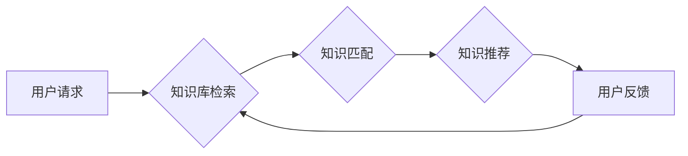

                 

## 人类知识的共享平台：知识就是力量的体现

> 关键词：知识共享、人工智能、平台架构、知识图谱、机器学习、数据可视化、未来趋势

## 1. 背景介绍

在信息爆炸的时代，人类知识的积累和传播速度前所未有。然而，知识的碎片化、分散性和难以获取性仍然是制约人类进步的重要因素。如何构建一个高效、便捷、可持续的知识共享平台，将成为推动人类社会进步的关键。

近年来，人工智能技术的发展为知识共享带来了新的机遇。人工智能能够自动分析、理解和组织知识，并将其以更易于理解和使用的形式呈现。同时，云计算、大数据和物联网等技术的蓬勃发展，为构建大规模、高性能的知识共享平台提供了技术基础。

## 2. 核心概念与联系

**2.1 知识图谱**

知识图谱是一种基于知识表示的数据库，它将知识表示为实体、关系和属性的网络结构。知识图谱能够有效地捕捉知识之间的关联性，并支持复杂的知识推理和查询。

**2.2 人工智能**

人工智能是指模拟人类智能行为的计算机系统。在知识共享领域，人工智能可以用于知识的自动提取、分类、组织和推荐。

**2.3 平台架构**

知识共享平台的架构应具备以下特点：

* **开放性和可扩展性:** 平台应该能够支持来自不同来源的知识数据，并能够随着知识库的不断扩展而灵活调整。
* **安全性与隐私保护:** 平台应该能够保障知识数据的安全性和用户隐私。
* **用户友好性:** 平台应该提供直观易用的界面，方便用户浏览、搜索和分享知识。

**2.4 流程图**



## 3. 核心算法原理 & 具体操作步骤

**3.1 算法原理概述**

知识推荐算法的核心是根据用户的历史行为、兴趣偏好和知识图谱中的关系，预测用户可能感兴趣的知识。常用的算法包括：

* **协同过滤:** 基于其他用户相似行为的知识推荐。
* **内容过滤:** 基于知识内容本身的特征进行推荐。
* **基于图的推荐:** 基于知识图谱中的关系和路径进行推荐。

**3.2 算法步骤详解**

以基于图的推荐算法为例，具体步骤如下：

1. **构建知识图谱:** 将知识表示为实体、关系和属性的网络结构。
2. **用户兴趣建模:** 根据用户的历史行为和偏好，构建用户的兴趣模型。
3. **知识相似度计算:** 使用图算法计算知识之间的相似度。
4. **推荐知识:** 根据用户的兴趣模型和知识相似度，推荐用户可能感兴趣的知识。

**3.3 算法优缺点**

* **优点:** 能够捕捉知识之间的复杂关系，推荐结果更精准。
* **缺点:** 需要构建完整的知识图谱，算法复杂度较高。

**3.4 算法应用领域**

* **教育领域:** 推荐个性化学习资源。
* **科研领域:** 推荐相关文献和研究成果。
* **商业领域:** 推荐产品和服务。

## 4. 数学模型和公式 & 详细讲解 & 举例说明

**4.1 数学模型构建**

知识图谱可以表示为一个三元组集合：

$$G = {(h, r, t)}$$

其中：

* $h$ 表示主语实体。
* $r$ 表示关系。
* $t$ 表示宾语实体。

**4.2 公式推导过程**

基于图的推荐算法可以使用PageRank算法计算知识的权重。PageRank算法的核心思想是，一个知识的权重与其被其他知识链接的次数成正比。

$$PR(h) = (1-d) + d \sum_{i \in I(h)} \frac{PR(i)}{C(i)}$$

其中：

* $PR(h)$ 表示知识 $h$ 的权重。
* $d$ 表示阻尼因子，通常取值为0.85。
* $I(h)$ 表示链接到知识 $h$ 的其他知识的集合。
* $C(i)$ 表示知识 $i$ 的出度。

**4.3 案例分析与讲解**

假设知识图谱中存在以下三元组：

* $(A, "作者", B)$
* $(B, "出版", C)$
* $(C, "主题", D)$

其中，A表示作者实体，B表示书籍实体，C表示出版社实体，D表示主题实体。

根据PageRank算法，我们可以计算每个知识的权重。例如，知识B的权重将受到知识A和C的影响。

## 5. 项目实践：代码实例和详细解释说明

**5.1 开发环境搭建**

* 操作系统：Ubuntu 20.04
* 编程语言：Python 3.8
* 框架：Flask

**5.2 源代码详细实现**

```python
from flask import Flask, request, jsonify

app = Flask(__name__)

# 知识图谱数据
knowledge_graph = {
    "A": {"作者": "B"},
    "B": {"出版": "C"},
    "C": {"主题": "D"},
}

@app.route('/recommend', methods=['POST'])
def recommend():
    user_id = request.json.get('user_id')
    # 根据用户ID获取用户兴趣模型
    user_interest = get_user_interest(user_id)
    # 基于知识图谱和用户兴趣模型推荐知识
    recommended_knowledge = recommend_knowledge(user_interest, knowledge_graph)
    return jsonify({'recommendations': recommended_knowledge})

# ... 其他函数实现

if __name__ == '__main__':
    app.run(debug=True)
```

**5.3 代码解读与分析**

* 代码使用Flask框架构建了一个简单的API接口。
* `/recommend`接口接收用户ID作为参数，并返回推荐的知识列表。
* `get_user_interest`函数根据用户ID获取用户兴趣模型。
* `recommend_knowledge`函数根据用户兴趣模型和知识图谱推荐知识。

**5.4 运行结果展示**

当用户发送POST请求到`/recommend`接口时，服务器会根据用户ID和知识图谱数据，返回推荐的知识列表。

## 6. 实际应用场景

**6.1 教育领域**

* 个性化学习资源推荐：根据学生的学习进度、兴趣和知识点，推荐相关的学习资源，例如视频、文章、练习题等。
* 智能辅导系统：利用知识图谱和机器学习算法，构建智能辅导系统，为学生提供个性化的学习指导和答疑服务。

**6.2 科研领域**

* 文献推荐：根据研究者的研究方向和兴趣，推荐相关的文献和研究成果。
* 知识发现：利用知识图谱和机器学习算法，挖掘科研领域中的潜在知识和趋势。

**6.3 商业领域**

* 产品推荐：根据用户的购买历史、浏览记录和兴趣偏好，推荐相关的产品和服务。
* 个性化营销：利用知识图谱和机器学习算法，构建个性化营销策略，为用户提供更精准的广告和促销信息。

**6.4 未来应用展望**

随着人工智能和知识图谱技术的不断发展，知识共享平台将更加智能化、个性化和高效化。未来，知识共享平台将能够：

* 更精准地理解用户的需求，提供更个性化的知识推荐。
* 更有效地组织和管理知识，提高知识的发现性和利用率。
* 促进知识的协同创造和共享，推动人类社会进步。

## 7. 工具和资源推荐

**7.1 学习资源推荐**

* **书籍:**
    * 《知识图谱》
    * 《深度学习》
* **在线课程:**
    * Coursera: Knowledge Graphs
    * edX: Artificial Intelligence

**7.2 开发工具推荐**

* **知识图谱构建工具:**
    * Neo4j
    * RDF4J
* **机器学习框架:**
    * TensorFlow
    * PyTorch

**7.3 相关论文推荐**

* **知识图谱:**
    * "A Survey on Knowledge Graph Embedding"
* **机器学习:**
    * "Deep Learning"


## 8. 总结：未来发展趋势与挑战

**8.1 研究成果总结**

本文介绍了知识共享平台的核心概念、算法原理和应用场景，并探讨了未来发展趋势和面临的挑战。

**8.2 未来发展趋势**

* **知识图谱规模和复杂度提升:** 未来知识图谱将包含更丰富、更复杂的知识，需要开发更强大的知识表示和推理方法。
* **人工智能技术的融合:** 人工智能技术将更加深入地融入知识共享平台，实现更智能化的知识推荐、发现和组织。
* **跨领域知识融合:** 不同领域知识的融合将成为未来知识共享平台的重要方向，需要开发跨领域知识表示和推理方法。

**8.3 面临的挑战**

* **知识获取和更新:** 知识的获取和更新是一个持续的过程，需要开发高效的知识采集、清洗和更新方法。
* **知识质量控制:** 知识的准确性和可靠性是知识共享平台的关键问题，需要开发有效的知识质量控制机制。
* **数据隐私和安全:** 知识共享平台需要保障用户数据隐私和安全，需要开发相应的安全机制和隐私保护技术。

**8.4 研究展望**

未来，我们将继续致力于知识共享平台的研究，探索更智能、更高效、更安全的知识共享模式，为人类社会的发展贡献力量。

## 9. 附录：常见问题与解答

**9.1 如何获取知识图谱数据？**

* 可以从公开的知识图谱数据库中获取数据，例如DBpedia、Wikidata等。
* 可以使用web爬虫技术从互联网上爬取知识数据。
* 可以与专家合作，构建领域特定的知识图谱。

**9.2 如何评估知识推荐算法的性能？**

* 可以使用准确率、召回率、F1-score等指标评估算法的性能。
* 可以进行用户实验，收集用户反馈，评估算法的实用性和有效性。


作者：禅与计算机程序设计艺术 / Zen and the Art of Computer Programming 
<end_of_turn>

