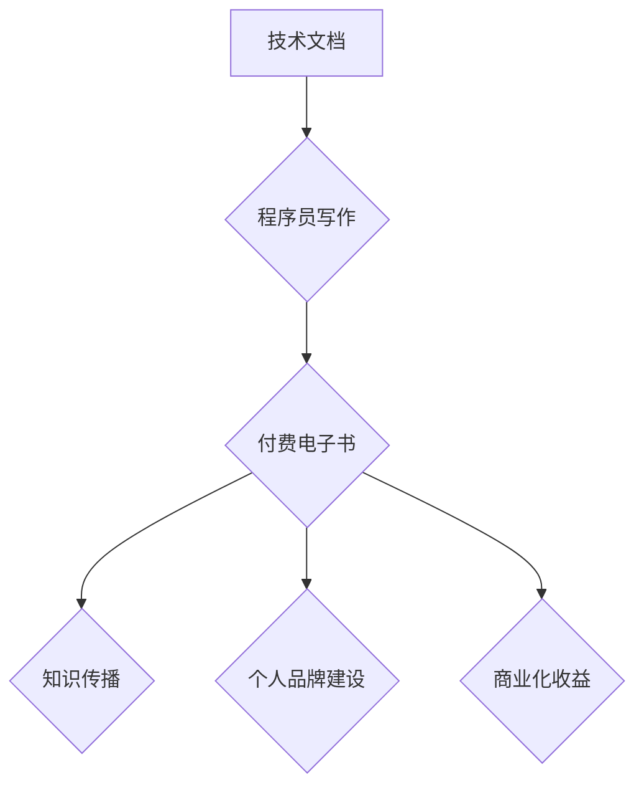

                 

## 从技术文档到付费电子书：程序员的写作之路

> 关键词：技术文档、付费电子书、程序员写作、知识付费、技术传播、内容创作、软件开发、技术博客

## 1. 背景介绍

在当今科技日新月异的时代，程序员们不仅需要精通各种编程语言和技术，更需要具备优秀的沟通和表达能力。技术文档是程序员日常工作中不可或缺的一部分，它帮助我们记录、分享和传播技术知识。然而，仅仅局限于内部技术文档，却无法充分发挥程序员的写作潜力。付费电子书则为程序员提供了将技术文档转化为商业价值的全新途径。

随着互联网的普及和知识付费模式的兴起，程序员创作的付费电子书越来越受到读者欢迎。这些电子书涵盖了从基础编程到高级架构设计的各个领域，为读者提供了深入浅出的技术学习资源。

## 2. 核心概念与联系

**2.1 技术文档与付费电子书的联系**

技术文档和付费电子书都是为了传达技术知识而创作的内容，两者之间存在着密切的联系。技术文档通常是面向特定团队或项目的内部文件，侧重于记录代码、规范和流程等实用信息。而付费电子书则面向更广泛的读者群体，旨在提供系统性的技术讲解和实践指导。

**2.2  程序员写作的价值**

程序员写作不仅可以提升个人技术水平，还能带来以下价值：

* **知识沉淀和传播:** 将自己的技术经验和见解记录下来，方便日后回顾和分享，也能帮助更多人学习和成长。
* **个人品牌建设:** 通过高质量的写作作品，建立个人技术权威和影响力，提升个人职业价值。
* **商业化收益:** 将技术文档转化为付费电子书，获得商业回报，实现知识付费。

**2.3  Mermaid 流程图**



## 3. 核心算法原理 & 具体操作步骤

**3.1 算法原理概述**

付费电子书的创作是一个系统工程，需要遵循一定的算法原理和操作步骤，才能保证高质量的输出。

**3.2 算法步骤详解**

1. **选题定位:** 选择一个有市场需求、自身具备优势的主题。
2. **内容规划:** 制定详细的章节结构和内容框架，确保内容完整性和逻辑性。
3. **写作创作:** 撰写高质量的文字内容，清晰易懂，富有逻辑性和深度。
4. **排版设计:** 使用专业的排版工具，设计美观的电子书格式，提升阅读体验。
5. **图文配图:** 添加图表、代码示例等辅助材料，增强内容的可读性和理解性。
6. **审校校对:** 严格进行审校和校对，确保内容准确性和语法规范。
7. **平台发布:** 选择合适的电子书平台，进行发布和推广。

**3.3 算法优缺点**

* **优点:** 
    * 可有效将技术知识转化为商业价值。
    * 提升个人品牌和技术影响力。
    * 满足读者对技术学习的需求。
* **缺点:** 
    * 需要投入大量时间和精力进行创作。
    * 市场竞争激烈，需要不断提升内容质量和营销策略。
    * 需要掌握一定的写作技巧和排版设计知识。

**3.4 算法应用领域**

* 软件开发
* 数据科学
* 人工智能
* 网络安全
* 云计算

## 4. 数学模型和公式 & 详细讲解 & 举例说明

**4.1 数学模型构建**

付费电子书的创作可以看作是一个信息传递和价值创造的过程，可以用数学模型来描述。

* **信息传递模型:**

$$
I = f(K, C)
$$

其中:

* $I$ 代表信息传递量
* $K$ 代表知识量
* $C$ 代表传播渠道

* **价值创造模型:**

$$
V = g(I, A)
$$

其中:

* $V$ 代表价值创造量
* $I$ 代表信息传递量
* $A$ 代表读者接受度

**4.2 公式推导过程**

信息传递量 $I$ 与知识量 $K$ 和传播渠道 $C$ 的关系可以推导如下:

$$
I = K * C
$$

价值创造量 $V$ 与信息传递量 $I$ 和读者接受度 $A$ 的关系可以推导如下:

$$
V = I * A
$$

**4.3 案例分析与讲解**

假设一个程序员创作了一本关于机器学习的付费电子书，其知识量 $K$ 为 100，传播渠道 $C$ 为 10，则信息传递量 $I$ 为 1000。如果读者接受度 $A$ 为 0.5，则价值创造量 $V$ 为 500。

## 5. 项目实践：代码实例和详细解释说明

**5.1 开发环境搭建**

* 操作系统: Windows/macOS/Linux
* 代码编辑器: VS Code/Sublime Text/Atom
* Markdown编辑器: Typora/MarkdownPad

**5.2 源代码详细实现**

```python
# 电子书内容生成脚本

import markdown

def generate_ebook(input_file, output_file):
    with open(input_file, 'r') as f:
        content = f.read()
    
    # 使用 markdown 库将 Markdown 文档转换为 HTML
    html_content = markdown.markdown(content)
    
    # 将 HTML 内容写入输出文件
    with open(output_file, 'w') as f:
        f.write(html_content)

# 示例用法
generate_ebook('input.md', 'output.html')
```

**5.3 代码解读与分析**

该脚本使用 Python 语言实现，主要功能是将 Markdown 格式的文本文件转换为 HTML 格式的电子书文件。

* `markdown` 库用于将 Markdown 文档转换为 HTML。
* `generate_ebook()` 函数接受输入文件路径和输出文件路径作为参数，并执行文件转换操作。

**5.4 运行结果展示**

运行该脚本后，将生成一个名为 `output.html` 的电子书文件，该文件可以打开浏览器查看。

## 6. 实际应用场景

付费电子书在软件开发领域有着广泛的应用场景，例如:

* **技术教程:** 提供特定编程语言、框架或工具的详细教程和实践案例。
* **项目实战:** 分享实际项目开发经验和最佳实践，帮助读者快速提升项目开发能力。
* **技术总结:** 对某个技术领域进行深入总结和分析，提供独到的见解和思考。
* **个人博客:** 将博客文章整理成电子书，提供更系统化的技术学习资源。

**6.4 未来应用展望**

随着人工智能和虚拟现实技术的不断发展，付费电子书的应用场景将更加丰富，例如:

* **个性化学习:** 根据用户的学习进度和需求，提供定制化的电子书内容。
* **交互式学习:** 通过虚拟现实技术，打造沉浸式的电子书阅读体验。
* **跨平台阅读:** 支持多种设备和平台的电子书阅读，方便用户随时随地学习。

## 7. 工具和资源推荐

**7.1 学习资源推荐**

* **书籍:** 《写作之道》、《技术写作指南》
* **网站:**  Stack Overflow、GitHub、Medium

**7.2 开发工具推荐**

* **Markdown 编辑器:** Typora、MarkdownPad
* **排版工具:**  LaTeX、Pandoc
* **电子书平台:** Amazon Kindle Direct Publishing、Gumroad

**7.3 相关论文推荐**

* **技术文档写作:**  "A Study on the Effectiveness of Technical Documentation"
* **知识付费:** "The Economics of Knowledge Sharing"

## 8. 总结：未来发展趋势与挑战

**8.1 研究成果总结**

付费电子书为程序员提供了将技术知识转化为商业价值的全新途径，同时也为读者提供了高质量的学习资源。

**8.2 未来发展趋势**

未来，付费电子书将朝着个性化、交互性和跨平台方向发展，并与人工智能和虚拟现实技术深度融合。

**8.3 面临的挑战**

* **内容质量:** 需要不断提升内容质量和原创性，才能在竞争激烈的市场中脱颖而出。
* **营销推广:** 需要制定有效的营销策略，才能吸引读者购买和阅读。
* **版权保护:** 需要加强版权保护措施，防止知识盗版。

**8.4 研究展望**

未来，需要进一步研究付费电子书的商业模式、用户行为和技术发展趋势，推动付费电子书行业健康发展。

## 9. 附录：常见问题与解答

**9.1 如何选择付费电子书主题？**

选择一个有市场需求、自身具备优势的主题，可以参考以下因素:

* **个人兴趣和经验:** 选择自己感兴趣和熟悉的领域，才能创作出高质量的内容。
* **市场调研:** 分析市场需求和竞争情况，选择有潜力且竞争不激烈的主题。
* **读者需求:** 了解读者想要学习的内容和痛点，创作能够解决读者问题的电子书。

**9.2 如何提高付费电子书的质量？**

* **内容完整性和逻辑性:** 确保内容系统化、逻辑清晰、易于理解。
* **写作风格:** 使用简洁明了的语言，避免使用过于专业的术语。
* **图文配图:** 添加图表、代码示例等辅助材料，增强内容的可读性和理解性。
* **审校校对:** 严格进行审校和校对，确保内容准确性和语法规范。


作者：禅与计算机程序设计艺术 / Zen and the Art of Computer Programming 
<end_of_turn>

