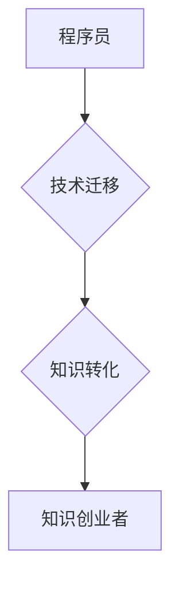

                 

## 从程序员到知识创业者的蜕变之路

> 关键词：程序员、知识创业、技术迁移、内容创作、社区建设、商业模式、技术博客、在线课程、知识付费

### 1. 背景介绍

在当今科技飞速发展的时代，程序员作为数字时代的基石，扮演着至关重要的角色。他们用代码构建着我们赖以生存的数字世界，推动着社会进步和经济发展。然而，随着技术的不断演进，程序员的职业道路也面临着新的挑战和机遇。传统的“码农”模式逐渐被打破，越来越多的程序员开始寻求新的发展方向，从单纯的代码编写者，蜕变成知识创造者、传播者和商业化运营者。

### 2. 核心概念与联系

**2.1 程序员与知识创业者的关系**

程序员和知识创业者之间并非完全割裂，而是存在着密切的联系。程序员拥有扎实的技术基础和解决问题的能力，这些都是知识创业成功的关键要素。知识创业者需要将自己的专业知识和经验转化为有价值的内容，并通过各种渠道进行传播和商业化运作。

**2.2 知识创业的本质**

知识创业的核心在于创造、传播和商业化知识。它不仅仅是技术上的创新，更重要的是对知识的深度理解和应用，以及对市场需求的洞察和把握。

**2.3 技术迁移与知识转化**

程序员想要成功转型为知识创业者，需要进行技术迁移和知识转化。这包括将自己的技术技能转化为可传播的知识，并将其应用于新的领域和场景。

**Mermaid 流程图**



### 3. 核心算法原理 & 具体操作步骤

**3.1 算法原理概述**

知识创业的核心算法可以概括为以下几个步骤：

1. **知识发现:** 识别自身专业领域中的关键知识点和价值点。
2. **知识结构化:** 将发现的知识进行整理、分类和结构化，使其易于理解和传播。
3. **知识包装:** 将结构化的知识转化为各种形式的内容，例如博客文章、视频教程、在线课程等。
4. **知识传播:** 通过各种渠道，例如技术博客、社交媒体、在线平台等，将知识传播给目标受众。
5. **知识商业化:** 通过知识付费、广告收入、赞助等方式，将知识转化为经济价值。

**3.2 算法步骤详解**

* **知识发现:** 程序员可以从自身的工作经验、学习笔记、项目实践等方面发现知识点。可以通过阅读行业书籍、参加技术会议、关注技术社区等方式获取更多知识。
* **知识结构化:** 可以使用思维导图、知识图谱等工具将知识进行结构化。将知识点进行分类、关联和层次化，使其更加清晰易懂。
* **知识包装:** 可以将知识点转化为博客文章、视频教程、在线课程等形式。根据目标受众的特点和需求，选择合适的包装方式。
* **知识传播:** 可以通过技术博客、社交媒体、在线平台等渠道进行知识传播。需要根据不同的平台特点，选择合适的传播方式和内容形式。
* **知识商业化:** 可以通过知识付费、广告收入、赞助等方式进行知识商业化。需要制定合理的商业模式，并进行有效的推广和运营。

**3.3 算法优缺点**

* **优点:** 
    * 能够充分利用程序员的专业技能和知识积累。
    * 能够创造新的价值，并获得经济回报。
    * 能够建立个人品牌，提升社会影响力。
* **缺点:** 
    * 需要投入时间和精力进行知识创作和传播。
    * 需要具备一定的商业运营能力。
    * 市场竞争激烈，需要不断学习和提升。

**3.4 算法应用领域**

* **技术博客:** 程序员可以将自己的技术经验和见解分享到技术博客上，吸引读者关注，建立个人品牌。
* **在线课程:** 程序员可以录制在线课程，教授自己的技术技能，并通过知识付费获得收入。
* **开源项目:** 程序员可以参与开源项目，贡献自己的代码和技术，并获得社区认可和支持。
* **技术咨询:** 程序员可以提供技术咨询服务，帮助企业解决技术难题，并获得咨询费。

### 4. 数学模型和公式 & 详细讲解 & 举例说明

**4.1 数学模型构建**

知识创业的成功可以看作是一个复杂的系统，我们可以用数学模型来描述其运作机制。例如，我们可以用以下公式来表示知识创业的收益：

$$收益 = 知识价值 * 知识传播量 * 知识转化率$$

其中：

* 知识价值：指知识点本身的价值，例如解决问题的能力、创新性等。
* 知识传播量：指知识传播出去的量，例如博客文章的阅读量、在线课程的报名人数等。
* 知识转化率：指知识被转化为经济价值的比例，例如付费用户比例、咨询项目转化率等。

**4.2 公式推导过程**

这个公式的推导过程基于以下假设：

* 知识的价值是客观存在的，可以通过量化评估。
* 知识的传播量越大，潜在的收益也就越大。
* 知识的转化率越高，最终的收益也就越高。

**4.3 案例分析与讲解**

例如，一位程序员写了一篇关于人工智能技术的博客文章，文章获得了10000次的阅读量，其中100人付费购买了他的在线课程，课程的单价为100美元。那么，他的知识创业收益可以计算如下：

$$收益 = 知识价值 * 10000 * 0.01 * 100 = 知识价值 * 1000$$

在这个例子中，知识价值是未知的，需要根据文章的质量、影响力和课程的价值来评估。

### 5. 项目实践：代码实例和详细解释说明

**5.1 开发环境搭建**

为了进行知识创业项目实践，需要搭建一个合适的开发环境。这包括选择合适的编程语言、开发工具和云服务平台。例如，可以使用Python语言、Jupyter Notebook工具和AWS云服务平台进行知识创业项目开发。

**5.2 源代码详细实现**

以下是一个简单的Python代码实例，用于生成一个技术博客文章的摘要：

```python
import nltk
from nltk.tokenize import sent_tokenize, word_tokenize

def generate_blog_summary(text):
  sentences = sent_tokenize(text)
  words = word_tokenize(text)
  # 使用nltk库进行文本分析，提取关键句子和关键词
  # ...
  summary = " ".join(selected_sentences)
  return summary

# 示例文本
text = """
人工智能技术正在快速发展，它正在改变着我们的生活方式。
机器学习算法能够从海量数据中学习，并做出预测。
深度学习模型能够模拟人类大脑的结构和功能。
人工智能技术在各个领域都有着广泛的应用，例如医疗、金融、交通等。
"""

# 生成博客文章摘要
summary = generate_blog_summary(text)
print(summary)
```

**5.3 代码解读与分析**

这个代码实例使用了NLTK库进行文本分析，提取了文章的关键句子和关键词，并生成了一个简短的摘要。

**5.4 运行结果展示**

运行这个代码实例，会输出一个类似于以下的博客文章摘要：

```
人工智能技术正在快速发展，它正在改变着我们的生活方式。机器学习算法能够从海量数据中学习，并做出预测。深度学习模型能够模拟人类大脑的结构和功能。
```

### 6. 实际应用场景

**6.1 技术博客写作**

程序员可以利用上述算法和代码实例，自动生成技术博客文章的摘要，提高文章的阅读量和传播效果。

**6.2 在线课程制作**

程序员可以利用文本分析技术，自动生成在线课程的学习笔记和知识点总结，方便学员学习和复习。

**6.3 社区建设**

程序员可以利用文本分析技术，分析社区讨论的热点话题和用户需求，并针对性地创作内容，促进社区活跃度和用户粘性。

**6.4 未来应用展望**

随着人工智能技术的不断发展，知识创业的自动化程度会越来越高。未来，程序员可以利用更先进的算法和工具，更加高效地进行知识创作、传播和商业化运作。

### 7. 工具和资源推荐

**7.1 学习资源推荐**

* **在线课程平台:** Coursera, edX, Udemy
* **技术博客:** Hacker News, Medium, Dev.to
* **开源社区:** GitHub, Stack Overflow

**7.2 开发工具推荐**

* **文本编辑器:** VS Code, Sublime Text
* **云服务平台:** AWS, Azure, Google Cloud
* **数据分析工具:** Jupyter Notebook, Pandas

**7.3 相关论文推荐**

* **Knowledge Representation and Reasoning**
* **Natural Language Processing**
* **Machine Learning**

### 8. 总结：未来发展趋势与挑战

**8.1 研究成果总结**

从程序员到知识创业者的蜕变之路，需要程序员具备技术迁移、知识转化、商业运营等方面的能力。通过学习和实践，程序员可以将自己的专业技能转化为有价值的知识，并通过各种渠道进行传播和商业化运作。

**8.2 未来发展趋势**

未来，知识创业将更加注重个性化、定制化和智能化。程序员需要不断学习新的技术和知识，并将其应用于知识创业领域，才能保持竞争力。

**8.3 面临的挑战**

知识创业面临着市场竞争激烈、知识产权保护等方面的挑战。程序员需要不断提升自己的专业技能和商业运营能力，才能克服这些挑战，取得成功。

**8.4 研究展望**

未来，我们需要进一步研究知识创业的机制和模式，并开发更先进的工具和技术，帮助程序员更有效地进行知识创业。


### 9. 附录：常见问题与解答

**9.1 如何找到自己的知识创业方向？**

程序员可以根据自己的兴趣、经验和技能，选择一个自己熟悉的领域进行知识创业。例如，可以分享自己的编程经验、技术博客文章、在线课程等。

**9.2 如何进行知识商业化？**

程序员可以采用知识付费、广告收入、赞助等方式进行知识商业化。例如，可以将自己的技术技能转化为在线课程，并通过知识付费平台进行销售。

**9.3 如何建立个人品牌？**

程序员可以通过技术博客、社交媒体、开源项目等方式建立个人品牌。需要坚持原创内容创作，并积极参与社区活动，提升个人影响力。


作者：禅与计算机程序设计艺术 / Zen and the Art of Computer Programming 
<end_of_turn>

