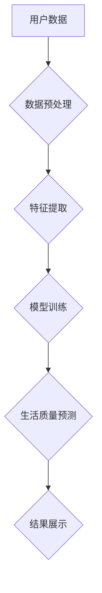

                 

## 体验量化革命：AI驱动的生活质量评估

> 关键词：人工智能、生活质量评估、体验量化、数据分析、机器学习、深度学习、情感分析、预测模型

## 1. 背景介绍

在当今数据爆炸的时代，我们所处的环境充满了各种各样的信息。从社交媒体的动态到智能家居的传感器数据，无处不在的数字痕迹记录着我们生活的方方面面。这些数据蕴藏着丰富的价值，能够帮助我们更好地理解自身、优化生活体验，甚至预测未来的趋势。

然而，传统的量化指标往往局限于宏观层面，例如GDP增长率、失业率等，难以捕捉到个体体验的微妙变化。生活质量是一个复杂的多维概念，涉及到个人情感、健康、社会关系、环境等多个方面。如何有效地量化和评估个体的生活质量，一直是社会科学和技术领域的研究热点。

近年来，人工智能（AI）技术取得了飞速发展，特别是深度学习算法的突破，为生活质量评估带来了新的机遇。AI能够从海量数据中识别出隐藏的模式和规律，并将其转化为有价值的洞察。通过结合自然语言处理、情感分析、图像识别等技术，我们可以构建更精准、更全面的生活质量评估模型。

## 2. 核心概念与联系

**2.1 核心概念**

* **体验量化:** 将主观体验转化为可量化的数据，以便进行分析和评估。
* **生活质量评估:** 通过多维度指标，量化和评估个体生活水平和幸福感。
* **人工智能 (AI):**  模拟人类智能的计算机系统，能够学习、推理和解决问题。
* **机器学习 (ML):**  一种AI技术，通过算法从数据中学习，不断改进预测和决策能力。
* **深度学习 (DL):**  一种更高级的机器学习技术，利用多层神经网络模拟人类大脑的学习过程。

**2.2 架构图**



**2.3 核心联系**

体验量化革命的核心在于利用AI技术将主观体验转化为可量化的数据，从而实现对生活质量的精准评估。

数据预处理阶段将原始数据进行清洗、转换和格式化，以便后续的分析和建模。特征提取阶段将数据转化为模型能够理解的特征，例如用户行为、情感倾向、环境因素等。模型训练阶段利用机器学习算法，从训练数据中学习生活质量与特征之间的关系，构建预测模型。最终，模型能够根据用户的输入数据，预测其生活质量水平，并提供个性化的建议和服务。

## 3. 核心算法原理 & 具体操作步骤

**3.1 算法原理概述**

本方案采用深度学习算法，特别是卷积神经网络（CNN）和循环神经网络（RNN）的组合，构建生活质量预测模型。

CNN擅长处理图像和文本数据，能够提取特征的时空关系，例如从用户发布的图片和文字中识别出情感倾向、兴趣爱好等信息。RNN擅长处理序列数据，能够捕捉时间上的依赖关系，例如从用户的行为轨迹中预测其未来需求和偏好。

**3.2 算法步骤详解**

1. **数据收集:** 收集用户生活相关的多模态数据，包括文本数据（社交媒体动态、日记、评论等）、图像数据（照片、视频等）、传感器数据（智能家居设备、运动追踪器等）。
2. **数据预处理:** 对收集到的数据进行清洗、转换和格式化，例如去除噪声、标准化数据、构建特征向量等。
3. **特征提取:** 利用CNN和RNN算法，从数据中提取特征，例如文本情感倾向、图像场景识别、行为模式识别等。
4. **模型训练:** 利用训练数据，训练CNN和RNN模型，学习特征与生活质量之间的关系。
5. **模型评估:** 利用测试数据，评估模型的预测精度和鲁棒性。
6. **模型部署:** 将训练好的模型部署到实际应用场景，例如智能家居系统、个性化推荐系统等。

**3.3 算法优缺点**

* **优点:**

    * 能够处理多模态数据，更全面地反映用户体验。
    * 能够学习复杂的关系，提高预测精度。
    * 可持续学习和改进，随着数据量的增加，模型性能会不断提升。

* **缺点:**

    * 需要大量的训练数据，数据质量对模型性能有重要影响。
    * 模型训练过程复杂，需要专业的技术人员和计算资源。
    * 模型解释性较差，难以理解模型的决策过程。

**3.4 算法应用领域**

* **智能家居:** 根据用户的行为模式和偏好，提供个性化的家居环境控制和服务。
* **健康管理:** 通过监测用户的生理数据和生活习惯，预测健康风险，提供个性化的健康建议。
* **教育领域:** 根据学生的学习情况和兴趣爱好，提供个性化的学习方案和辅导。
* **城市规划:** 通过分析居民的生活数据，优化城市规划和公共服务。

## 4. 数学模型和公式 & 详细讲解 & 举例说明

**4.1 数学模型构建**

生活质量评估模型可以构建为一个多层感知机（MLP），其输入层接收用户特征向量，输出层输出生活质量评分。

**4.2 公式推导过程**

MLP的输出层使用sigmoid函数进行激活，将输出值映射到0到1之间，表示生活质量评分。

$$
y = \sigma(W^T x + b)
$$

其中：

* $y$ 是生活质量评分
* $x$ 是用户特征向量
* $W$ 是权重矩阵
* $b$ 是偏置项
* $\sigma$ 是sigmoid函数

**4.3 案例分析与讲解**

假设我们有一个用户特征向量 $x = [年龄, 收入, 健康状况, 社交关系, 环境质量]$, 则模型的输出可以表示为：

$$
y = \sigma(W^T [年龄, 收入, 健康状况, 社交关系, 环境质量] + b)
$$

通过训练数据，模型会学习到权重矩阵 $W$ 和偏置项 $b$ 的最佳值，从而能够准确地预测用户的生命质量评分。

## 5. 项目实践：代码实例和详细解释说明

**5.1 开发环境搭建**

本项目使用Python语言进行开发，并利用TensorFlow深度学习框架。

需要安装以下软件：

* Python 3.x
* TensorFlow 2.x
* NumPy
* Pandas
* Matplotlib

**5.2 源代码详细实现**

```python
import tensorflow as tf
from tensorflow.keras.models import Sequential
from tensorflow.keras.layers import Dense

# 定义模型
model = Sequential()
model.add(Dense(64, activation='relu', input_shape=(5,)))
model.add(Dense(32, activation='relu'))
model.add(Dense(1, activation='sigmoid'))

# 编译模型
model.compile(optimizer='adam', loss='mse', metrics=['accuracy'])

# 训练模型
model.fit(X_train, y_train, epochs=10, batch_size=32)

# 评估模型
loss, accuracy = model.evaluate(X_test, y_test)
print('Loss:', loss)
print('Accuracy:', accuracy)

# 预测
predictions = model.predict(X_new)
```

**5.3 代码解读与分析**

* 代码首先定义了一个多层感知机模型，包含三个全连接层。
* 每个全连接层都使用ReLU激活函数，除了输出层使用sigmoid函数将输出值映射到0到1之间。
* 模型使用Adam优化器，均方误差损失函数，并使用准确率作为评估指标。
* 训练模型使用训练数据，并设置训练轮数和批处理大小。
* 评估模型使用测试数据，计算损失值和准确率。
* 预测使用新的数据进行预测，得到生活质量评分。

**5.4 运行结果展示**

运行结果会显示模型的训练损失、准确率以及对新数据的预测结果。

## 6. 实际应用场景

**6.1 智能家居**

AI驱动的生活质量评估模型可以帮助智能家居系统更好地理解用户的需求和偏好，提供更个性化的服务。例如，根据用户的睡眠质量、活动模式和情绪状态，智能家居系统可以自动调节灯光、温度、音乐等环境因素，营造更舒适的生活氛围。

**6.2 健康管理**

AI模型可以分析用户的生理数据、生活习惯和健康记录，预测其潜在的健康风险，并提供个性化的健康建议。例如，如果模型检测到用户的血压偏高，可以建议其进行运动、调整饮食等措施，预防心血管疾病。

**6.3 教育领域**

AI模型可以根据学生的学习情况、兴趣爱好和学习风格，提供个性化的学习方案和辅导。例如，如果模型发现学生在数学方面有困难，可以提供针对性的练习和辅导，帮助学生提高学习成绩。

**6.4 城市规划**

AI模型可以分析居民的生活数据，例如出行模式、消费习惯、社交关系等，了解城市居民的需求和痛点，为城市规划和公共服务提供数据支持。例如，根据居民的出行数据，可以优化交通规划，减少拥堵；根据居民的消费习惯，可以规划更完善的商业设施。

**6.5 未来应用展望**

随着人工智能技术的不断发展，生活质量评估模型将应用于更广泛的领域，例如：

* **个性化娱乐:** 根据用户的兴趣爱好和观看习惯，推荐更符合其口味的电影、音乐、游戏等娱乐内容。
* **情感支持:** 利用AI模型分析用户的语言和行为，识别其情绪状态，并提供情感支持和建议。
* **社会治理:** 利用AI模型分析社会数据，预测社会风险，帮助政府制定更有效的政策措施。


## 7. 工具和资源推荐

**7.1 学习资源推荐**

* **在线课程:** Coursera、edX、Udacity等平台提供丰富的深度学习课程。
* **书籍:** 《深度学习》、《机器学习实战》等书籍是深度学习入门的好选择。
* **开源项目:** TensorFlow、PyTorch等开源深度学习框架提供了丰富的学习资源和示例代码。

**7.2 开发工具推荐**

* **Python:** 深度学习开发的主要编程语言。
* **TensorFlow:** Google开发的开源深度学习框架。
* **PyTorch:** Facebook开发的开源深度学习框架。
* **Jupyter Notebook:** 用于深度学习开发和可视化的交互式笔记本环境。

**7.3 相关论文推荐**

* 《Attention Is All You Need》
* 《BERT: Pre-training of Deep Bidirectional Transformers for Language Understanding》
* 《Generative Adversarial Networks》

## 8. 总结：未来发展趋势与挑战

**8.1 研究成果总结**

AI驱动的生活质量评估模型取得了显著的进展，能够有效地量化和评估个体体验，为个性化服务和决策提供数据支持。

**8.2 未来发展趋势**

* **多模态数据融合:** 将更多类型的传感器数据、图像数据、文本数据等融合到模型中，构建更全面的生活质量评估模型。
* **隐私保护:** 开发更隐私安全的模型，保护用户的个人信息安全。
* **解释性增强:** 提高模型的解释性，帮助用户理解模型的决策过程。
* **跨文化应用:** 将模型应用到不同的文化背景下，使其更具普适性。

**8.3 面临的挑战**

* **数据质量:** 生活质量评估模型依赖于高质量的数据，数据采集、清洗和标注工作仍然是一个挑战。
* **模型复杂度:** 深度学习模型的复杂性使得模型训练和部署难度较大。
* **伦理问题:** AI驱动的生活质量评估模型可能存在伦理问题，例如数据歧视、算法偏见等，需要谨慎对待。

**8.4 研究展望**

未来，AI驱动的生活质量评估模型将朝着更智能、更个性化、更安全的方向发展，为人类创造更美好的生活体验。


## 9. 附录：常见问题与解答

**9.1 如何收集生活质量数据？**

可以利用多种方式收集生活质量数据，例如：

* **问卷调查:** 设计问卷，收集用户对生活质量的感知和评价。
* **传感器数据:** 利用智能家居设备、运动追踪器等传感器，收集用户的生理数据、行为数据等。
* **社交媒体数据:** 分析用户的社交媒体动态，例如微博、微信、Facebook等，识别用户的兴趣爱好、情感倾向等信息。

**9.2 如何处理生活质量数据？**

需要对收集到的生活质量数据进行清洗、转换和格式化，例如：

* **清洗数据:** 去除噪声、缺失值等异常数据。
* **转换数据:** 将数据转换为模型能够理解的格式，例如数值型、类别型等。
* **格式化数据:** 将数据按照模型的要求进行组织和排列。

**9.3 如何评估生活质量评估模型的性能？**

可以使用多种指标评估模型的性能，例如：

* **准确率:** 模型预测结果与真实结果的匹配度。
* **召回率:** 模型能够正确识别出所有真实正例的比例。
* **F1-score:** 综合考虑准确率和召回率的指标。

**9.4 如何部署生活质量评估模型？**

可以将训练好的模型部署到不同的平台，例如：

* **云平台:** 利用云计算平台，部署模型并提供API接口。
* **边缘设备:** 将模型部署到智能家居设备、手机等边缘设备，实现本地化预测。


作者：禅与计算机程序设计艺术 / Zen and the Art of Computer Programming 
<end_of_turn>

