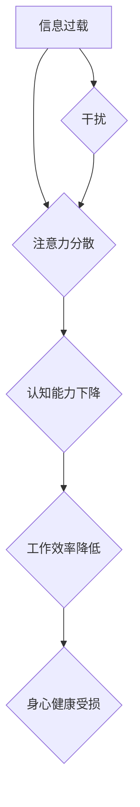

                 

## 信息时代的注意力管理策略：管理干扰和信息过载

> 关键词：注意力管理、信息过载、干扰、认知科学、深度学习、神经网络、时间管理、效率提升

### 1. 背景介绍

在当今信息爆炸的时代，我们每天都被来自各种渠道的信息轰炸。电子邮件、社交媒体、新闻推送、即时通讯软件，无处不在的通知和提醒，无时无刻不在争夺我们的注意力。这种信息过载和干扰不仅影响我们的工作效率和学习成果，也损害我们的身心健康。

注意力，是人类认知的核心能力之一，它让我们能够专注于当下，过滤无关信息，并有效地处理信息。然而，在信息时代，我们的注意力受到了前所未有的挑战。研究表明，人类的注意力持续时间越来越短，容易被分散，难以集中精力完成复杂的任务。

如何有效地管理注意力，在信息洪流中保持清醒和专注，已成为当今社会面临的重大课题。

### 2. 核心概念与联系

**2.1  注意力机制**

注意力机制（Attention Mechanism）是近年来深度学习领域兴起的一种重要技术，它能够帮助模型模拟人类的注意力机制，专注于输入序列中与当前任务最相关的部分。

**2.2  信息过载**

信息过载是指个体在短时间内接收和处理信息量过大，导致认知能力超负荷，难以有效地理解和记忆信息。

**2.3  干扰**

干扰是指任何阻碍我们集中注意力、完成任务的因素，包括外部环境的噪音、内部思绪的游离、以及来自社交媒体和电子设备的通知提醒等。

**2.4  认知科学**

认知科学研究人类的思维、学习、记忆、语言和感知等认知过程。

**Mermaid 流程图**



### 3. 核心算法原理 & 具体操作步骤

**3.1  算法原理概述**

注意力机制的核心思想是，在处理序列数据时，模型应该能够根据任务需求，动态地分配注意力权重，专注于与当前任务最相关的部分。

**3.2  算法步骤详解**

1. **输入序列编码:** 将输入序列（例如文本、音频、图像）编码成向量表示。
2. **注意力计算:** 计算每个时间步的注意力权重，表示模型对该时间步的关注程度。
3. **加权求和:** 根据注意力权重，对编码后的序列进行加权求和，得到最终的输出。

**3.3  算法优缺点**

**优点:**

* 能够有效地处理长序列数据。
* 可以学习到输入序列中与当前任务最相关的部分。
* 在许多自然语言处理任务中取得了优异的性能。

**缺点:**

* 计算复杂度较高。
* 需要大量的训练数据。

**3.4  算法应用领域**

* 自然语言处理：机器翻译、文本摘要、问答系统、情感分析等。
* 图像识别：目标检测、图像分类、图像 captioning 等。
* 语音识别：语音转文本、语音搜索等。

### 4. 数学模型和公式 & 详细讲解 & 举例说明

**4.1  数学模型构建**

注意力机制的数学模型通常基于以下公式：

$$
\text{Attention}(Q, K, V) = \text{softmax}\left(\frac{Q K^T}{\sqrt{d_k}}\right) V
$$

其中：

* $Q$：查询矩阵，表示模型当前需要关注的部分。
* $K$：键矩阵，表示输入序列中每个元素的特征表示。
* $V$：值矩阵，表示输入序列中每个元素的实际值。
* $d_k$：键向量的维度。
* $\text{softmax}$：softmax 函数，用于将注意力权重归一化到 [0, 1] 之间。

**4.2  公式推导过程**

注意力机制的公式推导过程可以分为以下几个步骤：

1. 计算查询向量 $Q$ 与键向量 $K$ 的点积，得到一个得分矩阵。
2. 对得分矩阵进行缩放，以控制注意力权重的范围。
3. 使用 softmax 函数对得分矩阵进行归一化，得到注意力权重矩阵。
4. 将注意力权重矩阵与值矩阵 $V$ 进行加权求和，得到最终的输出。

**4.3  案例分析与讲解**

例如，在机器翻译任务中，查询向量 $Q$ 表示目标语言的词嵌入，键向量 $K$ 表示源语言的词嵌入，值向量 $V$ 表示源语言的词嵌入。注意力机制可以帮助模型学习到源语言中与目标语言的词语最相关的部分，从而提高翻译的准确性。

### 5. 项目实践：代码实例和详细解释说明

**5.1  开发环境搭建**

* Python 3.x
* TensorFlow 或 PyTorch 深度学习框架
* Jupyter Notebook 或 VS Code 开发环境

**5.2  源代码详细实现**

```python
import tensorflow as tf

# 定义注意力机制层
class AttentionLayer(tf.keras.layers.Layer):
    def __init__(self, units):
        super(AttentionLayer, self).__init__()
        self.Wq = tf.keras.layers.Dense(units)
        self.Wk = tf.keras.layers.Dense(units)
        self.Wv = tf.keras.layers.Dense(units)
        self.softmax = tf.keras.layers.Softmax()

    def call(self, inputs):
        Q = self.Wq(inputs[0])
        K = self.Wk(inputs[1])
        V = self.Wv(inputs[2])
        attention_scores = tf.matmul(Q, K, transpose_b=True) / tf.math.sqrt(tf.cast(tf.shape(Q)[-1], tf.float32))
        attention_weights = self.softmax(attention_scores)
        output = tf.matmul(attention_weights, V)
        return output

# 示例用法
inputs = [tf.random.normal((1, 10, 64)), tf.random.normal((1, 10, 64)), tf.random.normal((1, 10, 64))]
attention_layer = AttentionLayer(units=128)
output = attention_layer(inputs)
print(output.shape)
```

**5.3  代码解读与分析**

* `AttentionLayer` 类定义了一个注意力机制层，包含三个稠密层 (`Wq`, `Wk`, `Wv`) 用于计算查询、键和值向量的线性变换。
* `call` 方法实现注意力机制的计算过程，包括计算注意力分数、归一化注意力权重、以及加权求和。
* 示例用法演示了如何使用 `AttentionLayer` 层处理输入数据。

**5.4  运行结果展示**

运行代码后，会输出注意力机制层的输出形状，例如 `(1, 10, 128)`。

### 6. 实际应用场景

**6.1  信息过滤与推荐系统**

注意力机制可以帮助信息过滤系统识别用户感兴趣的信息，并推荐相关内容。例如，社交媒体平台可以使用注意力机制过滤掉用户不感兴趣的帖子，并推荐用户可能感兴趣的内容。

**6.2  个性化学习**

注意力机制可以帮助个性化学习系统识别学生的学习风格和知识点，并提供个性化的学习内容和建议。例如，在线教育平台可以使用注意力机制分析学生的学习行为，并推荐适合学生的学习资源。

**6.3  医疗诊断与辅助决策**

注意力机制可以帮助医疗诊断系统识别患者病症的关键特征，并辅助医生做出诊断决策。例如，放射学图像分析系统可以使用注意力机制识别肿瘤和其他异常区域。

**6.4  未来应用展望**

随着深度学习技术的不断发展，注意力机制将在更多领域得到应用，例如：

* 自动驾驶
* 机器人
* 人机交互
* 虚拟现实

### 7. 工具和资源推荐

**7.1  学习资源推荐**

* **论文:**
    * "Attention Is All You Need" (Vaswani et al., 2017)
    * "BERT: Pre-training of Deep Bidirectional Transformers for Language Understanding" (Devlin et al., 2018)
* **博客文章:**
    * "Attention Is All You Need: A Deep Dive" (Jay Alammar)
    * "The Illustrated Transformer" (Jay Alammar)

**7.2  开发工具推荐**

* TensorFlow
* PyTorch
* Keras

**7.3  相关论文推荐**

* "Self-Attention with Relative Positional Encodings" (Shaw et al., 2018)
* "Multi-Head Attention for Machine Translation" (Bahdanau et al., 2014)
* "Transformer-XL: Attentive Language Models Beyond a Fixed-Length Context" (Dai et al., 2019)

### 8. 总结：未来发展趋势与挑战

**8.1  研究成果总结**

注意力机制在近年来取得了显著的进展，并在许多自然语言处理任务中取得了优异的性能。

**8.2  未来发展趋势**

* **更有效的注意力机制:** 研究人员将继续探索更有效的注意力机制，例如自注意力机制、相对位置编码、以及多头注意力机制。
* **注意力机制的泛化性:** 将注意力机制应用到更多领域，例如计算机视觉、语音识别、以及机器人学。
* **注意力机制的可解释性:** 研究注意力机制的决策过程，提高其可解释性和透明度。

**8.3  面临的挑战**

* **计算复杂度:** 某些注意力机制的计算复杂度较高，难以在资源有限的设备上运行。
* **数据需求:** 训练有效的注意力机制模型需要大量的训练数据。
* **可解释性:** 注意力机制的决策过程相对复杂，难以解释其背后的逻辑。

**8.4  研究展望**

未来，注意力机制将继续是深度学习领域的重要研究方向，并将在更多领域发挥重要作用。


### 9. 附录：常见问题与解答

**9.1  Q: 注意力机制与卷积神经网络有什么区别？**

**A:** 卷积神经网络擅长处理局部特征，而注意力机制能够处理全局信息。卷积神经网络的计算过程是固定的，而注意力机制可以根据输入数据动态地分配注意力权重。

**9.2  Q: 注意力机制的应用场景有哪些？**

**A:** 注意力机制的应用场景非常广泛，包括机器翻译、文本摘要、问答系统、图像识别、语音识别等。

**9.3  Q: 如何选择合适的注意力机制？**

**A:** 选择合适的注意力机制取决于具体的应用场景和任务需求。例如，对于长序列数据，可以使用自注意力机制；对于需要处理相对位置信息的场景，可以使用相对位置编码。


作者：禅与计算机程序设计艺术 / Zen and the Art of Computer Programming 
<end_of_turn>

