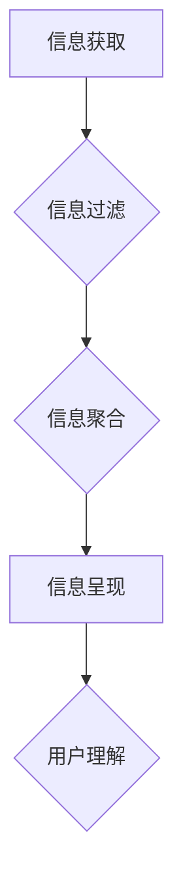

                 

## 信息简化的好处与实践：在复杂世界中简化以改善生活和决策

> 关键词：信息简化、复杂系统、决策支持、数据可视化、认知负荷、算法优化、人工智能、机器学习、信息架构

### 1. 背景介绍

我们生活在一个信息爆炸的时代。每天，我们被来自各个方向的海量信息淹没：新闻、社交媒体、电子邮件、广告等等。这些信息虽然丰富多彩，但同时也带来了巨大的挑战。过多的信息会加重我们的认知负荷，导致注意力分散、决策困难、效率低下，甚至引发焦虑和压力。

信息简化，即从海量信息中提取关键信息，并以简洁易懂的方式呈现，成为解决信息过载问题的关键。信息简化不仅可以帮助我们更好地理解世界，更能提高我们的决策效率，改善生活质量。

### 2. 核心概念与联系

信息简化是一个跨学科的领域，涉及计算机科学、认知科学、心理学、设计学等多个领域。其核心概念包括：

* **信息过滤:** 从海量信息中筛选出与用户需求相关的关键信息。
* **信息聚合:** 将相关信息进行整合，形成更有意义的整体。
* **信息呈现:** 以简洁易懂的方式呈现信息，例如图表、摘要、故事等。
* **认知负荷:** 指大脑处理信息的能力有限，过多的信息会加重认知负荷，影响决策和学习。

**信息简化流程图:**



### 3. 核心算法原理 & 具体操作步骤

#### 3.1 算法原理概述

信息简化算法通常基于以下原理：

* **文本挖掘:** 利用自然语言处理技术，从文本中提取关键词、主题、情感等信息。
* **机器学习:** 利用机器学习算法，根据历史数据学习用户偏好，自动过滤和聚合信息。
* **数据可视化:** 利用图表、地图等形式，将复杂数据进行可视化呈现，帮助用户快速理解信息。

#### 3.2 算法步骤详解

以文本挖掘为例，信息简化算法的具体步骤如下：

1. **预处理:** 对文本进行清洗、分词、去除停用词等预处理操作。
2. **关键词提取:** 利用TF-IDF、LDA等算法，从文本中提取关键词。
3. **主题建模:** 利用LDA、NMF等算法，对文本进行主题建模，识别文本的主要主题。
4. **情感分析:** 利用情感词典、机器学习算法，分析文本的情感倾向。
5. **信息聚合:** 根据关键词、主题、情感等信息，将相关文本进行聚合，形成摘要或主题报告。

#### 3.3 算法优缺点

**优点:**

* 自动化程度高，可以处理海量信息。
* 精度高，可以提取出关键信息。
* 可定制化，可以根据用户需求进行调整。

**缺点:**

* 需要大量的训练数据。
* 对文本质量要求较高。
* 难以处理复杂、多模态的信息。

#### 3.4 算法应用领域

信息简化算法广泛应用于以下领域：

* **新闻聚合:** 自动提取新闻中的关键信息，生成新闻摘要。
* **社交媒体分析:** 分析社交媒体上的用户评论、话题趋势等信息。
* **市场调研:** 分析市场数据，识别用户需求和市场趋势。
* **客户服务:** 自动回复客户常见问题，提高客户服务效率。

### 4. 数学模型和公式 & 详细讲解 & 举例说明

#### 4.1 数学模型构建

信息简化算法的数学模型通常基于概率论和统计学。例如，关键词提取算法可以使用TF-IDF模型，该模型将文本中的词频和逆文档频率作为关键词权重。

**TF-IDF公式:**

$$TF-IDF(t, d) = TF(t, d) \times IDF(t)$$

其中：

* $TF(t, d)$ 是词 $t$ 在文档 $d$ 中的词频。
* $IDF(t)$ 是词 $t$ 在整个语料库中的逆文档频率。

#### 4.2 公式推导过程

TF-IDF公式的推导过程如下：

* **词频 (TF):** 词频是指词在文档中出现的次数。词频越高，该词在文档中的重要性越高。
* **逆文档频率 (IDF):** 逆文档频率是指词在整个语料库中出现的频率的倒数。词在语料库中出现的次数越少，其逆文档频率越高，该词越独特，在文档中的重要性越高。

#### 4.3 案例分析与讲解

假设我们有一篇关于人工智能的文章，其中“人工智能”这个词出现了5次，而整个语料库中这个词出现了100次。那么，

* $TF(人工智能, 文章) = 5$
* $IDF(人工智能) = log(100/1) = 2$

因此，

$$TF-IDF(人工智能, 文章) = 5 \times 2 = 10$$

这个结果表明，“人工智能”这个词在该文章中非常重要。

### 5. 项目实践：代码实例和详细解释说明

#### 5.1 开发环境搭建

* Python 3.x
* NLTK 自然语言处理库
* Scikit-learn 机器学习库
* Matplotlib 数据可视化库

#### 5.2 源代码详细实现

```python
import nltk
from nltk.corpus import stopwords
from sklearn.feature_extraction.text import TfidfVectorizer

# 下载停用词列表
nltk.download('stopwords')

# 定义文本数据
text_data = [
    "人工智能是一种利用计算机模拟人类智能的学科。",
    "机器学习是人工智能的一个重要分支。",
    "深度学习是机器学习的一种高级形式。"
]

# 实例化TF-IDF向量化器
vectorizer = TfidfVectorizer(stop_words=stopwords.words('english'))

# 将文本数据转换为TF-IDF矩阵
tfidf_matrix = vectorizer.fit_transform(text_data)

# 打印TF-IDF矩阵
print(tfidf_matrix.toarray())
```

#### 5.3 代码解读与分析

* 首先，我们导入必要的库，并下载停用词列表。
* 然后，我们定义一个文本数据列表，包含三段关于人工智能的文本。
* 接着，我们实例化一个TF-IDF向量化器，并设置停用词列表。
* 接下来，我们使用向量化器将文本数据转换为TF-IDF矩阵。
* 最后，我们打印TF-IDF矩阵，可以看到每个词在每个文本中的权重。

#### 5.4 运行结果展示

运行代码后，会输出一个TF-IDF矩阵，其中每个元素代表一个词在某个文本中的权重。权重越高，该词在该文本中的重要性越高。

### 6. 实际应用场景

信息简化技术在各个领域都有广泛的应用场景：

#### 6.1 新闻聚合

新闻聚合平台利用信息简化技术，从海量新闻数据中提取关键信息，生成新闻摘要，帮助用户快速了解新闻内容。

#### 6.2 社交媒体分析

社交媒体平台利用信息简化技术，分析用户评论、话题趋势等信息，帮助企业了解用户需求，进行市场营销。

#### 6.3 电子商务

电子商务平台利用信息简化技术，对商品信息进行聚合和呈现，帮助用户快速找到所需商品。

#### 6.4 教育

教育平台利用信息简化技术，对教材内容进行简化和呈现，帮助学生更好地理解知识。

#### 6.5 医疗保健

医疗保健平台利用信息简化技术，对患者病历信息进行分析，帮助医生更快地做出诊断。

#### 6.4 未来应用展望

随着人工智能和机器学习技术的不断发展，信息简化技术将更加智能化、个性化。未来，信息简化技术将应用于更多领域，例如：

* **个性化信息推荐:** 根据用户的兴趣和需求，推荐个性化的信息内容。
* **智能决策支持:** 利用信息简化技术，帮助用户做出更明智的决策。
* **虚拟助手:** 利用信息简化技术，开发更智能的虚拟助手，帮助用户完成各种任务。

### 7. 工具和资源推荐

#### 7.1 学习资源推荐

* **书籍:**
    * 《信息简化：在复杂世界中简化以改善生活和决策》
    * 《认知心理学》
    * 《数据可视化》
* **在线课程:**
    * Coursera: 数据科学
    * edX: 人工智能
    * Udemy: 自然语言处理

#### 7.2 开发工具推荐

* **Python:** 
    * NLTK 自然语言处理库
    * Scikit-learn 机器学习库
    * Matplotlib 数据可视化库
* **R:** 
    * tidyverse 数据分析和可视化包
    * caret 机器学习包

#### 7.3 相关论文推荐

* **Information Filtering and Retrieval:** Manning, C. D., Raghavan, P., & Schütze, H. (2008). Introduction to information retrieval. Cambridge university press.
* **Text Mining:** Han, J., Kamber, M., & Pei, J. (2011). Data mining: concepts and techniques. Morgan Kaufmann.
* **Data Visualization:** Tufte, E. R. (2001). The visual display of quantitative information. Graphics Press.

### 8. 总结：未来发展趋势与挑战

#### 8.1 研究成果总结

信息简化技术已经取得了显著的成果，在各个领域都有广泛的应用。未来，随着人工智能和机器学习技术的不断发展，信息简化技术将更加智能化、个性化。

#### 8.2 未来发展趋势

* **更智能的信息过滤:** 利用深度学习等技术，实现更精准、更智能的信息过滤。
* **更个性化的信息呈现:** 根据用户的兴趣和需求，个性化定制信息呈现方式。
* **跨模态信息简化:** 处理文本、图像、音频等多模态信息，实现更全面的信息简化。

#### 8.3 面临的挑战

* **数据质量问题:** 信息简化算法依赖于高质量的数据，而现实世界中的数据往往存在噪声、不完整等问题。
* **算法解释性问题:** 一些深度学习算法的决策过程难以解释，这可能会导致用户对信息简化结果的信任度降低。
* **伦理问题:** 信息简化技术可能会被用于操纵用户行为，因此需要关注其伦理问题。

#### 8.4 研究展望

未来，信息简化技术的研究将集中在以下几个方面:

* **开发更鲁棒、更解释性的信息简化算法。**
* **研究信息简化技术在不同领域中的应用。**
* **探讨信息简化技术的伦理问题。**

### 9. 附录：常见问题与解答

**Q1: 信息简化技术有哪些应用场景？**

**A1:** 信息简化技术广泛应用于新闻聚合、社交媒体分析、电子商务、教育、医疗保健等领域。

**Q2: 信息简化算法有哪些？**

**A2:** 常用的信息简化算法包括文本挖掘、机器学习、数据可视化等。

**Q3: 如何评估信息简化算法的性能？**

**A3:** 信息简化算法的性能可以根据准确率、召回率、F1-score等指标进行评估。

**Q4: 信息简化技术有哪些挑战？**

**A4:** 信息简化技术面临的数据质量问题、算法解释性问题和伦理问题等挑战。


作者：禅与计算机程序设计艺术 / Zen and the Art of Computer Programming 
<end_of_turn>

