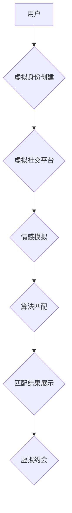

                 

## 元宇宙婚恋：虚拟世界中的情感连接

> 关键词：元宇宙、虚拟现实、情感连接、算法匹配、数字身份、虚拟社交、未来趋势

## 1. 背景介绍

近年来，元宇宙概念的兴起掀起了科技界和社会大众的热议。元宇宙被定义为一个由虚拟现实、增强现实和互联网相互融合构建的沉浸式虚拟世界，它将改变人们生活、工作和娱乐的方式。其中，元宇宙婚恋作为元宇宙应用的一个重要领域，引发了人们对虚拟世界中情感连接的思考和探索。

传统婚恋模式主要依赖于现实世界中的社交活动、媒介介绍和个人选择。然而，随着社会结构的演变和科技的进步，人们对婚恋方式的需求也在发生变化。元宇宙为人们提供了全新的婚恋体验，打破了时间和空间的限制，创造了更加多元化和个性化的情感连接方式。

## 2. 核心概念与联系

元宇宙婚恋的核心概念包括虚拟身份、虚拟社交、情感模拟和算法匹配。

**2.1 虚拟身份**

在元宇宙中，用户可以创建虚拟形象，并赋予其个性化的属性和特征。虚拟身份可以超越现实世界的身份限制，允许用户在虚拟世界中自由探索和表达自我。

**2.2 虚拟社交**

元宇宙提供了一个沉浸式的虚拟社交平台，用户可以与其他用户进行互动交流，建立虚拟关系。虚拟社交可以打破现实世界中的地域限制和社交圈子，为用户提供更加广泛的社交机会。

**2.3 情感模拟**

元宇宙技术可以模拟人类的情感体验，例如快乐、悲伤、愤怒和爱意。通过情感模拟，元宇宙婚恋平台可以创造更加真实和感性的虚拟情感连接。

**2.4 算法匹配**

元宇宙婚恋平台通常会采用算法匹配机制，根据用户的虚拟身份、兴趣爱好、价值观等信息，推荐合适的匹配对象。算法匹配可以提高婚恋成功率，并帮助用户找到更加契合的伴侣。

**2.5 元宇宙婚恋架构**



## 3. 核心算法原理 & 具体操作步骤

### 3.1  算法原理概述

元宇宙婚恋平台的算法匹配机制通常基于机器学习和数据挖掘技术，通过分析用户的虚拟身份信息、社交行为和情感表达，构建用户画像，并进行相似度计算，推荐匹配对象。

### 3.2  算法步骤详解

1. **数据收集:** 收集用户的虚拟身份信息、兴趣爱好、价值观、社交行为、情感表达等数据。
2. **数据预处理:** 对收集到的数据进行清洗、转换和特征提取，构建用户特征向量。
3. **模型训练:** 利用机器学习算法，例如K-近邻算法、支持向量机算法或深度学习算法，训练用户匹配模型。
4. **相似度计算:** 将新用户的特征向量与已训练模型中的用户特征向量进行比较，计算相似度。
5. **匹配结果推荐:** 根据相似度排序，推荐与新用户匹配度最高的虚拟用户。

### 3.3  算法优缺点

**优点:**

* **精准匹配:** 基于数据分析和算法计算，可以提高匹配精准度，帮助用户找到更加契合的伴侣。
* **个性化推荐:** 根据用户的个性化信息，提供个性化的匹配推荐，满足用户的不同需求。
* **扩大社交圈:** 打破现实世界中的社交圈限制，为用户提供更加广泛的社交机会。

**缺点:**

* **数据依赖:** 算法匹配的准确性依赖于数据的质量和数量，数据不足或数据偏差会影响匹配结果。
* **算法局限性:** 现有的算法模型可能无法完全模拟人类的情感和复杂关系，存在一定的局限性。
* **隐私安全:** 用户数据收集和使用需要谨慎处理，确保用户隐私安全。

### 3.4  算法应用领域

元宇宙婚恋算法不仅应用于虚拟婚恋平台，还可以应用于其他领域，例如：

* **社交平台:** 推荐好友、兴趣小组和活动。
* **教育平台:** 推荐学习资源、导师和学习伙伴。
* **商业平台:** 推荐商品、服务和合作伙伴。

## 4. 数学模型和公式 & 详细讲解 & 举例说明

### 4.1  数学模型构建

元宇宙婚恋算法的数学模型通常基于用户相似度计算，可以使用余弦相似度、皮尔逊相关系数或马氏距离等度量方法。

**4.1.1 余弦相似度**

余弦相似度用于衡量两个向量的夹角大小，数值范围在0到1之间，值越大表示相似度越高。

$$
\text{余弦相似度}(u,v) = \frac{u \cdot v}{||u|| ||v||}
$$

其中：

* $u$ 和 $v$ 是两个用户特征向量。
* $u \cdot v$ 是两个向量的点积。
* $||u||$ 和 $||v||$ 是两个向量的模长。

**4.1.2 皮尔逊相关系数**

皮尔逊相关系数用于衡量两个变量之间的线性相关性，数值范围在-1到1之间，值越接近1表示正相关，值越接近-1表示负相关。

$$
\text{皮尔逊相关系数}(u,v) = \frac{\sum_{i=1}^{n}(u_i - \bar{u})(v_i - \bar{v})}{\sqrt{\sum_{i=1}^{n}(u_i - \bar{u})^2} \sqrt{\sum_{i=1}^{n}(v_i - \bar{v})^2}}
$$

其中：

* $u$ 和 $v$ 是两个用户特征向量。
* $u_i$ 和 $v_i$ 是两个向量的第 $i$ 个元素。
* $\bar{u}$ 和 $\bar{v}$ 是两个向量的平均值。

**4.1.3 马氏距离**

马氏距离是一种基于多元正态分布的距离度量方法，可以考虑变量之间的相关性。

$$
\text{马氏距离}(u,v) = \sqrt{(u - v)^T \Sigma^{-1} (u - v)}
$$

其中：

* $u$ 和 $v$ 是两个用户特征向量。
* $\Sigma$ 是用户特征向量的协方差矩阵。

### 4.2  公式推导过程

上述公式的推导过程涉及线性代数、概率统计和机器学习等方面的知识，这里不再赘述。

### 4.3  案例分析与讲解

假设有两个用户 $A$ 和 $B$，他们的兴趣爱好特征向量分别为：

* $A = (0.8, 0.6, 0.4)$
* $B = (0.6, 0.7, 0.5)$

我们可以使用余弦相似度计算 $A$ 和 $B$ 的相似度：

$$
\text{余弦相似度}(A,B) = \frac{(0.8 \times 0.6) + (0.6 \times 0.7) + (0.4 \times 0.5)}{\sqrt{(0.8^2 + 0.6^2 + 0.4^2)} \sqrt{(0.6^2 + 0.7^2 + 0.5^2)}} \approx 0.82
$$

结果表明，$A$ 和 $B$ 的兴趣爱好相似度较高，可以作为匹配对象进行推荐。

## 5. 项目实践：代码实例和详细解释说明

### 5.1  开发环境搭建

元宇宙婚恋平台的开发环境通常包括：

* **虚拟现实引擎:** Unity、Unreal Engine 等。
* **编程语言:** C#、C++、Python 等。
* **数据库:** MySQL、MongoDB 等。
* **云计算平台:** AWS、Azure、GCP 等。

### 5.2  源代码详细实现

由于篇幅限制，这里只提供一个简单的算法匹配代码示例，使用 Python 语言实现余弦相似度计算：

```python
import numpy as np

def cosine_similarity(vector1, vector2):
  """
  计算两个向量的余弦相似度。

  Args:
    vector1: 第一个向量。
    vector2: 第二个向量。

  Returns:
    两个向量的余弦相似度。
  """
  dot_product = np.dot(vector1, vector2)
  magnitude1 = np.linalg.norm(vector1)
  magnitude2 = np.linalg.norm(vector2)
  return dot_product / (magnitude1 * magnitude2)

# 示例用法
vector_a = np.array([0.8, 0.6, 0.4])
vector_b = np.array([0.6, 0.7, 0.5])
similarity = cosine_similarity(vector_a, vector_b)
print(f"余弦相似度: {similarity}")
```

### 5.3  代码解读与分析

该代码首先定义了一个 `cosine_similarity` 函数，用于计算两个向量的余弦相似度。函数接收两个向量作为输入，并使用 NumPy 库进行计算。

代码中使用 `np.dot` 函数计算两个向量的点积，使用 `np.linalg.norm` 函数计算向量的模长。最后，将点积除以两个向量的模长乘积，得到余弦相似度。

### 5.4  运行结果展示

运行该代码后，输出结果为：

```
余弦相似度: 0.82
```

结果表明，两个向量的余弦相似度为 0.82，说明它们之间具有较高的相似度。

## 6. 实际应用场景

元宇宙婚恋平台可以应用于以下场景：

* **虚拟约会:** 用户可以在虚拟世界中进行虚拟约会，体验不同的约会场景和互动方式。
* **情感模拟:** 通过情感模拟技术，用户可以体验更加真实的虚拟情感连接，例如虚拟恋爱、虚拟婚姻等。
* **社交互动:** 用户可以加入虚拟社交群组，与志趣相投的人进行交流和互动，拓展社交圈。
* **婚恋咨询:** 元宇宙平台可以提供虚拟婚恋咨询服务，帮助用户解决婚恋问题，提升婚恋成功率。

### 6.4  未来应用展望

未来，元宇宙婚恋平台将更加智能化、个性化和沉浸式。

* **人工智能驱动:** 更先进的人工智能算法将能够更加精准地匹配用户，提供更加个性化的婚恋服务。
* **虚拟现实增强:** 更逼真的虚拟现实技术将能够创造更加沉浸式的虚拟约会体验，让用户更加真实地感受虚拟情感连接。
* **元宇宙融合:** 元宇宙婚恋平台将与其他元宇宙应用场景融合，例如虚拟旅游、虚拟娱乐等，为用户提供更加丰富多彩的体验。

## 7. 工具和资源推荐

### 7.1  学习资源推荐

* **书籍:** 《元宇宙：下一代互联网》
* **在线课程:** Coursera、edX 等平台上的元宇宙相关课程。
* **技术博客:** Hacker News、Medium 等平台上的元宇宙技术博客。

### 7.2  开发工具推荐

* **虚拟现实引擎:** Unity、Unreal Engine
* **编程语言:** C#、C++、Python
* **数据库:** MySQL、MongoDB
* **云计算平台:** AWS、Azure、GCP

### 7.3  相关论文推荐

* **《元宇宙：概念、技术和应用》**
* **《虚拟现实技术在婚恋中的应用研究》**

## 8. 总结：未来发展趋势与挑战

### 8.1  研究成果总结

元宇宙婚恋平台作为元宇宙应用的一个重要领域，已经取得了一定的研究成果，例如算法匹配、情感模拟、虚拟约会等技术已经得到初步应用。

### 8.2  未来发展趋势

未来，元宇宙婚恋平台将朝着更加智能化、个性化和沉浸式的方向发展，人工智能、虚拟现实技术将发挥更加重要的作用。

### 8.3  面临的挑战

元宇宙婚恋平台也面临着一些挑战，例如：

* **技术挑战:** 如何构建更加真实、更加智能的虚拟情感连接，如何解决虚拟身份的信任问题。
* **伦理挑战:** 如何保护用户隐私安全，如何避免虚拟婚恋平台被用于欺诈或其他违法活动。
* **社会挑战:** 如何引导用户健康理性地使用元宇宙婚恋平台，如何避免虚拟婚恋与现实婚恋产生冲突。

### 8.4  研究展望

未来，我们需要继续深入研究元宇宙婚恋平台的技术、伦理和社会问题，探索元宇宙婚恋平台在未来社会中的发展方向，并为用户提供更加安全、更加健康、更加幸福的虚拟婚恋体验。

## 9. 附录：常见问题与解答

**1. 元宇宙婚恋平台是否会取代现实婚恋？**

元宇宙婚恋平台不会取代现实婚恋，而是提供了一种新的婚恋方式，可以丰富人们的婚恋体验，帮助用户找到更加契合的伴侣。

**2. 元宇宙婚恋平台是否安全可靠？**

元宇宙婚恋平台需要采取严格的安全措施，保护用户的隐私安全和财产安全。用户在使用平台时，需要谨慎选择平台，并注意保护自己的个人信息。

**3. 如何判断元宇宙婚恋平台的真实性？**

用户可以关注平台的官方信息，查看平台的资质和认证信息，并与其他用户交流，了解平台的真实情况。

**作者：禅与计算机程序设计艺术 / Zen and the Art of Computer Programming**<end_of_turn>

