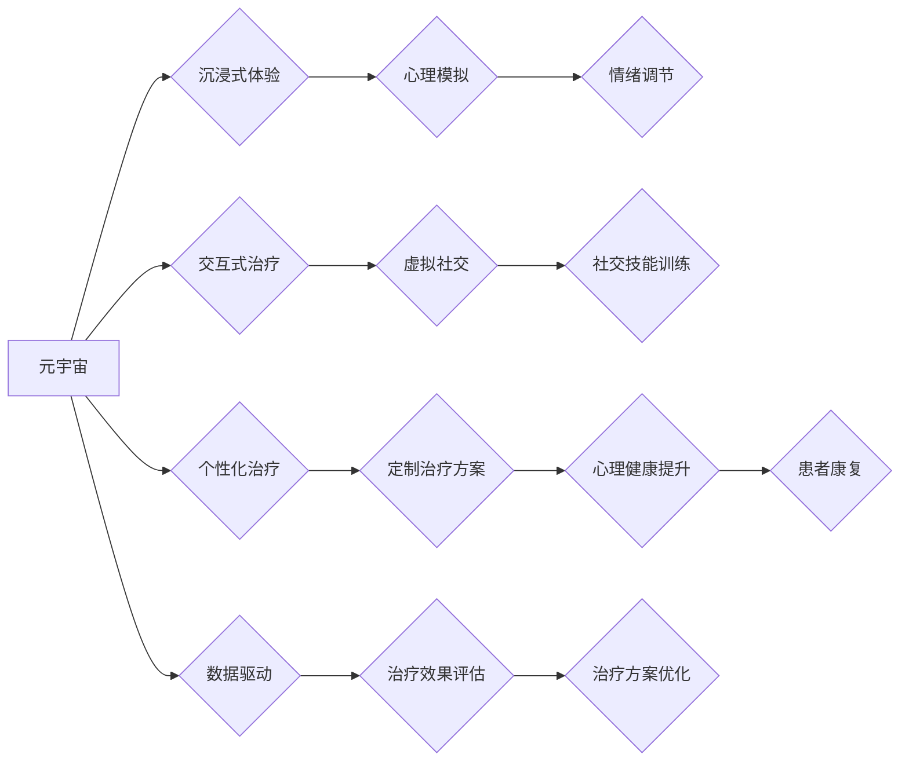

                 

## 元宇宙精神治疗:虚拟 worlds 的精神治疗技术

> 关键词：元宇宙、精神治疗、虚拟现实、人工智能、交互式治疗、沉浸式体验、心理健康

## 1. 背景介绍

近年来，随着虚拟现实 (VR)、增强现实 (AR) 和人工智能 (AI) 技术的飞速发展，元宇宙概念逐渐成为科技界和社会大众的热门话题。元宇宙被定义为一个由虚拟世界、数字经济和社交网络构成的下一代互联网，它将提供更加沉浸式、交互式和持久化的数字体验。

在精神治疗领域，元宇宙也展现出巨大的潜力。传统精神治疗模式往往局限于线下环境，患者需要克服时间、地理和心理障碍才能接受治疗。而元宇宙可以打破这些限制，为患者提供更加便捷、灵活和私密的治疗环境。

## 2. 核心概念与联系

### 2.1 元宇宙与精神治疗的融合

元宇宙为精神治疗提供了全新的可能性，其核心概念与精神治疗的联系如下：

* **沉浸式体验:** 元宇宙可以创造逼真的虚拟环境，让患者沉浸其中，体验不同的场景和角色，从而帮助他们更好地理解和应对现实生活中的问题。
* **交互式治疗:** 元宇宙支持用户与虚拟角色、其他患者以及治疗师进行互动，这可以增强治疗的参与度和效果。
* **个性化治疗:** 元宇宙可以根据患者的个体需求定制治疗方案，提供更加个性化和有效的治疗体验。
* **数据驱动:** 元宇宙可以收集患者在虚拟环境中的行为数据，帮助治疗师更好地了解患者的心理状态和治疗进展。

**核心概念与联系流程图:**



### 2.2 虚拟现实与精神治疗

虚拟现实技术在精神治疗领域有着广泛的应用前景。VR可以模拟各种场景，例如社交场合、恐怖环境、自然风光等，帮助患者克服恐惧、焦虑和社交障碍。

**VR在精神治疗中的应用场景:**

* **恐惧症治疗:** 使用VR模拟恐慌场景，帮助患者逐步克服恐惧。
* **创伤后应激障碍 (PTSD) 治疗:** 使用VR重现创伤事件，帮助患者进行心理重建和情绪调节。
* **社交焦虑症治疗:** 使用VR模拟社交场景，帮助患者练习社交技能和建立自信。

## 3. 核心算法原理 & 具体操作步骤

### 3.1 算法原理概述

元宇宙精神治疗的核心算法原理主要包括以下几个方面:

* **情绪识别:** 利用人工智能技术，从患者在虚拟环境中的语音、表情、肢体动作等数据中识别患者的情绪状态。
* **场景生成:** 根据患者的情绪状态和治疗目标，动态生成相应的虚拟场景，提供沉浸式的治疗体验。
* **交互式引导:** 通过虚拟角色或AI助手与患者进行互动，引导患者进行情绪表达、认知重构和行为训练。
* **数据分析:** 收集患者在虚拟环境中的行为数据，分析治疗效果并进行治疗方案优化。

### 3.2 算法步骤详解

1. **情绪识别:** 使用深度学习模型，例如卷积神经网络 (CNN) 或循环神经网络 (RNN)，从患者的语音、表情、肢体动作等数据中识别情绪状态。
2. **场景生成:** 根据患者的情绪状态和治疗目标，从预先定义的场景库中选择合适的场景，或根据患者的个性化需求动态生成新的场景。
3. **交互式引导:** 通过虚拟角色或AI助手与患者进行互动，引导患者进行情绪表达、认知重构和行为训练。
4. **数据分析:** 收集患者在虚拟环境中的行为数据，例如情绪变化、互动频率、场景停留时间等，分析治疗效果并进行治疗方案优化。

### 3.3 算法优缺点

**优点:**

* **沉浸式体验:** 提供更加逼真和沉浸式的治疗环境，增强患者的参与度和治疗效果。
* **个性化治疗:** 根据患者的个体需求定制治疗方案，提供更加个性化和有效的治疗体验。
* **数据驱动:** 通过数据分析，更好地了解患者的心理状态和治疗进展，优化治疗方案。
* **便捷性:** 患者可以随时随地接受治疗，不受时间和地理限制。

**缺点:**

* **技术成本:** 开发元宇宙精神治疗系统需要投入大量的技术资源和资金。
* **伦理问题:** 元宇宙精神治疗涉及到患者隐私和数据安全等伦理问题，需要谨慎处理。
* **技术成熟度:** 元宇宙技术还处于发展阶段，需要进一步完善和优化。

### 3.4 算法应用领域

元宇宙精神治疗算法可以应用于以下领域:

* **焦虑症治疗:** 使用VR模拟焦虑场景，帮助患者克服焦虑情绪。
* **抑郁症治疗:** 使用虚拟角色和AI助手陪伴患者，帮助他们进行情绪调节和社交训练。
* **PTSD 治疗:** 使用VR重现创伤事件，帮助患者进行心理重建和情绪调节。
* **自闭症治疗:** 使用虚拟环境模拟社交场景，帮助患者练习社交技能和建立自信。

## 4. 数学模型和公式 & 详细讲解 & 举例说明

### 4.1 数学模型构建

元宇宙精神治疗算法的数学模型主要基于以下几个方面:

* **情绪识别模型:** 使用深度学习模型，例如CNN或RNN，将患者的语音、表情、肢体动作等数据映射到情绪状态的向量空间。
* **场景生成模型:** 使用生成对抗网络 (GAN) 或变分自编码器 (VAE) 等模型，根据患者的情绪状态和治疗目标生成相应的虚拟场景。
* **交互式引导模型:** 使用强化学习算法，训练虚拟角色或AI助手，使其能够根据患者的情绪状态和行为进行动态交互和引导。

### 4.2 公式推导过程

情绪识别模型的训练过程可以概括为以下公式:

$$
Loss = \sum_{i=1}^{N} \left\| y_i - \hat{y}_i \right\|^2
$$

其中:

* $N$ 表示样本数量
* $y_i$ 表示真实的情绪标签
* $\hat{y}_i$ 表示模型预测的情绪标签
* $Loss$ 表示模型损失函数

### 4.3 案例分析与讲解

假设一个患者在虚拟环境中表现出焦虑情绪，情绪识别模型会将其情绪状态映射到一个焦虑向量的空间。场景生成模型会根据这个焦虑向量，从预先定义的场景库中选择一个焦虑场景，例如拥挤的街道或演讲场合。交互式引导模型会训练虚拟角色或AI助手，引导患者进行深呼吸、放松肌肉等行为，帮助他们缓解焦虑情绪。

## 5. 项目实践：代码实例和详细解释说明

### 5.1 开发环境搭建

元宇宙精神治疗项目的开发环境需要包含以下软件:

* **Unity3D:** 用于构建虚拟环境和交互逻辑
* **Unreal Engine:** 另一种流行的虚拟现实游戏引擎
* **Python:** 用于开发人工智能算法和数据分析
* **TensorFlow/PyTorch:** 深度学习框架

### 5.2 源代码详细实现

以下是一个简单的情绪识别模型的Python代码示例，使用TensorFlow框架:

```python
import tensorflow as tf

# 定义模型结构
model = tf.keras.models.Sequential([
  tf.keras.layers.Conv2D(32, (3, 3), activation='relu', input_shape=(64, 64, 3)),
  tf.keras.layers.MaxPooling2D((2, 2)),
  tf.keras.layers.Conv2D(64, (3, 3), activation='relu'),
  tf.keras.layers.MaxPooling2D((2, 2)),
  tf.keras.layers.Flatten(),
  tf.keras.layers.Dense(10, activation='softmax')
])

# 编译模型
model.compile(optimizer='adam',
              loss='sparse_categorical_crossentropy',
              metrics=['accuracy'])

# 训练模型
model.fit(x_train, y_train, epochs=10)
```

### 5.3 代码解读与分析

这段代码定义了一个简单的卷积神经网络模型，用于识别情绪。模型输入是患者的表情图像，输出是情绪标签的概率分布。

### 5.4 运行结果展示

训练完成后，可以将模型应用于新的表情图像，预测其对应的情绪标签。

## 6. 实际应用场景

元宇宙精神治疗技术已经在一些临床实践中得到应用，例如:

* **虚拟现实恐惧症治疗:** 使用VR模拟恐慌场景，帮助患者克服恐惧。
* **虚拟社交训练:** 使用虚拟环境模拟社交场景，帮助患者练习社交技能和建立自信。
* **虚拟陪伴治疗:** 使用AI助手陪伴患者，帮助他们进行情绪调节和社交训练。

### 6.4 未来应用展望

元宇宙精神治疗技术在未来将有更广泛的应用前景，例如:

* **个性化治疗方案:** 根据患者的个体需求定制更加个性化的治疗方案。
* **远程精神治疗:** 突破时间和地理限制，为更多患者提供精神治疗服务。
* **精神健康监测:** 利用元宇宙技术，实时监测患者的心理状态，及时发现潜在问题。

## 7. 工具和资源推荐

### 7.1 学习资源推荐

* **Coursera:** 提供有关虚拟现实、人工智能和精神治疗的在线课程。
* **edX:** 提供有关元宇宙、虚拟现实和人工智能的在线课程。
* **Udacity:** 提供有关人工智能和机器学习的在线课程。

### 7.2 开发工具推荐

* **Unity3D:** 构建虚拟环境和交互逻辑的流行游戏引擎。
* **Unreal Engine:** 另一种流行的虚拟现实游戏引擎。
* **TensorFlow:** 深度学习框架。
* **PyTorch:** 深度学习框架。

### 7.3 相关论文推荐

* **Virtual Reality Exposure Therapy for Anxiety Disorders: A Meta-Analysis.**
* **The Use of Virtual Reality in Mental Health Treatment: A Systematic Review.**
* **Artificial Intelligence in Mental Health: A Systematic Review.**

## 8. 总结：未来发展趋势与挑战

### 8.1 研究成果总结

元宇宙精神治疗技术在过去几年取得了显著进展，为精神治疗领域提供了新的可能性。

### 8.2 未来发展趋势

未来，元宇宙精神治疗技术将朝着以下方向发展:

* **更加沉浸式和交互式的虚拟环境:** 使用更先进的VR和AR技术，创造更加逼真和交互式的虚拟环境。
* **更加个性化和智能化的治疗方案:** 利用人工智能技术，根据患者的个体需求定制更加个性化和智能化的治疗方案。
* **更加广泛的应用场景:** 元宇宙精神治疗技术将应用于更多精神疾病的治疗，例如抑郁症、自闭症等。

### 8.3 面临的挑战

元宇宙精神治疗技术也面临着一些挑战:

* **技术成本:** 开发元宇宙精神治疗系统需要投入大量的技术资源和资金。
* **伦理问题:** 元宇宙精神治疗涉及到患者隐私和数据安全等伦理问题，需要谨慎处理。
* **技术成熟度:** 元宇宙技术还处于发展阶段，需要进一步完善和优化。

### 8.4 研究展望

尽管面临挑战，但元宇宙精神治疗技术的前景依然光明。未来，随着技术的不断发展和应用的不断拓展，元宇宙精神治疗技术将为精神疾病的治疗带来新的希望。

## 9. 附录：常见问题与解答

**Q1: 元宇宙精神治疗是否安全有效？**

A1: 元宇宙精神治疗技术仍在发展阶段，需要经过更多的临床研究和验证。目前，一些初步的研究表明，元宇宙精神治疗技术在治疗某些精神疾病方面有一定的效果，但还需要进一步的评估和优化。

**Q2: 元宇宙精神治疗是否会取代传统精神治疗？**

A2: 元宇宙精神治疗技术是一种补充传统精神治疗的新方法，而不是替代传统精神治疗。两种方法各有优缺点，最终的选择取决于患者的个体需求和治疗目标。

**Q3: 元宇宙精神治疗需要哪些硬件设备？**

A3: 元宇宙精神治疗通常需要VR头显、手柄和其他辅助设备，例如传感器、耳机等。

**Q4: 元宇宙精神治疗的费用如何？**

A4: 元宇宙精神治疗的费用取决于治疗方案、治疗时长和使用的设备等因素。


作者：禅与计算机程序设计艺术 / Zen and the Art of Computer Programming 
<end_of_turn>

