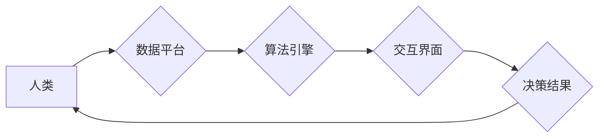

                 

## 创造更美好的世界：人类计算的终极目标

> 关键词：人工智能、计算模型、人类计算、算法优化、可持续发展、伦理规范、未来趋势

### 1. 背景介绍

人类文明的进步离不开对计算的不断探索和应用。从简单的算盘到复杂的超级计算机，计算一直是推动科技发展和社会进步的引擎。而随着人工智能技术的飞速发展，人类计算正进入一个全新的时代。

人工智能的出现，标志着计算能力的跨越式提升。人工智能算法能够学习和理解数据，并做出类似人类的决策。这为我们创造了无限的可能性，也带来了前所未有的挑战。

我们正处于一个十字路口，需要认真思考人工智能的发展方向，如何利用其强大的计算能力，创造更美好的世界。

### 2. 核心概念与联系

**2.1 人类计算的本质**

人类计算是指利用人类的智慧和计算能力，结合人工智能技术，共同解决复杂问题。它不仅仅是机器的计算能力，更重要的是人类的创造力、洞察力和伦理判断。

**2.2 人工智能的演进**

人工智能的发展经历了多个阶段，从早期规则型人工智能到现在的深度学习，每一次进步都带来了颠覆性的改变。深度学习算法的出现，使得人工智能能够处理海量数据，并从中学习出复杂的模式和规律。

**2.3 人类与人工智能的协同**

人类和人工智能并非相互替代，而是相互补充。人类擅长解决需要创造力和判断力的问题，而人工智能擅长处理大量数据和重复性任务。通过协同合作，我们可以发挥各自的优势，共同完成更复杂的任务。

**2.4 构建人类计算的架构**

为了实现人类计算的协同，我们需要构建一个完善的架构，包括：

* **数据平台:** 提供海量数据存储和处理能力。
* **算法引擎:** 提供各种人工智能算法，支持人类进行数据分析和决策。
* **交互界面:** 提供友好的交互方式，方便人类与人工智能进行沟通和合作。
* **伦理规范:** 制定相应的伦理规范，确保人工智能的应用安全、公平、可控。

**Mermaid 流程图**



### 3. 核心算法原理 & 具体操作步骤

**3.1 算法原理概述**

深度学习算法是人类计算的核心技术之一。它通过多层神经网络，模拟人类大脑的学习机制，从数据中学习出复杂的模式和规律。

**3.2 算法步骤详解**

1. **数据预处理:** 将原始数据进行清洗、转换和格式化，使其适合深度学习算法的训练。
2. **网络结构设计:** 根据具体任务，设计合适的深度神经网络结构，包括神经元的数量、连接方式和激活函数等。
3. **参数初始化:** 为神经网络中的参数进行随机初始化。
4. **前向传播:** 将输入数据通过神经网络进行传递，计算输出结果。
5. **反向传播:** 计算输出结果与真实值的误差，并根据误差反向调整神经网络的参数。
6. **优化算法:** 使用优化算法，例如梯度下降，不断调整参数，降低误差。
7. **模型评估:** 使用测试数据评估模型的性能，并根据评估结果进行模型调优。

**3.3 算法优缺点**

**优点:**

* 能够处理海量数据，学习出复杂的模式和规律。
* 具有强大的泛化能力，能够应用于各种不同的任务。

**缺点:**

* 训练过程需要大量的计算资源和时间。
* 对数据质量要求较高，数据偏差会影响模型的性能。
* 模型的内部机制难以解释，缺乏透明度。

**3.4 算法应用领域**

深度学习算法已广泛应用于各个领域，例如：

* **图像识别:** 人脸识别、物体检测、图像分类等。
* **自然语言处理:** 机器翻译、文本摘要、情感分析等。
* **语音识别:** 语音转文本、语音助手等。
* **推荐系统:** 商品推荐、内容推荐等。
* **医疗诊断:** 疾病预测、影像分析等。

### 4. 数学模型和公式 & 详细讲解 & 举例说明

**4.1 数学模型构建**

深度学习算法的核心是神经网络模型。神经网络模型由多个层组成，每一层包含多个神经元。神经元之间通过连接进行信息传递，每个连接都有一个权重。

**4.2 公式推导过程**

神经网络的学习过程本质上是一个参数优化过程。通过反向传播算法，我们可以计算出每个参数对输出结果的影响，并根据梯度下降法不断调整参数，使得模型的输出结果与真实值之间的误差最小化。

**损失函数:** 用于衡量模型预测结果与真实值的差距。常见的损失函数包括均方误差 (MSE) 和交叉熵损失 (Cross-Entropy Loss)。

**梯度下降法:** 用于更新模型参数的优化算法。

**4.3 案例分析与讲解**

假设我们有一个简单的线性回归模型，用于预测房价。模型的输入特征包括房屋面积和房间数量，输出为房价。

我们可以使用均方误差作为损失函数，梯度下降法作为优化算法，来训练这个模型。

通过训练，模型会学习出房屋面积和房间数量与房价之间的关系，并能够预测新的房屋的房价。

**公式示例:**

* 均方误差损失函数: $$L = \frac{1}{n} \sum_{i=1}^{n} (y_i - \hat{y}_i)^2$$

其中:

* $L$ 为损失函数值
* $n$ 为样本数量
* $y_i$ 为真实房价
* $\hat{y}_i$ 为模型预测的房价

**梯度下降法更新公式:**

$$\theta_j = \theta_j - \alpha \frac{\partial L}{\partial \theta_j}$$

其中:

* $\theta_j$ 为模型参数
* $\alpha$ 为学习率
* $\frac{\partial L}{\partial \theta_j}$ 为参数 $\theta_j$ 对损失函数的梯度

### 5. 项目实践：代码实例和详细解释说明

**5.1 开发环境搭建**

为了实现人类计算的项目实践，我们需要搭建一个合适的开发环境。

* **操作系统:** Linux 或 macOS
* **编程语言:** Python
* **深度学习框架:** TensorFlow 或 PyTorch
* **硬件环境:** GPU 加速器

**5.2 源代码详细实现**

以下是一个简单的深度学习模型的代码示例，使用 TensorFlow 框架实现图像分类任务。

```python
import tensorflow as tf

# 定义模型结构
model = tf.keras.models.Sequential([
    tf.keras.layers.Conv2D(32, (3, 3), activation='relu', input_shape=(28, 28, 1)),
    tf.keras.layers.MaxPooling2D((2, 2)),
    tf.keras.layers.Conv2D(64, (3, 3), activation='relu'),
    tf.keras.layers.MaxPooling2D((2, 2)),
    tf.keras.layers.Flatten(),
    tf.keras.layers.Dense(10, activation='softmax')
])

# 编译模型
model.compile(optimizer='adam',
              loss='sparse_categorical_crossentropy',
              metrics=['accuracy'])

# 训练模型
model.fit(x_train, y_train, epochs=5)

# 评估模型
loss, accuracy = model.evaluate(x_test, y_test)
print('Test loss:', loss)
print('Test accuracy:', accuracy)
```

**5.3 代码解读与分析**

这段代码定义了一个简单的卷积神经网络模型，用于图像分类任务。

* `tf.keras.models.Sequential` 创建了一个顺序模型，神经层按顺序连接。
* `tf.keras.layers.Conv2D` 定义了一个卷积层，用于提取图像特征。
* `tf.keras.layers.MaxPooling2D` 定义了一个最大池化层，用于降低特征图的维度。
* `tf.keras.layers.Flatten` 将多维特征图转换为一维向量。
* `tf.keras.layers.Dense` 定义了一个全连接层，用于分类。
* `model.compile` 编译模型，指定优化器、损失函数和评价指标。
* `model.fit` 训练模型，使用训练数据进行训练。
* `model.evaluate` 评估模型，使用测试数据评估模型的性能。

**5.4 运行结果展示**

训练完成后，我们可以使用测试数据评估模型的性能。

输出结果会显示测试集上的损失值和准确率。

### 6. 实际应用场景

**6.1 医疗诊断**

深度学习算法可以用于分析医学影像，辅助医生诊断疾病。例如，可以用于检测肺癌、乳腺癌、脑肿瘤等。

**6.2 金融风险管理**

深度学习算法可以用于分析金融数据，识别潜在的风险。例如，可以用于检测欺诈交易、预测股票价格波动等。

**6.3 智能交通**

深度学习算法可以用于智能交通系统，例如自动驾驶、交通流量预测等。

**6.4 个性化教育**

深度学习算法可以用于个性化教育，根据学生的学习情况，提供定制化的学习内容和教学方式。

**6.5 环保监测**

深度学习算法可以用于环境监测，例如监测空气质量、水质污染等。

**6.4 未来应用展望**

随着人工智能技术的不断发展，人类计算将在更多领域得到应用，例如：

* **科学研究:** 加速科学发现，解决复杂科学问题。
* **艺术创作:** 辅助艺术家创作新的艺术作品。
* **社会治理:** 提高社会管理效率，解决社会问题。

### 7. 工具和资源推荐

**7.1 学习资源推荐**

* **在线课程:** Coursera、edX、Udacity 等平台提供深度学习相关的在线课程。
* **书籍:** 《深度学习》、《神经网络与深度学习》等书籍。
* **开源项目:** TensorFlow、PyTorch 等开源深度学习框架。

**7.2 开发工具推荐**

* **编程语言:** Python
* **深度学习框架:** TensorFlow、PyTorch
* **数据处理工具:** Pandas、NumPy
* **可视化工具:** Matplotlib、Seaborn

**7.3 相关论文推荐**

* **《ImageNet Classification with Deep Convolutional Neural Networks》**
* **《Attention Is All You Need》**
* **《Generative Adversarial Networks》**

### 8. 总结：未来发展趋势与挑战

**8.1 研究成果总结**

人类计算正处于快速发展阶段，取得了令人瞩目的成果。深度学习算法的出现，使得人工智能能够处理海量数据，学习出复杂的模式和规律，并应用于各个领域。

**8.2 未来发展趋势**

* **模型规模和能力的提升:** 未来，深度学习模型将变得更加庞大，能够处理更加复杂的任务。
* **算法效率的提高:** 研究人员将继续探索更加高效的深度学习算法，降低训练时间和计算资源消耗。
* **模型解释性和透明度的增强:** 如何解释深度学习模型的决策过程，提高模型的透明度，是未来研究的重要方向。
* **跨模态学习:** 将不同模态的数据（例如文本、图像、音频）融合在一起，进行联合学习，是未来发展的重要趋势。

**8.3 面临的挑战**

* **数据安全和隐私保护:** 人类计算需要处理大量数据，如何保证数据安全和隐私保护，是需要认真考虑的问题。
* **算法偏见和公平性:** 深度学习算法可能会受到训练数据的影响，导致算法偏见和不公平的结果。
* **伦理规范和社会影响:** 人工智能的快速发展，需要制定相应的伦理规范，并关注其对社会的影响。

**8.4 研究展望**

未来，人类计算将继续朝着更加智能、高效、安全的方向发展。我们需要加强基础研究，探索新的算法和模型，并关注人工智能的伦理和社会影响，共同创造一个更加美好的未来。

### 9. 附录：常见问题与解答

**9.1 如何选择合适的深度学习框架？**

选择深度学习框架需要根据具体任务和需求进行考虑。 TensorFlow 和 PyTorch 是两个主流的深度学习框架，各有优缺点。

* **TensorFlow:** 更适合于生产环境，拥有更完善的部署工具和生态系统。
* **PyTorch:** 更灵活易用，更适合于研究和开发。

**9.2 如何解决深度学习模型的过拟合问题？**

过拟合是指模型在训练数据上表现很好，但在测试数据上表现较差。

解决过拟合问题的方法包括：

* **增加训练数据量**
* **使用正则化技术**
* **使用 dropout 技术**
* **使用 early stopping 技术**

**9.3 如何评估深度学习模型的性能？**

常用的评估指标包括：

* **准确率:** 模型正确预测的样本数量占总样本数量的比例。
* **召回率:** 模型正确预测的正样本数量占所有正样本数量的比例。
* **F1-score:** 准确率和召回率的调和平均值。
* **AUC:** 曲线下面积，用于评估模型的二分类能力。


作者：禅与计算机程序设计艺术 / Zen and the Art of Computer Programming<end_of_turn>

