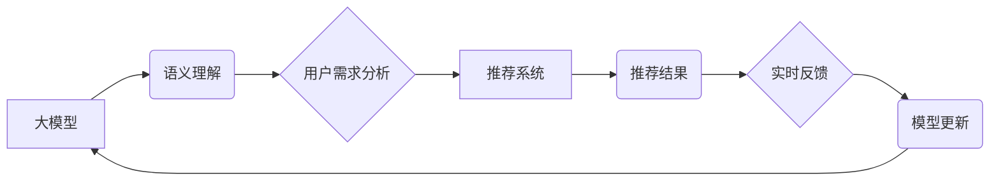

                 

## 利用大模型改进推荐系统的实时反馈处理

> 关键词：大模型、推荐系统、实时反馈、用户行为、个性化推荐、自然语言处理、Transformer模型

## 1. 背景介绍

推荐系统是互联网时代的重要组成部分，它通过分析用户行为和偏好，为用户提供个性化的内容推荐，例如商品、视频、音乐等。传统的推荐系统主要依赖于协同过滤、内容过滤和基于知识的推荐算法，这些算法通常需要大量的历史数据进行训练，并且难以捕捉用户行为的动态变化和复杂关系。

随着大模型技术的快速发展，大模型在推荐系统领域展现出巨大的潜力。大模型拥有强大的语义理解和文本生成能力，能够更好地理解用户的需求和意图，从而提供更精准、更个性化的推荐。

实时反馈处理是推荐系统的重要环节，它能够及时收集用户对推荐结果的反馈，并将其反馈到推荐算法中，从而不断优化推荐效果。然而，传统的实时反馈处理机制往往存在效率低下、数据处理复杂等问题。

## 2. 核心概念与联系

### 2.1  大模型

大模型是指参数量达到数亿甚至数十亿的深度学习模型，例如GPT-3、BERT、LaMDA等。大模型通过海量数据训练，能够学习到复杂的语言模式和知识表示，从而具备强大的语义理解、文本生成、翻译等能力。

### 2.2  推荐系统

推荐系统旨在根据用户的历史行为、偏好和上下文信息，预测用户对特定物品的兴趣，并提供个性化的推荐。常见的推荐算法包括协同过滤、内容过滤和基于知识的推荐算法。

### 2.3  实时反馈处理

实时反馈处理是指在用户与推荐系统交互时，及时收集用户对推荐结果的反馈，并将其反馈到推荐算法中，以不断优化推荐效果。常见的实时反馈类型包括点击、评分、购买等。

**核心概念与联系流程图:**



## 3. 核心算法原理 & 具体操作步骤

### 3.1  算法原理概述

利用大模型改进推荐系统的实时反馈处理，主要思路是将用户反馈信息作为训练数据，不断更新大模型的参数，从而提升推荐系统的精准度和个性化程度。

具体来说，可以采用以下步骤：

1. 收集用户对推荐结果的实时反馈信息，例如点击、评分、购买等。
2. 将用户反馈信息与用户历史行为数据结合，构建用户行为特征向量。
3. 利用大模型对用户行为特征向量进行语义理解和分析，提取用户潜在需求和偏好。
4. 根据用户需求和偏好，更新推荐系统的模型参数，从而提升推荐效果。

### 3.2  算法步骤详解

1. **数据收集与预处理:** 收集用户对推荐结果的实时反馈信息，并进行清洗、格式化等预处理操作。
2. **用户行为特征提取:** 将用户反馈信息与用户历史行为数据结合，例如浏览记录、购买历史、评分等，提取用户行为特征向量。
3. **大模型语义理解:** 利用预训练的大模型对用户行为特征向量进行语义理解和分析，提取用户潜在需求和偏好。
4. **模型参数更新:** 根据用户需求和偏好，更新推荐系统的模型参数，例如权重、偏置等。
5. **推荐结果生成:** 利用更新后的模型参数，生成个性化的推荐结果。

### 3.3  算法优缺点

**优点:**

* 能够更好地理解用户的需求和意图，提供更精准的推荐。
* 能够实时更新推荐模型，适应用户行为的变化。
* 能够个性化推荐，提升用户体验。

**缺点:**

* 需要大量的训练数据和计算资源。
* 模型训练和更新过程复杂，需要专业的技术人员。
* 存在数据隐私和安全问题。

### 3.4  算法应用领域

* **电商推荐:** 为用户推荐商品、优惠券等。
* **内容推荐:** 为用户推荐新闻、视频、音乐等内容。
* **社交推荐:** 为用户推荐好友、群组等。
* **教育推荐:** 为用户推荐学习资源、课程等。

## 4. 数学模型和公式 & 详细讲解 & 举例说明

### 4.1  数学模型构建

假设用户 $u$ 的行为特征向量为 $x_u$，推荐物品的特征向量为 $x_i$，则可以使用以下数学模型来预测用户 $u$ 对物品 $i$ 的评分：

$$
\hat{r}_{ui} = f(x_u, x_i, \theta)
$$

其中，$f$ 为评分预测函数，$\theta$ 为模型参数。

### 4.2  公式推导过程

可以使用梯度下降算法来优化模型参数 $\theta$，目标函数为均方误差：

$$
L(\theta) = \frac{1}{N} \sum_{u=1}^{N} \sum_{i=1}^{M} (r_{ui} - \hat{r}_{ui})^2
$$

其中，$N$ 为用户数量，$M$ 为物品数量，$r_{ui}$ 为用户 $u$ 对物品 $i$ 的真实评分，$\hat{r}_{ui}$ 为模型预测的评分。

梯度下降算法的更新规则为：

$$
\theta = \theta - \alpha \nabla L(\theta)
$$

其中，$\alpha$ 为学习率，$\nabla L(\theta)$ 为目标函数 $L(\theta)$ 的梯度。

### 4.3  案例分析与讲解

假设我们有一个电商平台，用户 $u$ 的行为特征向量 $x_u$ 包含用户年龄、性别、购买历史等信息，物品 $i$ 的特征向量 $x_i$ 包含物品类别、价格、评价等信息。

我们可以使用大模型对用户行为特征向量和物品特征向量进行语义理解，提取用户潜在需求和物品属性，并将其作为评分预测函数 $f$ 的输入。

通过训练和更新模型参数 $\theta$，我们可以得到一个能够预测用户对商品评分的模型，从而为用户推荐更符合其偏好的商品。

## 5. 项目实践：代码实例和详细解释说明

### 5.1  开发环境搭建

* Python 3.7+
* TensorFlow 2.0+
* PyTorch 1.0+
* CUDA 10.0+ (可选)

### 5.2  源代码详细实现

```python
import tensorflow as tf

# 定义评分预测模型
class RecommenderModel(tf.keras.Model):
    def __init__(self, embedding_dim, num_users, num_items):
        super(RecommenderModel, self).__init__()
        self.user_embedding = tf.keras.layers.Embedding(num_users, embedding_dim)
        self.item_embedding = tf.keras.layers.Embedding(num_items, embedding_dim)
        self.dense = tf.keras.layers.Dense(1)

    def call(self, user_ids, item_ids):
        user_embeddings = self.user_embedding(user_ids)
        item_embeddings = self.item_embedding(item_ids)
        concat = tf.keras.layers.Concatenate()([user_embeddings, item_embeddings])
        output = self.dense(concat)
        return output

# 训练模型
model = RecommenderModel(embedding_dim=64, num_users=1000, num_items=10000)
model.compile(optimizer='adam', loss='mse')
model.fit(x=[user_ids, item_ids], y=ratings, epochs=10)

# 生成推荐结果
user_id = 123
item_ids = tf.constant([1, 2, 3, 4, 5])
predictions = model(user_id, item_ids)
```

### 5.3  代码解读与分析

* 首先，定义了一个评分预测模型 `RecommenderModel`，该模型使用嵌入层将用户 ID 和物品 ID 映射到低维向量空间，然后使用全连接层进行评分预测。
* 然后，使用 TensorFlow 的 `compile` 方法配置模型的优化器、损失函数等参数。
* 接着，使用 `fit` 方法训练模型，输入用户 ID、物品 ID 和真实评分数据。
* 最后，使用训练好的模型生成推荐结果，输入用户 ID 和候选物品 ID，得到每个物品的预测评分。

### 5.4  运行结果展示

训练完成后，可以将模型应用于实际场景，例如为用户推荐商品。

## 6. 实际应用场景

### 6.1  电商推荐

利用大模型改进推荐系统的实时反馈处理，可以为电商平台提供更精准、更个性化的商品推荐，提升用户购物体验和转化率。

### 6.2  内容推荐

在内容推荐领域，大模型可以帮助平台更好地理解用户的兴趣偏好，并推荐更符合用户需求的内容，例如新闻、视频、音乐等。

### 6.3  社交推荐

社交平台可以利用大模型分析用户的社交行为和兴趣，推荐更相关的用户、群组和内容，提升用户粘性和活跃度。

### 6.4  未来应用展望

随着大模型技术的不断发展，其在推荐系统领域的应用将更加广泛和深入。例如，可以利用大模型进行多模态推荐，融合文本、图像、音频等多种数据类型，提供更丰富的推荐体验。

## 7. 工具和资源推荐

### 7.1  学习资源推荐

* **书籍:**
    * Deep Learning by Ian Goodfellow, Yoshua Bengio, and Aaron Courville
    * Natural Language Processing with Python by Steven Bird, Ewan Klein, and Edward Loper
* **在线课程:**
    * Stanford CS224N: Natural Language Processing with Deep Learning
    * DeepLearning.AI TensorFlow Specialization

### 7.2  开发工具推荐

* **TensorFlow:** https://www.tensorflow.org/
* **PyTorch:** https://pytorch.org/
* **Hugging Face Transformers:** https://huggingface.co/transformers/

### 7.3  相关论文推荐

* **BERT: Pre-training of Deep Bidirectional Transformers for Language Understanding**
* **GPT-3: Language Models are Few-Shot Learners**
* **Transformer-XL: Attentive Language Models Beyond a Fixed-Length Context**

## 8. 总结：未来发展趋势与挑战

### 8.1  研究成果总结

利用大模型改进推荐系统的实时反馈处理，取得了显著的成果，能够提升推荐系统的精准度和个性化程度。

### 8.2  未来发展趋势

* **多模态推荐:** 融合文本、图像、音频等多种数据类型，提供更丰富的推荐体验。
* **个性化推荐:** 更深入地理解用户的需求和偏好，提供更精准的个性化推荐。
* **实时交互:** 更加实时地收集用户反馈，并将其反馈到推荐模型中，提升推荐效果。

### 8.3  面临的挑战

* **数据隐私和安全:** 大模型训练需要大量的用户数据，如何保护用户隐私和数据安全是一个重要的挑战。
* **模型解释性和可控性:** 大模型的决策过程往往难以解释，如何提高模型的解释性和可控性是一个重要的研究方向。
* **计算资源和成本:** 大模型训练需要大量的计算资源和成本，如何降低训练成本是一个重要的挑战。

### 8.4  研究展望

未来，我们将继续探索大模型在推荐系统领域的应用，致力于开发更精准、更个性化、更安全的推荐系统，为用户提供更好的体验。

## 9. 附录：常见问题与解答

**Q1: 大模型训练需要多少数据？**

A1: 大模型训练需要大量的训练数据，通常需要百万甚至数十亿条数据。

**Q2: 大模型训练需要多少计算资源？**

A2: 大模型训练需要大量的计算资源，通常需要使用高性能计算集群。

**Q3: 如何保护用户隐私和数据安全？**

A3: 可以采用数据脱敏、联邦学习等技术来保护用户隐私和数据安全。


作者：禅与计算机程序设计艺术 / Zen and the Art of Computer Programming 
<end_of_turn>

