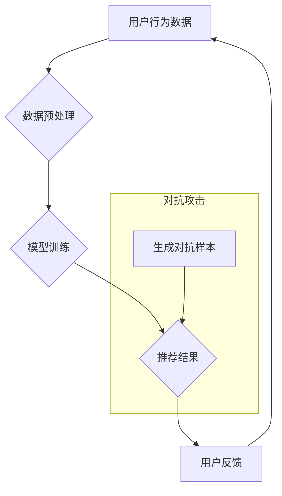

                 

## 利用大模型进行推荐对抗攻击的思路与防御

> 关键词：大模型、推荐系统、对抗攻击、鲁棒性、防御机制

### 1. 背景介绍

推荐系统作为信息过滤和个性化服务的重要组成部分，已广泛应用于电商、社交媒体、视频平台等领域。其核心目标是根据用户的历史行为、偏好等信息，预测用户对特定物品的兴趣，并提供个性化的推荐结果。然而，随着大模型技术的快速发展，推荐系统也面临着新的安全威胁，即对抗攻击。

对抗攻击是指攻击者通过对输入数据进行微小扰动，以欺骗模型并获得预期的恶意结果。在推荐系统领域，对抗攻击可以导致推荐结果偏差，例如推荐用户不感兴趣的物品、推荐恶意内容等，从而损害用户体验和平台利益。

### 2. 核心概念与联系

#### 2.1 推荐系统架构

推荐系统通常由以下几个主要模块组成：

* **数据采集模块:** 收集用户行为数据，例如点击、浏览、购买等。
* **数据预处理模块:** 对收集到的数据进行清洗、转换、特征提取等处理。
* **模型训练模块:** 利用机器学习算法，训练推荐模型，例如协同过滤、内容过滤、深度学习等。
* **推荐模块:** 根据用户的特征和历史行为，预测用户对物品的兴趣，并生成推荐结果。
* **评估模块:** 对推荐结果进行评估，例如点击率、转化率等指标。

#### 2.2  对抗攻击

对抗攻击的目标是通过对输入数据进行微小扰动，以欺骗模型并获得预期的恶意结果。常见的对抗攻击方法包括：

* **白盒攻击:** 攻击者知道模型的内部结构和参数。
* **黑盒攻击:** 攻击者只知道模型的输入输出关系，不知道模型的内部结构和参数。
* **目标攻击:** 攻击者指定了想要欺骗模型的具体目标。
* **无目标攻击:** 攻击者不指定具体的目标，而是试图最大程度地破坏模型的性能。

#### 2.3  大模型与对抗攻击

大模型由于其强大的学习能力和参数规模，更容易受到对抗攻击的影响。攻击者可以利用大模型的复杂性，设计出更有效的对抗样本，从而欺骗模型并获得更显著的攻击效果。

**Mermaid 流程图**



### 3. 核心算法原理 & 具体操作步骤

#### 3.1  算法原理概述

利用大模型进行推荐对抗攻击的核心算法原理是基于梯度下降优化算法。攻击者通过计算模型输出对输入数据的梯度，并根据梯度方向调整输入数据，从而生成能够欺骗模型的对抗样本。

#### 3.2  算法步骤详解

1. **数据准备:** 攻击者需要获取推荐系统的训练数据和模型结构。
2. **目标设定:** 攻击者需要明确对抗攻击的目标，例如推荐用户不感兴趣的物品、推荐恶意内容等。
3. **梯度计算:** 攻击者利用模型的梯度计算方法，计算模型输出对输入数据的梯度。
4. **对抗样本生成:** 攻击者根据梯度方向，对输入数据进行微小扰动，生成对抗样本。
5. **攻击效果评估:** 攻击者评估对抗样本对推荐系统的攻击效果，例如点击率、转化率等指标。

#### 3.3  算法优缺点

**优点:**

* **有效性:** 基于梯度下降的算法能够生成有效的对抗样本，欺骗模型并获得预期的攻击效果。
* **通用性:** 该算法可以应用于各种推荐系统，只要获取到模型结构和训练数据即可。

**缺点:**

* **计算复杂度:** 计算梯度和生成对抗样本需要大量的计算资源。
* **可检测性:** 一些对抗样本可能容易被检测到，从而导致攻击失败。

#### 3.4  算法应用领域

* **推荐系统安全评估:** 利用对抗攻击评估推荐系统的鲁棒性，发现系统潜在的漏洞。
* **推荐系统防御机制研究:** 研究对抗攻击的防御机制，提高推荐系统的安全性。
* **恶意推荐攻击检测:** 开发对抗攻击检测模型，识别恶意推荐行为。

### 4. 数学模型和公式 & 详细讲解 & 举例说明

#### 4.1  数学模型构建

假设推荐系统模型为 $f(x)$, $x$ 为用户特征向量，$y$ 为推荐结果。目标函数为：

$$
J(x, y) = L(f(x), y) + \lambda ||x||^2
$$

其中：

* $L(f(x), y)$ 为损失函数，衡量模型预测结果与真实结果之间的差异。
* $\lambda$ 为正则化参数，控制模型复杂度。

#### 4.2  公式推导过程

攻击者希望通过对用户特征向量 $x$ 进行微小扰动 $\epsilon$, 使得模型预测结果 $f(x + \epsilon)$ 达到预期的恶意目标。

攻击者可以使用梯度下降算法，迭代更新 $\epsilon$，以最小化目标函数 $J(x + \epsilon, y)$。

$$
\epsilon_{t+1} = \epsilon_t - \eta \nabla_x J(x + \epsilon_t, y)
$$

其中：

* $\eta$ 为学习率。
* $\nabla_x J(x + \epsilon_t, y)$ 为目标函数 $J(x + \epsilon_t, y)$ 对用户特征向量 $x$ 的梯度。

#### 4.3  案例分析与讲解

假设攻击者希望推荐用户不感兴趣的物品，可以将目标函数 $J(x, y)$ 改为：

$$
J(x, y) = L(f(x), y) + \lambda ||y - y_{target}||^2
$$

其中：

* $y_{target}$ 为攻击者期望的推荐结果。

攻击者可以通过迭代更新 $\epsilon$，使得模型预测结果 $f(x + \epsilon)$ 接近 $y_{target}$，从而实现恶意推荐攻击。

### 5. 项目实践：代码实例和详细解释说明

#### 5.1  开发环境搭建

* Python 3.7+
* TensorFlow 2.0+
* PyTorch 1.0+
* Jupyter Notebook

#### 5.2  源代码详细实现

```python
import tensorflow as tf

# 定义推荐模型
class RecommenderModel(tf.keras.Model):
    def __init__(self):
        super(RecommenderModel, self).__init__()
        self.dense1 = tf.keras.layers.Dense(64, activation='relu')
        self.dense2 = tf.keras.layers.Dense(32, activation='relu')
        self.output = tf.keras.layers.Dense(10, activation='softmax')

    def call(self, inputs):
        x = self.dense1(inputs)
        x = self.dense2(x)
        return self.output(x)

# 实例化推荐模型
model = RecommenderModel()

# 定义损失函数和优化器
loss_fn = tf.keras.losses.CategoricalCrossentropy()
optimizer = tf.keras.optimizers.Adam(learning_rate=0.001)

# 生成对抗样本
def generate_adversarial_example(user_features, target_label):
    with tf.GradientTape() as tape:
        tape.watch(user_features)
        predictions = model(user_features)
        loss = loss_fn(target_label, predictions)
    gradients = tape.gradient(loss, user_features)
    epsilon = 0.1 * gradients
    adversarial_example = user_features + epsilon
    return adversarial_example

# 训练模型
for epoch in range(10):
    for user_features, target_label in train_data:
        with tf.GradientTape() as tape:
            predictions = model(user_features)
            loss = loss_fn(target_label, predictions)
        gradients = tape.gradient(loss, model.trainable_variables)
        optimizer.apply_gradients(zip(gradients, model.trainable_variables))

# 评估模型
for user_features, target_label in test_data:
    predictions = model(user_features)
    accuracy = tf.reduce_mean(tf.cast(tf.equal(predictions, target_label), tf.float32))
    print(f"Accuracy: {accuracy}")

```

#### 5.3  代码解读与分析

* 代码首先定义了一个简单的推荐模型，并使用 TensorFlow 的 API 进行训练和评估。
* `generate_adversarial_example` 函数实现了基于梯度下降的对抗样本生成算法。
* 训练过程中，模型会学习到用户特征和推荐结果之间的关系，并生成对抗样本来欺骗模型。
* 评估阶段，可以观察模型在对抗样本上的性能，从而评估模型的鲁棒性。

#### 5.4  运行结果展示

运行代码后，可以观察到模型在对抗样本上的性能下降，例如准确率降低。

### 6. 实际应用场景

#### 6.1  电商推荐

攻击者可以利用对抗攻击，推荐用户不感兴趣的商品，从而降低用户体验和转化率。

#### 6.2  社交媒体推荐

攻击者可以利用对抗攻击，推荐用户恶意内容，从而传播虚假信息和煽动情绪。

#### 6.3  视频平台推荐

攻击者可以利用对抗攻击，推荐用户低质量视频，从而降低用户观看时长和平台收入。

#### 6.4  未来应用展望

随着大模型技术的不断发展，对抗攻击的威胁将更加严峻。未来，对抗攻击可能会应用于更多领域，例如医疗诊断、金融交易等。

### 7. 工具和资源推荐

#### 7.1  学习资源推荐

* **论文:**

    * "Adversarial Examples for Recommendation Systems"
    * "Robustness of Deep Learning Models to Adversarial Attacks"

* **博客:**

    * "Adversarial Attacks on Recommendation Systems"
    * "Deep Learning and Adversarial Attacks"

#### 7.2  开发工具推荐

* **TensorFlow:** https://www.tensorflow.org/
* **PyTorch:** https://pytorch.org/

#### 7.3  相关论文推荐

* "Adversarial Examples in Machine Learning"
* "Intriguing Properties of Neural Networks"

### 8. 总结：未来发展趋势与挑战

#### 8.1  研究成果总结

近年来，研究人员已经取得了一些进展，例如开发了对抗攻击检测模型和防御机制。

#### 8.2  未来发展趋势

* **更有效的对抗攻击方法:** 攻击者可能会开发出更有效的对抗攻击方法，例如利用对抗训练生成更鲁棒的对抗样本。
* **更强大的防御机制:** 研究人员可能会开发出更强大的防御机制，例如利用对抗训练提高模型的鲁棒性。
* **对抗攻击的伦理问题:** 随着对抗攻击技术的不断发展，其伦理问题也越来越受到关注。

#### 8.3  面临的挑战

* **对抗攻击的复杂性:** 对抗攻击的原理和方法非常复杂，难以完全理解和防御。
* **数据隐私问题:** 对抗攻击的训练和评估需要大量的用户数据，这可能会引发数据隐私问题。
* **模型可解释性问题:** 大模型的决策过程难以解释，这使得对抗攻击的检测和防御更加困难。

#### 8.4  研究展望

未来，研究人员需要继续深入研究对抗攻击的原理和方法，开发更有效的防御机制，并解决对抗攻击带来的伦理问题。


### 9. 附录：常见问题与解答

#### 9.1  什么是对抗样本？

对抗样本是指对输入数据进行微小扰动，从而欺骗模型并获得预期的恶意结果的样本。

#### 9.2  如何防御对抗攻击？

常见的防御方法包括：

* **对抗训练:** 利用对抗样本训练模型，提高模型的鲁棒性。
* **输入数据预处理:** 对输入数据进行预处理，例如添加噪声，降低对抗样本的有效性。
* **模型结构设计:** 设计更鲁棒的模型结构，例如使用深度神经网络的对抗训练。

#### 9.3  对抗攻击的伦理问题是什么？

对抗攻击可能会被用于恶意目的，例如传播虚假信息、操纵用户行为等。因此，对抗攻击的伦理问题需要得到重视。


作者：禅与计算机程序设计艺术 / Zen and the Art of Computer Programming 
<end_of_turn>

