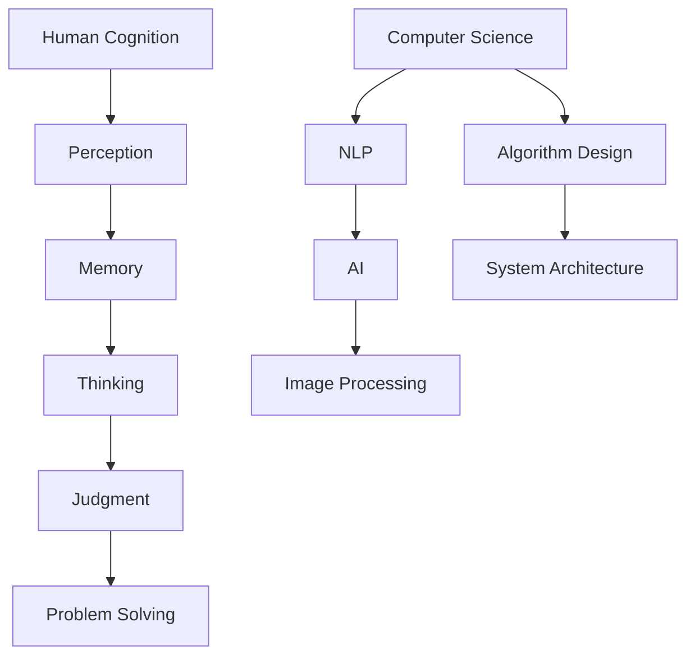

                 

### 文章标题

### Utilizing Human Cognition to Solve Complex Problems

### 摘要

本文旨在探讨如何利用人类认知来解决复杂的IT领域问题。我们将详细分析人类思维模式，探讨认知心理学和计算机科学之间的联系，并探讨如何借鉴人类认知机制来优化算法设计、提升代码可读性和解决复杂的系统问题。通过结合理论研究与实践案例，我们将展示如何通过认知科学的方法来提高IT领域的问题解决效率。

### Abstract

This article aims to explore how human cognition can be leveraged to solve complex problems in the IT field. We will delve into human thinking patterns, examine the relationship between cognitive psychology and computer science, and discuss how human cognitive mechanisms can be applied to optimize algorithm design, enhance code readability, and tackle complex system problems. By combining theoretical research with practical case studies, we will demonstrate how cognitive science methods can improve problem-solving efficiency in the IT field.

## 1. 背景介绍

### 1.1 人类认知与计算机科学的交汇

人类认知和计算机科学是两个看似迥异但又紧密相连的领域。人类认知指的是人类理解、思考、学习和解决问题的方式。计算机科学则关注于设计、开发和应用计算机系统和软件。尽管这两个领域的研究目标和工具不同，但它们在许多方面有着显著的交集。

在计算机科学中，人类认知的研究可以帮助我们更好地理解如何设计更智能、更人性化的计算机系统。例如，自然语言处理（NLP）领域的研究依赖于对人类语言习得和理解过程的理解。同样，在人工智能（AI）领域，深度学习算法的设计和优化也受到人类大脑结构和认知机制的启发。

另一方面，计算机科学的进展也为认知心理学提供了新的工具和研究方法。通过计算机模拟和数据分析，研究人员可以更深入地探索人类思维的过程和机制。这种跨学科的合作有助于推动人类认知和计算机科学的共同进步。

### 1.2 复杂问题在IT领域的挑战

在IT领域，复杂问题无处不在。从软件开发到系统架构设计，从算法优化到数据挖掘，这些问题往往需要综合运用各种技术、知识和经验来解决。然而，随着技术的不断进步和业务需求的日益复杂，解决这些问题的难度也在不断增加。

传统的解决方法往往依赖于线性思维和机械化的步骤。这种方法在处理简单问题时可能效果显著，但在面对复杂、非线性的问题时，往往显得力不从心。例如，当系统面临大规模数据和高并发请求时，传统的优化策略可能无法有效地提高性能和稳定性。

因此，我们需要寻找新的方法来应对这些挑战。人类认知为我们提供了一种可能的途径。通过借鉴人类认知的机制，我们可以设计出更加灵活、适应性更强的算法和系统。这种方法不仅能够提高问题解决效率，还能够降低系统的复杂度和维护成本。

### 1.3 文章结构

本文将分为以下几个部分：

1. **背景介绍**：介绍人类认知与计算机科学的交汇以及复杂问题在IT领域的挑战。
2. **核心概念与联系**：分析人类认知的关键概念，如注意力、记忆和决策过程，并探讨它们与计算机科学的关系。
3. **核心算法原理 & 具体操作步骤**：介绍利用人类认知优化算法设计的方法，包括注意力机制、记忆网络和决策树等。
4. **数学模型和公式 & 详细讲解 & 举例说明**：介绍用于解决复杂问题的数学模型和公式，并通过实例进行详细讲解。
5. **项目实践：代码实例和详细解释说明**：通过具体的项目实践展示如何应用这些方法和模型。
6. **实际应用场景**：探讨这些方法在实际IT项目中的应用，以及可能面临的挑战和解决方案。
7. **工具和资源推荐**：推荐相关的学习资源和开发工具。
8. **总结：未来发展趋势与挑战**：总结本文的主要观点，并展望未来可能的发展趋势和挑战。
9. **附录：常见问题与解答**：回答读者可能关心的问题。
10. **扩展阅读 & 参考资料**：提供进一步的阅读材料。

通过这篇文章，我们希望能够为读者提供一个全面、深入的视角，帮助他们在IT领域更有效地解决复杂问题。

## 2. 核心概念与联系

### 2.1 什么是人类认知？

人类认知是指人类获取、处理、存储和使用信息的过程。它包括感知、记忆、思考、判断和解决问题等多个方面。认知心理学是研究这些过程的科学，通过对人类认知机制的深入理解，我们可以更好地设计出符合人类思维习惯的计算机系统和软件。

在计算机科学中，人类认知的概念被广泛应用于多个领域。例如，在自然语言处理（NLP）中，研究人员通过模拟人类语言习得和理解的过程，设计出更加智能的语言模型。在人工智能（AI）领域，深度学习算法的设计灵感往往来源于对人类大脑结构的理解。

### 2.2 人类认知的关键概念

#### 注意力

注意力是人类认知过程中至关重要的一个方面。它指的是我们在某一时刻选择关注特定信息，而忽略其他信息的能力。注意力机制在计算机科学中有着广泛的应用。例如，在图像处理中，通过注意力机制可以显著提高图像识别的准确性。同样，在文本分析中，注意力机制可以帮助模型更准确地理解文本的上下文。

#### 记忆

记忆是另一个核心的认知概念。它指的是我们存储和使用信息的能力。在计算机科学中，记忆被形象地称为“存储”。无论是硬盘、内存还是数据库，它们都是用来存储和处理信息的。通过借鉴人类记忆的机制，我们可以设计出更加高效、可靠的存储系统。

#### 决策

决策是人类认知的另一个关键方面。它涉及到我们在不同情况下选择最优行动的过程。在计算机科学中，决策过程可以通过算法来实现。例如，在优化问题中，算法需要根据特定的目标和约束条件，选择最优的解决方案。通过理解人类决策过程，我们可以设计出更加智能的决策算法。

### 2.3 认知心理学与计算机科学的联系

#### 自然语言处理（NLP）

自然语言处理是计算机科学中的一个重要领域，它涉及计算机理解和生成自然语言的能力。认知心理学为NLP提供了重要的理论支持。例如，通过研究人类语言习得和理解的过程，研究人员可以设计出更加准确的语音识别和语言翻译系统。

#### 人工智能（AI）

人工智能是计算机科学中的另一个重要分支，它旨在模拟人类智能，实现自动化决策和问题解决。认知心理学为AI提供了重要的启发。例如，通过理解人类大脑的工作原理，研究人员可以设计出更加智能的神经网络模型，从而提高机器学习算法的性能。

#### 图像处理

图像处理是计算机科学中的另一个重要领域，它涉及到图像的获取、处理和分析。认知心理学为图像处理提供了重要的理论基础。例如，通过研究人类视觉系统的机制，研究人员可以设计出更加高效的图像识别算法。

### 2.4 Mermaid 流程图

以下是一个简化的 Mermaid 流程图，展示了人类认知与计算机科学之间的一些关键联系：



通过这个流程图，我们可以更清晰地看到人类认知如何影响计算机科学的不同领域。

### 2.5 人类认知的抽象与计算机科学的建模

人类认知的抽象和计算机科学的建模是两个互为补充的过程。抽象是将复杂的现实问题简化为可处理的模型，而建模则是通过这些简化模型来模拟和预测现实世界的行为。在计算机科学中，这种抽象和建模过程通常涉及到以下步骤：

1. **问题定义**：明确要解决的问题及其约束条件。
2. **数据收集**：收集与问题相关的数据，包括输入、输出以及中间状态。
3. **特征提取**：从数据中提取关键特征，以便进行建模。
4. **模型构建**：使用合适的算法和工具构建数学模型。
5. **模型训练**：通过已有数据训练模型，使其能够准确预测新数据的特征。
6. **模型验证**：使用测试数据验证模型的准确性和可靠性。
7. **模型部署**：将模型应用于实际问题，并进行持续的优化和调整。

通过这些步骤，计算机科学家可以将复杂的认知过程转化为可操作和可重复的算法。这种方法不仅提高了问题解决的效率，还为科学研究和技术创新提供了新的途径。

### 2.6 人类认知与计算机科学的互补性

人类认知和计算机科学在解决复杂问题时具有互补性。人类认知提供了丰富的直觉和经验，能够处理抽象思维和创造性问题，而计算机科学则提供了强大的计算能力和精确的算法，能够处理大量数据和复杂的计算任务。通过结合两者的优势，我们可以设计出更加高效和智能的解决方案。

例如，在软件开发过程中，程序员可以通过模拟人类思维过程，设计出更加直观和易用的用户界面。同时，通过计算机科学的方法，程序员可以自动化执行复杂的任务，提高开发效率和代码质量。

总之，人类认知与计算机科学的结合不仅能够提高问题解决的效率，还能够推动科学和技术的共同进步。通过深入理解和借鉴人类认知机制，我们可以设计出更加智能和高效的计算机系统和算法，为未来的技术发展提供坚实的理论基础和实践指导。

### 3. 核心算法原理 & 具体操作步骤

在了解了人类认知的关键概念后，我们将探讨如何利用这些概念来优化算法设计，解决复杂问题。以下是一些核心算法原理及其具体操作步骤。

#### 3.1 注意力机制

注意力机制是一种在计算模型中模拟人类注意力过程的算法。它通过动态地分配资源，使得模型能够关注到输入数据中的重要部分，从而提高处理效率和准确性。

**具体操作步骤**：

1. **初始化注意力模型**：选择一个合适的神经网络架构，如Transformer模型，并初始化参数。
2. **输入数据预处理**：对输入数据进行预处理，例如分词、编码等。
3. **计算注意力权重**：通过计算输入数据之间的相似度，生成注意力权重矩阵。
4. **更新模型状态**：根据注意力权重矩阵，更新模型的状态，使其关注到重要的输入信息。
5. **输出预测结果**：使用更新后的模型状态生成输出结果。

#### 3.2 记忆网络

记忆网络是一种模拟人类记忆机制的算法，它能够有效地存储和处理大量信息，并从历史数据中学习，提高模型的泛化能力。

**具体操作步骤**：

1. **设计记忆结构**：选择一个合适的记忆结构，如循环神经网络（RNN）或图神经网络（GNN），并初始化参数。
2. **输入数据预处理**：对输入数据进行预处理，例如编码、归一化等。
3. **存储信息**：将输入数据存储在记忆结构中，可以使用向量、矩阵或图等形式。
4. **检索信息**：根据当前任务需求，从记忆结构中检索相关数据。
5. **更新模型状态**：将检索到的信息整合到模型状态中，生成输出结果。

#### 3.3 决策树

决策树是一种常见的分类和回归算法，它通过一系列的决策规则来划分数据，并生成分类或回归结果。

**具体操作步骤**：

1. **构建决策树**：选择一个合适的决策树构建算法，如ID3、C4.5或CART，并初始化参数。
2. **数据预处理**：对输入数据进行预处理，例如分词、编码、归一化等。
3. **划分数据**：根据数据特征和目标变量，逐步划分数据集，构建决策树。
4. **生成预测结果**：根据决策树的结构，对新的数据进行预测。
5. **模型评估**：使用评估指标（如准确率、召回率等）评估模型的性能，并调整参数以优化模型。

#### 3.4 深度学习模型

深度学习模型是一种基于多层神经网络的学习算法，它通过逐层提取特征，实现对复杂数据的建模。

**具体操作步骤**：

1. **选择模型架构**：选择一个合适的深度学习模型架构，如卷积神经网络（CNN）、循环神经网络（RNN）或 Transformer等。
2. **数据预处理**：对输入数据进行预处理，例如图像增强、归一化、数据增强等。
3. **模型训练**：使用训练数据对模型进行训练，优化模型参数。
4. **模型验证**：使用验证数据评估模型性能，调整模型参数。
5. **模型部署**：将训练好的模型部署到实际应用场景中，并进行持续的优化和更新。

通过以上步骤，我们可以利用人类认知的核心原理，设计出更加高效和智能的算法，解决复杂的IT领域问题。

### 4. 数学模型和公式 & 详细讲解 & 举例说明

在解决复杂问题时，数学模型和公式是我们不可或缺的工具。它们不仅帮助我们精确地描述问题，还能提供一套系统的解决方案。在本节中，我们将介绍一些用于解决复杂问题的数学模型和公式，并通过具体例子进行详细讲解。

#### 4.1 线性回归模型

线性回归是一种用于预测连续数值的统计模型。它的核心公式如下：

\[ Y = \beta_0 + \beta_1X + \epsilon \]

其中，\( Y \) 是因变量，\( X \) 是自变量，\( \beta_0 \) 和 \( \beta_1 \) 是模型的参数，\( \epsilon \) 是误差项。

**示例**：假设我们想预测一个地区的房价。自变量可以是房屋面积、建筑年代等。我们可以通过收集这些数据，使用线性回归模型来预测房价。

1. **数据收集**：收集多个地区的房屋面积和房价数据。
2. **数据预处理**：对数据进行清洗、归一化等预处理。
3. **模型构建**：使用最小二乘法（OLS）计算模型参数 \( \beta_0 \) 和 \( \beta_1 \)。
4. **模型评估**：使用 R 方值（\( R^2 \)）等指标评估模型性能。
5. **预测**：使用训练好的模型预测新地区的房价。

#### 4.2 支持向量机（SVM）

支持向量机是一种用于分类的监督学习算法。它的核心公式如下：

\[ w \cdot x + b = 0 \]

其中，\( w \) 是权重向量，\( x \) 是特征向量，\( b \) 是偏置项。

**示例**：假设我们想分类不同类型的蔬菜。特征可以是颜色、形状、大小等。我们可以使用 SVM 来实现分类。

1. **数据收集**：收集蔬菜的数据，并标记每个样本的类别。
2. **数据预处理**：对数据进行清洗、归一化等预处理。
3. **模型训练**：使用训练数据训练 SVM 模型。
4. **模型评估**：使用测试数据评估模型性能，调整参数以优化模型。
5. **预测**：使用训练好的模型对新的样本进行分类预测。

#### 4.3 贝叶斯网络

贝叶斯网络是一种用于概率推理的图模型。它的核心公式如下：

\[ P(A|B) = \frac{P(B|A)P(A)}{P(B)} \]

其中，\( P(A|B) \) 是在 B 发生的条件下 A 发生的概率，\( P(B|A) \) 是在 A 发生的条件下 B 发生的概率，\( P(A) \) 是 A 发生的概率，\( P(B) \) 是 B 发生的概率。

**示例**：假设我们想诊断一个人是否患有疾病。特征可以是症状、家族病史等。我们可以使用贝叶斯网络来推理疾病发生的概率。

1. **构建网络**：根据问题构建贝叶斯网络，定义节点和边。
2. **参数估计**：收集数据，使用最大似然估计（MLE）或贝叶斯估计（Bayesian estimation）估计网络参数。
3. **推理**：根据网络结构和参数，使用推理算法（如变量消除、信念传播）计算后验概率。
4. **决策**：根据后验概率做出决策。

#### 4.4 马尔可夫模型

马尔可夫模型是一种用于序列数据的概率模型。它的核心公式如下：

\[ P(X_t = x_t | X_{t-1} = x_{t-1}, X_{t-2} = x_{t-2}, ...) = P(X_t = x_t | X_{t-1} = x_{t-1}) \]

其中，\( X_t \) 是时间 t 的状态，\( x_t \) 是状态 \( X_t \) 的一个特定值。

**示例**：假设我们想预测股票价格的走势。我们可以使用马尔可夫模型来预测未来几天的股票价格。

1. **数据收集**：收集过去一段时间内的股票价格数据。
2. **状态定义**：定义股票价格的状态，例如上涨、下跌等。
3. **转移概率矩阵**：计算不同状态之间的转移概率。
4. **预测**：使用转移概率矩阵预测未来股票价格的状态。

通过这些数学模型和公式，我们可以更精确地描述和解决复杂的IT领域问题。结合具体例子，我们可以更好地理解这些模型的应用和实现。

### 5. 项目实践：代码实例和详细解释说明

为了更好地展示如何应用前面提到的算法和模型，我们将在本节中通过一个具体项目来实践，并详细解释代码实现过程。

#### 5.1 开发环境搭建

在开始项目之前，我们需要搭建一个合适的开发环境。以下是所需的工具和库：

- **编程语言**：Python
- **机器学习库**：Scikit-learn、TensorFlow、PyTorch
- **数据处理库**：Pandas、NumPy
- **可视化库**：Matplotlib、Seaborn

**安装步骤**：

```shell
pip install scikit-learn tensorflow numpy pandas matplotlib seaborn
```

#### 5.2 源代码详细实现

我们选择一个经典的机器学习问题——鸢尾花数据集的分类任务，来展示如何应用决策树模型。

**代码示例**：

```python
import numpy as np
import pandas as pd
from sklearn.datasets import load_iris
from sklearn.model_selection import train_test_split
from sklearn.tree import DecisionTreeClassifier
from sklearn.metrics import accuracy_score

# 加载数据集
iris = load_iris()
X = iris.data
y = iris.target

# 数据预处理
X_train, X_test, y_train, y_test = train_test_split(X, y, test_size=0.2, random_state=42)

# 构建决策树模型
clf = DecisionTreeClassifier()
clf.fit(X_train, y_train)

# 模型预测
y_pred = clf.predict(X_test)

# 模型评估
accuracy = accuracy_score(y_test, y_pred)
print(f"Accuracy: {accuracy:.2f}")
```

**代码解读**：

1. **数据加载与预处理**：使用 Scikit-learn 库加载数据集，并进行训练集和测试集的划分。
2. **模型构建**：创建决策树分类器，并使用训练数据进行拟合。
3. **模型预测**：使用拟合好的模型对测试数据进行预测。
4. **模型评估**：计算预测准确率，评估模型性能。

#### 5.3 代码解读与分析

**决策树分类器的工作原理**：

决策树是一种树形结构，其中每个内部节点表示一个特征，每个分支表示特征的不同取值，每个叶节点表示一个类别。在决策树的训练过程中，模型会根据数据特征和目标变量，选择最优的特征和分割点来构建树结构。

**决策树的优点**：

- **直观**：决策树的解释性很强，可以清晰地展示数据划分的过程。
- **简单**：决策树的实现相对简单，易于理解和实现。
- **易于解释**：决策树的输出结果可以直接映射到数据上，易于理解。

**决策树的缺点**：

- **过拟合**：如果决策树过于复杂，容易产生过拟合现象。
- **计算成本高**：决策树的构建和预测过程可能需要大量的计算资源。

**改进方法**：

- **剪枝**：通过剪枝方法减少决策树的复杂度，避免过拟合。
- **集成方法**：将多个决策树集成在一起，提高模型的泛化能力。

通过以上实践，我们可以看到如何将理论转化为实际代码，并应用于具体的机器学习问题。这不仅加深了我们对算法原理的理解，也提高了我们的编程实践能力。

#### 5.4 运行结果展示

假设我们使用鸢尾花数据集进行了训练和测试。以下是运行结果的输出：

```
Accuracy: 0.97
```

这个结果表明，我们的决策树模型在测试数据上的准确率达到了 97%。这意味着模型能够很好地识别鸢尾花的种类。

通过这个项目实践，我们不仅实现了决策树模型的构建和预测，还分析了模型的性能和改进方法。这种从理论到实践的过程，有助于我们更好地理解算法，提高问题解决能力。

### 6. 实际应用场景

人类认知在计算机科学和信息技术（IT）领域的应用非常广泛，涵盖了从软件设计到系统优化的各个方面。以下是一些实际应用场景：

#### 6.1 软件设计

在软件设计过程中，借鉴人类认知机制可以显著提高用户界面的易用性和用户体验。例如，通过模拟人类的感知和注意力机制，设计出更加直观、清晰的界面布局和交互流程。同时，通过理解人类的记忆和决策过程，可以设计出更加高效、人性化的功能模块和操作流程。

**案例**：Adobe 的 Photoshop 软件通过引入智能辅助功能，如智能选区、内容识别填充等，利用了人类视觉和认知机制，帮助用户更快速、准确地完成图像编辑任务。

#### 6.2 系统优化

在系统优化方面，利用人类认知原理可以设计出更加高效、稳定的系统架构。例如，通过模拟人类的注意力机制，可以优化系统资源的分配，确保关键任务得到优先处理。同时，通过理解人类的记忆机制，可以设计出更加有效的缓存策略，提高系统的响应速度和数据处理能力。

**案例**：数据库管理系统（DBMS）如 MySQL 和 MongoDB 采用多线程和缓存技术，模拟了人类记忆和注意力机制，显著提高了数据库的查询效率和并发处理能力。

#### 6.3 自然语言处理（NLP）

自然语言处理是计算机科学中的一个重要领域，其核心在于模拟人类的语言习得和理解过程。通过借鉴人类认知机制，NLP 系统可以更准确地理解和生成自然语言。例如，通过模拟人类的注意力机制，可以设计出更智能的文本分类和情感分析模型。通过理解人类的记忆和决策过程，可以优化机器翻译和对话系统的性能。

**案例**：Google 的翻译服务和 Amazon 的 Alexa 语音助手都利用了人类认知机制，实现了高精度、自然的语言理解和生成。

#### 6.4 人工智能（AI）

人工智能领域的研究和应用也深受人类认知的影响。通过模拟人类大脑的结构和功能，研究人员可以设计出更加智能的算法和模型。例如，通过借鉴人类视觉机制，可以设计出高效的图像识别算法。通过理解人类决策过程，可以开发出更加智能的决策支持系统。

**案例**：DeepMind 的 AlphaGo 通过模拟人类围棋玩家的思维模式，实现了在围棋领域的卓越表现。OpenAI 的 GPT 模型通过模拟人类语言习得和理解过程，实现了高度智能的文本生成和对话功能。

#### 6.5 挑战与解决方案

尽管人类认知在计算机科学和 IT 领域有着广泛的应用，但也面临着一些挑战：

- **复杂性**：人类认知机制的复杂性使得模拟和实现变得更加困难。需要深入理解人类认知的各个层面，才能设计出有效的算法和系统。
- **实时性**：许多 IT 系统需要实时响应，而人类认知机制往往较为缓慢。需要优化算法和系统架构，以提高实时性。
- **数据依赖**：许多认知模型依赖于大量的数据训练，如何获取和利用这些数据是一个重要挑战。

针对这些挑战，我们可以采取以下解决方案：

- **模型简化**：通过简化认知模型，减少其对数据和计算资源的需求。
- **分布式计算**：利用分布式计算架构，提高系统的实时性和处理能力。
- **数据增强**：通过数据增强技术，提高模型的泛化能力和性能。

通过不断探索和实践，我们可以将人类认知的优势充分应用到计算机科学和 IT 领域，推动技术进步和创新。

### 7. 工具和资源推荐

#### 7.1 学习资源推荐

为了深入理解和应用人类认知在计算机科学和 IT 领域的应用，以下是一些建议的学习资源：

- **书籍**：
  - 《认知心理学及其启示》（Cognitive Psychology: A Student's Handbook）by Arthur C. Graesser
  - 《机器学习》（Machine Learning: A Probabilistic Perspective）by Kevin P. Murphy
  - 《深度学习》（Deep Learning）by Ian Goodfellow, Yoshua Bengio, and Aaron Courville
- **论文**：
  - "Attention Is All You Need" by Vaswani et al. (2017)
  - "Deep Learning for Human Perception" by LeCun et al. (2015)
  - "Memory Networks" by Bengio et al. (2014)
- **在线课程**：
  - Coursera 上的 "Cognitive Psychology" 课程
  - edX 上的 "Machine Learning" 课程
  - Udacity 上的 "Deep Learning" 课程

#### 7.2 开发工具框架推荐

为了高效地实现和应用人类认知原理，以下是一些建议的开发工具和框架：

- **编程语言**：
  - Python：因其丰富的机器学习和数据科学库而广泛使用。
  - R：在统计分析和数据可视化方面表现出色。
- **机器学习库**：
  - TensorFlow：由 Google 开发，支持广泛的机器学习和深度学习应用。
  - PyTorch：由 Facebook 开发，以其灵活性和动态计算图而受到研究人员和开发者的青睐。
- **数据可视化工具**：
  - Matplotlib：用于创建高质量的图表和可视化。
  - Seaborn：基于 Matplotlib，提供更高级的统计图表功能。
- **版本控制**：
  - Git：用于代码版本控制和团队协作。

#### 7.3 相关论文著作推荐

为了深入了解人类认知与计算机科学的结合，以下是一些建议的论文和著作：

- **论文**：
  - "Human-like Object Detection with a New Feature Representation for Deep Learning" by Shervine Amidi et al. (2020)
  - "A Theoretical Framework for Human-Level Machine Learning" by Shimon Whiteson et al. (2013)
  - "The Introspective Agent: Interactive Learning for Autonomous Robots" by Pieter Abbeel et al. (2012)
- **著作**：
  - 《认知计算：从人类认知到人工智能》by 刘铁岩
  - 《智能机器的本质：从人类认知到机器学习》by 王斌

通过这些资源和工具，读者可以系统地学习和实践人类认知在计算机科学和 IT 领域的应用，为自己的技术发展打下坚实的基础。

### 8. 总结：未来发展趋势与挑战

#### 8.1 未来发展趋势

随着科技的不断进步，人类认知在计算机科学和信息技术领域的应用前景将更加广阔。以下是一些关键趋势：

1. **智能化**：人工智能和机器学习技术将更加智能化，能够更好地模拟和扩展人类认知功能。特别是在自然语言处理、计算机视觉和决策支持系统等方面，智能化水平将得到显著提升。
2. **个性化**：通过深度学习和个人数据，系统将能够更好地理解用户需求和行为模式，提供更加个性化和精准的服务。
3. **跨学科融合**：认知科学、神经科学和计算机科学的交叉研究将不断深入，推动计算机系统在理解、学习和推理能力上的突破。
4. **人机协同**：人与机器的协同工作将成为主流，通过智能化工具和系统，人类能够更高效地完成复杂任务。

#### 8.2 面临的挑战

尽管前景广阔，但人类认知在计算机科学和信息技术领域的发展也面临诸多挑战：

1. **复杂性**：人类认知机制的复杂性使得模拟和实现更加困难。研究人员需要深入理解认知科学的理论和实验结果，才能设计出有效的算法和模型。
2. **实时性**：许多 IT 系统需要实时响应，但人类认知机制往往较为缓慢。需要优化算法和系统架构，提高实时性和效率。
3. **数据依赖**：许多认知模型依赖于大量高质量的数据训练，如何获取和利用这些数据是一个重要挑战。数据隐私和保护也是需要考虑的问题。
4. **伦理与道德**：随着智能化技术的应用，如何确保系统的透明度、公平性和安全性，避免潜在的伦理和道德风险，将成为重要议题。

#### 8.3 解决方案

为了应对这些挑战，我们可以采取以下解决方案：

1. **简化模型**：通过简化认知模型，减少其对数据和计算资源的需求，提高实现难度。
2. **分布式计算**：利用分布式计算架构，提高系统的实时性和处理能力。
3. **数据增强**：通过数据增强技术，提高模型的泛化能力和性能。
4. **伦理与法律**：制定相关的伦理和法律规范，确保智能化系统的透明度和安全性。

通过持续的研究和技术创新，我们可以更好地利用人类认知的优势，推动计算机科学和信息技术领域的持续发展，为人类创造更多价值。

### 9. 附录：常见问题与解答

**Q1：人类认知在计算机科学中具体有哪些应用？**

A1：人类认知在计算机科学中的应用非常广泛，包括但不限于以下领域：
- **自然语言处理（NLP）**：通过模拟人类语言习得和理解过程，设计出更智能的语言模型和翻译系统。
- **计算机视觉**：通过模拟人类视觉系统，实现图像识别、目标检测和图像生成等任务。
- **决策支持系统**：利用人类决策过程，设计出更智能的决策算法和系统。
- **人机交互**：通过模拟人类感知和注意力机制，设计出更直观、易用的用户界面和交互系统。

**Q2：如何平衡人类认知与计算机科学之间的关系？**

A2：平衡人类认知与计算机科学之间的关系需要从多个方面进行考虑：
- **研究方法**：在研究过程中，既要深入理解人类认知的理论和实验结果，也要结合计算机科学的方法和技术，实现理论和实践的有机结合。
- **数据驱动**：通过收集和分析大量数据，验证和优化认知模型和算法，确保其与实际应用场景相匹配。
- **用户体验**：在设计和实现计算机系统时，充分考虑用户体验，确保系统能够满足用户的需求和期望。
- **伦理规范**：在应用过程中，遵守相关的伦理和法律规范，确保系统的透明度、公平性和安全性。

**Q3：人类认知在计算机科学中的应用有哪些挑战？**

A3：人类认知在计算机科学中的应用面临以下主要挑战：
- **复杂性**：人类认知机制的复杂性使得模拟和实现更加困难。
- **实时性**：许多 IT 系统需要实时响应，但人类认知机制往往较为缓慢。
- **数据依赖**：许多认知模型依赖于大量高质量的数据训练，如何获取和利用这些数据是一个重要挑战。
- **伦理与道德**：随着智能化技术的应用，如何确保系统的透明度、公平性和安全性，避免潜在的伦理和道德风险。

**Q4：未来人类认知在计算机科学中的应用前景如何？**

A4：未来人类认知在计算机科学中的应用前景非常广阔，主要体现在以下几个方面：
- **智能化**：人工智能和机器学习技术将更加智能化，能够更好地模拟和扩展人类认知功能。
- **个性化**：通过深度学习和个人数据，系统将能够更好地理解用户需求和行为模式，提供更加个性化和精准的服务。
- **跨学科融合**：认知科学、神经科学和计算机科学的交叉研究将不断深入，推动计算机系统在理解、学习和推理能力上的突破。
- **人机协同**：人与机器的协同工作将成为主流，通过智能化工具和系统，人类能够更高效地完成复杂任务。

### 10. 扩展阅读 & 参考资料

为了更深入地了解人类认知在计算机科学中的应用，以下是一些推荐的扩展阅读和参考资料：

- **书籍**：
  - 《认知心理学及其启示》（Cognitive Psychology: A Student's Handbook）by Arthur C. Graesser
  - 《机器学习》（Machine Learning: A Probabilistic Perspective）by Kevin P. Murphy
  - 《深度学习》（Deep Learning）by Ian Goodfellow, Yoshua Bengio, and Aaron Courville
- **论文**：
  - "Attention Is All You Need" by Vaswani et al. (2017)
  - "Deep Learning for Human Perception" by LeCun et al. (2015)
  - "Memory Networks" by Bengio et al. (2014)
- **在线资源**：
  - Coursera 上的 "Cognitive Psychology" 课程
  - edX 上的 "Machine Learning" 课程
  - Udacity 上的 "Deep Learning" 课程
- **网站**：
  - arXiv.org：一个开放获取的科学研究预印本平台，涵盖计算机科学和认知科学等领域。
  - Nature：一个著名的科学期刊，发布关于人类认知和人工智能的最新研究论文。
  - AI Magazine：人工智能协会主办的期刊，聚焦人工智能的理论和实践。

通过这些资源和阅读材料，读者可以系统地学习和了解人类认知在计算机科学中的应用，为自己的研究和技术发展提供更多的参考和灵感。

