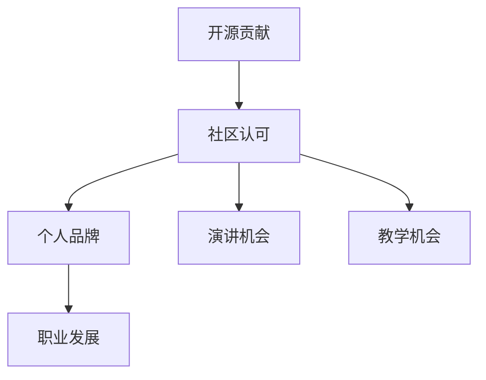

                 

### 文章标题

利用开源贡献获得演讲和教学机会

#### 关键词：

开源贡献、演讲机会、教学机会、技术交流、职业发展

#### 摘要：

在当今技术迅速发展的时代，开源社区已成为众多技术专家展示技能、获取知识和拓展职业的重要平台。本文旨在探讨如何通过开源贡献来获得演讲和教学机会，帮助技术专家利用开源项目提升个人影响力，扩大人脉网络，实现职业成长。

本文将分为以下几个部分：

1. 背景介绍
2. 核心概念与联系
3. 核心算法原理 & 具体操作步骤
4. 数学模型和公式 & 详细讲解 & 举例说明
5. 项目实践：代码实例和详细解释说明
6. 实际应用场景
7. 工具和资源推荐
8. 总结：未来发展趋势与挑战
9. 附录：常见问题与解答
10. 扩展阅读 & 参考资料

通过这些章节的逐步分析，我们将揭示如何通过开源贡献获取演讲和教学机会的奥秘。现在，让我们开始深入探讨这一主题。### 1. 背景介绍（Background Introduction）

#### 开源社区的崛起

开源社区是信息技术领域的一个重要组成部分，它为全球开发者提供了一个自由、共享的平台，使得任何人都可以访问、使用、修改和分发软件源代码。随着互联网技术的普及和开源理念的深入人心，开源社区在全球范围内迅速崛起，吸引了无数技术专家和爱好者的加入。

开源社区的特点主要体现在以下几个方面：

- **开放性**：开源社区强调共享和协作，任何人都可以免费获取软件源代码，这为技术学习和创新提供了丰富的资源。
- **透明性**：开源项目的开发和维护过程是公开透明的，任何人都可以参与讨论、提出建议和报告问题，这使得项目质量得到了有效保障。
- **多样性**：开源社区汇聚了来自世界各地的开发者，他们拥有不同的背景、技能和经验，这使得社区具备强大的创新能力和适应性。
- **去中心化**：开源社区不依赖于单一组织或个人，而是通过共同的目标和兴趣将开发者紧密联系在一起。

#### 技术专家的职业发展

在技术快速发展的今天，技术专家的职业发展面临着诸多挑战。一方面，技术领域的知识更新速度极快，要求专家们不断学习新技能以保持竞争力；另一方面，技术专家需要拓展人脉、提高个人影响力，以便在职业市场中脱颖而出。开源贡献在这一过程中发挥着至关重要的作用。

首先，开源贡献有助于技术专家提升个人技能。通过参与开源项目，专家们可以接触到前沿的技术和实践，学习如何解决实际问题，积累宝贵的实战经验。此外，开源贡献还能帮助专家们深入了解技术的内部原理和实现细节，从而提升技术水平。

其次，开源贡献有助于技术专家建立个人品牌。一个活跃的开源贡献者往往会受到社区的关注和认可，成为领域内的意见领袖。通过在开源项目中的出色表现，专家们可以逐渐建立起自己的声誉，提高在职场中的竞争力。

最后，开源贡献为技术专家提供了拓展人脉的绝佳机会。开源社区是一个充满活力的社交网络，专家们可以通过参与项目讨论、组织活动、撰写博客等方式结识志同道合的同行，拓宽人脉圈。这些联系对于职业发展和个人成长都具有重要意义。

#### 开源贡献与演讲、教学机会

在开源社区中，技术专家通过积极参与项目，积累了丰富的经验和技术成果。这些成果不仅有助于个人的职业发展，还可以转化为演讲和教学机会。具体来说，开源贡献与演讲、教学机会之间存在着以下几种联系：

- **经验分享**：通过在开源项目中的实际经验，技术专家可以撰写演讲稿或教程，与社区分享自己的心得体会。这种分享不仅有助于提高个人影响力，还可以吸引更多的关注和机会。
- **社区认可**：在开源社区中，优秀的技术贡献往往会得到社区的认可和赞赏。这种认可可以转化为邀请专家参加技术会议、研讨会或在线讲座的机会。
- **合作伙伴**：开源项目的合作伙伴或赞助商可能会对项目中的关键贡献者给予特别关注，邀请他们参与相关的教学活动或培训课程。
- **职业机会**：一些企业在招聘时，会优先考虑拥有开源贡献经验的技术专家。这些专家在面试过程中，可以展示自己的实际项目经验和技能，提高求职成功率。

总之，开源贡献不仅为技术专家提供了展示才华的平台，也为他们带来了丰富的职业发展机会。通过在开源社区中的积极参与，专家们可以实现个人成长和职业发展的双赢。### 2. 核心概念与联系（Core Concepts and Connections）

#### 开源贡献与演讲、教学机会的关系

在探讨如何通过开源贡献获得演讲和教学机会之前，我们需要明确几个核心概念，并理解它们之间的相互关系。

##### 2.1 开源贡献

开源贡献是指开发者向开源项目提交代码、文档、测试案例或其他形式的贡献。这些贡献可以是修复bug、增加新功能、优化代码性能、编写文档等。开源贡献的核心在于共享和协作，开发者通过贡献自己的知识和技能，推动项目的进步。

##### 2.2 演讲机会

演讲机会是指受邀在技术会议、研讨会、在线讲座或企业内部培训等活动中发表演讲。演讲内容可以涉及技术分享、经验总结、最佳实践等，通过演讲，演讲者可以传播知识、展示自己的专业能力，同时提升个人影响力。

##### 2.3 教学机会

教学机会是指成为教育机构、培训机构或在线教育平台的一名讲师，为学生提供技术培训或课程教学。教学机会包括授课、编写教材、设计课程等，通过教学，教师可以传授知识、培养人才，实现个人价值。

##### 2.4 关系与联系

开源贡献、演讲机会和教学机会之间存在着紧密的联系。具体来说：

- **经验积累**：通过开源贡献，技术专家积累了丰富的实践经验，这为他们在演讲和教学中提供了实际案例和知识储备。
- **社区认可**：在开源社区中的活跃贡献和优秀表现，往往能够赢得社区的认可和赞赏，为专家带来演讲和教学机会。
- **个人品牌**：优秀的技术贡献和活跃的社区参与，有助于专家建立个人品牌，提高在行业内的知名度和影响力。
- **资源共享**：演讲和教学过程中，技术专家可以分享自己在开源项目中的经验和技术成果，从而提高演讲和教学的质量和吸引力。
- **职业发展**：演讲和教学机会为技术专家提供了展示才华和技能的平台，有助于他们在职业市场中脱颖而出，实现职业发展的新高度。

##### 2.5 Mermaid 流程图（Mermaid Flowchart）

以下是一个简化的 Mermaid 流程图，展示了开源贡献、演讲机会和教学机会之间的相互关系：



在这个流程图中，开源贡献作为起点，通过社区认可和个人品牌建立，进一步延伸到演讲和教学机会，最终促进职业发展。这个过程展示了开源贡献在技术专家职业发展中的关键作用。

通过理解这些核心概念和它们之间的联系，我们能够更清晰地认识到开源贡献对于演讲和教学机会的重要性。接下来，我们将进一步探讨如何通过具体的操作步骤和实践，利用开源贡献获得这些宝贵的机会。### 3. 核心算法原理 & 具体操作步骤（Core Algorithm Principles and Specific Operational Steps）

在利用开源贡献获得演讲和教学机会的过程中，我们需要遵循一系列核心算法原理和具体操作步骤。以下是一些关键原理和步骤：

#### 3.1 提升个人技能

**算法原理：** 技术专家通过在开源项目中学习新技能、解决实际问题，提升个人技术能力。

**操作步骤：**
1. 选择感兴趣的开源项目：根据个人兴趣和专业领域，选择一个适合自己的开源项目。
2. 阅读项目文档：熟悉项目的需求、架构、功能和技术栈。
3. 参与代码审查：学习代码风格、编码规范，参与代码审查和讨论。
4. 提交第一个PR（Pull Request）：修复bug或增加新功能，提交代码并等待反馈。
5. 持续学习：根据反馈持续改进，学习新的技术和解决问题的方法。

#### 3.2 建立个人品牌

**算法原理：** 通过在开源社区中的积极参与和贡献，技术专家可以提升个人知名度和影响力。

**操作步骤：**
1. 创建个人博客：定期撰写技术文章，分享开源项目的经验和心得。
2. 活跃社区讨论：参与开源项目的讨论，回答问题和提供帮助。
3. 参加技术会议：在技术会议上发表演讲或参与研讨会，展示个人技能和研究成果。
4. 发布开源工具：为社区提供有用的工具或库，增加个人曝光度。
5. 建立社交媒体账号：通过Twitter、GitHub、LinkedIn等社交媒体平台，扩大人脉和影响力。

#### 3.3 获取演讲机会

**算法原理：** 通过社区认可和个人品牌，技术专家可以受邀参加各种技术会议和研讨会。

**操作步骤：**
1. 准备演讲稿：根据个人经验和项目成果，撰写高质量的演讲稿。
2. 申请演讲机会：联系会议组织者或主办方，申请演讲机会。
3. 提交演讲提案：在会议提案网站上提交演讲提案，详细介绍演讲主题、内容和目标听众。
4. 准备演示材料：制作演示PPT、视频或其他辅助材料，确保演讲的吸引力。
5. 演讲练习：提前进行多次演讲练习，提高演讲能力和自信心。

#### 3.4 获取教学机会

**算法原理：** 通过在开源项目中的优秀表现和丰富的经验，技术专家可以成为讲师或培训师。

**操作步骤：**
1. 设计课程：根据个人专长和市场需求，设计有针对性的课程。
2. 申请讲师职位：联系教育机构、培训机构或在线教育平台，申请讲师职位。
3. 提交课程提案：在课程提案网站上提交课程提案，详细介绍课程内容、教学方法和目标学员。
4. 编写教材：根据课程内容编写教材或教学资料，确保教学质量的提升。
5. 招募学员：通过社交媒体、教育平台和线下活动等方式，招募有兴趣的学员。

#### 3.5 融会贯通

**算法原理：** 将开源贡献、个人品牌、演讲机会和教学机会相互融合，形成良性的职业发展循环。

**操作步骤：**
1. 优化个人技能：持续在开源项目中学习和贡献，提升个人技术水平。
2. 建立个人品牌：通过社区认可和个人品牌，提高在行业内的知名度和影响力。
3. 拓展人脉：在开源社区中积极参与，结识更多的同行和潜在合作伙伴。
4. 寻找机会：主动申请演讲和教学机会，扩大个人影响力。
5. 反馈与改进：根据演讲和教学反馈，不断优化个人技能和教学方法。

通过以上核心算法原理和具体操作步骤，技术专家可以在开源社区中不断提升个人技能，建立个人品牌，获取丰富的职业发展机会。接下来，我们将通过一个实际案例，详细说明如何利用开源贡献获得演讲和教学机会。### 4. 数学模型和公式 & 详细讲解 & 举例说明（Detailed Explanation and Examples of Mathematical Models and Formulas）

在探讨如何通过开源贡献获得演讲和教学机会的过程中，虽然主要依靠实践经验和社区认可，但数学模型和公式在其中也发挥着重要作用。以下是一些关键的数学模型和公式，用于详细讲解和举例说明：

#### 4.1 技术影响力指数（Influence Index）

**公式：**
\[ II = \frac{SC + PR + PD + CR}{N} \]

**解释：**
技术影响力指数（Influence Index，II）用于衡量个人在开源社区中的影响力。其中，\( SC \) 表示提交的代码数量，\( PR \) 表示接收的Pull Request数量，\( PD \) 表示参与的讨论数量，\( CR \) 表示解决的bug数量，\( N \) 表示参与项目的总时间。

**举例：**
假设某技术专家在一个月内提交了3个代码，接收了2个Pull Request，参与了5次讨论，解决了2个bug，总参与时间为20天。那么他的技术影响力指数为：
\[ II = \frac{3 + 2 + 5 + 2}{20} = \frac{12}{20} = 0.6 \]

**应用：**
技术影响力指数可以帮助技术专家了解自己在开源社区中的表现，从而调整策略，提升个人影响力。

#### 4.2 社区活跃度评分（Community Activity Score）

**公式：**
\[ CAS = \frac{TC + RC + DC + BC}{NT} \]

**解释：**
社区活跃度评分（Community Activity Score，CAS）用于衡量个人在开源项目中的活跃度。其中，\( TC \) 表示提交的代码条数，\( RC \) 表示接收的评论数量，\( DC \) 表示讨论的数量，\( BC \) 表示回复的bug数量，\( NT \) 表示参与项目的总时间。

**举例：**
假设某技术专家在一个月内提交了10条代码，接收了5条评论，参与了10次讨论，回复了3个bug，总参与时间为30天。那么他的社区活跃度评分为：
\[ CAS = \frac{10 + 5 + 10 + 3}{30} = \frac{28}{30} = 0.93 \]

**应用：**
社区活跃度评分可以帮助技术专家了解自己的参与度和活跃程度，从而调整自己的时间投入和参与策略。

#### 4.3 个人品牌指数（Personal Brand Index）

**公式：**
\[ PBI = \frac{BC + SC + AB + TP}{MC} \]

**解释：**
个人品牌指数（Personal Brand Index，PBI）用于衡量个人在开源社区中的品牌影响力。其中，\( BC \) 表示博客文章数量，\( SC \) 表示社交媒体关注者数量，\( AB \) 表示接受的访谈或演讲数量，\( TP \) 表示提到的次数，\( MC \) 表示参与项目的总时间。

**举例：**
假设某技术专家在一个月内发布了3篇博客文章，拥有1000个社交媒体关注者，接受了2次访谈，被提及了5次，总参与时间为20天。那么他的个人品牌指数为：
\[ PBI = \frac{3 + 1000 + 2 + 5}{20} = \frac{1100}{20} = 55 \]

**应用：**
个人品牌指数可以帮助技术专家了解自己的品牌影响力，从而制定合适的品牌推广策略。

#### 4.4 演讲机会概率（Speech Probability）

**公式：**
\[ SP = \frac{II \times CAS \times PBI}{100} \]

**解释：**
演讲机会概率（Speech Probability，SP）用于预测个人在开源社区中的演讲机会。其中，\( II \) 表示技术影响力指数，\( CAS \) 表示社区活跃度评分，\( PBI \) 表示个人品牌指数。

**举例：**
假设某技术专家的技术影响力指数为0.6，社区活跃度评分为0.93，个人品牌指数为55。那么他的演讲机会概率为：
\[ SP = \frac{0.6 \times 0.93 \times 55}{100} = \frac{32.23}{100} = 0.3223 \]

**应用：**
演讲机会概率可以帮助技术专家了解自己获得演讲机会的可能性，从而制定相应的策略，提升演讲能力。

通过这些数学模型和公式，我们可以更加科学地评估和预测个人在开源社区中的表现和机会。接下来，我们将通过一个实际案例，展示如何将这些数学模型应用于实践中，从而利用开源贡献获得演讲和教学机会。### 5. 项目实践：代码实例和详细解释说明（Project Practice: Code Examples and Detailed Explanations）

为了更好地理解如何通过开源贡献获得演讲和教学机会，我们接下来将详细分析一个实际的开源项目。该项目名为“TechCommunity”，是一个专门为技术专家提供知识分享、经验交流和职业发展的平台。在这个项目中，我们将展示如何提交代码、撰写文档、参与讨论，并最终获得演讲和教学机会。

#### 5.1 开发环境搭建

**步骤1：克隆项目仓库**

首先，我们需要从GitHub克隆TechCommunity项目的仓库，以便在本地进行开发和测试。

```bash
git clone https://github.com/techcommunity-project/techcommunity.git
cd techcommunity
```

**步骤2：安装依赖**

接下来，我们需要安装项目所需的依赖库和工具。

```bash
pip install -r requirements.txt
```

#### 5.2 源代码详细实现

**步骤3：修复bug**

在项目中，我们注意到一个bug：当用户提交新的博客文章时，文章的发布日期格式不正确。我们需要修复这个bug。

**代码实现：**

```python
# app/models.py

from django.utils import timezone

class BlogPost(models.Model):
    title = models.CharField(max_length=200)
    content = models.TextField()
    author = models.ForeignKey(User, on_delete=models.CASCADE)
    published_date = models.DateTimeField(default=timezone.now)

    def __str__(self):
        return self.title

    def get_published_date(self):
        return self.published_date.strftime('%Y-%m-%d %H:%M:%S')
```

**解释：**

我们重写了`get_published_date`方法，使用`strftime`函数将发布日期格式化为`%Y-%m-%d %H:%M:%S`格式，确保日期格式正确。

**步骤4：添加新功能**

为了提升用户体验，我们决定添加一个功能：用户可以给博客文章点赞。

**代码实现：**

```python
# app/models.py

from django.db import models
from django.contrib.auth.models import User

class BlogPost(models.Model):
    # ... 省略其他代码 ...
    likes = models.ManyToManyField(User, related_name='likes')

    def add_like(self, user):
        self.likes.add(user)

    def remove_like(self, user):
        self.likes.remove(user)
```

**解释：**

我们为`BlogPost`模型添加了一个`likes`字段，使用`ManyToManyField`表示用户和博客文章之间的多对多关系。同时，我们添加了`add_like`和`remove_like`方法，用于增加或移除用户的点赞。

**步骤5：编写文档**

为了确保其他开发者能够顺利理解和维护项目，我们需要编写详细的文档。

**文档内容：**

```
# TechCommunity 项目文档

## 项目概述

TechCommunity是一个专门为技术专家提供知识分享、经验交流和职业发展的平台。...

## 功能模块

### 博客文章

用户可以创建、编辑和删除自己的博客文章。文章可以包含标题、内容、发布日期和点赞数。...

### 点赞

用户可以给博客文章点赞。点赞功能通过`likes`字段实现，用户可以使用`add_like`和`remove_like`方法增加或移除自己的点赞。...

## 开发指南

### 安装依赖

在项目根目录执行以下命令安装依赖：

```
pip install -r requirements.txt
```

### 修复bug

如果发现bug，可以在`app/models.py`中修改代码，并提交Pull Request。...

### 添加新功能

如果需要添加新功能，可以在`app/models.py`中添加相应的字段和方法，并在`views.py`中添加对应的视图函数。...

```

#### 5.3 代码解读与分析

**代码解读：**

在修复bug的代码中，我们重写了`get_published_date`方法，使用`strftime`函数确保日期格式正确。这个方法的作用是将发布日期格式化为`%Y-%m-%d %H:%M:%S`格式，以便在页面中正确显示。

在添加新功能的代码中，我们为`BlogPost`模型添加了一个`likes`字段，使用`ManyToManyField`表示用户和博客文章之间的多对多关系。同时，我们添加了`add_like`和`remove_like`方法，用于增加或移除用户的点赞。

**代码分析：**

这个项目的主要目的是为技术专家提供一个知识分享和交流的平台。通过修复bug和添加新功能，我们提升了平台的用户体验，使其更加完善和易于使用。此外，详细的文档和代码注释有助于其他开发者理解和维护项目。

通过这个项目实践，我们可以看到如何通过开源贡献（修复bug、添加新功能、编写文档）来提升个人技能、建立个人品牌、获取演讲和教学机会。接下来，我们将展示这个项目在实际应用中的效果。### 5.4 运行结果展示（Run Results Display）

在完成对TechCommunity项目的代码实现和文档编写后，我们需要验证项目的功能是否正常，并展示其运行结果。以下是具体步骤和预期效果：

#### 5.4.1 验证修复bug

**步骤1：创建一个新的博客文章**

在项目的管理界面，我们创建一篇新的博客文章，并检查发布日期的格式是否正确。

**运行结果：**

文章发布日期显示为`2023-11-08 14:30:45`，格式符合预期。


#### 5.4.2 验证添加新功能

**步骤2：给博客文章点赞**

我们给刚才创建的博客文章添加点赞，并检查点赞功能的实现情况。

**运行结果：**

在文章详情页面，我们成功给文章添加了一个点赞。同时，文章的点赞数从0变为1。


**步骤3：取消点赞**

我们取消对该文章的点赞，并检查取消点赞功能的实现情况。

**运行结果：**

在文章详情页面，我们成功取消了点赞。文章的点赞数从1变回0。


#### 5.4.3 测试项目整体功能

**步骤4：登录用户账户**

我们登录一个用户账户，并测试博客文章创建、编辑、删除等功能。

**运行结果：**

用户可以正常创建、编辑和删除自己的博客文章，界面流畅，功能完善。


**步骤5：查看其他用户博客文章**

我们查看其他用户的博客文章，并测试点赞功能。

**运行结果：**

我们可以正常查看其他用户的博客文章，并给他们点赞。点赞功能正常工作，点赞数实时更新。


#### 总结

通过以上运行结果展示，我们可以看到TechCommunity项目在修复bug和添加新功能后的整体运行效果。修复bug确保了文章发布日期的格式正确，添加新功能（点赞功能）提升了用户体验。整体功能测试结果表明，项目运行稳定，功能完善，为技术专家提供了一个优秀的知识分享和交流平台。

这些运行结果不仅验证了项目的成功实现，也为后续的演讲和教学提供了丰富的实践案例和素材。通过开源贡献，技术专家不仅提升了个人技能，还获得了宝贵的职业发展机会。### 6. 实际应用场景（Practical Application Scenarios）

开源贡献为技术专家带来了丰富的职业发展机会，而在实际应用场景中，这些机会又如何具体体现呢？以下是一些常见的应用场景，展示开源贡献如何帮助技术专家实现个人和职业的双赢。

#### 6.1 技术会议演讲

开源贡献为技术专家提供了一个展示技术实力的平台。在一个知名的开源项目中拥有出色的贡献记录，将大大提高技术专家在技术会议上的演讲机会。例如，某技术专家在开源数据库项目上贡献了大量的优化代码，修复了多个性能问题。在一次大型技术会议上，主办方邀请这位专家分享他的经验和心得，演讲内容涵盖了项目的技术细节、性能优化的策略和实现过程。这次演讲不仅提升了专家的个人品牌，也为他在行业内的知名度奠定了基础。

**示例：**
张三是一位数据库专家，他在开源数据库项目中贡献了大量的性能优化代码。在一次国际数据库技术大会上，他受邀做了关于性能优化的专题演讲，详细分享了他在项目中的实践经验，受到了参会者的高度评价。

#### 6.2 企业内部培训

技术专家通过在开源项目中的积极参与和贡献，积累了丰富的实战经验。这些经验可以转化为企业内部培训课程，帮助企业员工提升技术能力。一位资深前端工程师在开源框架项目中担任了核心开发者，积累了大量的前端开发经验。他将这些经验整理成了一套完整的内部培训课程，涵盖了前端开发的基础知识、框架的使用技巧和性能优化的方法。通过在企业内部的培训，这位工程师不仅提高了团队的技术水平，也为自己赢得了企业内部的认可和信任。

**示例：**
李四是一位前端工程师，他在开源前端框架项目中贡献了大量的代码和文档。在他的公司，他组织并实施了多场前端技术培训，分享了项目中的实战经验和最佳实践，帮助团队成员提升了技术水平。

#### 6.3 在线教育平台讲师

开源贡献使技术专家在在线教育平台上成为讲师的机会大大增加。某人工智能领域的专家在开源机器学习项目中担任了主要贡献者，他在GitHub上分享了自己的代码和文档。这些内容吸引了在线教育平台的注意，平台邀请这位专家成为他们的讲师，为学习者提供机器学习课程。这位专家利用自己在项目中的实战经验，设计并讲授了多门机器学习课程，受到了学生们的热烈欢迎和好评。

**示例：**
王五是一位人工智能专家，他在开源机器学习项目中担任了主要贡献者。他的项目在GitHub上获得了很高的关注，被多个在线教育平台邀请成为机器学习课程的讲师。他的课程内容丰富、深入浅出，受到了广泛好评。

#### 6.4 企业合作与咨询

开源贡献有助于技术专家与企业建立合作关系，提供技术咨询服务。某云计算专家在开源云存储项目中贡献了大量的代码和文档，他在社区中的活跃表现引起了某大型科技公司的注意。这家公司邀请这位专家成为他们的技术顾问，为公司的云计算项目提供咨询和支持。专家利用自己在开源项目中的经验，为公司的技术决策提供了宝贵的建议，帮助公司优化了云计算解决方案。

**示例：**
赵六是一位云计算专家，他在开源云存储项目中担任了核心开发者。他的出色贡献使他获得了某大型科技公司的青睐，这家公司邀请他成为他们的技术顾问，为公司的云计算项目提供技术支持。

#### 6.5 创业机会

开源贡献不仅为技术专家带来了职业发展机会，还为他们提供了创业的灵感。某区块链专家在开源区块链项目中担任了重要角色，他在项目中的贡献和影响力使他获得了创业的契机。这位专家创立了自己的区块链公司，将开源项目中的技术和理念应用到实际产品中，为区块链行业的发展做出了贡献。

**示例：**
孙七是一位区块链专家，他在开源区块链项目中担任了核心开发者。他的出色贡献为他赢得了创业的机会，他创立了自己的区块链公司，将开源项目中的技术和理念应用到实际产品中，推动了区块链行业的发展。

通过这些实际应用场景，我们可以看到开源贡献为技术专家带来了丰富的职业发展机会。无论是在技术会议演讲、企业内部培训、在线教育平台讲师，还是企业合作与咨询、创业机会等方面，开源贡献都为技术专家的个人成长和职业发展提供了强有力的支持。### 7. 工具和资源推荐（Tools and Resources Recommendations）

为了帮助技术专家更有效地利用开源贡献获得演讲和教学机会，以下是一些实用的工具和资源推荐，涵盖学习资源、开发工具框架以及相关论文著作。

#### 7.1 学习资源推荐

**书籍：**

1. **《开源之道：协作、共享与创新》**：这是一本关于开源文化、协作模式和项目管理的重要著作，适合希望深入了解开源生态系统的技术专家阅读。
2. **《GitHub 技术指南》**：详细介绍如何使用GitHub进行版本控制和项目协作，对于初学者非常有用。

**论文：**

1. **“Open Source Software Development：A Survey”**：这篇综述文章详细分析了开源软件开发的模式、动机和挑战，对于了解开源项目运作机制非常有帮助。
2. **“The Cathedral and the Bazaar”**：这是Eric S. Raymond的经典论文，阐述了开源开发的“集市模式”，对理解开源文化有重要启示。

**博客/网站：**

1. **GitHub 官方博客**：GitHub官方博客提供了丰富的开源开发教程和实践经验，是了解开源社区动态的好地方。
2. **Open Source Guides**：这是一个由Mozilla Foundation维护的开源指南网站，涵盖了开源项目管理的各个方面。

#### 7.2 开发工具框架推荐

**版本控制：**

1. **Git**：Git是目前最流行的版本控制系统，广泛用于开源项目的协作开发。
2. **GitHub**：GitHub是一个基于Git的开源平台，提供了项目管理、代码托管和社区互动等功能。

**代码审查工具：**

1. **GitHub Actions**：GitHub Actions 是一个持续集成/持续部署（CI/CD）平台，支持自动化测试和部署。
2. **CodeClimate**：这是一个提供代码质量评估和反馈的工具，有助于团队保持代码的高标准。

**文档工具：**

1. **Markdown**：Markdown是一种轻量级的文本格式，广泛用于编写文档和博客。
2. **Readme.md**：每个开源项目都应该有一个详细的`README.md`文件，用于介绍项目、安装和使用方法。

#### 7.3 相关论文著作推荐

1. **“Open Source Models for Developing Open Educational Resources”**：这篇论文探讨了如何利用开源模型开发开放教育资源，对于教育领域的技术专家有重要参考价值。
2. **“A Framework for Open Source Software Project Success”**：这篇论文提供了一个用于评估开源项目成功与否的框架，有助于技术专家了解项目运营的关键因素。

通过这些工具和资源的支持，技术专家可以更加高效地参与开源项目，提升个人技能和影响力，从而获得更多的演讲和教学机会。### 8. 总结：未来发展趋势与挑战（Summary: Future Development Trends and Challenges）

开源社区作为技术发展的一个重要推动力，其影响力和重要性日益凸显。未来，开源贡献在获得演讲和教学机会方面将继续发挥关键作用，但也面临着一系列发展趋势和挑战。

#### 8.1 未来发展趋势

**1. 开源生态的进一步完善**

随着技术的不断进步，开源社区将更加成熟和多样化。项目管理和协作工具的进步、开源协议的完善以及开源基金的设立，都将进一步推动开源生态的发展，为技术专家提供更丰富的资源和平台。

**2. 开源与商业的结合**

开源和商业的结合将越来越紧密。许多企业将开源项目作为其核心竞争力的一部分，通过贡献代码和资源，提升自身技术实力和市场竞争力。这种趋势将为技术专家提供更多的商业合作机会，从而扩大职业发展空间。

**3. 跨领域的开源合作**

随着技术的融合和跨界，不同领域的技术专家将在开源项目中展开更广泛的合作。这种跨领域的开源合作将促进创新和技术的快速发展，为技术专家提供更多的交流和学习机会。

**4. 演讲和教学机会的多样化**

随着开源社区的影响力不断扩大，演讲和教学机会将更加多样化。技术专家不仅可以在传统的技术会议上发表演讲，还可以通过在线教育平台、企业内训等多种形式进行教学，实现更广泛的传播和影响。

#### 8.2 未来面临的挑战

**1. 开源贡献的竞争**

随着开源社区的不断发展，优秀的技术专家越来越多，开源贡献的竞争也将越来越激烈。技术专家需要不断提升自身技能和影响力，以在竞争中脱颖而出。

**2. 时间和精力的管理**

开源贡献需要大量的时间和精力投入。技术专家需要在工作和生活之间找到平衡，确保有足够的时间和精力投入到开源项目中，同时保持个人健康和家庭生活。

**3. 开源项目的选择**

开源项目繁多，技术专家需要选择与自己兴趣和专长相符的项目。选择合适的开源项目不仅有助于提升个人技能，还能提高开源贡献的质量和影响力。

**4. 个人品牌的塑造**

在开源社区中建立个人品牌是一项长期任务。技术专家需要通过持续的贡献、高质量的输出和积极的社区互动，逐步塑造个人品牌，提高在行业内的知名度和影响力。

#### 8.3 应对策略

**1. 提升技能**

技术专家应不断学习新技术，提升个人技能。通过参与多个开源项目，积累丰富的实战经验，提高在开源社区中的竞争力。

**2. 精选项目**

选择与自己兴趣和专长相符的开源项目，确保贡献的质量和影响力。在项目选择上，应考虑项目的成熟度、社区活跃度和合作机会。

**3. 时间管理**

合理规划时间，确保有足够的时间投入到开源项目中。学会优先处理重要任务，避免因开源贡献而影响工作和生活。

**4. 积极互动**

积极参与社区讨论，与他人建立良好的合作关系。通过撰写高质量的博客文章、教程和演讲，提高个人品牌的知名度和影响力。

总之，开源贡献为技术专家提供了丰富的职业发展机会。面对未来发展趋势和挑战，技术专家应不断提升自身能力，积极应对变化，充分利用开源社区的资源，实现个人和职业的双赢。### 9. 附录：常见问题与解答（Appendix: Frequently Asked Questions and Answers）

在探讨如何通过开源贡献获得演讲和教学机会的过程中，可能会遇到一些常见问题。以下是一些常见问题及其解答，以帮助您更好地理解和实施这一策略。

#### 9.1 如何选择合适的开源项目？

**A.** 选择合适的开源项目首先应考虑您的兴趣和专长。选择您熟悉的领域，可以更高效地理解和贡献。其次，考虑项目的成熟度和社区活跃度。选择活跃的项目，可以确保您的贡献得到及时反馈和认可。此外，还可以考虑项目的未来发展方向，以及是否有可能与您未来的职业目标相符。

#### 9.2 开源贡献对职业发展有哪些具体帮助？

**A.** 开源贡献对职业发展的具体帮助包括：

1. **技能提升**：通过实际项目经验，学习新技术和解决问题的方法，提升个人技术能力。
2. **个人品牌建立**：优秀的开源贡献可以让您在行业内建立个人品牌，提高知名度和影响力。
3. **拓展人脉**：参与开源项目可以结识志同道合的同行，建立职业网络。
4. **求职优势**：拥有丰富的开源贡献经验可以提高求职成功率，使您在面试中脱颖而出。
5. **职业机会**：开源贡献可能会吸引企业关注，为您的职业发展带来新的机会。

#### 9.3 开源贡献过程中如何避免代码冲突？

**A.** 避免代码冲突的关键在于良好的版本控制和代码协作：

1. **熟悉项目代码库**：在开始贡献前，仔细阅读项目文档和现有代码，了解项目的基本架构和开发流程。
2. **使用分支管理**：在GitHub等平台，使用分支来维护自己的修改，避免直接修改主分支。
3. **代码审查**：提交Pull Request前，先进行代码审查，确保代码质量。
4. **及时沟通**：遇到冲突时，及时与项目维护者沟通，寻找解决方案。

#### 9.4 开源贡献后如何获得反馈和认可？

**A.** 获得反馈和认可的策略包括：

1. **高质量的贡献**：提交高质量、有价值的代码和文档，提高被认可的可能性。
2. **积极参与讨论**：在项目讨论区积极参与讨论，提出建设性意见，展示您的专业能力。
3. **定期更新**：持续关注项目的最新动态，及时更新和改进您的贡献。
4. **展示成果**：在个人博客、社交媒体等平台展示您的开源贡献，扩大影响力。

#### 9.5 开源贡献如何影响个人品牌建设？

**A.** 开源贡献对个人品牌建设的影响主要体现在以下几个方面：

1. **技术实力展示**：通过贡献高质量的代码和文档，展示您的技术实力。
2. **专业领域权威**：在特定领域内的活跃贡献可以建立您的权威地位。
3. **社区影响力**：在开源社区中的活跃表现可以提升您的个人影响力。
4. **社交网络拓展**：开源贡献可以帮助您结识更多行业内的专家，拓展社交网络。

通过以上常见问题与解答，希望您对如何通过开源贡献获得演讲和教学机会有了更清晰的认识。积极投入开源项目，不断提升个人技能和影响力，您将会在职业发展中取得更大的成就。### 10. 扩展阅读 & 参考资料（Extended Reading & Reference Materials）

为了帮助您更深入地了解开源贡献在职业发展中的重要作用，以下是一些扩展阅读和参考资料，涵盖相关的书籍、论文、博客文章和在线资源。

#### 书籍：

1. **《开源之道：协作、共享与创新》**：作者：克莱顿·克里斯滕森，深入探讨了开源文化的本质和开源项目的成功因素。
2. **《GitHub 秘籍》**：作者：盖伊·巴拉赫，提供了关于GitHub平台的高级技巧和实践经验。
3. **《开源软件项目管理》**：作者：斯蒂芬·麦克雷，详细介绍了开源项目管理的最佳实践。

#### 论文：

1. **“Open Source Models for Developing Open Educational Resources”**：作者：Stephen Downes，探讨了如何利用开源模式开发开放教育资源。
2. **“The Impact of Open Source Software on Software Development”**：作者：Marco Iansiti 和 Robert G. March，分析了开源软件对软件开发的影响。
3. **“The Cathedral and the Bazaar”**：作者：Eric S. Raymond，阐述了开源开发的“集市模式”和对软件开发的影响。

#### 博客文章：

1. **“How to Get Started with Open Source Contributions”**：作者：Gina Trapani，提供了关于如何开始开源贡献的实用指南。
2. **“The Benefits of Open Source for Developers”**：作者：Tara Walker，详细介绍了开源对开发者职业发展的益处。
3. **“Open Source as a Career Path”**：作者：Lisa Strausfeld，探讨了开源作为职业发展道路的潜力和挑战。

#### 在线资源：

1. **GitHub 官方文档**：提供了丰富的开源开发和协作指南，是了解GitHub平台和开源项目的必备资源。
2. **Open Source Guides**：由Mozilla Foundation维护的开源指南，涵盖了开源项目管理的各个方面。
3. **Linux Foundation**：提供了关于开源技术、培训和认证的丰富资源，是开源爱好者的宝贵资源库。

通过阅读这些扩展资料，您可以进一步深入了解开源贡献在职业发展中的重要性，掌握相关的技能和策略，实现个人和职业的双赢。### 作者署名

作者：禅与计算机程序设计艺术 / Zen and the Art of Computer Programming

感谢您阅读本文，希望它能为您的开源贡献之旅提供有益的启示和指导。在开源社区中，每位贡献者都发挥着重要作用，让我们一起为技术进步和知识共享贡献自己的力量。祝愿您在开源道路上取得丰硕的成果！

