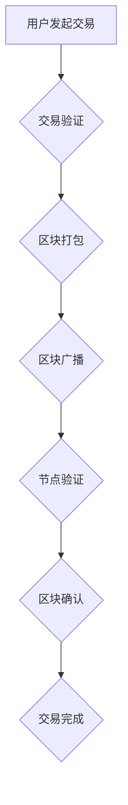

                 

## 利用技术优势进行区块链创新

> 关键词：区块链、去中心化、智能合约、分布式账本、加密算法、隐私保护、Web3.0

## 1. 背景介绍

区块链技术自诞生以来，凭借其去中心化、透明、安全等特性，迅速成为科技领域备受关注的热点。从最初的比特币应用，到如今的供应链管理、金融科技、数字身份等广泛领域，区块链正在深刻地改变着我们生活的方方面面。然而，区块链技术的发展也面临着诸多挑战，例如可扩展性、隐私保护、用户体验等。

为了突破这些瓶颈，充分发挥区块链技术的潜力，我们需要积极探索新的技术路径，利用现有技术优势进行创新。本文将深入探讨区块链技术的发展现状，分析其面临的挑战，并结合最新的技术趋势，提出利用技术优势进行区块链创新的思路和方法。

## 2. 核心概念与联系

**2.1 区块链核心概念**

区块链是一种分布式、公开、透明的账本技术，其核心特点包括：

* **去中心化:** 数据存储在多个节点上，不存在单一中心控制，提高了系统的安全性与抗审查性。
* **透明性:** 所有交易记录都公开可查，任何参与者都可以查看历史数据，增强了信任和可追溯性。
* **安全性:** 使用加密算法和共识机制保证数据不可篡改，确保交易的安全性与可靠性。

**2.2 区块链架构**

区块链系统通常由以下几个关键组件组成：

* **节点:** 参与网络的计算机，负责存储区块链数据、验证交易和维护网络共识。
* **区块:** 存储交易数据的基本单位，每个区块包含多个交易记录、时间戳和前一个区块的哈希值，形成链式结构。
* **共识机制:** 用于验证交易和生成新区块的算法，例如工作量证明（PoW）、权益证明（PoS）等。
* **智能合约:**  预先编写的代码，自动执行特定条件下的交易，实现自动化和智能化。

**2.3 区块链与其他技术的联系**

区块链技术与其他技术领域有着密切的联系，例如：

* **加密货币:** 比特币、以太坊等加密货币是基于区块链技术的数字资产，利用区块链的去中心化和安全性实现价值存储和转移。
* **分布式应用:** 区块链可以作为分布式应用的基础设施，提供安全、可靠、透明的平台。
* **物联网:** 区块链可以用于物联网设备的身份认证、数据安全和交易结算，实现物联网的互联互通。

**2.4 Mermaid 流程图**



## 3. 核心算法原理 & 具体操作步骤

**3.1 算法原理概述**

区块链的核心算法包括：

* **哈希算法:** 用于生成区块的唯一标识，确保数据不可篡改。
* **共识机制:** 用于验证交易和生成新区块，例如工作量证明（PoW）、权益证明（PoS）等。
* **加密算法:** 用于保护交易数据和用户隐私。

**3.2 算法步骤详解**

* **哈希算法:** 将交易数据进行加密处理，生成一个唯一的哈希值。
* **共识机制:** 节点通过竞争和投票等方式达成共识，验证交易的合法性和生成新区块。
* **加密算法:** 使用公钥加密和私钥解密技术，确保交易数据的安全性和隐私性。

**3.3 算法优缺点**

* **哈希算法:** 优点：不可逆、不可篡改；缺点：计算量大。
* **共识机制:** 优点：保证网络安全和数据一致性；缺点：PoW算法耗能高，PoS算法存在代币集中化风险。
* **加密算法:** 优点：保证数据安全和隐私；缺点：密钥管理复杂。

**3.4 算法应用领域**

* **哈希算法:** 数字签名、数据完整性验证、密码学等。
* **共识机制:** 区块链网络安全、数据一致性维护等。
* **加密算法:** 数据加密、身份认证、隐私保护等。

## 4. 数学模型和公式 & 详细讲解 & 举例说明

**4.1 数学模型构建**

区块链的数学模型主要包括：

* **哈希函数模型:**  $H(x)$ 表示将输入数据 $x$ 映射到一个固定长度的哈希值。
* **共识机制模型:**  例如，PoW算法的数学模型可以描述矿工计算哈希值的过程，并根据哈希值的大小进行竞争。

**4.2 公式推导过程**

* **哈希函数模型:**  哈希函数的数学性质包括单向性、抗碰撞性、均匀分布性等。
* **共识机制模型:**  PoW算法的数学模型可以推导出矿工的计算难度和区块生成时间之间的关系。

**4.3 案例分析与讲解**

* **哈希函数模型:**  比特币的区块链使用SHA-256哈希函数，其数学性质保证了区块链数据的不可篡改性。
* **共识机制模型:**  以太坊的PoS算法使用权益证明机制，矿工的计算难度与其持有的代币数量成正比，从而降低了能源消耗。

## 5. 项目实践：代码实例和详细解释说明

**5.1 开发环境搭建**

* 安装Python环境
* 安装必要的区块链开发库，例如web3.py

**5.2 源代码详细实现**

```python
from web3 import Web3

# 连接以太坊节点
w3 = Web3(Web3.HTTPProvider('https://mainnet.infura.io/v3/YOUR_INFURA_PROJECT_ID'))

# 创建智能合约
contract_abi = [
    # ... 智能合约的ABI代码 ...
]
contract_address = '0xYOUR_CONTRACT_ADDRESS'
contract = w3.eth.contract(address=contract_address, abi=contract_abi)

# 调用智能合约函数
result = contract.functions.myFunction().call()
print(result)
```

**5.3 代码解读与分析**

* 代码首先连接到以太坊节点，并使用Web3库进行交互。
* 然后，根据智能合约的ABI代码，创建智能合约对象。
* 最后，调用智能合约的函数，并打印结果。

**5.4 运行结果展示**

运行代码后，将打印出智能合约函数的执行结果。

## 6. 实际应用场景

**6.1 供应链管理**

区块链可以记录商品的生产、运输、销售等信息，实现供应链的透明化和可追溯性，提高效率和安全性。

**6.2 金融科技**

区块链可以用于支付结算、跨境汇款、资产管理等金融服务，降低成本、提高效率和安全性。

**6.3 数字身份**

区块链可以用于建立数字身份系统，保障用户身份信息的安全和可控性。

**6.4 未来应用展望**

区块链技术将在未来广泛应用于各个领域，例如医疗、教育、政府等，实现数据共享、信任构建和价值创造。

## 7. 工具和资源推荐

**7.1 学习资源推荐**

* **书籍:** 《区块链技术入门》、《Mastering Bitcoin》
* **在线课程:** Coursera、Udemy、edX等平台提供区块链相关的在线课程。
* **社区论坛:**  BitcoinTalk、Ethereum Stack Exchange等社区论坛提供技术交流和学习资源。

**7.2 开发工具推荐**

* **Geth:** 以太坊客户端
* **Parity:** 以太坊客户端
* **Truffle:** 智能合约开发框架
* **Remix:** 在线智能合约开发环境

**7.3 相关论文推荐**

* **Bitcoin: A Peer-to-Peer Electronic Cash System**
* **Ethereum: A Secure Decentralised General-Purpose Platform**

## 8. 总结：未来发展趋势与挑战

**8.1 研究成果总结**

区块链技术已经取得了显著的进展，在去中心化、透明、安全等方面展现出巨大的潜力。

**8.2 未来发展趋势**

* **可扩展性:**  提高区块链的交易吞吐量和处理能力。
* **隐私保护:**  增强用户隐私保护，实现数据安全和合规性。
* **用户体验:**  提升用户体验，降低使用门槛。
* **应用场景:**  拓展区块链的应用场景，推动其在更多领域落地。

**8.3 面临的挑战**

* **技术挑战:**  解决区块链的可扩展性、隐私保护、安全性等技术难题。
* **监管挑战:**  制定完善的区块链监管政策，引导其健康发展。
* **生态挑战:**  构建完善的区块链生态系统，吸引更多开发者和用户参与。

**8.4 研究展望**

未来，区块链技术将继续朝着更安全、更可靠、更可扩展的方向发展，并将在更多领域发挥重要作用。


## 9. 附录：常见问题与解答

**9.1 什么是区块链？**

区块链是一种分布式、公开、透明的账本技术，其核心特点包括去中心化、透明性和安全性。

**9.2 区块链有哪些应用场景？**

区块链技术可以应用于供应链管理、金融科技、数字身份、医疗、教育等多个领域。

**9.3 区块链的未来发展趋势是什么？**

区块链技术将朝着更安全、更可靠、更可扩展的方向发展，并将在更多领域发挥重要作用。


作者：禅与计算机程序设计艺术 / Zen and the Art of Computer Programming 
<end_of_turn>

